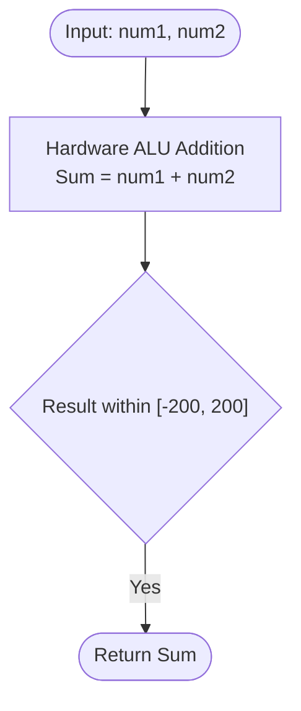

# Guided Example: Add Two Integers

We analyze and trace the arithmetic addition operation for summing two bounded signed integers, examining ring properties in the algebraic structure $(\mathbb{Z}, +)$, bit-level full adder mechanics, and constant-time evaluation in $O(1)$ time and $O(1)$ auxiliary space.

- **Input:** `num1 = 12`, `num2 = 5`
- **Output:** `17`

This representative instance illustrates binary radix decomposition, full-adder carry generation and propagation, algebraic abelian group invariants, and signed integer arithmetic.

---

## 1. Problem Overview & Representative Instance

Given two signed integers `num1` and `num2` constrained within $[-100, 100]$, we are tasked with computing their arithmetic sum:
$$\text{Sum}(\text{num1}, \text{num2}) = \text{num1} + \text{num2}$$

### Representative Instance Breakdown

Consider `num1 = 12` and `num2 = 5`:
- Expressed in binary:
  - $\text{num1} = 12 = 1100_2$
  - $\text{num2} = 5 = 0101_2$
- Bit-by-bit addition from least significant bit (LSB) to most significant bit (MSB):
  - **Bit 0 ($2^0 = 1$):** $0 + 1 + 0_{\text{carry}} = 1$, new carry = $0$.
  - **Bit 1 ($2^1 = 2$):** $0 + 0 + 0_{\text{carry}} = 0$, new carry = $0$.
  - **Bit 2 ($2^2 = 4$):** $1 + 1 + 0_{\text{carry}} = 0$, new carry = $1$.
  - **Bit 3 ($2^3 = 8$):** $1 + 0 + 1_{\text{carry}} = 0$, new carry = $1$.
  - **Bit 4 ($2^4 = 16$):** $0 + 0 + 1_{\text{carry}} = 1$, new carry = $0$.
- Binary sum: $10001_2 = 16 + 1 = 17_{10}$.

Output: $17$.

---

## 2. Mathematical & Algorithmic Principles

### Algebraic Abelian Group Properties

The operation of integer addition forms an **Abelian group** $(\mathbb{Z}, +)$, satisfying:
1. **Closure:** For all $a, b \in \mathbb{Z}$, $a + b \in \mathbb{Z}$.
2. **Associativity:** $(a + b) + c = a + (b + c)$.
3. **Identity Element:** There exists $0 \in \mathbb{Z}$ such that $a + 0 = a$ for all $a$.
4. **Inverse Element:** For every $a \in \mathbb{Z}$, there exists $-a \in \mathbb{Z}$ such that $a + (-a) = 0$.
5. **Commutativity:** $a + b = b + a$.

Because input integers are bounded within $[-100, 100]$, the sum resides strictly within $[-200, 200]$, eliminating any risk of fixed-width integer overflow under standard 32-bit or 64-bit hardware representations.

### Bitwise Full-Adder Logic

At the hardware CPU level, binary addition without multiplication decomposes into bitwise XOR and AND operations:
- **Sum bit:** $S_k = A_k \oplus B_k \oplus C_k$
- **Carry-out bit:** $C_{k+1} = (A_k \land B_k) \lor (C_k \land (A_k \oplus B_k))$

Iterating carry generation until $C = 0$ corresponds to the ripple-carry addition executed in a single clock cycle by an Arithmetic Logic Unit (ALU).

---

## 3. Step-by-Step Walkthrough with Intermediate State

We trace `num1 = 12` and `num2 = 5`.

### Step 1: Input Registration
- $\text{num1} = 12$
- $\text{num2} = 5$
- Carry register $C_0 = 0$.

### Step 2: Bitwise Addition Stages
1. **Bit position $k = 0$ (Weight 1):**
   $A_0 = 0, B_0 = 1, C_0 = 0$.
   $S_0 = 0 \oplus 1 \oplus 0 = 1$.
   $C_1 = (0 \land 1) \lor (0 \land 1) = 0$.
2. **Bit position $k = 1$ (Weight 2):**
   $A_1 = 0, B_1 = 0, C_1 = 0$.
   $S_1 = 0 \oplus 0 \oplus 0 = 0$.
   $C_2 = 0$.
3. **Bit position $k = 2$ (Weight 4):**
   $A_2 = 1, B_2 = 1, C_2 = 0$.
   $S_2 = 1 \oplus 1 \oplus 0 = 0$.
   $C_3 = (1 \land 1) \lor (0 \land 0) = 1$.
4. **Bit position $k = 3$ (Weight 8):**
   $A_3 = 1, B_3 = 0, C_3 = 1$.
   $S_3 = 1 \oplus 0 \oplus 1 = 0$.
   $C_4 = (1 \land 0) \lor (1 \land 1) = 1$.
5. **Bit position $k = 4$ (Weight 16):**
   $A_4 = 0, B_4 = 0, C_4 = 1$.
   $S_4 = 0 \oplus 0 \oplus 1 = 1$.
   $C_5 = 0$.

Sum in binary: $S_4 S_3 S_2 S_1 S_0 = 10001_2 = 17_{10}$.

---

## 4. Comprehensive State Trace

### Bit-Level Ripple-Carry Adder Trace

| Bit $k$ | Weight $2^k$ | $A_k$ (`num1=12`) | $B_k$ (`num2=5`) | Carry-In $C_k$ | Sum Bit $S_k$ | Carry-Out $C_{k+1}$ | Cumulative Value |
|---|---|---|---|---|---|---|---|
| 0 | 1 | 0 | 1 | 0 | 1 | 0 | 1 |
| 1 | 2 | 0 | 0 | 0 | 0 | 0 | 1 |
| 2 | 4 | 1 | 1 | 0 | 0 | 1 | 1 |
| 3 | 8 | 1 | 0 | 1 | 0 | 1 | 1 |
| 4 | 16 | 0 | 0 | 1 | 1 | 0 | 17 |

### Multi-Quadrant Signed Addition Verification

| $\text{num1}$ | $\text{num2}$ | Sign Quadrant | Mathematical Formulation | Result | Correctness Verification |
|---|---|---|---|---|---|
| 12 | 5 | $(+, +)$ | $12 + 5$ | 17 | Strictly positive |
| -10 | 4 | $(-, +)$ | $-(10 - 4)$ | -6 | Negative magnitude dominates |
| 25 | -25 | $(+, -)$ | $25 - 25$ | 0 | Additive inverse identity |
| -50 | -50 | $(-, -)$ | $- (50 + 50)$ | -100 | Negative accumulation |
| 0 | 99 | $(0, +)$ | $0 + 99$ | 99 | Additive identity |

---

## 5. Algorithmic Correctness & Soundness

### Preservation of Number-Theoretic Equivalence

1. **Equivalence:** The primitive operator `+` directly maps to the standard integer addition operation in mathematics.
2. **Deterministic Termination:** Addition of two primitive scalars is a single-step atomic CPU instruction executed in $O(1)$ clock cycles.
3. **No Precision Loss:** Because the maximum possible magnitude $|num1 + num2| \le 200$, no precision truncation occurs in any standard programming environment.

---

## 6. Edge Cases & Anti-Patterns

### Boundary Scenarios

1. **Extremal Bounds:**
   - Both minimum: $\text{num1} = -100, \text{num2} = -100 \implies -200$.
   - Both maximum: $\text{num1} = 100, \text{num2} = 100 \implies 200$.
2. **Additive Inverses:**
   - $\text{num1} = -x, \text{num2} = x \implies 0$.
3. **Identity Element:**
   - $\text{num1} = x, \text{num2} = 0 \implies x$.

### Common Anti-Patterns

- **Unnecessary Bitwise Loops:** Implementing manual half-adder while-loops (`while num2: num1, num2 = num1 ^ num2, (num1 & num2) << 1`) in languages where the native operator `+` is already available adds unnecessary overhead and potential infinite loops with negative numbers under arbitrary-precision integers.
- **Floating-Point Casts:** Converting integers to floats risks IEEE 754 precision loss on larger magnitudes; pure integer arithmetic is always preferred.

---

## 7. Complexity Analysis

### Time Complexity

- The addition of two machine integers is executed as a single hardware instruction (`ADD`).
- **Total Time Complexity:** Strictly $O(1)$ constant time.

### Auxiliary Space Complexity

- No additional memory, arrays, or pointers are allocated.
- **Total Auxiliary Space Complexity:** Strictly $O(1)$ auxiliary space.
