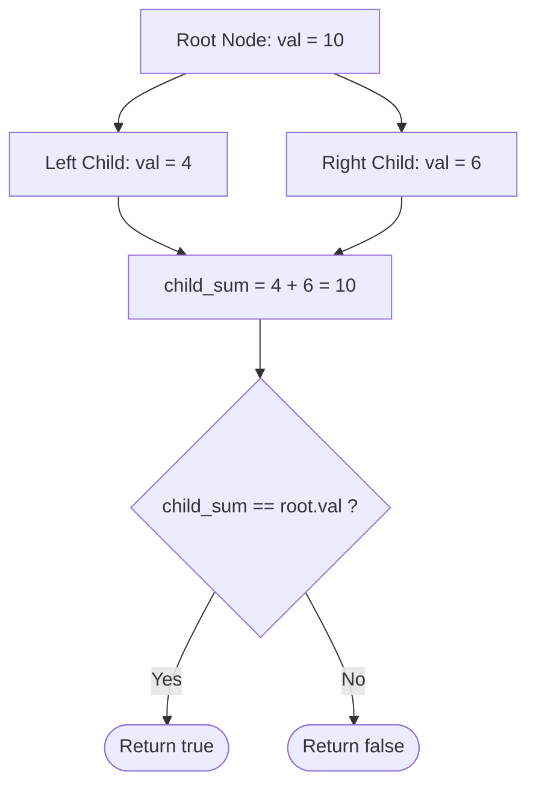

# Guided Example: Root Equals Sum of Children

We analyze and trace the direct pointer dereference and additive equality algorithm for validating the local sum property in a 3-node binary tree in $O(1)$ time and $O(1)$ auxiliary space.

- **Input:** `root = [10, 4, 6]`
- **Output:** `true`

This representative instance demonstrates binary tree node pointer access, binary additive conservation, structural topology guarantees, and constant-time predicate verification.

---

## 1. Problem Overview & Representative Instance

You are given the `root` of a binary tree that consists of **exactly 3 nodes**:
1. The root node `root`.
2. Its left child `root.left`.
3. Its right child `root.right`.

We must determine whether the value stored in the root node equals the arithmetic sum of the values stored in its two immediate child nodes:
$$\text{root.val} \stackrel{?}{=} \text{root.left.val} + \text{root.right.val}$$

Return `true` if the equality holds, and `false` otherwise.

### Representative Instance Breakdown

Consider `root = [10, 4, 6]`:
- Value at root node: $\text{root.val} = 10$.
- Value at left child: $\text{root.left.val} = 4$.
- Value at right child: $\text{root.right.val} = 6$.

Calculating the sum of the children:
$$\text{child\_sum} = 4 + 6 = 10$$
Comparing with root:
$$\text{root.val} == \text{child\_sum} \iff 10 == 10 \implies \text{True}$$

Output: `true`.

---

## 2. Mathematical & Algorithmic Principles

### Local Additive Conservation Invariant

Let $T = (V, E)$ be a rooted binary tree with vertex set $V = \{r, u_L, u_R\}$ and directed edges $E = \{(r, u_L), (r, u_R)\}$.
The tree valuation function is $v: V \to \mathbb{Z}$.

We evaluate the Boolean decision predicate:
$$P(T) = \left[ v(r) = v(u_L) + v(u_R) \right]$$

### Topology Guarantees and Direct Memory Access

Because the problem contract strictly enforces $|V| = 3$:
- The left child pointer `root.left` is guaranteed to be non-null.
- The right child pointer `root.right` is guaranteed to be non-null.
- Both children are leaf nodes (`left.left == null`, `left.right == null`, etc.).

No recursive traversal, DFS stack, or null-pointer guard branching is required. The verification reduces to accessing memory offsets and performing a single arithmetic comparison.

---

## 3. Step-by-Step Walkthrough with Intermediate State

We trace `root = [10, 4, 6]`.

### Step 1: Pointer Dereference & Value Extraction
1. Access root node:
   $$\text{val}_{\text{root}} = \text{root.val} = 10$$
2. Dereference left pointer:
   $$\text{val}_{\text{left}} = \text{root.left.val} = 4$$
3. Dereference right pointer:
   $$\text{val}_{\text{right}} = \text{root.right.val} = 6$$

---

### Step 2: Sum Evaluation & Predicate Comparison
1. Compute the sum of children:
   $$\text{sum} = \text{val}_{\text{left}} + \text{val}_{\text{right}} = 4 + 6 = 10$$
2. Evaluate equality:
   $$\text{val}_{\text{root}} == \text{sum} \iff 10 == 10 \implies \text{True}$$

Result: `true`.

---

## 4. Comprehensive State Trace

### Node Pointer Dereference Table

| Node Identifier | Object Reference | Field Inspected | Value Retrieved | Role in Expression |
|---|---|---|---|---|
| Root | `root` | `.val` | 10 | Left-hand side (target value) |
| Left Child | `root.left` | `.val` | 4 | First addend |
| Right Child | `root.right` | `.val` | 6 | Second addend |

### Comparative Verification Across Tree Archetypes

| Tree Representation | `root.val` | `root.left.val` | `root.right.val` | Children Sum | Equality Test | Return Result |
|---|---|---|---|---|---|---|
| `[10, 4, 6]` | 10 | 4 | 6 | $4 + 6 = 10$ | $10 == 10$ | **True** (Exact match) |
| `[5, 3, 1]` | 5 | 3 | 1 | $3 + 1 = 4$ | $5 \ne 4$ | **False** (Deficit) |
| `[0, -3, 3]` | 0 | -3 | 3 | $-3 + 3 = 0$ | $0 == 0$ | **True** (Zero sum with negatives) |
| `[-5, -2, -3]` | -5 | -2 | -3 | $-2 + (-3) = -5$ | $-5 == -5$ | **True** (All negative) |
| `[1, 1, 1]` | 1 | 1 | 1 | $1 + 1 = 2$ | $1 \ne 2$ | **False** (Equal values) |

---

## 5. Algorithmic Correctness & Soundness

### Direct Structural Equivalence

1. **Exact Semantic Translation:** The code expression `root.val == root.left.val + root.right.val` directly implements the problem specification without transformation or heuristic approximation.
2. **Safety Invariant:** By the guaranteed tree definition, `root`, `root.left`, and `root.right` are valid instantiated references. No `NullPointerException` or `AttributeError` can occur.
3. **Soundness & Completeness:** The Boolean comparison evaluates to `true` if and only if the root value is identically equal to the sum of its two children.

---

## 6. Edge Cases & Anti-Patterns

### Boundary Scenarios

1. **Negative Child Values:**
   - E.g., `root = [0, -5, 5]`. Negative and positive child values cancel out: $-5 + 5 = 0 == 0 \implies \text{true}$.
2. **All Negative Values:**
   - E.g., `root = [-10, -4, -6]`. $-4 + (-6) = -10 == -10 \implies \text{true}$.
3. **Zero Values:**
   - E.g., `root = [0, 0, 0]`. $0 + 0 = 0 == 0 \implies \text{true}$.

### Common Anti-Patterns

- **General Tree DFS/Recursion Overhead:**
  Writing a recursive tree traversal function designed for arbitrary depth binary trees introduces function call stack overhead and redundant base cases for a fixed 3-node structure.
- **Unnecessary Null Checks:**
  Adding defensive guards like `if not root or not root.left or not root.right:` adds dead branch code, as the input contract guarantees a complete 3-node tree.

---

## 7. Complexity Analysis

### Time Complexity

- The algorithm performs two memory dereferences (`root.left.val` and `root.right.val`), one addition, and one equality comparison.
- All operations execute in $O(1)$ machine instructions.
- **Total Time Complexity:** Strictly $O(1)$ constant time.

### Auxiliary Space Complexity

- No variables, buffers, recursion frames, or heap objects are allocated.
- **Total Auxiliary Space Complexity:** Strictly $O(1)$ auxiliary space.