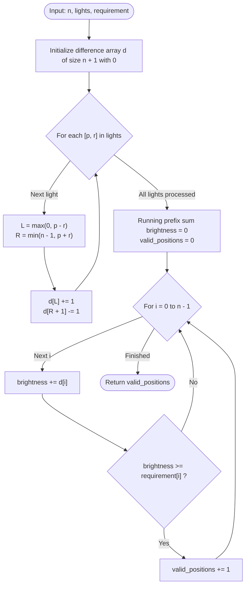

# Guided Example: Count Positions on Street With Required Brightness

We analyze and trace the 1D difference array (range-update, prefix-sum query) algorithm for evaluating cumulative street lamp illumination against requirement thresholds in $O(m + n)$ time and $O(n)$ auxiliary space.

- **Input:** `n = 5`, `lights = [[0, 1], [2, 1], [3, 2]]`, `requirement = [0, 2, 1, 4, 1]`
- **Output:** `4`

This representative instance demonstrates coordinate boundary clamping, discrete derivative interval encoding, running prefix sum reconstruction, and pointwise threshold compliance.

---

## 1. Problem Overview & Representative Instance

A straight street is modeled as an integer grid of $n$ positions indexed from $0$ to $n - 1$.
You are given a 2D integer array `lights` where each lamp $\text{lights}[i] = [p_i, r_i]$ illuminates all integer coordinates within the closed interval:
$$[\max(0, p_i - r_i), \min(n - 1, p_i + r_i)]$$
Each lamp contributes $+1$ unit of brightness to every integer coordinate in its range.
Multiple lamps overlapping at a position have their illumination added together.

You are also given an integer array `requirement` of length $n$.
Our objective is to return the number of positions $i \in \{0, \dots, n-1\}$ where the total brightness meets or exceeds $\text{requirement}[i]$.

### Representative Instance Breakdown

Consider $n = 5$, `lights = [[0, 1], [2, 1], [3, 2]]`, and `requirement = [0, 2, 1, 4, 1]`:
- **Lamp 0 ($p = 0, r = 1$):**
  Illuminates $[\max(0, 0 - 1), \min(4, 0 + 1)] = [0, 1]$.
- **Lamp 1 ($p = 2, r = 1$):**
  Illuminates $[\max(0, 2 - 1), \min(4, 2 + 1)] = [1, 3]$.
- **Lamp 2 ($p = 3, r = 2$):**
  Illuminates $[\max(0, 3 - 2), \min(4, 3 + 2)] = [1, 4]$.

Superposing illumination at each street position $x \in \{0, 1, 2, 3, 4\}$:
- $x = 0$: Covered by Lamp 0 $\implies$ Brightness = $1$. Requirement = $0$. $1 \ge 0$ (Satisfied).
- $x = 1$: Covered by Lamps 0, 1, 2 $\implies$ Brightness = $3$. Requirement = $2$. $3 \ge 2$ (Satisfied).
- $x = 2$: Covered by Lamps 1, 2 $\implies$ Brightness = $2$. Requirement = $1$. $2 \ge 1$ (Satisfied).
- $x = 3$: Covered by Lamps 1, 2 $\implies$ Brightness = $2$. Requirement = $4$. $2 \ge 4$ (Violated).
- $x = 4$: Covered by Lamp 2 $\implies$ Brightness = $1$. Requirement = $1$. $1 \ge 1$ (Satisfied).

Total positions meeting requirement: $4$ (positions $0, 1, 2, 4$).

---

## 2. Mathematical & Algorithmic Principles

### The Difference Array (Discrete Derivative)

Let $B(x)$ be the total brightness at integer position $x \in \{0, \dots, n-1\}$.
Iterating across every coordinate for every lamp requires $O(m \cdot n)$ operations, which times out when $m, n \approx 10^5$.

To achieve $O(1)$ time per range update, we define the difference array $d$ of length $n + 1$:
$$d[x] = B(x) - B(x - 1), \quad \text{with } B(-1) = 0$$

An illumination interval $[L, R]$ increments $B(x)$ by $+1$ for all $x \in [L, R]$ and leaves all other positions unchanged.
In the difference array:
- At the entry point $x = L$, $B(L) - B(L-1)$ increases by $1$:
  $$d[L] \leftarrow d[L] + 1$$
- Across the interior $x \in (L, R]$, both $B(x)$ and $B(x-1)$ increase by $1$, so the difference $B(x) - B(x-1)$ remains constant.
- Immediately after the exit point $x = R + 1$, $B(R+1)$ does not receive the light, while $B(R)$ did, so the difference drops by $1$:
  $$d[R + 1] \leftarrow d[R + 1] - 1$$

### Prefix Sum Reconstruction

By the fundamental theorem of discrete calculus:
$$B(x) = \sum_{k=0}^x d[k]$$
Accumulating the prefix sums of $d$ in a single linear pass reconstructs the exact brightness for every position $x$ in $O(n)$ time.

---

## 3. Step-by-Step Walkthrough with Intermediate State

We trace $n = 5$, `lights = [[0, 1], [2, 1], [3, 2]]`, and `requirement = [0, 2, 1, 4, 1]`.
Initialize difference array $d = [0, 0, 0, 0, 0, 0]$ of length $6$.

### Phase 1: Range Update Application
1. **Lamp 0: `[0, 1]`**
   - $L = \max(0, 0 - 1) = 0$.
   - $R = \min(4, 0 + 1) = 1$.
   - Apply boundary updates:
     - $d[0] \leftarrow d[0] + 1 = 1$.
     - $d[1 + 1] = d[2] \leftarrow d[2] - 1 = -1$.
   - Array: $d = [1, 0, -1, 0, 0, 0]$.

2. **Lamp 1: `[2, 1]`**
   - $L = \max(0, 2 - 1) = 1$.
   - $R = \min(4, 2 + 1) = 3$.
   - Apply boundary updates:
     - $d[1] \leftarrow d[1] + 1 = 1$.
     - $d[3 + 1] = d[4] \leftarrow d[4] - 1 = -1$.
   - Array: $d = [1, 1, -1, 0, -1, 0]$.

3. **Lamp 2: `[3, 2]`**
   - $L = \max(0, 3 - 2) = 1$.
   - $R = \min(4, 3 + 2) = 4$.
   - Apply boundary updates:
     - $d[1] \leftarrow d[1] + 1 = 2$.
     - $d[4 + 1] = d[5] \leftarrow d[5] - 1 = -1$.
   - Final difference array: $d = [1, 2, -1, 0, -1, -1]$.

---

### Phase 2: Prefix Sum Accumulation & Threshold Evaluation

Initialize running brightness $s = 0$, valid count $\text{ans} = 0$.

1. **Position $i = 0$:**
   - $s \leftarrow 0 + d[0] = 0 + 1 = 1$.
   - $\text{requirement}[0] = 0$.
   - Check: $1 \ge 0 \implies \text{True}$.
   - $\text{ans} \leftarrow 0 + 1 = 1$.

2. **Position $i = 1$:**
   - $s \leftarrow 1 + d[1] = 1 + 2 = 3$.
   - $\text{requirement}[1] = 2$.
   - Check: $3 \ge 2 \implies \text{True}$.
   - $\text{ans} \leftarrow 1 + 1 = 2$.

3. **Position $i = 2$:**
   - $s \leftarrow 3 + d[2] = 3 + (-1) = 2$.
   - $\text{requirement}[2] = 1$.
   - Check: $2 \ge 1 \implies \text{True}$.
   - $\text{ans} \leftarrow 2 + 1 = 3$.

4. **Position $i = 3$:**
   - $s \leftarrow 2 + d[3] = 2 + 0 = 2$.
   - $\text{requirement}[3] = 4$.
   - Check: $2 \ge 4 \implies \text{False}$.
   - $\text{ans}$ remains $3$.

5. **Position $i = 4$:**
   - $s \leftarrow 2 + d[4] = 2 + (-1) = 1$.
   - $\text{requirement}[4] = 1$.
   - Check: $1 \ge 1 \implies \text{True}$.
   - $\text{ans} \leftarrow 3 + 1 = 4$.

Final count of qualified positions: $4$.

---

## 4. Comprehensive State Trace

### Lamp Ingestion & Difference Array Mutations

| Lamp $k$ | Center $p$ | Radius $r$ | Clamped Range $[L, R]$ | $+1$ Boundary $L$ | $-1$ Boundary $R+1$ | Difference Array State $d[0 \dots 5]$ |
|---|---|---|---|---|---|---|
| Initial | - | - | - | - | - | $[0, 0, 0, 0, 0, 0]$ |
| 0 | 0 | 1 | $[0, 1]$ | $d[0]$ | $d[2]$ | $[1, 0, -1, 0, 0, 0]$ |
| 1 | 2 | 1 | $[1, 3]$ | $d[1]$ | $d[4]$ | $[1, 1, -1, 0, -1, 0]$ |
| 2 | 3 | 2 | $[1, 4]$ | $d[1]$ | $d[5]$ | $[1, 2, -1, 0, -1, -1]$ |

### Position-by-Position Brightness & Requirement Trace

| Position $i$ | $d[i]$ | Computed Brightness $s = \sum_{k=0}^i d[k]$ | Covering Lamps | Requirement | $s \ge \text{req}$? | Valid Positions Count |
|---|---|---|---|---|---|---|
| 0 | +1 | 1 | {Lamp 0} | 0 | **True** | 1 |
| 1 | +2 | 3 | {Lamp 0, Lamp 1, Lamp 2} | 2 | **True** | 2 |
| 2 | -1 | 2 | {Lamp 1, Lamp 2} | 1 | **True** | 3 |
| 3 | 0 | 2 | {Lamp 1, Lamp 2} | 4 | **False** | 3 |
| 4 | -1 | 1 | {Lamp 2} | 1 | **True** | **4** |

---

## 5. Algorithmic Correctness & Soundness

### Mathematical Invariant of Telescoping Sums

For any coordinate $x \in \{0, \dots, n-1\}$, the prefix sum is:
$$B(x) = \sum_{k=0}^x d[k]$$
For any individual lamp covering $[L, R]$:
- If $x < L$, neither $d[L]$ nor $d[R+1]$ is included in the prefix sum, contributing $0$.
- If $L \le x \le R$, $d[L] = +1$ is included but $d[R+1] = -1$ is excluded, contributing $+1$.
- If $x > R$, both $d[L] = +1$ and $d[R+1] = -1$ are included, telescoping to $+1 - 1 = 0$.

By linearity of summation, $B(x)$ strictly equals the number of lamps whose illumination interval contains $x$.

---

## 6. Edge Cases & Anti-Patterns

### Boundary Scenarios

1. **Light Range Spans Beyond Street ($p - r < 0$ or $p + r \ge n$):**
   - Correctly clamped by $\max(0, p - r)$ and $\min(n - 1, p + r)$ so indices never fall out of bounds.
2. **Point Illuminators ($r = 0$):**
   - A lamp with range 0 illuminates only its own coordinate $p$. Clamped interval is $[p, p]$, giving $d[p] \mathrel{+}= 1, d[p+1] \mathrel{-}= 1$.
3. **Zero Requirement ($\text{requirement}[i] = 0$):**
   - Since brightness is always non-negative ($s \ge 0$), any position with requirement 0 is trivially satisfied.
4. **All Requirements Unmet:**
   - If requirement values exceed total available lamps, returns $0$.

### Common Anti-Patterns

- **Direct Iteration Over Each Lamp's Span ($O(m \cdot n)$):**
  Iterating a loop `for x in range(L, R + 1): brightness[x] += 1` executes up to $10^5 \times 10^5 = 10^{10}$ operations, causing massive Time Limit Exceeded (TLE). The difference array reduces interval stamping to $O(1)$.
- **Forgetting Size $n + 1$ for Difference Array:**
  When $R = n - 1$, writing to $d[R + 1] = d[n]$ causes an index out-of-bounds error if the difference array is allocated with length $n$ instead of $n + 1$.

---

## 7. Complexity Analysis

### Time Complexity

- **Difference Array Updates:** Processing $m$ lamps requires $O(1)$ operations per lamp: $O(m)$ time.
- **Prefix Sum Sweep:** Iterating through $n$ coordinates to accumulate prefix sums and compare against `requirement`: $O(n)$ time.
- **Total Time Complexity:** $O(m + n)$ deterministic linear time, optimal since every lamp and requirement must be read.

### Auxiliary Space Complexity

- **Difference Array:** Stores $n + 1$ integers: $O(n)$ space.
- **Total Auxiliary Space Complexity:** $O(n)$ auxiliary space.
