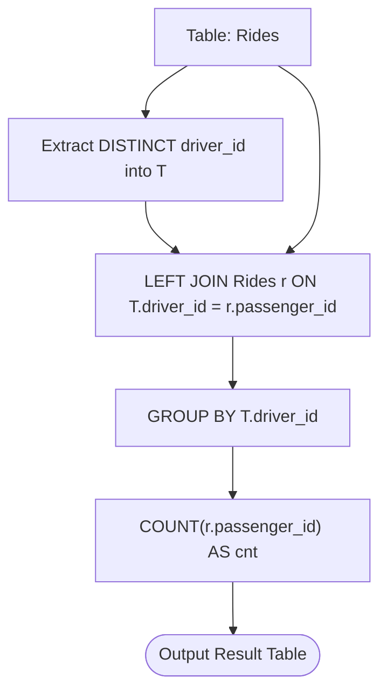

# Guided Example: Number of Times a Driver Was a Passenger

We analyze and trace the self-referential relational left outer join and null-safe aggregation algorithm for reporting passenger frequency for all registered drivers in $O(n \log n)$ time and $O(n)$ space.

- **Input:** `Rides` table containing 6 ride events for drivers 7 and 11.
- **Output:** `[[7, 2], [11, 0]]`

This representative instance demonstrates entity role duality (driver vs passenger), left outer join preservation of zero-occurrence categories, the crucial distinction between `COUNT(*)` and `COUNT(column)`, and relational aggregation.

---

## 1. Problem Overview & Representative Instance

We are given a database table `Rides`:
- `ride_id` (integer, primary key): Unique transaction identifier for each ride.
- `driver_id` (integer): Identifier for the user operating the vehicle.
- `passenger_id` (integer): Identifier for the customer riding as a passenger.

Our objective is to report the ID of **every driver** who has driven at least one ride, along with the **number of times they were a passenger**.
If a driver has never been a passenger, their passenger count must be reported as $0$.
The result table may be returned in any order.

### Representative Instance Breakdown

Consider the `Rides` table:

| `ride_id` | `driver_id` | `passenger_id` |
|---|---|---|
| 1 | 7 | 1 |
| 2 | 7 | 2 |
| 3 | 11 | 1 |
| 4 | 11 | 7 |
| 5 | 11 | 7 |
| 6 | 11 | 3 |

Analysis by entity:
1. **Registered Drivers:**
   The unique values in the `driver_id` column are $\{7, 11\}$.
   (Passengers $1, 2, 3$ never drove any rides and are excluded from the output driver list).
2. **Passenger Occurrences for Driver 7:**
   - In `ride_id = 4`, the passenger is $7$.
   - In `ride_id = 5`, the passenger is $7$.
   - Total times Driver 7 was a passenger: $2$.
3. **Passenger Occurrences for Driver 11:**
   - Scanning `passenger_id` across all 6 rides, $11$ never appears.
   - Total times Driver 11 was a passenger: $0$.

Output table:
- `(driver_id: 7, cnt: 2)`
- `(driver_id: 11, cnt: 0)`

---

## 2. Mathematical & Algorithmic Principles

### Bipartite Role Duality

In rideshare event modeling, an individual user can act in two orthogonal capacities:
- As an active agent (Driver: origin of service).
- As a passive consumer (Passenger: recipient of service).

Let $R$ denote the multiset of ride records.
The universe of drivers to report is the projection:
$$D = \pi_{\text{driver\_id}}(R)$$
For each $d \in D$, the required metric is the in-degree frequency as a passenger:
$$\text{cnt}(d) = \sum_{r \in R} \mathbf{1}_{\{ r.\text{passenger\_id} = d \}}$$

### Left Outer Join Preservation

If we use an `INNER JOIN` between distinct drivers $D$ and passenger records in $R$, any driver with $\text{cnt}(d) = 0$ (such as Driver 11) will fail the join condition $d = r.\text{passenger\_id}$ and be completely dropped from the output.

To preserve every driver in $D$:
1. Form the distinct set of driver IDs:
   $$T = \pi_{\text{driver\_id}}(R)$$
2. Perform a `LEFT OUTER JOIN` from $T$ to $R$ on condition:
   $$T.\text{driver\_id} = R.\text{passenger\_id}$$
3. For a driver who was never a passenger, the join produces a single row containing `NULL` for all attributes from $R$.
4. **The Null-Tolerant Counting Invariant:**
   - `COUNT(*)` counts all rows in a group, returning $1$ for a NULL-padded row (which would be incorrect).
   - `COUNT(r.passenger_id)` ignores `NULL` values and correctly produces $0$.

---

## 3. Step-by-Step Walkthrough with Intermediate State

We trace the query pipeline on the 6-row `Rides` table.

### Phase 1: Unique Driver Extraction
Scan column `driver_id` in `Rides`:
$$\text{driver\_id} \in \{7, 7, 11, 11, 11, 11\}$$
Deduplicate via `DISTINCT`:
$$T = \{7, 11\}$$

---

### Phase 2: Left Outer Join Execution
Join $T$ as $t$ with `Rides` as $r$ on $t.\text{driver\_id} = r.\text{passenger\_id}$:

1. **For $t.\text{driver\_id} = 7$:**
   - Compare with `ride_id = 1` (`passenger_id = 1`): No match.
   - Compare with `ride_id = 2` (`passenger_id = 2`): No match.
   - Compare with `ride_id = 3` (`passenger_id = 1`): No match.
   - Compare with `ride_id = 4` (`passenger_id = 7`): **Match!** Generates `(driver_id: 7, ride_id: 4, passenger_id: 7)`.
   - Compare with `ride_id = 5` (`passenger_id = 7`): **Match!** Generates `(driver_id: 7, ride_id: 5, passenger_id: 7)`.
   - Compare with `ride_id = 6` (`passenger_id = 3`): No match.
   - Matches produced: 2 rows.

2. **For $t.\text{driver\_id} = 11$:**
   - Compare with all 6 rides: $11$ never appears in `passenger_id`.
   - Left join preserves driver 11 with NULL padding:
     Generates `(driver_id: 11, ride_id: NULL, passenger_id: NULL)`.
   - Matches produced: 1 row with NULL values.

---

### Phase 3: Grouping & Aggregation

1. **Group $t.\text{driver\_id} = 7$:**
   - Rows in group:
     - `passenger_id = 7` (non-null)
     - `passenger_id = 7` (non-null)
   - Evaluation: $\text{COUNT}(\text{passenger\_id}) = 2$.
   - Output tuple: `(driver_id: 7, cnt: 2)`.

2. **Group $t.\text{driver\_id} = 11$:**
   - Rows in group:
     - `passenger_id = NULL` (null)
   - Evaluation: $\text{COUNT}(\text{passenger\_id}) = 0$.
   - Output tuple: `(driver_id: 11, cnt: 0)`.

---

## 4. Comprehensive State Trace

### Intermediate Left Join Result Matrix

| $t.\text{driver\_id}$ | $r.\text{ride\_id}$ | $r.\text{driver\_id}$ | $r.\text{passenger\_id}$ | Null Status |
|---|---|---|---|---|
| 7 | 4 | 11 | 7 | Non-Null |
| 7 | 5 | 11 | 7 | Non-Null |
| 11 | `NULL` | `NULL` | `NULL` | **Null Padded** |

### Group By Aggregation Comparison

| Driver Identifier | Joined Row Count | `COUNT(*)` Behavior | `COUNT(r.passenger_id)` Behavior | Final Selected Metric `cnt` |
|---|---|---|---|---|
| 7 | 2 | Evaluates to 2 | Evaluates to 2 | **2** |
| 11 | 1 | Evaluates to 1 (Incorrect!) | Evaluates to 0 (Correct!) | **0** |

---

## 5. Algorithmic Correctness & Soundness

### Relational Proof of Invariants

1. **Driver Universe Completeness:**
   CTE $T$ selects `DISTINCT driver_id FROM Rides`. Every user who has ever driven is present in $T$ exactly once.
2. **Preservation of Zeroes via Left Outer Join:**
   Because $T$ is the left table in `T LEFT JOIN Rides`, no row from $T$ can be discarded. If a driver has zero passenger occurrences, exactly one row with `r.passenger_id IS NULL` is retained.
3. **Null Aggregation Semantics:**
   In ANSI SQL, aggregate function `COUNT(expression)` computes the number of rows for which `expression` evaluates to a non-null value. For Driver 11, the expression `r.passenger_id` evaluates to `NULL`, so `COUNT` returns strictly $0$.

---

## 6. Edge Cases & Anti-Patterns

### Boundary Scenarios

1. **Driver Has Never Been a Passenger:**
   - Handled seamlessly by left outer join and non-null counting; returns count 0.
2. **Passengers Who Are Never Drivers:**
   - Users who only appear in `passenger_id` (e.g. users 1, 2, 3) are excluded from the output because $T$ restricts the entity universe strictly to `driver_id`.
3. **Driver Is a Passenger in Their Own Ride:**
   - If a ride record has `driver_id == passenger_id`, the condition $t.\text{driver\_id} = r.\text{passenger\_id}$ matches and counts it as a passenger ride.

### Common Anti-Patterns

- **Using `COUNT(*)` with Left Join:**
  `COUNT(*)` counts the row itself. For Driver 11, the NULL-padded join row is counted as $1$, falsely claiming Driver 11 was a passenger once! Always use `COUNT(r.passenger_id)`.
- **Using `INNER JOIN`:**
  An inner join silently drops all drivers who have 0 passenger rides, omitting valid drivers from the final report.
- **Correlated Subquery in `SELECT`:**
  Writing `SELECT driver_id, (SELECT COUNT(*) FROM Rides r WHERE r.passenger_id = t.driver_id) FROM ...` runs an $O(n)$ scan for every distinct driver, leading to $O(d \cdot n)$ quadratic database engine execution. The grouped hash left join executes in linear time.

---

## 7. Complexity Analysis

### Time Complexity

- **Distinct Driver Extraction:** One linear scan of $n$ rows in `Rides` using hash deduplication takes $O(n)$ time.
- **Left Hash Join:** Building an in-memory hash table on passenger IDs from `Rides` and probing with $d$ unique drivers takes $O(n)$ time.
- **Group By Aggregation:** Hashing by `driver_id` to aggregate non-null counts takes $O(d)$ time where $d \le n$.
- **Total Time Complexity:** $O(n \log n)$ or $O(n)$ expected time with relational hash indexing.

### Auxiliary Space Complexity

- **Hash Tables:** Storing the distinct set of $d$ drivers and the hash join index takes $O(d + n)$ space.
- **Result Relation:** Stores $d$ output rows: $O(d)$ space.
- **Total Auxiliary Space Complexity:** $O(n)$ space.
