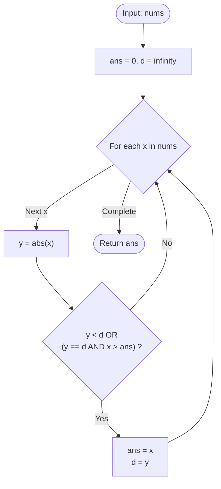

# Guided Example: Find Closest Number to Zero

We analyze and trace the online single-pass composite extremum scan algorithm for identifying the integer closest to zero with directional tie-breaking in $O(n)$ time and $O(1)$ auxiliary space.

- **Input:** `nums = [-4, -2, 1, 4, 8]`
- **Output:** `1`

This representative instance demonstrates distance metric evaluation via absolute value, asymmetric lexicographical tie-breaking, streaming argmin maintenance, and linear order invariance.

---

## 1. Problem Overview & Representative Instance

You are given an integer array `nums` of size $n$.
Our objective is to return the number in `nums` that is **closest to 0**.
If there are multiple numbers that are equally close to 0 (meaning their absolute values are identical), return the number with the **largest numerical value** (i.e. if both $-x$ and $x$ are present and tied for minimum distance, return $x$).

### Representative Instance Breakdown

Consider `nums = [-4, -2, 1, 4, 8]`:
- Absolute distance from 0 for each element:
  - $x = -4 \implies |-4| = 4$
  - $x = -2 \implies |-2| = 2$
  - $x = 1 \implies |1| = 1$
  - $x = 4 \implies |4| = 4$
  - $x = 8 \implies |8| = 8$

Minimum distance among all elements is $1$, achieved uniquely by element $1$.
Output: $1$.

### Tie-Breaking Nuance

If the array contained both $-1$ and $1$ (e.g. `nums = [2, -1, 1]`):
- Both have $|-1| = |1| = 1$.
- The tie-breaking rule specifies selecting the strictly greater signed value: $\max(-1, 1) = 1$.

---

## 2. Mathematical & Algorithmic Principles

### Composite Lexicographical Total Order

We define a binary relation $\prec$ that establishes a strict total order over the elements of $\mathbb{Z}$:
$$x \prec y \iff (|x| < |y|) \lor (|x| = |y| \land x > y)$$

In this ordering:
- A candidate with a strictly smaller absolute magnitude $|x|$ is preferred over one with a larger magnitude.
- When two candidates have identical absolute magnitudes ($|x| = |y|$), the candidate with the larger algebraic signed value ($x > y$) is preferred.
This is mathematically equivalent to minimizing the 2-tuple:
$$(|x|, -x)$$
under standard lexicographical comparison.

### Streaming Online Argmin Invariant

We maintain two scalar variables throughout a single linear scan:
- `ans`: the best candidate encountered so far.
- `d`: the minimum absolute distance observed so far ($\text{d} = |ans|$).

For each element $x \in \text{nums}$, let $y = |x|$. We update the state $(ans, d) \leftarrow (x, y)$ if and only if:
$$y < d \quad \text{or} \quad (y = d \land x > ans)$$

---

## 3. Step-by-Step Walkthrough with Intermediate State

We trace `nums = [-4, -2, 1, 4, 8]`.
Initialize $\text{ans} = 0$, $d = \infty$.

### Step 1: Element $x = -4$
- Absolute distance: $y = |-4| = 4$.
- Compare: $4 < \infty \implies$ **True**.
- Update: $\text{ans} \leftarrow -4$, $d \leftarrow 4$.
- State: $\text{ans} = -4, d = 4$.

### Step 2: Element $x = -2$
- Absolute distance: $y = |-2| = 2$.
- Compare: $2 < 4 \implies$ **True**.
- Update: $\text{ans} \leftarrow -2$, $d \leftarrow 2$.
- State: $\text{ans} = -2, d = 2$.

### Step 3: Element $x = 1$
- Absolute distance: $y = |1| = 1$.
- Compare: $1 < 2 \implies$ **True**.
- Update: $\text{ans} \leftarrow 1$, $d \leftarrow 1$.
- State: $\text{ans} = 1, d = 1$.

### Step 4: Element $x = 4$
- Absolute distance: $y = |4| = 4$.
- Compare: $4 < 1$ is False; $4 == 1$ is False.
- No update.
- State: $\text{ans} = 1, d = 1$.

### Step 5: Element $x = 8$
- Absolute distance: $y = |8| = 8$.
- Compare: $8 < 1$ is False; $8 == 1$ is False.
- No update.
- State: $\text{ans} = 1, d = 1$.

### Termination
All elements processed. Return $\text{ans} = 1$.

---

## 4. Comprehensive State Trace

### Complete Linear Scan Step Trace

| Step $i$ | Element $x$ | Magnitude $y = \lvert x \rvert$ | Current Best $\text{ans}$ | Current Min Distance $d$ | Condition $y < d$ | Tie Check $(y == d \land x > \text{ans})$ | Updated State $(\text{ans}, d)$ |
|---|---|---|---|---|---|---|---|
| Initial | - | - | 0 | $\infty$ | - | - | $(0, \infty)$ |
| 0 | -4 | 4 | 0 | $\infty$ | **True** ($4 < \infty$) | - | $(-4, 4)$ |
| 1 | -2 | 2 | -4 | 4 | **True** ($2 < 4$) | - | $(-2, 2)$ |
| 2 | 1 | 1 | -2 | 2 | **True** ($1 < 2$) | - | $(1, 1)$ |
| 3 | 4 | 4 | 1 | 1 | False ($4 > 1$) | False | $(1, 1)$ |
| 4 | 8 | 8 | 1 | 1 | False ($8 > 1$) | False | $(1, 1)$ |

### Comparative Verification Across Ambiguous Scenarios

| Test Array `nums` | Candidate Magnitudes | Competing Best Elements | Tie-Breaking Reason | Returned Result |
|---|---|---|---|---|
| `[-4, -2, 1, 4, 8]` | $\{4, 2, 1, 4, 8\}$ | $\{1\}$ | Strictly minimum magnitude $1$ | **1** |
| `[2, -1, 1]` | $\{2, 1, 1\}$ | $\{-1, 1\}$ | Tied at magnitude $1$; $1 > -1$ | **1** |
| `[-5, -5, -5]` | $\{5, 5, 5\}$ | $\{-5\}$ | Identical candidates | **-5** |
| `[0, -10, 10]` | $\{0, 10, 10\}$ | $\{0\}$ | Magnitude $0$ is optimal | **0** |
| `[-1000]` | $\{1000\}$ | $\{-1000\}$ | Single element | **-1000** |

---

## 5. Algorithmic Correctness & Soundness

### Preservation of the Total Order Invariant

1. **Strict Total Order:** For any two integers $a, b$:
   - Either $a \prec b$, $b \prec a$, or $a = b$.
   - The relation $\prec$ is transitive: $a \prec b \land b \prec c \implies a \prec c$.
2. **Inductive Correctness:** Let $P(k)$ be the proposition that after processing the prefix $\text{nums}[0 \dots k]$, `ans` holds the minimum element of the prefix under $\prec$.
   - Base case: For $k = 0$, $x_0$ is evaluated against $\infty$, setting $\text{ans} = x_0$. $P(0)$ holds.
   - Inductive step: Assume $P(k-1)$ holds. When inspecting $x_k$, the algorithm updates `ans` to $x_k$ if and only if $x_k \prec \text{ans}$. Thus `ans` remains the minimum under $\prec$ for $\text{nums}[0 \dots k]$.
3. **Soundness:** Upon completing the scan of all $n$ elements, `ans` is guaranteed to be the global minimum under $\prec$.

---

## 6. Edge Cases & Anti-Patterns

### Boundary Scenarios

1. **Presence of Zero ($0 \in \text{nums}$):**
   - If $0$ is in the array, $|0| = 0$. Since distance cannot be negative, $d$ becomes $0$ and no other non-zero number can surpass it.
2. **All Negative Elements:**
   - E.g., `nums = [-5, -2, -8]`.
   - Magnitudes are $5, 2, 8$. The smallest magnitude is $2$, yielding $-2$.
3. **Bilateral Symmetrical Pairs ($[-x, x]$):**
   - E.g., `nums = [-7, 7]`.
   - Encountering $-7$ sets $\text{ans} = -7, d = 7$.
   - Encountering $+7$ triggers $y == d$ and $7 > -7$, correctly updating $\text{ans} = 7$.

### Common Anti-Patterns

- **Two-Pass Approach (Find Min Distance First, Filter Second):**
  Scanning once to find $\min(|x|)$ and then scanning again to find the maximum $x$ with that magnitude uses $2n$ passes when a single pass with composite logic suffices.
- **Sorting with Custom Comparator ($O(n \log n)$):**
  Sorting the entire array with a custom comparator achieves the result in $O(n \log n)$ time, which is strictly inferior to the $O(n)$ streaming linear scan.

---

## 7. Complexity Analysis

### Time Complexity

- The algorithm performs a single pass through the $n$ elements of `nums`.
- In each iteration, it performs one absolute value calculation, at most two scalar comparisons, and conditional assignments.
- **Total Time Complexity:** Strictly $O(n)$ time.

### Auxiliary Space Complexity

- The algorithm maintains two primitive scalar variables (`ans` and `d`).
- No heap objects or auxiliary arrays are allocated.
- **Total Auxiliary Space Complexity:** Strictly $O(1)$ auxiliary space.
