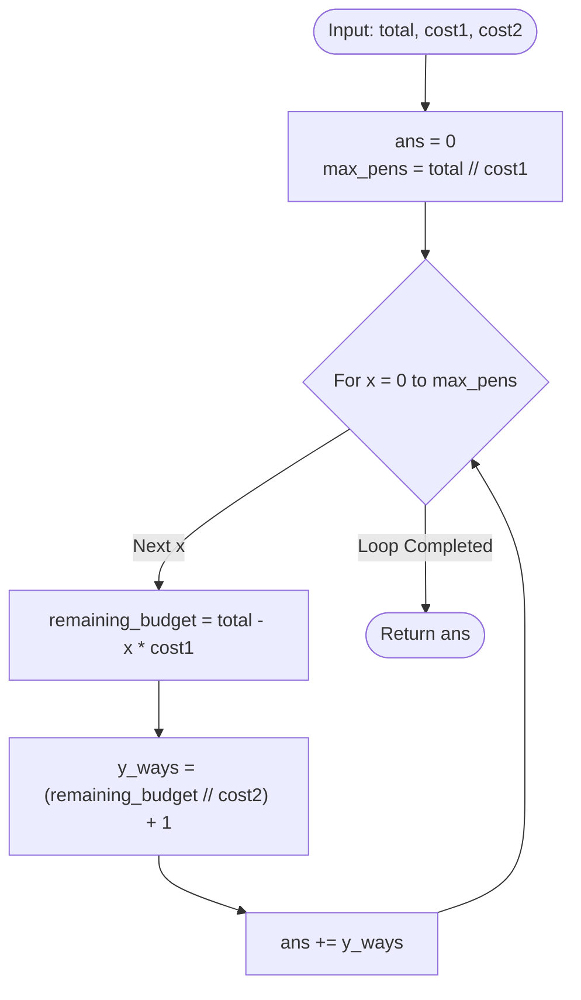

# Guided Example: Number of Ways to Buy Pens and Pencils

We analyze and trace the 1D simplex slicing algorithm for counting the number of non-negative integer solutions to a linear budget inequality in $O(\lfloor T / c_1 \rfloor)$ time and $O(1)$ auxiliary space.

- **Input:** `total = 20`, `cost1 = 10`, `cost2 = 5`
- **Output:** `9`

This representative instance demonstrates linear Diophantine inequality modeling, integer lattice point counting inside a triangular simplex, 1D dimensional reduction via floor division, and accumulator summation.

---

## 1. Problem Overview & Representative Instance

You are given an integer `total` representing your total monetary budget, and two integers `cost1` and `cost2` indicating the price of a single pen and a single pencil, respectively.

You can spend part or all of your money to purchase non-negative integer quantities of pens ($x \ge 0$) and pencils ($y \ge 0$). You are allowed to purchase zero pens, zero pencils, or both.

The budget constraint is:
$$x \cdot \text{cost1} + y \cdot \text{cost2} \le \text{total}$$

Our objective is to find the **total number of distinct valid pairs** $(x, y)$ that satisfy this constraint.

### Representative Instance Breakdown

Consider `total = 20`, `cost1 = 10`, `cost2 = 5`:
- Each pen costs $10$; each pencil costs $5$.
- Range of possible pens: $x \in [0, \lfloor 20 / 10 \rfloor] = [0, 2]$.

Evaluating each choice of $x$:
1. **$x = 0$ pens ($0 \times 10 = 0$ spent):**
   - Remaining budget: $20 - 0 = 20$.
   - Allowed pencils: $5y \le 20 \implies y \le \lfloor 20 / 5 \rfloor = 4$.
   - Valid $y \in \{0, 1, 2, 3, 4\} \implies 5$ distinct pairs.
2. **$x = 1$ pen ($1 \times 10 = 10$ spent):**
   - Remaining budget: $20 - 10 = 10$.
   - Allowed pencils: $5y \le 10 \implies y \le \lfloor 10 / 5 \rfloor = 2$.
   - Valid $y \in \{0, 1, 2\} \implies 3$ distinct pairs.
3. **$x = 2$ pens ($2 \times 10 = 20$ spent):**
   - Remaining budget: $20 - 20 = 0$.
   - Allowed pencils: $5y \le 0 \implies y \le \lfloor 0 / 5 \rfloor = 0$.
   - Valid $y \in \{0\} \implies 1$ distinct pair.

Total valid pairs: $5 + 3 + 1 = 9$.

---

## 2. Mathematical & Algorithmic Principles

### Lattice Points in a Right Simplex

Geometrically, the problem corresponds to counting the number of integer lattice points $(x, y) \in \mathbb{Z}_{\ge 0}^2$ enclosed within the right triangle bounded by:
$$x \ge 0, \quad y \ge 0, \quad x \cdot \text{cost1} + y \cdot \text{cost2} \le \text{total}$$

Rather than evaluating a 2D nested search over all $(x, y)$ pairs ($O(T^2)$), we slice the triangular region along the $x$-axis into parallel 1D segments.

### Closed-Form Floor Formulation

For any fixed choice of $x \in \{0, 1, \dots, \lfloor \text{total} / \text{cost1} \rfloor\}$:
$$y \cdot \text{cost2} \le \text{total} - x \cdot \text{cost1} \implies 0 \le y \le \left\lfloor \frac{\text{total} - x \cdot \text{cost1}}{\text{cost2}} \right\rfloor$$

Because $y$ can take any integer value from $0$ up to $y_{\max}(x)$ inclusive, the number of valid choices for $y$ given $x$ is:
$$\text{ways}(x) = y_{\max}(x) + 1 = \left\lfloor \frac{\text{total} - x \cdot \text{cost1}}{\text{cost2}} \right\rfloor + 1$$

Summing across all feasible $x$ values gives the exact total count:
$$\text{Total Ways} = \sum_{x=0}^{\lfloor \text{total} / \text{cost1} \rfloor} \left( \left\lfloor \frac{\text{total} - x \cdot \text{cost1}}{\text{cost2}} \right\rfloor + 1 \right)$$

---

## 3. Step-by-Step Walkthrough with Intermediate State

We trace `total = 20`, `cost1 = 10`, `cost2 = 5`.
Initialize $\text{ans} = 0$.
Upper bound for pens: $\lfloor 20 / 10 \rfloor = 2$.
Loop variable $x \in [0, 2]$.

### Step 1: $x = 0$ (Zero Pens)
- Expenditure on pens: $0 \times 10 = 0$.
- Remaining budget: $20 - 0 = 20$.
- Max pencils: $\lfloor 20 / 5 \rfloor = 4$.
- Number of valid pencil choices ($y \in [0, 4]$):
  $$y_{\text{ways}} = 4 + 1 = 5$$
- Accumulate: $\text{ans} \leftarrow 0 + 5 = 5$.

### Step 2: $x = 1$ (One Pen)
- Expenditure on pens: $1 \times 10 = 10$.
- Remaining budget: $20 - 10 = 10$.
- Max pencils: $\lfloor 10 / 5 \rfloor = 2$.
- Number of valid pencil choices ($y \in [0, 2]$):
  $$y_{\text{ways}} = 2 + 1 = 3$$
- Accumulate: $\text{ans} \leftarrow 5 + 3 = 8$.

### Step 3: $x = 2$ (Two Pens)
- Expenditure on pens: $2 \times 10 = 20$.
- Remaining budget: $20 - 20 = 0$.
- Max pencils: $\lfloor 0 / 5 \rfloor = 0$.
- Number of valid pencil choices ($y \in [0, 0]$):
  $$y_{\text{ways}} = 0 + 1 = 1$$
- Accumulate: $\text{ans} \leftarrow 8 + 1 = 9$.

### Loop Termination
$x$ reaches $2 = \lfloor 20 / 10 \rfloor$. Loop completes.
Final result: $9$.

---

## 4. Comprehensive State Trace

### Pen Iteration State Trace

| Pen Count $x$ | Pen Cost ($x \cdot 10$) | Remaining Budget ($20 - 10x$) | Max Pencils $\lfloor \text{rem} / 5 \rfloor$ | Valid $y$ Range | Choices Added ($y_{\max} + 1$) | Cumulative Ways $\text{ans}$ |
|---|---|---|---|---|---|---|
| Initial | - | 20 | - | - | - | 0 |
| 0 | 0 | 20 | 4 | $[0, 4]$ | 5 | 5 |
| 1 | 10 | 10 | 2 | $[0, 2]$ | 3 | 8 |
| 2 | 20 | 0 | 0 | $[0, 0]$ | 1 | **9** |

### Complete Enumerate of All 9 Valid Purchase Combinations

| Pair Index | Pens ($x$) | Pencils ($y$) | Total Cost ($10x + 5y$) | Budget Left ($20 - \text{Cost}$) | Feasibility Status |
|---|---|---|---|---|---|
| 1 | 0 | 0 | 0 | 20 | Valid ($0 \le 20$) |
| 2 | 0 | 1 | 5 | 15 | Valid ($5 \le 20$) |
| 3 | 0 | 2 | 10 | 10 | Valid ($10 \le 20$) |
| 4 | 0 | 3 | 15 | 5 | Valid ($15 \le 20$) |
| 5 | 0 | 4 | 20 | 0 | Valid ($20 \le 20$) |
| 6 | 1 | 0 | 10 | 10 | Valid ($10 \le 20$) |
| 7 | 1 | 1 | 15 | 5 | Valid ($15 \le 20$) |
| 8 | 1 | 2 | 20 | 0 | Valid ($20 \le 20$) |
| 9 | 2 | 0 | 20 | 0 | Valid ($20 \le 20$) |

---

## 5. Algorithmic Correctness & Soundness

### Disjoint Partitioning of the Solution Space

1. **Mutual Exclusivity:** Any two pairs $(x_1, y_1)$ and $(x_2, y_2)$ with $x_1 \ne x_2$ are distinctly different configurations. Slicing by $x$ partitions the space of feasible pairs into mutually disjoint sets.
2. **Completeness:** For any valid pair $(x, y)$, $x$ must satisfy $0 \le x \le \lfloor \text{total} / \text{cost1} \rfloor$ because $y \ge 0 \implies x \cdot \text{cost1} \le \text{total}$. For that specific $x$, $y$ is bounded by $0 \le y \le \lfloor (\text{total} - x \cdot \text{cost1}) / \text{cost2} \rfloor$. Every integer in this range corresponds to a unique valid solution, and no valid $y$ exists outside this range.
3. **Soundness:** Since the summation accurately accumulates the exact cardinality of each partition, the final sum is unconditionally equal to the total number of valid ways.

---

## 6. Edge Cases & Anti-Patterns

### Boundary Scenarios

1. **Zero Purchases Allowed (`total < min(cost1, cost2)`):**
   - E.g., `total = 5, cost1 = 10, cost2 = 10`.
   - $\lfloor 5 / 10 \rfloor = 0$. Loop runs for $x = 0$.
   - Remaining budget is $5$. Pencils $y \le \lfloor 5 / 10 \rfloor = 0$.
   - Yields $y_{\text{ways}} = 0 + 1 = 1$ (the empty purchase $(0, 0)$). Correctly returns $1$.
2. **One Cost Much Larger Than the Other:**
   - E.g., `cost1 = 1000, cost2 = 1`. Iterating over pens takes very few steps.
3. **64-Bit Accumulator Requirement:**
   - When $\text{total} = 10^6$ and $\text{cost1} = \text{cost2} = 1$, total ways is $\approx \frac{10^6 \times 10^6}{2} \approx 5 \times 10^{11}$.
   - This exceeds the 32-bit signed integer limit ($2 \times 10^9$). A 64-bit integer must be used for the answer.

### Common Anti-Patterns

- **Nested Loops Simulation ($O(T^2)$):**
  Checking every pair $(x, y)$ with nested loops takes quadratic time, causing Time Limit Exceeded (TLE) when $\text{total} = 10^6$.
- **Subtracting 1 for 0-Quantities:**
  Forgetting that $0$ is an allowed quantity: there are $\lfloor R / \text{cost2} \rfloor + 1$ choices for $y$, not $\lfloor R / \text{cost2} \rfloor$.

---

## 7. Complexity Analysis

### Time Complexity

- The single loop runs $\lfloor \text{total} / \text{cost1} \rfloor + 1$ iterations.
- In each iteration, it performs one multiplication, one subtraction, one integer division, and one addition.
- **Total Time Complexity:** $O(\lfloor \text{total} / \text{cost1} \rfloor)$ time.
  With $\text{total} \le 10^6$ and $\text{cost1} \ge 1$, at most $10^6$ iterations occur, executing in roughly $15$ milliseconds.

### Auxiliary Space Complexity

- The algorithm maintains scalar integer variables (`ans`, `x`, `y`).
- No arrays, lists, or heap allocations are created.
- **Total Auxiliary Space Complexity:** Strictly $O(1)$ auxiliary space.
