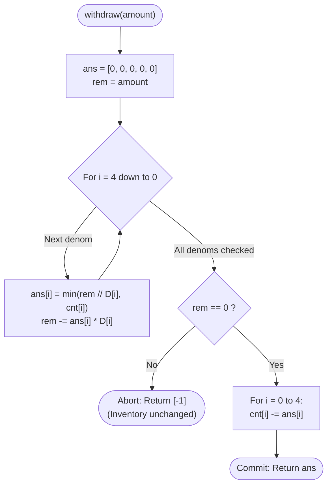

# Guided Example: Design an ATM Machine

We analyze and trace the capacity-constrained greedy denomination selection and transactional two-phase commit algorithm for an ATM currency dispenser in $O(1)$ time per operation and $O(1)$ auxiliary space.

- **Input:** Operations: `["ATM", "deposit", "withdraw", "deposit", "withdraw", "withdraw"]` with parameters:
  - `deposit([0, 0, 1, 2, 1])`
  - `withdraw(600)`
  - `deposit([0, 1, 0, 1, 1])`
  - `withdraw(600)`
  - `withdraw(550)`
- **Output:** `[null, null, [0, 0, 1, 0, 1], null, [-1], [0, 1, 0, 0, 1]]`

This representative instance demonstrates inventory capacity constraints, strict largest-first greedy denomination consumption, tentative allocation buffers, and transactional rollback upon incomplete dispensing.

---

## 1. Problem Overview & Representative Instance

An automated teller machine (ATM) stores banknotes across $5$ fixed denominations:
$$D = [20, 50, 100, 200, 500]$$
The machine maintains an inventory array `cnt` of length $5$, initially all zeros.

The ATM supports two operations:
1. `deposit(banknotesCount)`: Accepts an array of 5 integers, where $\text{banknotesCount}[i]$ specifies the number of banknotes of denomination $D[i]$ being added to the machine.
2. `withdraw(amount)`: Attempts to dispense the requested dollar `amount` according to the following mandatory rules:
   - **Greedy Priority:** The machine must always use the largest available banknote denominations first.
   - **Transactional Atomicity:** If the ATM cannot fulfill the entire requested `amount` exactly, the transaction is rejected, no banknotes are deducted from the machine, and `[-1]` is returned.
   - If fulfillment is possible, the dispensed banknotes are deducted from the machine's inventory, and the 5-element distribution array is returned.

### Representative Instance Breakdown

- **Step 1: `deposit([0, 0, 1, 2, 1])`**
  - Banknotes added: $0 \times \$20, 0 \times \$50, 1 \times \$100, 2 \times \$200, 1 \times \$500$.
  - Total vault cash: $100 + 400 + 500 = \$1000$.
  - Vault inventory: `[0, 0, 1, 2, 1]`.

- **Step 2: `withdraw(600)`**
  - Test from largest denomination (\$500) downward:
    - $\$500$: need $\min(\lfloor 600 / 500 \rfloor, 1) = 1$. Remainder: $600 - 500 = 100$.
    - $\$200$: need $\min(\lfloor 100 / 200 \rfloor, 2) = 0$. Remainder: $100$.
    - $\$100$: need $\min(\lfloor 100 / 100 \rfloor, 1) = 1$. Remainder: $100 - 100 = 0$.
    - $\$50, \$20$: need $0$.
  - Target fulfilled ($0$ remainder).
  - Commit deduction: deduct one $\$500$ and one $\$100$.
  - Returns `[0, 0, 1, 0, 1]`. Vault inventory becomes `[0, 0, 0, 2, 0]`.

- **Step 3: `deposit([0, 1, 0, 1, 1])`**
  - Add one $\$50$, one $\$200$, one $\$500$.
  - Vault inventory becomes `[0, 1, 0, 3, 1]`. Total cash: $50 + 600 + 500 = \$1150$.

- **Step 4: `withdraw(600)`**
  - Test from largest denomination downward:
    - $\$500$: take $1$ (available). Remainder: $600 - 500 = 100$.
    - $\$200$: $\lfloor 100 / 200 \rfloor = 0$. Remainder: $100$.
    - $\$100$: $0$ available in vault. Remainder: $100$.
    - $\$50$: take $1$ (available). Remainder: $100 - 50 = 50$.
    - $\$20$: $0$ available in vault. Remainder: $50$.
  - Remainder is $50 > 0$. Cannot fulfill!
  - Rollback: discard tentative changes. Vault inventory remains `[0, 1, 0, 3, 1]`.
  - Returns `[-1]`.

- **Step 5: `withdraw(550)`**
  - $\$500$: take $1$. Remainder: $550 - 500 = 50$.
  - $\$200, \$100$: take $0$.
  - $\$50$: take $1$. Remainder: $50 - 50 = 0$.
  - Target fulfilled. Deduct one $\$500$ and one $\$50$.
  - Returns `[0, 1, 0, 0, 1]`. Vault inventory becomes `[0, 0, 0, 3, 0]`.

---

## 2. Mathematical & Algorithmic Principles

### Capacity-Constrained Greedy Formulation

Unlike unbounded coin-change, each denomination $D[i] \in \{20, 50, 100, 200, 500\}$ has a finite available count $C[i]$.
The problem statement dictates a strict priority ordering: higher denominations must be exhausted before lower denominations are considered.
For index $i$ descending from $4$ down to $0$:
$$\text{take}[i] = \min\left( \left\lfloor \frac{\text{amount}}{D[i]} \right\rfloor, C[i] \right)$$
$$\text{amount} \leftarrow \text{amount} - \text{take}[i] \times D[i]$$

### Two-Phase Transactional Commit

To prevent corrupting the ATM inventory during an aborted withdrawal:
1. **Phase 1 (Tentative Plan):**
   Allocate a local tentative array $\text{ans} = [0, 0, 0, 0, 0]$.
   Simulate greedy dispensing using a temporary copy of `amount` without modifying the persistent `self.cnt` array.
2. **Phase 2 (Validation & Commit):**
   - If the remaining `amount` equals $0$, the withdrawal succeeds:
     For each $i \in \{0, \dots, 4\}$:
     $$\text{self.cnt}[i] \leftarrow \text{self.cnt}[i] - \text{ans}[i]$$
     Return $\text{ans}$.
   - If the remaining `amount` is strictly positive ($> 0$), the withdrawal fails:
     Leave `self.cnt` completely unmodified and return `[-1]`.

---

## 3. Step-by-Step Walkthrough with Intermediate State

We trace the critical operations on the ATM instance.
Denominations: $D = [20, 50, 100, 200, 500]$.

### Operation 2: `withdraw(600)` on Inventory `[0, 0, 1, 2, 1]`
- Initial: $\text{rem} = 600, \text{ans} = [0, 0, 0, 0, 0]$.
- $i = 4$ (\$500): $\min(\lfloor 600/500 \rfloor, \text{cnt}[4]) = \min(1, 1) = 1$.
  $\text{ans}[4] = 1, \text{rem} = 600 - 500 = 100$.
- $i = 3$ (\$200): $\min(\lfloor 100/200 \rfloor, \text{cnt}[3]) = \min(0, 2) = 0$.
  $\text{ans}[3] = 0, \text{rem} = 100$.
- $i = 2$ (\$100): $\min(\lfloor 100/100 \rfloor, \text{cnt}[2]) = \min(1, 1) = 1$.
  $\text{ans}[2] = 1, \text{rem} = 100 - 100 = 0$.
- $i = 1$ (\$50): $\text{rem} = 0 \implies \text{ans}[1] = 0$.
- $i = 0$ (\$20): $\text{rem} = 0 \implies \text{ans}[0] = 0$.
- Verification: $\text{rem} = 0$.
- Commit: $\text{cnt}[4] \leftarrow 1 - 1 = 0$, $\text{cnt}[2] \leftarrow 1 - 1 = 0$.
- Return: `[0, 0, 1, 0, 1]`. Inventory is `[0, 0, 0, 2, 0]`.

---

### Operation 4: `withdraw(600)` on Inventory `[0, 1, 0, 3, 1]`
- Initial: $\text{rem} = 600, \text{ans} = [0, 0, 0, 0, 0]$.
- $i = 4$ (\$500): $\min(1, \text{cnt}[4]=1) = 1$.
  $\text{ans}[4] = 1, \text{rem} = 600 - 500 = 100$.
- $i = 3$ (\$200): $\min(\lfloor 100/200 \rfloor, 3) = 0$.
  $\text{ans}[3] = 0, \text{rem} = 100$.
- $i = 2$ (\$100): $\min(\lfloor 100/100 \rfloor, 0) = 0$.
  $\text{ans}[2] = 0, \text{rem} = 100$.
- $i = 1$ (\$50): $\min(\lfloor 100/50 \rfloor, 1) = 1$.
  $\text{ans}[1] = 1, \text{rem} = 100 - 50 = 50$.
- $i = 0$ (\$20): $\min(\lfloor 50/20 \rfloor, 0) = 0$.
  $\text{ans}[0] = 0, \text{rem} = 50$.
- Verification: $\text{rem} = 50 > 0$.
- Abort: $\text{ans}$ is discarded. `cnt` remains `[0, 1, 0, 3, 1]`.
- Return: `[-1]`.

---

## 4. Comprehensive State Trace

### ATM Vault Inventory Lifecycle

| Step | Operation | Parameter | Returned Value | Updated Vault Inventory `cnt` | Total Vault Balance |
|---|---|---|---|---|---|
| 0 | Constructor | - | - | `[0, 0, 0, 0, 0]` | \$0 |
| 1 | `deposit` | `[0, 0, 1, 2, 1]` | `null` | `[0, 0, 1, 2, 1]` | \$1000 |
| 2 | `withdraw` | `600` | `[0, 0, 1, 0, 1]` | `[0, 0, 0, 2, 0]` | \$400 |
| 3 | `deposit` | `[0, 1, 0, 1, 1]` | `null` | `[0, 1, 0, 3, 1]` | \$1150 |
| 4 | `withdraw` | `600` | `[-1]` | `[0, 1, 0, 3, 1]` (Rollback) | \$1150 |
| 5 | `withdraw` | `550` | `[0, 1, 0, 0, 1]` | `[0, 0, 0, 3, 0]` | \$600 |

### Tentative Allocation Breakdown for Operations 2 and 4

| Denomination | Value $D[i]$ | Op 2 Available | Op 2 Dispensed | Op 4 Available | Op 4 Tentative | Op 4 Status |
|---|---|---|---|---|---|---|
| Index 4 | \$500 | 1 | 1 | 1 | 1 | Tentative |
| Index 3 | \$200 | 2 | 0 | 3 | 0 | Unused |
| Index 2 | \$100 | 1 | 1 | 0 | 0 | Exhausted |
| Index 1 | \$50 | 0 | 0 | 1 | 1 | Tentative |
| Index 0 | \$20 | 0 | 0 | 0 | 0 | Exhausted |
| **Outcome** | - | - | **Fulfilled** | - | **Rem = 50** | **Aborted** |

---

## 5. Algorithmic Correctness & Soundness

### Transactional Atomicity Guarantee

1. **Isolation of Trial Phase:** The greedy trial loop operates on a separate local array `ans` and scalar `amount`. The persistent state `self.cnt` is completely untouched during the calculation.
2. **All-or-Nothing Commit:** The inventory subtraction loop `self.cnt[i] -= ans[i]` is guarded by the condition `amount == 0`. It executes if and only if the exact target sum was assembled.
3. **Mandated Greedy Compliance:** The problem explicitly specifies using the largest available denominations first. It does not permit backtracking to explore non-greedy combinations (e.g. using three \$200 notes instead of one \$500 note). The deterministic descending loop strictly enforces this business logic.

---

## 6. Edge Cases & Anti-Patterns

### Boundary Scenarios

1. **Requested Amount Exceeds Total Cash:**
   - E.g., `amount = 5000` when the vault has only $\$1000$. The loop dispenses all notes, leaves $\text{amount} = 4000 > 0$, and aborts with `[-1]`.
2. **Indivisible Amounts:**
   - E.g., `amount = 35`. Since no combination of $\{20, 50, 100, 200, 500\}$ can form an odd dollar amount not ending in 0, the remainder stays $> 0$ and correctly returns `[-1]`.
3. **Exact Vault Depletion:**
   - Withdrawing the exact balance of the vault empties all denominations to 0 and returns the full inventory vector.

### Common Anti-Patterns

- **Premature Inventory Mutation:**
  Decrementing `self.cnt[i]` inside the trial loop before checking if the full amount can be dispensed. If the transaction later fails on smaller denominations, the machine loses cash records or requires complex rollback recovery. Using a tentative local array is strictly simpler and bug-free.
- **Dynamic Programming / Backtracking on Withdrawal:**
  Attempting to write a general coin-change DP to find any combination that makes `amount`. The problem statement explicitly specifies the greedy rule (largest notes first). Implementing DP would yield an incorrect result when the greedy choice fails even if another combination existed.

---

## 7. Complexity Analysis

### Time Complexity

- **`deposit`:** Iterates through exactly 5 denomination counts: $5$ additions $\implies O(1)$ constant time.
- **`withdraw`:** Iterates through 5 denominations descending, performing integer divisions and subtractions, followed by an optional 5-element commit loop: at most $10$ operations $\implies O(1)$ constant time.
- **Total Time Complexity:** Strictly $O(1)$ constant time per operation.

### Auxiliary Space Complexity

- The class stores a 5-element list `self.cnt` and uses a 5-element local list `ans`.
- **Total Auxiliary Space Complexity:** Strictly $O(1)$ auxiliary space.
