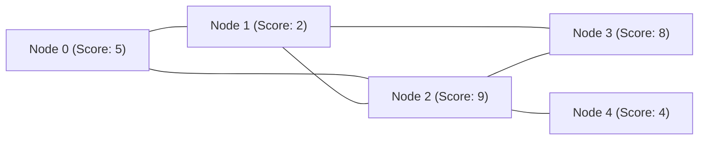

# Guided Example: Maximum Score of a Node Sequence

## 1. Problem Overview & Representative Instance

Given an undirected graph with $n$ nodes numbered from $0$ to $n - 1$ and an array of non-negative integers $\text{scores}$ where $\text{scores}[i]$ denotes the score of node $i$, along with a list of undirected edges, the objective is to determine the maximum possible score of a valid node sequence of length $4$. A valid node sequence of length $4$ is defined as four distinct nodes $(c, a, b, d)$ such that edges exist between $c$ and $a$, between $a$ and $b$, and between $b$ and $d$. In graph-theoretic terms, this corresponds to finding an elementary path (a simple path with no repeated vertices) of length $3$ edges that maximizes the sum of the vertex weights:

$$\text{Score}(c, a, b, d) = \text{scores}[c] + \text{scores}[a] + \text{scores}[b] + \text{scores}[d]$$

If no four distinct nodes can form such a simple path, the required result is $-1$.

### Representative Instance

Consider a representative graph containing $5$ nodes with scores:
- $\text{scores} = [5, 2, 9, 8, 4]$
- Nodes: $0$ (score $5$), $1$ (score $2$), $2$ (score $9$), $3$ (score $8$), $4$ (score $4$)
- Edges: $(0, 1), (1, 2), (2, 3), (0, 2), (1, 3), (2, 4)$

Below is the graph structure visualized with vertex scores indicated alongside each vertex identifier:

The goal is to find four distinct vertices forming an unbranched path $c - a - b - d$ yielding the maximum total score.

---

## 2. Mathematical & Algorithmic Principles

### The Central Edge Perspective

A brute-force enumeration of all paths of length $3$ across the graph requires examining all quadruples $(c, a, b, d)$, which requires $O(n^4)$ time in the worst case, or $O(m \cdot \Delta^2)$ by exploring paths from every node, where $\Delta$ is the maximum degree. In dense regions where $\Delta = O(n)$, this degenerates to $O(m \cdot n^2)$, which is far too slow when $m, n \le 5 \cdot 10^4$.

The decisive structural insight is to anchor the search on the **central edge** $(a, b)$:
1. Every path of length $3$ has an identified middle edge connecting two internal vertices $a$ and $b$.
2. To complete the path into $(c, a, b, d)$, we must select an external neighbor $c$ of $a$ and an external neighbor $d$ of $b$.
3. The four vertices must be pairwise distinct:
   $$c \neq a, \quad c \neq b, \quad d \neq a, \quad d \neq b, \quad c \neq d$$

### The Pigeonhole Principle and Top-3 Neighbor Selection

For a fixed central edge $(a, b)$, we seek to maximize $\text{scores}[c] + \text{scores}[d]$ subject to:
- $c \in \text{Adj}(a) \setminus \{b, d\}$
- $d \in \text{Adj}(b) \setminus \{a, c\}$

How many candidate neighbors must we retain for each vertex?
- Vertex $c$ chosen from $\text{Adj}(a)$ cannot be $b$ ($1$ forbidden node) and cannot be $d$ ($1$ forbidden node). Hence, at most $2$ choices of $c$ can collide with the other chosen vertices.
- Vertex $d$ chosen from $\text{Adj}(b)$ cannot be $a$ ($1$ forbidden node) and cannot be $c$ ($1$ forbidden node). Hence, at most $2$ choices of $d$ can collide.

By the **Pigeonhole Principle**, if we pre-sort the neighbors of each node in descending order of their vertex scores and preserve only the **top $3$** highest-scoring neighbors:
- Node $a$ considers candidate set $C_a = \text{Top3}(\text{Adj}(a))$.
- Node $b$ considers candidate set $D_b = \text{Top3}(\text{Adj}(b))$.

Even in the worst-case collision scenario where:
1. One candidate equals the opposite central node ($c = b$ or $d = a$), and
2. Another candidate is shared ($c = d$),
there is still at least $3 - 2 = 1$ valid candidate remaining on each side. Thus, keeping at most $3$ candidates per node strictly guarantees that if any valid assignment $(c, a, b, d)$ exists for edge $(a, b)$, the optimal one will be tested.

Checking all pairs $(c, d) \in C_a \times D_b$ requires at most $3 \times 3 = 9$ iterations per edge, reducing the entire search to $O(m)$ after linear-time preprocessing.

---

## 3. Step-by-Step Walkthrough with Intermediate State

Let us apply this strategy to our representative instance.

### Phase 1: Precompute Top-3 Neighbors

For each node $u$, list all adjacent nodes and retain the $3$ neighbors with the highest scores.

| Node $u$ | Score | All Neighbors with Scores | Top-3 Candidate List $T[u]$ (Descending Score) |
|---|---|---|---|
| **0** | $5$ | Node 1 (score 2), Node 2 (score 9) | $[2, 1]$ |
| **1** | $2$ | Node 0 (score 5), Node 2 (score 9), Node 3 (score 8) | $[2, 3, 0]$ |
| **2** | $9$ | Node 0 (score 5), Node 1 (score 2), Node 3 (score 8), Node 4 (score 4) | $[3, 0, 4]$ (or $[3, 0, 4]$ keeping highest among $\{3, 0, 4, 1\}$) |
| **3** | $8$ | Node 1 (score 2), Node 2 (score 9) | $[2, 1]$ |
| **4** | $4$ | Node 2 (score 9) | $[2]$ |

### Phase 2: Central Edge Exploration

Initialize global maximum: $\text{Best} = -1$.
We iterate through each undirected edge $(a, b)$ and test all candidate pairs $(c, d) \in T[a] \times T[b]$:

1. **Edge $(0, 1)$:**
   - $a = 0$, $\text{scores}[0] = 5$, $T[0] = [2, 1]$
   - $b = 1$, $\text{scores}[1] = 2$, $T[1] = [2, 3, 0]$
   - Candidate pairs $(c, d)$:
     - $c = 2, d = 2$: Invalid ($c = d$).
     - $c = 2, d = 3$: Valid sequence $(2, 0, 1, 3)$. Distinct nodes: $\{2, 0, 1, 3\}$.
       $$\text{Sum} = 9 + 5 + 2 + 8 = 24$$
       Update $\text{Best} = \max(-1, 24) = 24$.
     - $c = 2, d = 0$: Invalid ($d = a$).
     - $c = 1, d = \dots$: Invalid ($c = b$).

2. **Edge $(1, 2)$:**
   - $a = 1$, $\text{scores}[1] = 2$, $T[1] = [2, 3, 0]$
   - $b = 2$, $\text{scores}[2] = 9$, $T[2] = [3, 0, 4]$
   - Candidate pairs $(c, d)$:
     - $c = 2, d = \dots$: Invalid ($c = b$).
     - $c = 3, d = 3$: Invalid ($c = d$).
     - $c = 3, d = 0$: Valid sequence $(3, 1, 2, 0)$. Distinct nodes: $\{3, 1, 2, 0\}$.
       $$\text{Sum} = 8 + 2 + 9 + 5 = 24$$
       $\text{Best} = \max(24, 24) = 24$.
     - $c = 3, d = 4$: Valid sequence $(3, 1, 2, 4)$. Distinct nodes: $\{3, 1, 2, 4\}$.
       $$\text{Sum} = 8 + 2 + 9 + 4 = 23 \le 24$$
     - $c = 0, d = 3$: Valid sequence $(0, 1, 2, 3)$. Distinct nodes: $\{0, 1, 2, 3\}$.
       $$\text{Sum} = 5 + 2 + 9 + 8 = 24$$
     - $c = 0, d = 0$: Invalid ($c = d$).
     - $c = 0, d = 4$: Valid sequence $(0, 1, 2, 4)$. Distinct nodes: $\{0, 1, 2, 4\}$.
       $$\text{Sum} = 5 + 2 + 9 + 4 = 20 \le 24$$

3. **Edge $(2, 3)$:**
   - $a = 2, b = 3$. Fixed core sum: $\text{scores}[2] + \text{scores}[3] = 9 + 8 = 17$.
   - $T[2] = [3, 0, 4]$, $T[3] = [2, 1]$.
   - $c \in \{0, 4\}$ (since $3 = b$), $d \in \{1\}$ (since $2 = a$).
   - Pair $c = 0, d = 1$: Valid sequence $(0, 2, 3, 1)$. Sum $= 5 + 9 + 8 + 2 = 24$.
   - Pair $c = 4, d = 1$: Valid sequence $(4, 2, 3, 1)$. Sum $= 4 + 9 + 8 + 2 = 23$.

4. **Remaining edges:** Testing $(0, 2), (1, 3), (2, 4)$ yields maximum sums of at most $24$.

Final Result: $24$.

---

## 4. Comprehensive State Trace

The following state trace details the candidate checks across representative edge evaluations:

| Evaluated Edge $(a, b)$ | Node Scores $(\text{sc}[a], \text{sc}[b])$ | Candidate $c \in T[a]$ | Candidate $d \in T[b]$ | Validity Assessment | Candidate Sequence | Total Score | Running Global Best |
|---|---|---|---|---|---|---|---|
| **$(0, 1)$** | $(5, 2)$ | $2$ ($\text{sc}=9$) | $2$ ($\text{sc}=9$) | Colliding endpoints: $c = d$ | Discarded | — | $-1$ |
| **$(0, 1)$** | $(5, 2)$ | $2$ ($\text{sc}=9$) | $3$ ($\text{sc}=8$) | All distinct: $\{2, 0, 1, 3\}$ | $2 - 0 - 1 - 3$ | $9 + 5 + 2 + 8 = 24$ | **$24$** |
| **$(0, 1)$** | $(5, 2)$ | $2$ ($\text{sc}=9$) | $0$ ($\text{sc}=5$) | Endpoint equals central node: $d = a$ | Discarded | — | $24$ |
| **$(0, 1)$** | $(5, 2)$ | $1$ ($\text{sc}=2$) | Any | Endpoint equals central node: $c = b$ | Discarded | — | $24$ |
| **$(1, 2)$** | $(2, 9)$ | $3$ ($\text{sc}=8$) | $3$ ($\text{sc}=8$) | Colliding endpoints: $c = d$ | Discarded | — | $24$ |
| **$(1, 2)$** | $(2, 9)$ | $3$ ($\text{sc}=8$) | $0$ ($\text{sc}=5$) | All distinct: $\{3, 1, 2, 0\}$ | $3 - 1 - 2 - 0$ | $8 + 2 + 9 + 5 = 24$ | $24$ |
| **$(1, 2)$** | $(2, 9)$ | $3$ ($\text{sc}=8$) | $4$ ($\text{sc}=4$) | All distinct: $\{3, 1, 2, 4\}$ | $3 - 1 - 2 - 4$ | $8 + 2 + 9 + 4 = 23$ | $24$ |
| **$(2, 4)$** | $(9, 4)$ | $3$ ($\text{sc}=8$) | $2$ ($\text{sc}=9$) | Endpoint equals central node: $d = a$ | Discarded | — | $24$ |

---

## 5. Algorithmic Correctness & Soundness

### Soundness (Valid Sequences Only)

Every sequence evaluated is of the form $(c, a, b, d)$:
1. By construction, $c \in \text{Adj}(a)$ ensures edge $(c, a)$ exists.
2. The outer iteration guarantees edge $(a, b)$ exists.
3. By construction, $d \in \text{Adj}(b)$ ensures edge $(b, d)$ exists.
4. The explicit condition $c \neq b$, $d \neq a$, and $c \neq d$ enforces that all four vertices $\{c, a, b, d\}$ are distinct.
Thus, every candidate score evaluated corresponds to a valid simple path of length $3$.

### Completeness (Optimal Path Preservation)

Suppose an optimal path exists, denoted by $P^* = (c^*, a^*, b^*, d^*)$.
- The central edge $(a^*, b^*)$ is present in the graph and will inevitably be visited by the outer edge loop.
- In $\text{Adj}(a^*)$, the only vertices that cannot serve as $c^*$ are $b^*$ and $d^*$. These constitute at most $2$ prohibited vertices.
- Since we retain the top $3$ vertices of $\text{Adj}(a^*)$ by score, at least one of these top $3$ vertices is not in $\{b^*, d^*\}$.
- Moreover, if $c^*$ is not in the top $3$ of $\text{Adj}(a^*)$, then all top $3$ neighbors of $a^*$ have scores greater than or equal to $\text{scores}[c^*]$. Since at most $2$ can be blocked by $\{b^*, d^*\}$, at least one candidate $c'$ in the top $3$ is valid and satisfies $\text{scores}[c'] \ge \text{scores}[c^*]$.
- Symmetrically, for $b^*$, at least one candidate $d'$ in its top $3$ neighbors is valid and satisfies $\text{scores}[d'] \ge \text{scores}[d^*]$.
- Therefore, the Cartesian product of the top $3$ candidates of $a^*$ and $b^*$ is guaranteed to contain a valid pair $(c', d')$ whose score sum meets or exceeds $\text{scores}[c^*] + \text{scores}[d^*]$.
- Consequently, pruning the adjacency lists to the top $3$ elements preserves the global optimum.

---

## 6. Edge Cases & Anti-Patterns

### Edge Cases
1. **Graph with Fewer Than $4$ Nodes:** If $n < 4$, no $4$-node sequence can exist; the procedure safely returns $-1$.
2. **Disconnected Components:** If components have sizes less than $4$, no path of length $3$ can span them. The algorithm naturally skips edges with insufficient non-colliding neighbors and correctly outputs $-1$ if no valid sequence is formed across any component.
3. **Star Graph ($K_{1, n-1}$):** A star graph has one central hub connected to all other nodes. Any path can have length at most $2$ (leaf-hub-leaf). When testing edge (hub, leaf), the leaf has degree $1$ (its only neighbor is the hub, which causes an endpoint collision $d = a$). Hence, no candidate pair is valid, and the algorithm returns $-1$.
4. **Identical Scores:** Vertices may share identical scores; the top-3 selection handles ties arbitrarily without affecting correctness since only the score magnitude matters.

### Anti-Patterns to Avoid
- **Backtracking / DFS from All Nodes:** Attempting a depth-limited DFS up to depth $3$ from each vertex takes $O(n \cdot \Delta^3)$ or $O(m \cdot \Delta^2)$, which experiences catastrophic time limit exceeded on dense graphs.
- **Keeping Only Top-2 Neighbors:** Retaining only $2$ neighbors per node is insufficient. For example, if $a$ and $b$ share their top two neighbors $x$ and $y$, testing edge $(a, b)$ with only $\{x, y\}$ on both sides leaves no valid configuration: $(x, y)$ forces $c = x, d = y$ or $c = y, d = x$, but if $x$ or $y$ also happens to be $a$ or $b$, all combinations collide. Three neighbors are strictly required by the Pigeonhole Principle.
- **Global Sorting of All Nodes:** Selecting the top $4$ highest-scoring nodes in the entire graph and checking if they form a path fails because high-scoring nodes may be disconnected. The search must be grounded on existing graph edges.

---

## 7. Complexity Analysis

### Time Complexity
- **Graph Construction:** Building the adjacency list takes $O(n + m)$ where $m$ is the number of edges.
- **Top-3 Neighbor Pruning:** For each vertex $u$, selecting the $3$ largest neighbors out of $\text{deg}(u)$ elements can be done in $O(\text{deg}(u))$ using a min-heap of size $3$ or partial sorting. Summing over all vertices:
  $$\sum_{u=0}^{n-1} O(\text{deg}(u)) = O(m)$$
- **Edge Enumeration:** For each of the $m$ edges $(a, b)$, we test at most $|T[a]| \times |T[b]| \le 3 \times 3 = 9$ candidate pairs. Each check performs $O(1)$ equality tests and additions. Total time for this phase:
  $$m \times 9 \times O(1) = O(m)$$
- **Total Time Complexity:** $\mathcal{O}(n + m)$, which is strictly linear in the size of the graph and optimal.

### Space Complexity
- **Adjacency Lists:** Storing all edges requires $O(n + m)$ space.
- **Pruned Candidates:** Storing at most $3$ candidates per node requires $O(n)$ space.
- **Auxiliary Tracking:** Constant auxiliary variables for tracking the running maximum score.
- **Total Space Complexity:** $\mathcal{O}(n + m)$ to store the graph representation.
