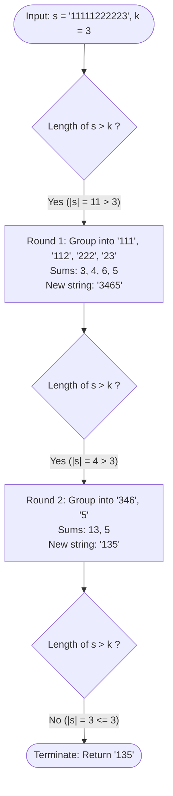

# Guided Example: Calculate Digit Sum of a String

## 1. Problem Overview & Representative Instance

Given a string $s$ consisting of numerical digits and an integer $k$, the task is to repeatedly compress the string until its length becomes less than or equal to $k$. In each round of compression, the current string is divided into consecutive groups of length $k$. If the length of the string is not divisible by $k$, the final group may contain fewer than $k$ digits. Within each group, the individual decimal digits are summed together, and the numeric sum is converted to its decimal string representation. Finally, all resulting group sum strings are concatenated in their original order to produce the new string for the next round.

This iterative transformation continues until $|s| \le k$, at which point the current string is returned.

### Representative Instance

Consider the following input parameters:
- String: $s = \text{"11111222223"}$
- Group size threshold: $k = 3$
- Initial string length: $|s| = 11$

Since $|s| = 11 > 3$, the reduction process must execute through multiple discrete rounds.

---

## 2. Mathematical & Algorithmic Principles

### Deterministic Group Partitioning

In any round with string length $n$, the string is partitioned into $m = \lceil n / k \rceil$ blocks:

$$s = G_0 \circ G_1 \circ \dots \circ G_{m-1}$$

where each contiguous substring $G_i = s[i \cdot k \,:\, \min((i + 1) \cdot k, n)]$ satisfies:
- $|G_i| = k$ for all $0 \le i < m - 1$
- $1 \le |G_{m-1}| \le k$ for the final trailing group

For each group $G_i$, let its constituent characters be $c_{i, 0}, c_{i, 1}, \dots, c_{i, |G_i|-1}$. The numeric evaluation function maps $G_i$ to a non-negative integer:

$$\sigma(G_i) = \sum_{j=0}^{|G_i|-1} \text{val}(c_{i, j})$$

where $\text{val}(c) \in \{0, 1, \dots, 9\}$ is the decimal integer value of digit character $c$. The transformed block is the base-10 character representation of this integer, $\text{str}(\sigma(G_i))$. The updated string for the next round is obtained via concatenation:

$$s' = \text{str}(\sigma(G_0)) \circ \text{str}(\sigma(G_1)) \circ \dots \circ \text{str}(\sigma(G_{m-1}))$$

### Contraction & Termination Guarantees

Why does this iterative process always terminate?
- Each group of size up to $k$ has maximum possible sum $9 \cdot k$.
- The number of digits in $\text{str}(\sigma(G_i))$ is:
  $$d_i = \lfloor \log_{10}(\sigma(G_i)) \rfloor + 1 \le \lfloor \log_{10}(9k) \rfloor + 1$$
- For constraints where $k \ge 2$:
  - When $k = 2$, maximum group sum is $9 + 9 = 18$ ($2$ digits). An input with length $> 2$ has at least $2$ groups. If a string does not immediately shrink, subsequent sums rapidly produce single digits unless all characters are $9$.
  - When $k \ge 3$, $9k < 10^{k-1}$ for all practical $k$. For instance, with $k = 3$, $9 \times 3 = 27$ yields $2 < 3$ digits. Each block of $3$ characters shrinks into at most $2$ characters.
  - For $k = 4$, $9 \times 4 = 36$ yields $2 < 4$ digits.
- Because each full block of $k$ characters strictly compresses to fewer than $k$ characters on average, the string length monotonically decreases until $|s| \le k$.

---

## 3. Step-by-Step Walkthrough with Intermediate State

### Round 1 Execution

Initial state: $s = \text{"11111222223"}$, length $n = 11$, $k = 3$.
Number of groups: $m = \lceil 11 / 3 \rceil = 4$.

1. **Group 0:** Indices $[0, 3)$, substring $\text{"111"}$.
   - Sum: $1 + 1 + 1 = 3$.
   - Output string segment: $\text{"3"}$.
2. **Group 1:** Indices $[3, 6)$, substring $\text{"112"}$.
   - Sum: $1 + 1 + 2 = 4$.
   - Output string segment: $\text{"4"}$.
3. **Group 2:** Indices $[6, 9)$, substring $\text{"222"}$.
   - Sum: $2 + 2 + 2 = 6$.
   - Output string segment: $\text{"6"}$.
4. **Group 3:** Indices $[9, 11)$, substring $\text{"23"}$ (short final group of length 2).
   - Sum: $2 + 3 = 5$.
   - Output string segment: $\text{"5"}$.

Concatenating segments: $s' = \text{"3"} \circ \text{"4"} \circ \text{"6"} \circ \text{"5"} = \text{"3465"}$.
New length: $|s'| = 4$.
Since $4 > k = 3$, the loop proceeds to Round 2.

### Round 2 Execution

Current state: $s = \text{"3465"}$, length $n = 4$, $k = 3$.
Number of groups: $m = \lceil 4 / 3 \rceil = 2$.

1. **Group 0:** Indices $[0, 3)$, substring $\text{"346"}$.
   - Sum: $3 + 4 + 6 = 13$.
   - Output string segment: $\text{"13"}$ (two digits).
2. **Group 1:** Indices $[3, 4)$, substring $\text{"5"}$ (short final group of length 1).
   - Sum: $5$.
   - Output string segment: $\text{"5"}$.

Concatenating segments: $s'' = \text{"13"} \circ \text{"5"} = \text{"135"}$.
New length: $|s''| = 3$.
Check condition: $|s''| = 3 \le k = 3$. The termination condition is met.
Final result returned: $\text{"135"}$.

---

## 4. Comprehensive State Trace

### Group Breakdown Across Rounds

The table below catalogs every group evaluated during each round of transformation:

| Round | Group Index $i$ | Substring Window | Characters in Group | Arithmetic Sum $\sigma(G_i)$ | Formatted Segment | Cumulative Round Output |
|---|---|---|---|---|---|---|
| **1** | 0 | $[0, 3)$ | $\text{"111"}$ | $1 + 1 + 1 = 3$ | $\text{"3"}$ | $\text{"3"}$ |
| **1** | 1 | $[3, 6)$ | $\text{"112"}$ | $1 + 1 + 2 = 4$ | $\text{"4"}$ | $\text{"34"}$ |
| **1** | 2 | $[6, 9)$ | $\text{"222"}$ | $2 + 2 + 2 = 6$ | $\text{"6"}$ | $\text{"346"}$ |
| **1** | 3 | $[9, 11)$ | $\text{"23"}$ | $2 + 3 = 5$ | $\text{"5"}$ | $\text{"3465"}$ |
| **2** | 0 | $[0, 3)$ | $\text{"346"}$ | $3 + 4 + 6 = 13$ | $\text{"13"}$ | $\text{"13"}$ |
| **2** | 1 | $[3, 4)$ | $\text{"5"}$ | $5$ | $\text{"5"}$ | $\text{"135"}$ |

### Round-by-Round Evolution

| Round | Input String to Round | Input Length | Number of Chunks | Chunk Sums Produced | Concatenated Output | Termination Check ($|s| \le k$) |
|---|---|---|---|---|---|---|
| **Start** | $\text{"11111222223"}$ | $11$ | — | — | — | $11 > 3 \implies \text{Continue}$ |
| **Round 1** | $\text{"11111222223"}$ | $11$ | $4$ | $[3, 4, 6, 5]$ | $\text{"3465"}$ | $4 > 3 \implies \text{Continue}$ |
| **Round 2** | $\text{"3465"}$ | $4$ | $2$ | $[13, 5]$ | $\text{"135"}$ | $3 \le 3 \implies \text{Halt}$ |

---

## 5. Algorithmic Correctness & Soundness

### Preservation of Ordering

The simulation strictly maintains spatial ordering by processing chunks from left to right with stride $k$. Appending the decimal representations of each chunk sum to an ordered list and subsequently joining them ensures that relative positional semantics are never permuted or inverted.

### Multi-Digit Sum Expansion

When a chunk sum exceeds $9$ (such as $3 + 4 + 6 = 13$), its string conversion naturally generates multiple characters. The specification mandates converting the numeric value to a string rather than taking modulo $10$. By treating the resulting string as atomic characters in the next round, subsequent divisions correctly split multi-digit sums across groups if necessary.

### Invariant Maintenance

At the start of every iteration, the invariant holds:
- $s$ is composed purely of decimal digits ASCII $'0'$ through $'9'$.
- $|s|$ represents the valid current state of repeated group-summing.
- When the condition $|s| \le k$ is reached, the while-loop exits immediately without performing an extraneous unnecessary round.

---

## 6. Edge Cases & Anti-Patterns

### Edge Cases
1. **Initial Length Already $\le k$:**
   If $|s| \le k$ upon invocation (for example $s = \text{"123"}$ and $k = 3$), the loop condition is false from the outset. The string is returned immediately without modification.
2. **String Composed Entirely of Zeroes:**
   For $s = \text{"00000000"}$ with $k = 3$:
   - Groups: $\text{"000"} \to 0 \to \text{"0"}$, $\text{"000"} \to 0 \to \text{"0"}$, $\text{"00"} \to 0 \to \text{"0"}$.
   - Round 1 output: $\text{"000"}$, length $3 \le 3$.
   - Output correctly retains multiple zeroes rather than collapsing to a single zero.
3. **Minimum $k = 2$ with High Digits:**
   If $s = \text{"9999"}$ and $k = 2$:
   - $\text{"99"} \to 18$, $\text{"99"} \to 18$.
   - Result: $\text{"1818"}$ (length remains 4).
   - Next round: $\text{"18"} \to 9$, $\text{"18"} \to 9 \implies \text{"99"}$ (length 2).
   - Halts at $\text{"99"}$.
   The length strictly decreases within at most 2 rounds even in extreme carry scenarios.

### Anti-Patterns to Avoid
- **Recursive Digit Summing Within Groups:** Summing digits of a multi-digit group sum repeatedly until single-digit (digital root) is incorrect. If the sum is $13$, it remains $\text{"13"}$, not $1 + 3 = 4$.
- **In-Place String Mutation / String Reallocation:** Repeatedly modifying strings in place or doing quadratic string slice concatenation inside inner loops. Assembling a list of string fragments and joining them once per round is both idiomatic and time-optimal.
- **Ignoring the Final Incomplete Chunk:** Dropping the leftover digits when $|s|$ is not an exact multiple of $k$ leads to data loss. The final group must process all remaining characters $\min(i + k, n)$.

---

## 7. Complexity Analysis

### Time Complexity
- In each round, every character of the current string is accessed once to convert to an integer and add to the group accumulator: $O(|s|)$.
- Formatted chunk sums are joined into a new string: $O(|s'|)$.
- For $k \ge 3$, the length contracts by at least a factor of $k / 2$ each round. For $k = 2$, length decreases strictly within at most two iterations per step.
- The total length across all rounds forms a rapidly decaying geometric series:
  $$T(n) = n + \frac{n}{c} + \frac{n}{c^2} + \dots = O(n)$$
- Total Time Complexity: $\mathcal{O}(n)$ where $n$ is the initial length of string $s$.

### Space Complexity
- Each round constructs an auxiliary list of group sum strings whose concatenated length is bounded by the current string length $O(n)$.
- Total Space Complexity: $\mathcal{O}(n)$ auxiliary memory to store intermediate chunk strings and buffer the joined round result.
