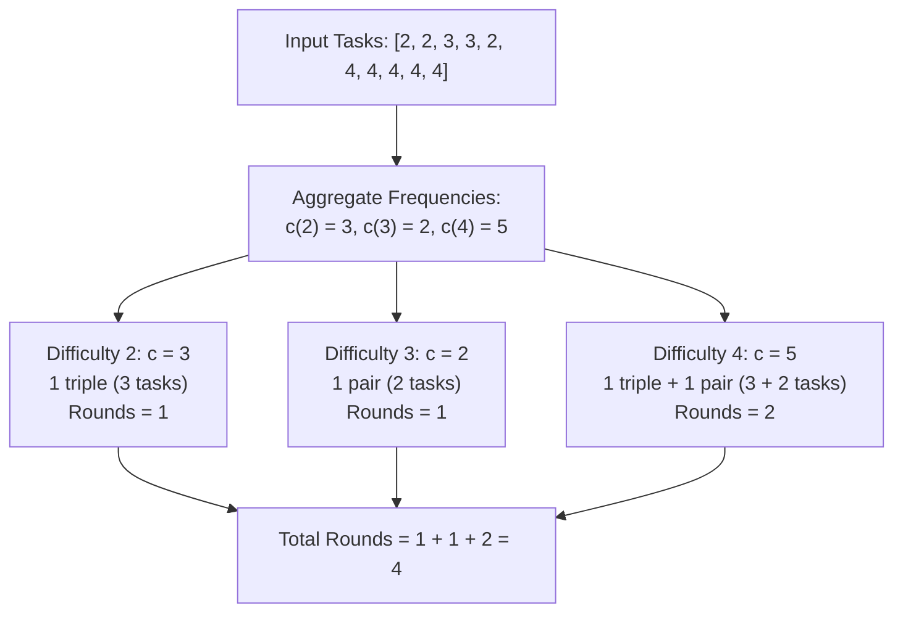

# Guided Example: Minimum Rounds to Complete All Tasks

## 1. Problem Overview & Representative Instance

Given an integer array $\text{tasks}$ where each element represents the difficulty level of a task, the goal is to determine the minimum number of rounds required to complete all tasks. In each round, an operator may complete either $2$ or $3$ tasks of the same difficulty level. Different difficulty levels cannot be mixed in the same round. If it is impossible to complete all tasks under these conditions, the required output is $-1$.

### Representative Instance

Consider an array of $10$ tasks with varying difficulty levels:
$$\text{tasks} = [2, 2, 3, 3, 2, 4, 4, 4, 4, 4]$$

Grouping by difficulty level gives the following counts:
- Difficulty $2$: occurrences at indices $0, 1, 4 \implies$ count $c_2 = 3$
- Difficulty $3$: occurrences at indices $2, 3 \implies$ count $c_3 = 2$
- Difficulty $4$: occurrences at indices $5, 6, 7, 8, 9 \implies$ count $c_4 = 5$

Because each difficulty level is processed in total isolation from the others, the global minimum rounds is the sum of the minimum rounds required for each distinct difficulty level.

---

## 2. Mathematical & Algorithmic Principles

### Independence Across Difficulty Levels

Let $U$ be the set of distinct task difficulty levels, and for each $d \in U$, let $c_d$ denote its multiplicity in $\text{tasks}$. Because a round cannot combine different difficulty levels:

$$\text{Total Minimum Rounds} = \sum_{d \in U} R(c_d)$$

where $R(c)$ is the minimum rounds to process $c$ tasks of a single difficulty level.

### Linear Diophantine Formulation & Frobenius Bound

For a specific difficulty count $c$, each round eliminates either $2$ or $3$ tasks. Hence, we must find non-negative integers $x, y \in \mathbb{N}_0$ representing the number of pairs and triples respectively, such that:

$$2x + 3y = c$$

subject to minimizing the objective function:

$$Z(x, y) = x + y$$

By the Frobenius Coin Problem for denominations $\{2, 3\}$:
- The Frobenius number is $g(2, 3) = 2 \times 3 - 2 - 3 = 1$.
- Thus, every integer $c > 1$ (that is, $c \ge 2$) can be expressed as a non-negative linear combination of $2$ and $3$.
- Conversely, $c = 1$ has no non-negative solution because $2(0) + 3(0) = 0 < 1$ and any positive coefficient yields $\ge 2$. If any difficulty level has count $c = 1$, completion is impossible, and the global answer is immediately $-1$.

### Minimizing Total Rounds

To minimize $Z = x + y$, substitute $y = \frac{c - 2x}{3}$:

$$Z(x) = x + \frac{c - 2x}{3} = \frac{c + x}{3}$$

Because $c$ is constant, minimizing $Z(x)$ is strictly equivalent to choosing the smallest non-negative integer $x \ge 0$ such that $c - 2x \ge 0$ and $c - 2x \equiv 0 \pmod 3$. The congruence $2x \equiv c \pmod 3$ simplifies to $x \equiv 2c \pmod 3$:

1. **Case $c \equiv 0 \pmod 3$:**
   $x \equiv 0 \pmod 3 \implies \min x = 0$.
   $$y = \frac{c}{3}, \quad Z = \frac{c}{3}$$
   Example: $c = 6 \implies 0$ pairs, $2$ triples $\implies 2$ rounds.

2. **Case $c \equiv 1 \pmod 3$:**
   $x \equiv 2(1) \equiv 2 \pmod 3 \implies \min x = 2$.
   $$y = \frac{c - 4}{3}, \quad Z = 2 + \frac{c - 4}{3} = \frac{c + 2}{3}$$
   Example: $c = 4 \implies 2$ pairs, $0$ triples $\implies 2$ rounds.

3. **Case $c \equiv 2 \pmod 3$:**
   $x \equiv 2(2) \equiv 1 \pmod 3 \implies \min x = 1$.
   $$y = \frac{c - 2}{3}, \quad Z = 1 + \frac{c - 2}{3} = \frac{c + 1}{3} = \frac{c + 2}{3}$$
   Example: $c = 5 \implies 1$ pair, $1$ triple $\implies 2$ rounds.

Notice that for all cases $c \ge 2$, the optimal round count matches the ceiling division:

$$R(c) = \left\lceil \frac{c}{3} \right\rceil = \left\lfloor \frac{c + 2}{3} \right\rfloor$$

---

## 3. Step-by-Step Walkthrough with Intermediate State

Applying this formula to our representative instance:

### Step 1: Frequency Aggregation
Scan through $\text{tasks} = [2, 2, 3, 3, 2, 4, 4, 4, 4, 4]$.
Construct hash map of counts:
- $\text{count}[2] = 3$
- $\text{count}[3] = 2$
- $\text{count}[4] = 5$

### Step 2: Evaluating Each Frequency
1. **Difficulty $2$ ($c = 3$):**
   - Check validity: $c = 3 \ne 1$, valid.
   - Modulo arithmetic: $3 \pmod 3 = 0$.
   - Rounds required: $\lfloor (3 + 2) / 3 \rfloor = \lfloor 5 / 3 \rfloor = 1$.
   - Configuration: $1$ triple of difficulty $2$.

2. **Difficulty $3$ ($c = 2$):**
   - Check validity: $c = 2 \ne 1$, valid.
   - Modulo arithmetic: $2 \pmod 3 = 2$.
   - Rounds required: $\lfloor (2 + 2) / 3 \rfloor = \lfloor 4 / 3 \rfloor = 1$.
   - Configuration: $1$ pair of difficulty $3$.

3. **Difficulty $4$ ($c = 5$):**
   - Check validity: $c = 5 \ne 1$, valid.
   - Modulo arithmetic: $5 \pmod 3 = 2$.
   - Rounds required: $\lfloor (5 + 2) / 3 \rfloor = \lfloor 7 / 3 \rfloor = 2$.
   - Configuration: $1$ triple $+ 1$ pair ($3 + 2 = 5$) of difficulty $4$.

### Step 3: Total Accumulation
$$\text{Total} = 1 + 1 + 2 = 4$$
All tasks are completed in $4$ rounds.

---

## 4. Comprehensive State Trace

### Per-Difficulty Resolution Table

The table below catalogs the processing of each task difficulty group present in the representative array:

| Difficulty Key $d$ | Multiplicity $c_d$ | Feasibility Check ($c_d \ge 2$) | Remainder $c_d \pmod 3$ | Optimal Pairs ($x$) | Optimal Triples ($y$) | Subproblem Rounds $R(c_d)$ | Running Total Rounds |
|---|---|---|---|---|---|---|---|
| **$2$** | $3$ | Passed ($3 \ge 2$) | $0$ | $0$ | $1$ | $\lfloor (3+2)/3 \rfloor = 1$ | $1$ |
| **$3$** | $2$ | Passed ($2 \ge 2$) | $2$ | $1$ | $0$ | $\lfloor (2+2)/3 \rfloor = 1$ | $2$ |
| **$4$** | $5$ | Passed ($5 \ge 2$) | $2$ | $1$ | $1$ | $\lfloor (5+2)/3 \rfloor = 2$ | $4$ |

### Mathematical Behavior Across Canonical Counts

The table below demonstrates the ceiling division invariant across representative count magnitudes:

| Count $c$ | Solvability | $c \pmod 3$ | Triples $y$ | Pairs $x$ | Equation Verification $3y + 2x$ | Ceiling Expression $\lceil c / 3 \rceil$ | Rounds $R(c)$ |
|---|---|---|---|---|---|---|---|
| **$1$** | Impossible | $1$ | — | — | Cannot form $1$ | — | **$-1$** |
| **$2$** | Solvable | $2$ | $0$ | $1$ | $3(0) + 2(1) = 2$ | $\lceil 2/3 \rceil = 1$ | $1$ |
| **$3$** | Solvable | $0$ | $1$ | $0$ | $3(1) + 2(0) = 3$ | $\lceil 3/3 \rceil = 1$ | $1$ |
| **$4$** | Solvable | $1$ | $0$ | $2$ | $3(0) + 2(2) = 4$ | $\lceil 4/3 \rceil = 2$ | $2$ |
| **$5$** | Solvable | $2$ | $1$ | $1$ | $3(1) + 2(1) = 5$ | $\lceil 5/3 \rceil = 2$ | $2$ |
| **$6$** | Solvable | $0$ | $2$ | $0$ | $3(2) + 2(0) = 6$ | $\lceil 6/3 \rceil = 2$ | $2$ |
| **$7$** | Solvable | $1$ | $1$ | $2$ | $3(1) + 2(2) = 7$ | $\lceil 7/3 \rceil = 3$ | $3$ |
| **$8$** | Solvable | $2$ | $2$ | $1$ | $3(2) + 2(1) = 8$ | $\lceil 8/3 \rceil = 3$ | $3$ |

---

## 5. Algorithmic Correctness & Soundness

### Global Independence Proof

Every round must select tasks of identical difficulty. Formally, if $T_d$ denotes the subset of tasks with difficulty $d$, any valid round operates entirely within some $T_d$. There are no cross-difficulty interactions or constraints. Consequently, the minimum total rounds across all tasks is strictly equal to the independent sum of minimum rounds for each $T_d$:

$$\min \sum \text{rounds} = \sum_{d} \min \text{rounds}(T_d)$$

No choice made for difficulty $d_1$ can alter or constrain the options available for difficulty $d_2$.

### Local Optimality Proof

For a single difficulty with count $c$:
1. Every round completes at most $3$ tasks. Hence, any valid schedule of $R$ rounds satisfies:
   $$c \le 3R \implies R \ge \left\lceil \frac{c}{3} \right\rceil$$
2. The constructive decomposition exhibited in Section 2 achieves exactly $\lceil c / 3 \rceil$ rounds using valid rounds of size $2$ and $3$ for all $c \ge 2$.
3. Since the lower bound is constructively achieved, $\lceil c / 3 \rceil$ is provably the exact minimum.

---

## 6. Edge Cases & Anti-Patterns

### Edge Cases
1. **Singleton Task ($c = 1$):**
   If any difficulty level has exactly $1$ occurrence (such as $\text{tasks} = [2, 3, 3]$ where $2$ appears once), it is impossible to complete that task because the minimum batch size is $2$. The algorithm detects $c = 1$ and immediately aborts with $-1$.
2. **Homogeneous Array:**
   When all tasks have the same difficulty (for example, ten $7$'s), the algorithm aggregates into a single key with $c = 10$, yielding $\lfloor 12 / 3 \rfloor = 4$ rounds ($2$ triples and $2$ pairs).
3. **Many Disjoint Pairs:**
   If all tasks appear exactly twice (such as $[1, 1, 2, 2, 3, 3]$), each difficulty requires $\lceil 2 / 3 \rceil = 1$ round, yielding total rounds equal to the number of distinct elements.

### Anti-Patterns to Avoid
- **Unconstrained Coin Change Dynamic Programming:**
  Allocating a DP array up to the maximum frequency count. Because the closed-form formula $R(c) = \lfloor (c + 2) / 3 \rfloor$ runs in $O(1)$, general dynamic programming introduces unnecessary asymptotic overhead and allocations.
- **Backtracking / Greedy Subtraction of 3 Without Safeguards:**
  Greedily subtracting $3$ from $c$ until $c \le 0$ without handling the $c = 4$ case. Subtracting $3$ from $4$ leaves $1$, which mistakenly triggers an impossibility condition if not properly redirected to two pairs ($2 + 2$).
- **Sorting the Entire Array:**
  Sorting the array in $O(n \log n)$ time is unnecessary; a frequency hash map aggregates counts in linear time $O(n)$.

---

## 7. Complexity Analysis

### Time Complexity
- **Frequency Aggregation:** A single linear pass through the array of length $n$ populates the frequency table: $O(n)$ operations.
- **Round Calculation:** Iterating over the $|U|$ unique difficulty levels and applying the $O(1)$ arithmetic formula $\lfloor (c + 2) / 3 \rfloor$: $O(|U|) \le O(n)$ operations.
- **Total Time Complexity:** $\mathcal{O}(n)$ where $n$ is the length of $\text{tasks}$, which is strictly optimal since every input element must be inspected.

### Space Complexity
- **Frequency Storage:** The hash map stores one integer key-value pair per unique difficulty level. In the worst case where all elements are distinct, the table holds $n$ entries.
- **Total Space Complexity:** $\mathcal{O}(n)$ auxiliary memory for the frequency table.
