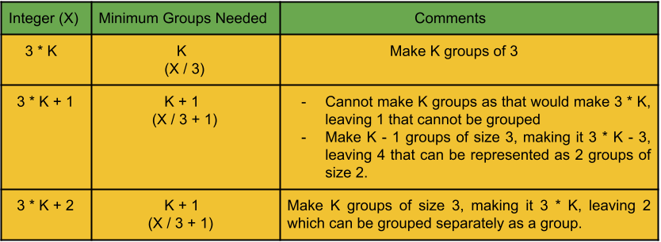

## Solution

---

### Approach 1: Counting

#### Intuition

We are given $N$ integers, we can group them with sizes of two or three. We need to find out if it's possible to group them and if we can what is the minimum number of groups needed.

First, let's check when we won't be able to group the integers. Since the minimum size of the group is $2$, we cannot cover the integer with frequency $1$.  To find the minimum number of groups for other integers, we can divide the integers into three groups:

- Integers that are multiples of $3$ i.e., of the form $3*K$.
- Integers that leaves remainder of $1$ when divided by $3$ i.e., of the form $3 * K + 1$.
- Integers that leaves remainder of $2$ when divided by $3$ i.e., of the form $3 * K + 2$.

We need to represent each frequency in the form of $3x + 2y$, where $x$ is the number of groups with size $3$ and $y$ is the number of groups with size $2$. The total number of groups needed is $x + y$, and we need to minimize the value of $x + y$. In order to minimize the value we need to maximize the value of $x$. Because the groups with size $3$ would contribute more to make the total value equal to the frequency compared to the group of size $2$.

The below figure shows the general representation of the group division for the above three types of integers.



#### Algorithm

1. Iterate over the integers in the array `tasks`, and for each integer store the frequency in the map `freq`.
2. Initialize the answer variable `minimumRounds` to `0`.
3. Iterate over the frequencies in the map `freq` and for each frequency `count`:

- If `count` is `1`, then we should stop and return `-1`.
- Add $count / 3$ to the answer variable `minimumRounds`, if `count` is divisible by $3$.
- Otherwise, add $count / 3 + 1$ to `minimumRounds`.

4. Return `minimumRounds`.

#### Implementation

```cpp
class Solution {
public:
    int minimumRounds(vector<int>& tasks) {
        unordered_map<int, int> freq;
        // Store the frequencies in the map.
        for (int task : tasks) {
            freq[task]++;
        }

        int minimumRounds = 0;
        // Iterate over the task's frequencies.
        for (auto [task, count] : freq) {
            // If the frequency is 1, it's not possible to complete tasks.
            if (count == 1) {
                return - 1;
            }

            if (count % 3 == 0) {
                // Group all the task in triplets.
                minimumRounds += count / 3;
            } else {
                // If count % 3 = 1; (count / 3 - 1) groups of triplets and 2 pairs.
                // If count % 3 = 2; (count / 3) groups of triplets and 1 pair.
                minimumRounds += count / 3 + 1;
            }
        }

        return minimumRounds;
    }
};
```

#### Complexity Analysis

Here, $N$ is the number integers in the given array.

* Time complexity: $O(N)$.

  We iterate over the integer array to store the frequencies in the map, this will take $O(N)$ time, then we iterate over the map to find the minimum group needed for each integer, which again will cost $O(N)$. Therefore, the total time complexity is equal to $O(N)$.

* Space complexity: $O(N)$.

  We need the map to store the frequencies of the integers, hence the total space complexity is equal to $O(N)$.

---