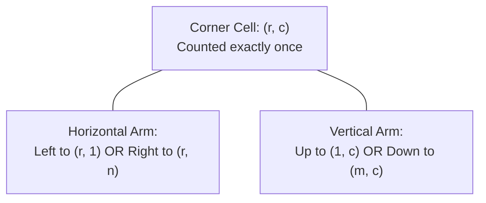

# Guided Example: Maximum Trailing Zeros in a Cornered Path

## 1. Problem Overview & Representative Instance

Given an $m \times n$ integer grid, a **cornered path** is defined as a simple path that begins and ends at boundary cells or interior cells, moves along grid lines, and makes at most one $90^\circ$ turn. That is, a cornered path consists of either:
1. A single straight horizontal or vertical line segment, or
2. A union of one horizontal segment and one vertical segment meeting at a single corner cell $(r, c)$.

The product of all integers visited along the path is computed. The objective is to identify the cornered path that maximizes the number of trailing zeros in this product.

### Representative Instance

Consider a $3 \times 3$ grid populated with values that expose both factor $2$ and factor $5$ supplies:

$$\text{grid} = \begin{pmatrix} 2 & 5 & 10 \\ 25 & 4 & 1 \\ 1 & 2 & 5 \end{pmatrix}$$

The 4 possible L-shaped orientations at each corner cell $(r, c)$ correspond to:
- **Up-Left**: From $(1, c)$ down to $(r, c)$, then left to $(r, 1)$
- **Down-Left**: From $(m, c)$ up to $(r, c)$, then left to $(r, 1)$
- **Up-Right**: From $(1, c)$ down to $(r, c)$, then right to $(r, n)$
- **Down-Right**: From $(m, c)$ up to $(r, c)$, then right to $(r, n)$

---

## 2. Mathematical & Algorithmic Principles

### Prime Factorization and Trailing Zeros

In base $10$, each trailing zero is generated by the prime factor product $2 \times 5 = 10$.
By the Fundamental Theorem of Arithmetic, any positive integer $x$ can be expressed uniquely as:

$$x = 2^{v_2(x)} \cdot 5^{v_5(x)} \cdot k, \quad \text{where } \gcd(k, 10) = 1$$

For any path $P = (u_1, u_2, \dots, u_L)$ of cells, the product of cell values has trailing zeros determined strictly by the limiting prime factor:

$$\text{Zeros}(P) = \min\left( \sum_{u \in P} v_2(\text{grid}[u]), \; \sum_{u \in P} v_5(\text{grid}[u]) \right)$$

The actual magnitude of the path product is irrelevant; only the additive accumulations of $v_2$ and $v_5$ govern the outcome.

### 2D Prefix Sums for Constant-Time Arm Queries

Calculating the sum of factors along arbitrary path segments from scratch takes $O(\max(m, n))$ per candidate path, which over $O(m \cdot n)$ cells leads to $O(m \cdot n \cdot (m + n))$ runtime.
To achieve optimal linear efficiency, we precompute prefix sums along each row and column:

1. **Row Prefix Sums:**
   $$R_2[i][j] = \sum_{k=1}^j v_2(\text{grid}[i-1][k-1]), \quad R_5[i][j] = \sum_{k=1}^j v_5(\text{grid}[i-1][k-1])$$
2. **Column Prefix Sums:**
   $$C_2[i][j] = \sum_{k=1}^i v_2(\text{grid}[k-1][j-1]), \quad C_5[i][j] = \sum_{k=1}^i v_5(\text{grid}[k-1][j-1])$$

With these prefix sums constructed (using $1$-based indexing for convenient boundary handling), the factor totals along any ray from $(i, j)$ can be evaluated in $O(1)$:
- **Left Ray (columns $1$ to $j$ in row $i$):**
  $$\text{sum}_2 = R_2[i][j], \quad \text{sum}_5 = R_5[i][j]$$
- **Right Ray (columns $j$ to $n$ in row $i$):**
  $$\text{sum}_2 = R_2[i][n] - R_2[i][j-1], \quad \text{sum}_5 = R_5[i][n] - R_5[i][j-1]$$
- **Up Ray (rows $1$ to $i$ in column $j$):**
  $$\text{sum}_2 = C_2[i][j], \quad \text{sum}_5 = C_5[i][j]$$
- **Down Ray (rows $i$ to $m$ in column $j$):**
  $$\text{sum}_2 = C_2[m][j] - C_2[i-1][j], \quad \text{sum}_5 = C_5[m][j] - C_5[i-1][j]$$

### Avoiding Double-Counting the Corner Cell

When joining a horizontal arm and a vertical arm meeting at $(i, j)$, cell $(i, j)$ belongs to both rays. It must be counted **exactly once**:
- Combining Left Ray and Up Ray:
  $$\text{Total}_2 = R_2[i][j] + C_2[i-1][j], \quad \text{Total}_5 = R_5[i][j] + C_5[i-1][j]$$
- Combining Left Ray and Down Ray:
  $$\text{Total}_2 = R_2[i][j] + (C_2[m][j] - C_2[i][j]), \quad \text{Total}_5 = R_5[i][j] + (C_5[m][j] - C_5[i][j])$$
- Combining Right Ray and Up Ray:
  $$\text{Total}_2 = (R_2[i][n] - R_2[i][j]) + C_2[i][j], \quad \text{Total}_5 = (R_5[i][n] - R_5[i][j]) + C_5[i][j]$$
- Combining Right Ray and Down Ray:
  $$\text{Total}_2 = (R_2[i][n] - R_2[i][j-1]) + (C_2[m][j] - C_2[i][j])$$
  $$\text{Total}_5 = (R_5[i][n] - R_5[i][j-1]) + (C_5[m][j] - C_5[i][j])$$

---

## 3. Step-by-Step Walkthrough with Intermediate State

### Phase 1: Grid Factorization

For our representative instance $\text{grid} = \begin{pmatrix} 2 & 5 & 10 \\ 25 & 4 & 1 \\ 1 & 2 & 5 \end{pmatrix}$:

| Cell $(i, j)$ | Value | Prime Factorization | Factor 2 Count ($v_2$) | Factor 5 Count ($v_5$) |
|---|---|---|---|---|
| $(1, 1)$ | $2$ | $2^1 \cdot 5^0$ | $1$ | $0$ |
| $(1, 2)$ | $5$ | $2^0 \cdot 5^1$ | $0$ | $1$ |
| $(1, 3)$ | $10$ | $2^1 \cdot 5^1$ | $1$ | $1$ |
| $(2, 1)$ | $25$ | $2^0 \cdot 5^2$ | $0$ | $2$ |
| $(2, 2)$ | $4$ | $2^2 \cdot 5^0$ | $2$ | $0$ |
| $(2, 3)$ | $1$ | $2^0 \cdot 5^0$ | $0$ | $0$ |
| $(3, 1)$ | $1$ | $2^0 \cdot 5^0$ | $0$ | $0$ |
| $(3, 2)$ | $2$ | $2^1 \cdot 5^0$ | $1$ | $0$ |
| $(3, 3)$ | $5$ | $2^0 \cdot 5^1$ | $0$ | $1$ |

### Phase 2: Prefix Sum Tables

Construct the cumulative tables:
- **$R_2$ (Row cumulative for factor 2):**
  - Row 1: $[0, 1, 1, 2]$
  - Row 2: $[0, 0, 2, 2]$
  - Row 3: $[0, 0, 1, 1]$
- **$R_5$ (Row cumulative for factor 5):**
  - Row 1: $[0, 0, 1, 2]$
  - Row 2: $[0, 2, 2, 2]$
  - Row 3: $[0, 0, 0, 1]$
- **$C_2$ (Column cumulative for factor 2):**
  - Col 1: $[0, 1, 1, 1]$
  - Col 2: $[0, 0, 2, 3]$
  - Col 3: $[0, 1, 1, 1]$
- **$C_5$ (Column cumulative for factor 5):**
  - Col 1: $[0, 0, 2, 2]$
  - Col 2: $[0, 1, 1, 1]$
  - Col 3: $[0, 1, 1, 2]$

### Phase 3: Evaluating Candidate Cornered Paths

Inspect key candidates:

1. **Corner at $(2, 2)$ (Value $4$):**
   - **Left + Up:**
     - Left arm: $(2, 1) \to (2, 2)$, factor $2 = R_2[2][2] = 2$, factor $5 = R_5[2][2] = 2$.
     - Up arm (above $(2, 2)$): cell $(1, 2)$, factor $2 = C_2[1][2] = 0$, factor $5 = C_5[1][2] = 1$.
     - Combined path: cells $(1, 2) [5]$, $(2, 2) [4]$, $(2, 1) [25]$.
     - Total factors: $v_2 = 2 + 0 = 2$, $v_5 = 2 + 1 = 3$.
     - Trailing zeros: $\min(2, 3) = 2$.
     - Verification: $5 \times 4 \times 25 = 500$, which terminates in $2$ zeros.

   - **Left + Down:**
     - Left arm: factor $2 = 2$, factor $5 = 2$.
     - Down arm (below $(2, 2)$): cell $(3, 2)$, factor $2 = C_2[3][2] - C_2[2][2] = 3 - 2 = 1$, factor $5 = 1 - 1 = 0$.
     - Combined path: cells $(2, 1) [25]$, $(2, 2) [4]$, $(3, 2) [2]$.
     - Total factors: $v_2 = 2 + 1 = 3$, $v_5 = 2 + 0 = 2$.
     - Trailing zeros: $\min(3, 2) = 2$.
     - Verification: $25 \times 4 \times 2 = 200$, which terminates in $2$ zeros.

2. **Corner at $(2, 1)$ (Value $25$):**
   - **Up + Right:**
     - Up arm: $(1, 1) \to (2, 1)$, factor $2 = C_2[2][1] = 1$, factor $5 = C_5[2][1] = 2$.
     - Right arm (strictly right): $(2, 2), (2, 3)$, factor $2 = R_2[2][3] - R_2[2][1] = 2 - 0 = 2$, factor $5 = 2 - 2 = 0$.
     - Combined path: cells $(1, 1) [2]$, $(2, 1) [25]$, $(2, 2) [4]$, $(2, 3) [1]$.
     - Total factors: $v_2 = 1 + 2 = 3$, $v_5 = 2 + 0 = 2$.
     - Trailing zeros: $\min(3, 2) = 2$.
     - Verification: $2 \times 25 \times 4 \times 1 = 200$, yielding $2$ zeros.

Global maximum across all cells and orientations is $2$.

---

## 4. Comprehensive State Trace

The table below catalogs evaluation of all 4 cornered path orientations across candidate center cells:

| Corner Cell $(i, j)$ | Grid Value | Orientation Tested | Cells Traversed | Total Factor 2 | Total Factor 5 | Zeros $\min(\Sigma_2, \Sigma_5)$ | Running Maximum |
|---|---|---|---|---|---|---|---|
| $(1, 1)$ | $2$ | Right + Down | $(1, 1) \to (1, 3)$ and down to $(3, 1)$ | $2 + 0 = 2$ | $2 + 2 = 4$ | $\min(2, 4) = 2$ | $2$ |
| $(1, 2)$ | $5$ | Left + Down | $(1, 1) \to (1, 2)$ and down to $(3, 2)$ | $1 + 3 = 4$ | $1 + 0 = 1$ | $\min(4, 1) = 1$ | $2$ |
| $(1, 3)$ | $10$ | Left + Down | $(1, 1) \to (1, 3)$ and down to $(3, 3)$ | $2 + 0 = 2$ | $2 + 1 = 3$ | $\min(2, 3) = 2$ | $2$ |
| $(2, 1)$ | $25$ | Up + Right | $(1, 1) \to (2, 1) \to (2, 3)$ | $1 + 2 = 3$ | $2 + 0 = 2$ | $\min(3, 2) = 2$ | $2$ |
| $(2, 2)$ | $4$ | Left + Up | $(1, 2) \to (2, 2) \to (2, 1)$ | $2 + 0 = 2$ | $2 + 1 = 3$ | $\min(2, 3) = 2$ | $2$ |
| $(2, 2)$ | $4$ | Left + Down | $(2, 1) \to (2, 2) \to (3, 2)$ | $2 + 1 = 3$ | $2 + 0 = 2$ | $\min(3, 2) = 2$ | $2$ |
| $(2, 2)$ | $4$ | Right + Up | $(1, 2) \to (2, 2) \to (2, 3)$ | $2 + 0 = 2$ | $0 + 1 = 1$ | $\min(2, 1) = 1$ | $2$ |
| $(3, 2)$ | $2$ | Up + Right | $(1, 2) \to (3, 2) \to (3, 3)$ | $3 + 0 = 3$ | $1 + 1 = 2$ | $\min(3, 2) = 2$ | $2$ |

---

## 5. Algorithmic Correctness & Soundness

### Path Topology Invariance

A cornered path consists of at most one turn between perpendicular axes. Any such path:
1. Cannot self-intersect because both legs move monotonically along distinct orthogonal lines.
2. Must have its turn point at some grid coordinate $(i, j)$ with $1 \le i \le m$ and $1 \le j \le n$.
3. When the path is a straight line, it can be viewed as an L-path where one of the two legs has length $0$ (e.g. extending from $(i, j)$ to $(i, n)$ with no vertical extension).
Because the algorithm enumerates all $m \times n$ cells and all $4$ orthogonal ray pairs extending to the boundaries, the entire search space of maximal valid cornered paths is exhaustively covered.

### Monotonicity of Prefix Subtractions

For non-negative weights $v_2(x) \ge 0$ and $v_5(x) \ge 0$, the cumulative factor sums along a line are weakly monotonically increasing. Truncating a ray before reaching the grid boundary cannot increase the number of factor 2's or factor 5's:

$$\sum_{k=1}^{j'} v(k) \le \sum_{k=1}^n v(k) \quad \text{for all } j' \le n$$

Since trailing zeros are defined by $\min(\Sigma_2, \Sigma_5)$ and adding non-negative terms preserves or increases both arguments, extending each arm all the way to the grid boundary dominates or equals any sub-segment. Hence, only boundary-terminated rays need to be tested.

---

## 6. Edge Cases & Anti-Patterns

### Edge Cases
1. **Single Cell Grid ($1 \times 1$):**
   If the grid has dimensions $1 \times 1$ containing $100$, $v_2(100) = 2$ and $v_5(100) = 2$. The path consists of the single cell itself, correctly returning $\min(2, 2) = 2$.
2. **Straight Paths Only ($1 \times n$ or $m \times 1$):**
   When $m = 1$, vertical arms have length $0$. The formula gracefully reduces to horizontal ray intervals, capturing full or partial row products.
3. **No Zeros Possible:**
   If the grid contains only odd numbers with no multiples of $5$, all $v_2$ counts are $0$. The minimum of factor sums evaluates to $0$ across all paths, returning $0$ without failure.
4. **Cells with Large Prime Multiplicities:**
   Numbers such as $1000 = 2^3 \times 5^3$ contribute multiple factors per step; the while-loop factorization accurately extracts all exponent counts.

### Anti-Patterns to Avoid
- **Multiplying Numbers Directly:**
  Attempting to compute $\prod \text{grid}[i][j]$ directly in arbitrary-precision arithmetic. A path of length $1000$ could produce a number with thousands of digits, resulting in severe arithmetic slowdown and memory consumption. Factor counting keeps numbers small ($v_2 \le 10, v_5 \le 5$ per cell).
- **Depth-First Search (DFS) with Path State:**
  Using recursive DFS to discover paths. A general DFS cannot readily enforce the "at most one turn" constraint without cumbersome direction state, and exploring paths dynamically incurs exponential or cubic overhead.
- **Double-Counting the Vertex Corner:**
  Adding $R_2[i][j] + C_2[i][j]$ directly counts the intersection cell $(i, j)$ twice, which artificially inflates factor counts. The corner cell must be included in exactly one arm.

---

## 7. Complexity Analysis

### Time Complexity
- **Cell Factorization:** Each cell contains a positive integer $x \le 1000$. Finding $v_2(x)$ and $v_5(x)$ via repeated division takes at most $\lfloor \log_2(1000) \rfloor \approx 10$ steps. Across all $m \times n$ cells:
  $$O(m \cdot n \cdot \log(\max V)) = O(m \cdot n)$$
- **Prefix Sum Table Construction:** Building four 2D arrays $R_2, R_5, C_2, C_5$ of size $(m + 1) \times (n + 1)$ requires one pass over the grid: $O(m \cdot n)$ operations.
- **Corner Enumeration:** Iterating over all $(i, j)$ pairs and evaluating $4$ constant-time combinations takes $4 \times O(1) \times m \times n = O(m \cdot n)$ operations.
- **Total Time Complexity:** $\mathcal{O}(m \cdot n)$, which is strictly linear with respect to the number of cells in the grid.

### Space Complexity
- **Prefix Sum Tables:** Four arrays of size $(m + 1) \times (n + 1)$ to store cumulative sums of $2$ and $5$ factors along rows and columns.
- **Total Space Complexity:** $\mathcal{O}(m \cdot n)$ auxiliary storage, matching the grid dimensions.
