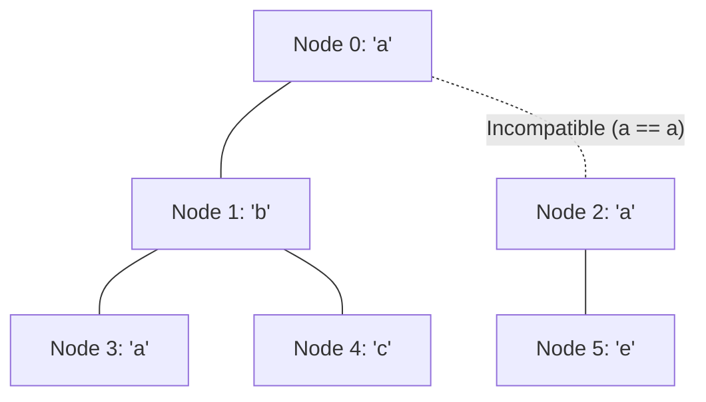

# Guided Example: Longest Path With Different Adjacent Characters

## 1. Problem Overview & Representative Instance

Given a tree of $n$ nodes numbered from $0$ to $n - 1$ rooted at node $0$, represented by a parent array where $\text{parent}[0] = -1$ and $\text{parent}[i]$ is the direct parent of node $i$, along with a string $s$ of length $n$ where $s[i]$ denotes the character assigned to node $i$, the goal is to determine the length (in number of vertices) of the longest simple path in the tree such that no two adjacent nodes on the path share the same character.

A path is a sequence of distinct vertices where each consecutive pair is connected by an undirected tree edge. If adjacent vertices $u$ and $v$ satisfy $s[u] = s[v]$, an alternating path cannot traverse the edge $(u, v)$.

### Representative Instance

Consider a tree with $n = 6$ nodes:
- $\text{parent} = [-1, 0, 0, 1, 1, 2]$
- Character labels: $s = \text{"abacbe"}$

The node relationships and assigned characters are:
- Node $0$: label `'a'`, children $\{1, 2\}$
- Node $1$: label `'b'`, children $\{3, 4\}$
- Node $2$: label `'a'`, children $\{5\}$
- Node $3$: label `'a'`, leaf
- Node $4$: label `'c'`, leaf
- Node $5$: label `'e'`, leaf

In this instance, edge $(0, 2)$ connects two nodes both labeled `'a'`. Any valid path crossing between node $0$ and node $2$ is invalid. However, node $1$ labeled `'b'` connects to children labeled `'a'` and `'c'`, enabling a path of length $3$ through node $1$, or a path of length $3$ from node $0$ descending into node $1$.

---

## 2. Mathematical & Algorithmic Principles

### Path Anatomy and the Lowest Common Ancestor Peak

Any simple path $P$ in a rooted tree has a unique vertex of minimum depth (closest to the root), denoted as its **peak vertex** (or lowest common ancestor) $u = \text{LCA}(P)$:
1. The path consists of $u$ itself (contributing $1$ node).
2. It extends downwards into at most two distinct child subtrees of $u$, say via children $v_1$ and $v_2$.
3. Each downward branch starting from $v_k$ must be a simple downward path of alternating characters.

Thus, for any node $u$, the maximum length of a valid path having $u$ as its peak vertex is:

$$\text{PathLength}(u) = 1 + d_1(u) + d_2(u)$$

where $d_1(u)$ and $d_2(u)$ are the lengths (number of edges) of the two longest valid downward branches descending from $u$ into distinct children $v$ satisfying $s[v] \ne s[u]$. If $u$ has fewer than two compatible child branches, the missing branch lengths are defined as $0$.

### Dynamic Programming Recurrence

Let $L(u)$ denote the maximum number of nodes in a valid downward path originating at node $u$ and descending entirely within the subtree rooted at $u$:
- If $u$ is a leaf, $L(u) = 1$.
- In general, for each child $v \in \text{Children}(u)$:
  $$\text{branch}(v) = \begin{cases} L(v) & \text{if } s[v] \neq s[u] \\ 0 & \text{if } s[v] = s[u] \end{cases}$$
- The return value to $u$'s parent is:
  $$L(u) = 1 + \max_{v \in \text{Children}(u)} \text{branch}(v)$$
- Simultaneously, let the top two values of $\text{branch}(v)$ among all children of $u$ be $b_1 \ge b_2 \ge 0$. The peak path at $u$ achieves:
  $$\text{LocalMax}(u) = 1 + b_1 + b_2$$

The global maximum across all nodes in the tree is:

$$\text{GlobalMax} = \max_{u \in V} \text{LocalMax}(u)$$

Post-order depth-first traversal naturally computes $L(v)$ for all children before evaluating $u$, yielding a clean linear-time solution.

---

## 3. Step-by-Step Walkthrough with Intermediate State

We trace the post-order evaluation from the leaves up to root node $0$.

### Step 1: Leaves $3$, $4$, and $5$
- **Node 3 ($s[3] = \text{'a'}$):** Leaf.
  - Compatible branches: none.
  - $\text{LocalMax}(3) = 1$.
  - Returns $L(3) = 1$.
- **Node 4 ($s[4] = \text{'c'}$):** Leaf.
  - Compatible branches: none.
  - $\text{LocalMax}(4) = 1$.
  - Returns $L(4) = 1$.
- **Node 5 ($s[5] = \text{'e'}$):** Leaf.
  - Compatible branches: none.
  - $\text{LocalMax}(5) = 1$.
  - Returns $L(5) = 1$.

### Step 2: Internal Node $1$ ($s[1] = \text{'b'}$)
- Children: $\{3, 4\}$.
- For child $3$: $s[3] = \text{'a'} \ne \text{'b'}$. Compatible! Branch length $= L(3) = 1$.
- For child $4$: $s[4] = \text{'c'} \ne \text{'b'}$. Compatible! Branch length $= L(4) = 1$.
- Top two branches: $b_1 = 1, b_2 = 1$.
- Candidate peak path at $1$:
  $$\text{LocalMax}(1) = 1 + b_1 + b_2 = 1 + 1 + 1 = 3$$
  Path: $3 \to 1 \to 4$ (characters $\text{'a'} - \text{'b'} - \text{'c'}$).
- Value returned to parent: $L(1) = 1 + \max(1, 1) = 2$.

### Step 3: Internal Node $2$ ($s[2] = \text{'a'}$)
- Children: $\{5\}$.
- For child $5$: $s[5] = \text{'e'} \ne \text{'a'}$. Compatible! Branch length $= L(5) = 1$.
- Top two branches: $b_1 = 1, b_2 = 0$.
- Candidate peak path at $2$:
  $$\text{LocalMax}(2) = 1 + 1 + 0 = 2$$
  Path: $2 \to 5$ (characters $\text{'a'} - \text{'e'}$).
- Value returned to parent: $L(2) = 1 + 1 = 2$.

### Step 4: Root Node $0$ ($s[0] = \text{'a'}$)
- Children: $\{1, 2\}$.
- For child $1$: $s[1] = \text{'b'} \ne \text{'a'}$. Compatible! Branch length $= L(1) = 2$.
- For child $2$: $s[2] = \text{'a'} == \text{'a'}$. Incompatible! Label collision breaks the alternating invariant. Branch length $= 0$.
- Top two branches: $b_1 = 2, b_2 = 0$.
- Candidate peak path at $0$:
  $$\text{LocalMax}(0) = 1 + 2 + 0 = 3$$
  Path: $0 \to 1 \to 3$ or $0 \to 1 \to 4$ (length $3$).
- Value returned: $L(0) = 1 + 2 = 3$.

### Step 5: Global Conclusion
$$\text{GlobalMax} = \max(1, 1, 1, 3, 2, 3) = 3$$
The longest valid alternating path contains $3$ nodes.

---

## 4. Comprehensive State Trace

### Post-Order Node Processing Summary

The table below catalogs the post-order execution across all nodes in the tree:

| Node $u$ | Label $s[u]$ | Children | Child Evaluations $(v, s[v], \text{valid?})$ | Top Two Branches $(b_1, b_2)$ | Subtree Peak Length $1 + b_1 + b_2$ | Downward Return $L(u)$ |
|---|---|---|---|---|---|---|
| **$3$** | `'a'` | $\emptyset$ | None | $(0, 0)$ | $1$ | $1$ |
| **$4$** | `'c'` | $\emptyset$ | None | $(0, 0)$ | $1$ | $1$ |
| **$1$** | `'b'` | $\{3, 4\}$ | $(3, \text{'a'}, \text{Yes}), (4, \text{'c'}, \text{Yes})$ | $(1, 1)$ | $1 + 1 + 1 = 3$ | $1 + 1 = 2$ |
| **$5$** | `'e'` | $\emptyset$ | None | $(0, 0)$ | $1$ | $1$ |
| **$2$** | `'a'` | $\{5\}$ | $(5, \text{'e'}, \text{Yes})$ | $(1, 0)$ | $1 + 1 + 0 = 2$ | $1 + 1 = 2$ |
| **$0$** | `'a'` | $\{1, 2\}$ | $(1, \text{'b'}, \text{Yes}), (2, \text{'a'}, \text{No})$ | $(2, 0)$ | $1 + 2 + 0 = 3$ | $1 + 2 = 3$ |

### Path Composition Comparison

The table below highlights the competing candidate paths in the representative tree:

| Peak Anchor Node $u$ | Candidate Path Vertices | Character Sequence | Status vs Constraints | Path Length |
|---|---|---|---|---|
| Node $1$ | $3 - 1 - 4$ | `'a' - 'b' - 'c'` | Fully alternating | $3$ |
| Node $0$ | $0 - 1 - 3$ | `'a' - 'b' - 'a'` | Fully alternating | $3$ |
| Node $0$ | $0 - 1 - 4$ | `'a' - 'b' - 'c'` | Fully alternating | $3$ |
| Node $2$ | $2 - 5$ | `'a' - 'e'` | Fully alternating | $2$ |
| Node $0$ (Hypothetical) | $3 - 1 - 0 - 2 - 5$ | `'a' - 'b' - 'a' - 'a' - 'e'` | Violates $s[0] \ne s[2]$ | Disallowed |

---

## 5. Algorithmic Correctness & Soundness

### Path Uniqueness via Peak Node

Every simple path in a tree has a unique highest node $u$ with respect to tree depth:
- Let $u$ be the lowest common ancestor of all vertices in path $P$.
- $P$ intersects at most two child subtrees of $u$. If it visited three or more, $P$ would require branching, violating the definition of an elementary path.
- Within each child subtree, $P$ must be purely monotonic in depth; any turn would create another peak or self-intersection.
- Therefore, every simple path in the tree is formed by joining $u$ with at most two downward paths into separate child subtrees.

### Optimal Substructure

Because edge weights are uniformly $1$ and the compatibility check $s[u] \ne s[v]$ depends solely on the immediate endpoint characters of edge $(u, v)$:
- An optimal downward path from $u$ through child $v$ requires taking the longest possible valid downward path starting at $v$.
- The internal structure of the path below $v$ does not interact with $u$ or any other child of $u$.
- Thus, greedily selecting the two largest compatible child return values $L(v)$ guarantees the optimal path peaking at $u$.

---

## 6. Edge Cases & Anti-Patterns

### Edge Cases
1. **Single Node Tree ($n = 1$):**
   $\text{parent} = [-1]$ and $s = \text{"z"}$. The post-order loop processes node $0$ with no children, returning $L(0) = 1$. The global maximum is $1$.
2. **All Identical Characters:**
   For example, $s = \text{"aaaa"}$. Every edge $(u, v)$ has $s[u] = s[v]$. All branch lengths evaluate to $0$. The local maximum at every node is $1 + 0 + 0 = 1$, correctly outputting $1$.
3. **Linear Chain (Alternating):**
   $\text{parent} = [-1, 0, 1, 2]$ and $s = \text{"abab"}$. Each node has exactly one child. The downward branch lengths grow strictly: $1 \to 2 \to 3 \to 4$. The peak at root yields $1 + 3 + 0 = 4$.
4. **Star Graph with Multiple Compatible Leaves:**
   A root with $10$ children having alternating characters. The top two branches are chosen, yielding $1 + 1 + 1 = 3$.

### Anti-Patterns to Avoid
- **All-Pairs Shortest Path / Floyd-Warshall:**
  Attempting graph algorithms like BFS from every node takes $O(n^2)$ time, which fails on $n = 10^5$.
- **Summing All Compatible Children at a Node:**
  Adding lengths from more than two children. A simple path can enter through at most one child branch and exit through at most one other child branch. Combining three or more branches creates a tree, not a simple path.
- **Top-Down DFS Without Pruning:**
  Attempting to push path lengths downward from the root requires tracking branch commitments and re-evaluating subtrees, complicating state and increasing runtime.

---

## 7. Complexity Analysis

### Time Complexity
- **Tree Construction:** Building the adjacency list from the $\text{parent}$ array takes $O(n)$ time for $n$ vertices.
- **Depth-First Search Traversal:** The post-order DFS visits each node exactly once.
- **Child Processing:** For each vertex $u$, the algorithm iterates through its immediate children. Finding the top two branches among $\text{deg}(u)$ children takes $O(\text{deg}(u))$ time.
- **Sum Over All Vertices:**
  $$\sum_{u=0}^{n-1} O(\text{deg}(u)) = O(n)$$
- **Total Time Complexity:** $\mathcal{O}(n)$, which is linear and optimal.

### Space Complexity
- **Adjacency Representation:** Storing child lists for all nodes requires $O(n)$ space.
- **Call Stack:** The recursive DFS uses recursion stack space bounded by the tree height $h$, where $h \le n$ in the worst-case degenerate chain.
- **Total Space Complexity:** $\mathcal{O}(n)$ auxiliary memory.