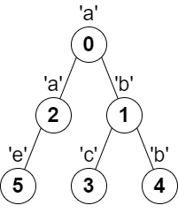
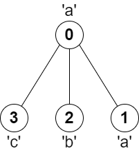

### 1. Description

You are given a **tree** (i.e. a connected, undirected graph that has no cycles) **rooted** at node `0` consisting of `n` nodes numbered from `0` to $n - 1$. The tree is represented by a **0-indexed** array `parent` of size `n`, where $\text{parent}[i]$ is the parent of node `i`. Since node `0` is the root, $\text{parent}[0] = -1$.

You are also given a string `s` of length `n`, where $s[i]$ is the character assigned to node `i`.

Return *the length of the **longest path** in the tree such that no pair of **adjacent** nodes on the path have the same character assigned to them.*

### 2. Function Contract

**Inputs**

- `parent`: Input parameter (`List[int]`).
- `s`: Input parameter (`str`).

**Return value**

- Returns `int`.

### 3. Examples

#### Example 1

- **Input:** $parent = [-1,0,0,1,1,2], s = "abacbe"$
- **Output:** `3`
- **Explanation:** The longest path where each two adjacent nodes have different characters in the tree is the path: 0 -> 1 -> 3. The length of this path is 3, so 3 is returned.
It can be proven that there is no longer path that satisfies the conditions.

#### Example 2

- **Input:** $parent = [-1,0,0,0], s = "aabc"$
- **Output:** `3`
- **Explanation:** The longest path where each two adjacent nodes have different characters is the path: 2 -> 0 -> 3. The length of this path is 3, so 3 is returned.

### 4. Constraints

- $n = \text{parent.length} = \text{s.length}$

- $1 \le n \le 10^{5}$

- $0 \le \text{parent}[i] \le n - 1$ for all $i \ge 1$

- $\text{parent}[0] = -1$

- `parent` represents a valid tree.

- `s` consists of only lowercase English letters.
