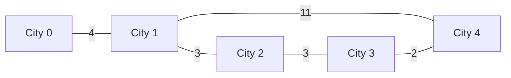

# Guided Example: Maximum Cost of Trip With K Highways

## 1. Problem Overview & Representative Instance

Given an integer $n$ denoting the number of cities labeled from $0$ to $n - 1$, an array $\text{highways}$ where each element $[u, v, \text{cost}]$ denotes an undirected highway connecting cities $u$ and $v$ with a traversal toll $\text{cost}$, and an integer $k$, the objective is to find the maximum possible toll collected on a trip that traverses **exactly $k$ highways** without visiting any city more than once.

A trip with exactly $k$ highways without revisiting any city forms an elementary path (simple path) consisting of $k + 1$ distinct cities. If no such path exists anywhere in the network, the expected result is $-1$.

### Representative Instance

Consider a network of $n = 5$ cities and $k = 3$ target highways:
- Highways:
  - $(0, 1)$ with toll $4$
  - $(1, 2)$ with toll $3$
  - $(1, 4)$ with toll $11$
  - $(2, 3)$ with toll $3$
  - $(3, 4)$ with toll $2$

We must find a sequence of $4$ distinct cities connected by $3$ edges that maximizes the sum of the edge tolls.

---

## 2. Mathematical & Algorithmic Principles

### Path Cardinality and Feasibility Bound

By the definition of a simple path of length $k$:
- Number of edges traversed $= k$.
- Number of distinct cities visited $= k + 1$.
- If $k \ge n$, the Pigeonhole Principle dictates that any walk of length $k$ must revisit at least one city because $k + 1 > n$. In this case, no simple path can exist, and the problem immediately yields $-1$.

### Bitmask Dynamic Programming Formulation

Finding the longest simple path in a general graph is NP-hard (generalizing the Hamiltonian Path problem). However, the constraint $n \le 15$ makes exact exponential search tractable. The number of non-empty subsets of cities is $2^n \le 2^{15} = 32{,}768$.

We define the dynamic programming state:
- Let $\text{mask} \in [1, 2^n - 1]$ be an integer bitmask where the $j$-th bit is $1$ if and only if city $j$ has been visited.
- Let $u \in \{0, \dots, n - 1\}$ be the terminal city of the path, where the $u$-th bit of $\text{mask}$ is set ($(\text{mask} \gg u) \ \& \ 1 = 1$).
- State definition:
  $$f(\text{mask}, u) = \text{maximum toll of a simple path covering vertices in mask ending at } u$$

### Recurrence Relation

1. **Base Cases (Paths of 0 Edges):**
   A trip starting at city $u$ visiting only $\{u\}$ traverses $0$ highways:
   $$f(1 \ll u, u) = 0 \quad \text{for all } u \in \{0, \dots, n - 1\}$$
   All other states are initialized to $-\infty$.

2. **State Transitions:**
   To compute $f(\text{mask}, u)$, city $u$ must be reached from some predecessor $v$ present in $\text{mask} \setminus \{u\}$ such that highway $(v, u)$ exists with toll $w$:
   $$f(\text{mask}, u) = \max_{(v, w) \in \text{Adj}(u), \; v \in \text{mask}} \left( f(\text{mask} \setminus \{u\}, v) + w \right)$$
   where $\text{mask} \setminus \{u\} = \text{mask} \oplus (1 \ll u)$.

3. **Topological Order:**
   Because $\text{mask} \setminus \{u\} < \text{mask}$, iterating masks in ascending numerical order from $1$ to $2^n - 1$ guarantees that all predecessor states are fully resolved before they are read.

4. **Answer Extraction:**
   A trip of $k$ highways visits exactly $k + 1$ vertices. The bit count (Hamming weight) of the mask must equal $k + 1$:
   $$\text{Answer} = \max_{\substack{\text{popcount}(\text{mask}) = k + 1 \\ u \in \text{mask}}} f(\text{mask}, u)$$
   If no state with $\text{popcount}(\text{mask}) = k + 1$ is reachable, return $-1$.

---

## 3. Step-by-Step Walkthrough with Intermediate State

We trace path construction on the representative instance ($n = 5, k = 3$).
Bitmask representation uses binary integers where bit $i$ represents city $i$.

### Stage 1: Paths of 0 Highways (1 City)
For each city $i \in \{0, 1, 2, 3, 4\}$, set $f(1 \ll i, i) = 0$.
- $f(00001_2, 0) = 0$
- $f(00010_2, 1) = 0$
- $f(00100_2, 2) = 0$
- $f(01000_2, 3) = 0$
- $f(10000_2, 4) = 0$

### Stage 2: Paths of 1 Highway (2 Cities)
Evaluating adjacent pairs:
- From city $0$ across highway $(0, 1)$ toll $4$:
  $f(00011_2, 1) = f(00001_2, 0) + 4 = 4$
  $f(00011_2, 0) = f(00010_2, 1) + 4 = 4$
- From city $1$ across highway $(1, 4)$ toll $11$:
  $f(10010_2, 4) = f(00010_2, 1) + 11 = 11$
  $f(10010_2, 1) = f(10000_2, 4) + 11 = 11$
- Across highway $(1, 2)$ toll $3$:
  $f(00110_2, 2) = 3, \quad f(00110_2, 1) = 3$
- Across highway $(2, 3)$ toll $3$:
  $f(01100_2, 3) = 3, \quad f(01100_2, 2) = 3$
- Across highway $(3, 4)$ toll $2$:
  $f(11000_2, 4) = 2, \quad f(11000_2, 3) = 2$

### Stage 3: Paths of 2 Highways (3 Cities)
Extend $2$-city masks by adding an adjacent third city:
- Extending $\{0, 1\}$ to city $4$ via edge $(1, 4)$ toll $11$:
  Mask: $\{0, 1, 4\} = 10011_2$.
  $$f(10011_2, 4) = f(00011_2, 1) + 11 = 4 + 11 = 15$$
- Extending $\{0, 1\}$ to city $2$ via edge $(1, 2)$ toll $3$:
  Mask: $\{0, 1, 2\} = 00111_2$.
  $$f(00111_2, 2) = f(00011_2, 1) + 3 = 4 + 3 = 7$$
- Extending $\{1, 4\}$ to city $3$ via edge $(4, 3)$ toll $2$:
  Mask: $\{1, 3, 4\} = 11010_2$.
  $$f(11010_2, 3) = f(10010_2, 4) + 2 = 11 + 2 = 13$$
- Extending $\{2, 1\}$ to city $4$ via edge $(1, 4)$ toll $11$:
  Mask: $\{1, 2, 4\} = 10110_2$.
  $$f(10110_2, 4) = f(00110_2, 1) + 11 = 3 + 11 = 14$$

### Stage 4: Paths of 3 Highways (4 Cities)
We inspect states where $\text{popcount}(\text{mask}) = 3 + 1 = 4$:

1. **Mask $\{0, 1, 3, 4\} = 11011_2$ ending at city $3$:**
   - Predecessor in mask: city $4$ (edge $(4, 3)$ has toll $2$).
   - Remaining mask: $\{0, 1, 4\} = 10011_2$.
   - Computation:
     $$f(11011_2, 3) = f(10011_2, 4) + 2 = 15 + 2 = 17$$
   - Path realization: $0 \to 1 \to 4 \to 3$ with tolls $4 + 11 + 2 = 17$.

2. **Mask $\{1, 2, 3, 4\} = 11110_2$ ending at city $1$:**
   - Predecessor: city $2$ or city $4$.
   - Via path $3 \to 2 \to 1 \to 4$: toll is $3 + 3 + 11 = 17$ (ending at 4).
   - Via path $2 \to 3 \to 4 \to 1$: toll is $3 + 2 + 11 = 16$.

3. **Mask $\{0, 1, 2, 3\} = 01111_2$:**
   - Path $0 \to 1 \to 2 \to 3$: toll is $4 + 3 + 3 = 10$.

Comparing all candidates with $4$ cities, the maximum toll achieved is $17$.

---

## 4. Comprehensive State Trace

### Dynamic Programming Subproblem Progression

The table below catalogs key bitmask transitions leading to the optimal $3$-highway path:

| Mask (Binary) | Visited City Set | Terminal City $u$ | Active Transition | Submask Used | Value Derivation | Accumulated Toll |
|---|---|---|---|---|---|---|
| $00001_2$ | $\{0\}$ | $0$ | Base state | None | Starting anchor | $0$ |
| $00011_2$ | $\{0, 1\}$ | $1$ | Traverse $(0, 1)$ | $00001_2$ | $0 + 4$ | $4$ |
| $10010_2$ | $\{1, 4\}$ | $4$ | Traverse $(1, 4)$ | $00010_2$ | $0 + 11$ | $11$ |
| $00111_2$ | $\{0, 1, 2\}$ | $2$ | Traverse $(1, 2)$ | $00011_2$ | $4 + 3$ | $7$ |
| $10011_2$ | $\{0, 1, 4\}$ | $4$ | Traverse $(1, 4)$ | $00011_2$ | $4 + 11$ | $15$ |
| $11010_2$ | $\{1, 3, 4\}$ | $3$ | Traverse $(4, 3)$ | $10010_2$ | $11 + 2$ | $13$ |
| $10110_2$ | $\{1, 2, 4\}$ | $4$ | Traverse $(1, 4)$ | $00110_2$ | $3 + 11$ | $14$ |
| $11011_2$ | $\{0, 1, 3, 4\}$ | $3$ | Traverse $(4, 3)$ | $10011_2$ | $15 + 2$ | **$17$** |
| $11110_2$ | $\{1, 2, 3, 4\}$ | $4$ | Traverse $(1, 4)$ | $01110_2$ | $6 + 11$ | **$17$** |

### Complete Enumeration of Valid 4-City Simple Paths

| Path Sequence | Visited Cities | Edges Traversed | Edge Tolls | Total Toll Sum | Status vs Global Maximum |
|---|---|---|---|---|---|
| $0 - 1 - 4 - 3$ | $\{0, 1, 3, 4\}$ | $(0, 1), (1, 4), (4, 3)$ | $4 + 11 + 2$ | $17$ | **Optimal Maximum** |
| $3 - 2 - 1 - 4$ | $\{1, 2, 3, 4\}$ | $(3, 2), (2, 1), (1, 4)$ | $3 + 3 + 11$ | $17$ | **Optimal Maximum** |
| $2 - 1 - 4 - 3$ | $\{1, 2, 3, 4\}$ | $(2, 1), (1, 4), (4, 3)$ | $3 + 11 + 2$ | $16$ | Suboptimal |
| $2 - 3 - 4 - 1$ | $\{1, 2, 3, 4\}$ | $(2, 3), (3, 4), (4, 1)$ | $3 + 2 + 11$ | $16$ | Suboptimal |
| $0 - 1 - 2 - 3$ | $\{0, 1, 2, 3\}$ | $(0, 1), (1, 2), (2, 3)$ | $4 + 3 + 3$ | $10$ | Suboptimal |

---

## 5. Algorithmic Correctness & Soundness

### Loopless Guarantee via Bitwise Tracking

A simple path must visit distinct cities. In the bitmask formulation:
- Each vertex corresponds to exactly one bit in $\text{mask}$.
- When transitioning from submask $S' = \text{mask} \setminus \{u\}$ to $\text{mask}$, the bit for $u$ is turned on.
- Because submask $S'$ does not contain $u$, vertex $u$ could not have been visited at any previous step of that path.
- Therefore, no cycle or revisited vertex can ever be represented by a valid sequence of state transitions.

### Optimal Substructure

Any subpath of a simple path is itself a simple path. If a path $P$ from $s$ to $u$ via predecessor $v$ achieves maximum toll, the prefix of $P$ ending at $v$ must be an optimal simple path covering the exact set of vertices $\text{mask} \setminus \{u\}$. If a higher-toll path existed on the exact same vertex set ending at $v$, splicing that prefix would yield a strictly larger toll for the full path without altering validity. Hence, optimal substructure holds.

---

## 6. Edge Cases & Anti-Patterns

### Edge Cases
1. **$k \ge n$ (More Highways Than City Limit):**
   If $k \ge n$, any trip of $k$ highways must visit $k + 1 > n$ cities, which is impossible. The guard condition immediately outputs $-1$.
2. **Disconnected Components:**
   If the graph consists of isolated clusters where no connected component contains at least $k + 1$ nodes, all candidate states with $\text{popcount} = k + 1$ remain at $-\infty$. The algorithm correctly returns $-1$.
3. **Zero-Cost Highways:**
   Tolls can be $0$. The algorithm correctly distinguishes a valid path with toll sum $0$ from unreachable states by initializing unreachable states to $-\infty$.
4. **Single Highway ($k = 1$):**
   When $k = 1$, the problem simplifies to selecting the single edge with the maximum toll weight.

### Anti-Patterns to Avoid
- **Dijkstra / Greedy Traversals:**
  Greedily selecting the highest-cost outgoing edge at each step can trap the path in a dead-end or cycle, missing globally optimal trips.
- **Unbounded Depth-First Search Without Memoization:**
  Exploring all paths using plain recursion can revisit the same subset of vertices in factorial $O(n!)$ order. Bitmask DP reduces redundant state combinations to $O(2^n \cdot n)$.
- **Revisiting Vertices:**
  Failing to track visited vertices leads to infinite bouncing back and forth between two vertices connected by a high-toll highway.

---

## 7. Complexity Analysis

### Time Complexity
- **Graph Construction:** Building the adjacency list takes $O(n + m)$ time where $m$ is the number of highways.
- **State Space:** There are $2^n$ distinct bitmasks and $n$ possible terminal cities, yielding $2^n \times n$ states.
- **Transitions:** For each state $(\text{mask}, u)$, the algorithm iterates over all incident edges of $u$. Across all $u$, the total degrees sum to $2m$.
- **Total Operations:**
  $$\sum_{\text{mask}=1}^{2^n - 1} \sum_{u=0}^{n-1} \text{deg}(u) = 2^n \times 2m = O(2^n \cdot m)$$
  For $n \le 15$ and $m \le 50$:
  $$2^{15} \times 100 \approx 3.28 \times 10^6 \text{ operations}$$
  which executes comfortably in less than $0.1$ seconds.

### Space Complexity
- **DP Table:** The 2D table $f$ requires $2^n \times n$ integer entries.
  For $n = 15$: $32{,}768 \times 15 \approx 4.9 \times 10^5$ elements, requiring approximately $4 \text{ MB}$ of RAM.
- **Total Space Complexity:** $\mathcal{O}(2^n \cdot n)$ auxiliary space.
