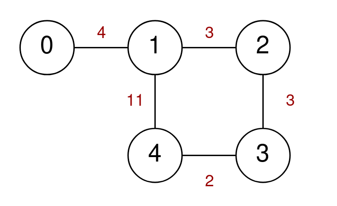
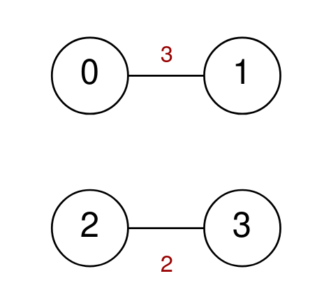

## Description

A series of highways connect `n` cities numbered from `0` to $n - 1$. You are given a 2D integer array `highways` where $\text{highways}[i] = [\text{city1}_{i}, \text{city2}_{i}, \text{toll}_{i}]$ indicates that there is a highway that connects $\text{city1}_{i}$ and $\text{city2}_{i}$, allowing a car to go from $\text{city1}_{i}$ to $\text{city2}_{i}$ and **vice versa** for a cost of $\text{toll}_{i}$.

You are also given an integer `k`. You are going on a trip that crosses **exactly** `k` highways. You may start at any city, but you may only visit each city **at most** once during your trip.

Return* the **maximum** cost of your trip. If there is no trip that meets the requirements, return *`-1`*.*
### Function Contract

- Refer to method signature.

### Examples

#### Example 1

- **Input:** $n = 5, highways = [[0,1,4],[2,1,3],[1,4,11],[3,2,3],[3,4,2]], k = 3$
- **Output:** `17`
- **Explanation:**
One possible trip is to go from 0 -> 1 -> 4 -> 3. The cost of this trip is 4 + 11 + 2 = 17.
Another possible trip is to go from 4 -> 1 -> 2 -> 3. The cost of this trip is 11 + 3 + 3 = 17.
It can be proven that 17 is the maximum possible cost of any valid trip.
Note that the trip 4 -> 1 -> 0 -> 1 is not allowed because you visit the city 1 twice.
#### Example 2

- **Input:** $n = 4, highways = [[0,1,3],[2,3,2]], k = 2$
- **Output:** `-1`
- **Explanation:** There are no valid trips of length 2, so return -1.
### Constraints

- $2 \le n \le 15$

- $1 \le \text{highways.length} \le 50$

- $\text{highways}[i].length = 3$

- $0 \le \text{city1}_{i}, \text{city2}_{i} \le n - 1$

- $\text{city1}_{i} \neq \text{city2}_{i}$

- $0 \le \text{toll}_{i} \le 100$

- $1 \le k \le 50$

- There are no duplicate highways.