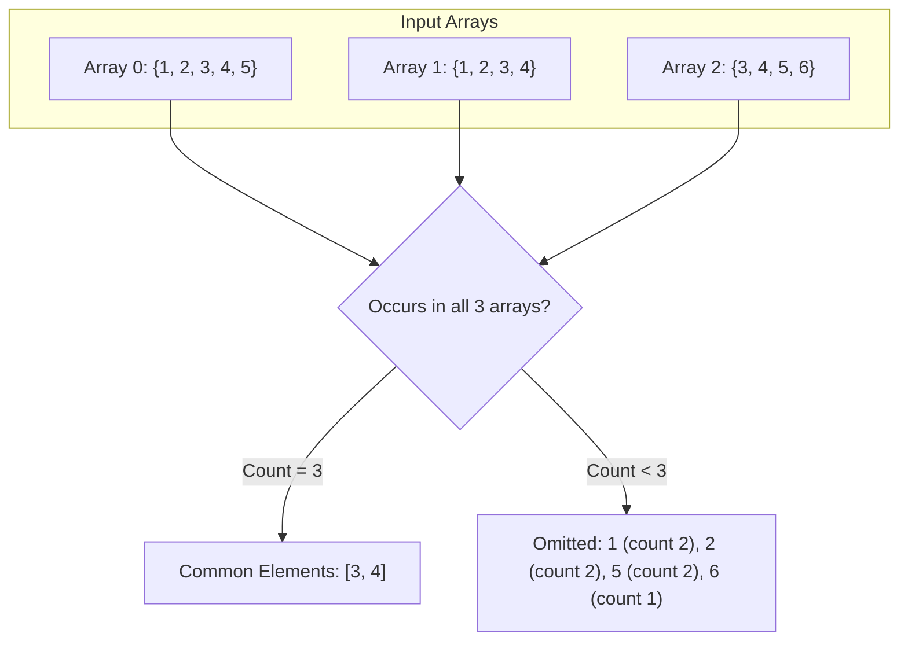

# Guided Example: Intersection of Multiple Arrays

## 1. Problem Overview & Representative Instance

Given a 2D integer array $\text{nums}$ where each inner array $\text{nums}[i]$ is a non-empty list of distinct positive integers, the objective is to find all integers that appear in **every** sub-array of $\text{nums}$. The resulting integers must be returned as a list sorted in strictly ascending order.

In set-theoretic terms, given a collection of sets $S_0, S_1, \dots, S_{M-1}$, the problem asks for the elements of their intersection:

$$\mathcal{I} = \bigcap_{i=0}^{M-1} S_i$$

### Representative Instance

Consider $M = 3$ arrays with positive integers:
- $\text{nums}[0] = [3, 1, 2, 4, 5]$
- $\text{nums}[1] = [1, 2, 3, 4]$
- $\text{nums}[2] = [3, 4, 5, 6]$

The values present in all $3$ rows are $3$ and $4$. Sorting them yields $[3, 4]$.

---

## 2. Mathematical & Algorithmic Principles

### Set Intersection via Incidence Counting

An element $x$ belongs to the intersection of $M$ sets if and only if it is a member of every set:

$$x \in \bigcap_{i=0}^{M-1} S_i \iff \forall i \in \{0, \dots, M-1\}, \; x \in S_i$$

Because each individual array $\text{nums}[i]$ contains pairwise distinct integers, an integer $x$ can appear at most once in any given row:

$$\sum_{x' \in \text{nums}[i]} \mathbf{1}_{x' = x} \in \{0, 1\}$$

Therefore, the global frequency of $x$ summed across all elements of all rows equals the exact number of rows containing $x$:

$$\text{freq}(x) = \sum_{i=0}^{M-1} \sum_{v \in \text{nums}[i]} \mathbf{1}_{v = x}$$

This establishes a fundamental identity:

$$x \in \bigcap_{i=0}^{M-1} S_i \iff \text{freq}(x) = M$$

### Direct-Address Frequency Array and Implicit Sorting

The problem constraints specify that each integer value satisfies $1 \le x \le 1000$.
Instead of allocating generic hash sets and performing repeated pairwise intersections, we allocate a fixed direct-address lookup table $\text{cnt}$ of size $1001$:
1. A single linear pass over all elements of all rows increments $\text{cnt}[x]$ for each observed value $x$.
2. Scanning the indices $x$ from $1$ to $1000$ sequentially and filtering for those where $\text{cnt}[x] = M$:
   - Verifies the membership condition in $O(1)$ per candidate value.
   - Collects the surviving elements in **strictly increasing numerical order** naturally, eliminating the need for an explicit post-processing sorting step.

---

## 3. Step-by-Step Walkthrough with Intermediate State

We execute the frequency scan on our representative instance ($M = 3$).

### Step 1: Initial State
Allocate a frequency array $\text{cnt}$ of size $1001$ with all entries initialized to $0$.
Target threshold: $M = 3$.

### Step 2: Ingestion of Array 0
$\text{nums}[0] = [3, 1, 2, 4, 5]$
Update entries:
- $\text{cnt}[1] \leftarrow 1$
- $\text{cnt}[2] \leftarrow 1$
- $\text{cnt}[3] \leftarrow 1$
- $\text{cnt}[4] \leftarrow 1$
- $\text{cnt}[5] \leftarrow 1$

### Step 3: Ingestion of Array 1
$\text{nums}[1] = [1, 2, 3, 4]$
Update entries:
- $\text{cnt}[1] \leftarrow 1 + 1 = 2$
- $\text{cnt}[2] \leftarrow 1 + 1 = 2$
- $\text{cnt}[3] \leftarrow 1 + 1 = 2$
- $\text{cnt}[4] \leftarrow 1 + 1 = 2$

### Step 4: Ingestion of Array 2
$\text{nums}[2] = [3, 4, 5, 6]$
Update entries:
- $\text{cnt}[3] \leftarrow 2 + 1 = 3$
- $\text{cnt}[4] \leftarrow 2 + 1 = 3$
- $\text{cnt}[5] \leftarrow 1 + 1 = 2$
- $\text{cnt}[6] \leftarrow 0 + 1 = 1$

### Step 5: Sequential Filtering Scan
Scan indices $x \in [1, 1000]$:
- $x = 1: \text{cnt}[1] = 2 \ne 3 \implies \text{Skip}$
- $x = 2: \text{cnt}[2] = 2 \ne 3 \implies \text{Skip}$
- $x = 3: \text{cnt}[3] = 3 == 3 \implies \text{Collect } 3$
- $x = 4: \text{cnt}[4] = 3 == 3 \implies \text{Collect } 4$
- $x = 5: \text{cnt}[5] = 2 \ne 3 \implies \text{Skip}$
- $x = 6: \text{cnt}[6] = 1 \ne 3 \implies \text{Skip}$
- For all other $x \in [7, 1000]$, $\text{cnt}[x] = 0 \ne 3 \implies \text{Skip}$

Final Result: $[3, 4]$.

---

## 4. Comprehensive State Trace

### Element Presence Matrix Across Sub-Arrays

The table below catalogs every unique integer observed in the representative input, tracking row-by-row presence and total occurrences:

| Candidate Value $x$ | In Row 0? | In Row 1? | In Row 2? | Total Frequency $\text{cnt}[x]$ | Required Quorum $M$ | In All Rows? | Filter Result |
|---|---|---|---|---|---|---|---|
| **$1$** | Yes | Yes | No | $2$ | $3$ | False | Excluded |
| **$2$** | Yes | Yes | No | $2$ | $3$ | False | Excluded |
| **$3$** | Yes | Yes | Yes | $3$ | $3$ | True | **Included (3)** |
| **$4$** | Yes | Yes | Yes | $3$ | $3$ | True | **Included (4)** |
| **$5$** | Yes | No | Yes | $2$ | $3$ | False | Excluded |
| **$6$** | No | No | Yes | $1$ | $3$ | False | Excluded |

### Behavior Across Canonical Input Configurations

| Input Scenario | Input Sub-Arrays | Multiplicity Target $M$ | Matching Values | Ascending Ordered Output |
|---|---|---|---|---|
| **Disjoint Rows** | $[[1, 2], [3, 4]]$ | $2$ | None ($\text{max freq} = 1$) | `[]` |
| **Single Row** | $[[5, 1, 3]]$ | $1$ | All values in row | `[1, 3, 5]` |
| **Single Common Element** | $[[9, 1], [2, 9], [9, 8]]$ | $3$ | Value $9$ | `[9]` |
| **Identical Rows** | $[[2, 4, 6], [2, 4, 6]]$ | $2$ | Values $2, 4, 6$ | `[2, 4, 6]` |
| **Extremes Included** | $[[1, 1000], [1000, 1]]$ | $2$ | Values $1, 1000$ | `[1, 1000]` |

---

## 5. Algorithmic Correctness & Soundness

### Soundness (No False Positives)

Suppose an integer $x$ is included in the output list.
- An element is appended if and only if $\text{cnt}[x] = M$.
- Since each row contains at most one copy of $x$, $\text{cnt}[x] = \sum_{i=0}^{M-1} \mathbf{1}_{x \in \text{nums}[i]} \le M$.
- Equality $\text{cnt}[x] = M$ holds if and only if every indicator $\mathbf{1}_{x \in \text{nums}[i]}$ equals $1$.
- Thus, $x \in \text{nums}[i]$ for every row $i \in \{0, \dots, M-1\}$.
- Therefore, $x \in \bigcap_{i=0}^{M-1} \text{nums}[i]$. No false positive can occur.

### Completeness (No False Negatives)

Suppose $x^* \in \bigcap_{i=0}^{M-1} \text{nums}[i]$.
- By definition of set intersection, $x^* \in \text{nums}[i]$ for every $i \in \{0, \dots, M-1\}$.
- Since the loops iterate over every element of every inner array, $\text{cnt}[x^*]$ is incremented exactly $M$ times.
- The subsequent scan traverses all valid domain values $x \in [1, 1000]$.
- Because $x^*$ falls within the domain and has $\text{cnt}[x^*] = M$, it will be observed and included.

### Monotonic Ordering Preservation

The final output is gathered by iterating index $x$ through the integer range $1 \le x \le 1000$ in strictly increasing order. Because elements are appended sequentially as they satisfy the condition, the output list is sorted in strictly ascending order without requiring an explicit comparison sort.

---

## 6. Edge Cases & Anti-Patterns

### Edge Cases
1. **Empty Intersection:**
   When rows have disjoint contents (e.g. $[[1, 2], [3, 4]]$), no index has $\text{cnt}[x] = M$. The output is an empty list `[]`.
2. **Single Row ($M = 1$):**
   When $M = 1$, all numbers in that row have count $1 = M$. The algorithm returns all elements of the row sorted in ascending order.
3. **Boundary Values:**
   Minimum value $1$ and maximum value $1000$ are accommodated directly by sizing the count table to $1001$ entries ($0$ through $1000$).
4. **Rows of Differing Lengths:**
   Some rows may contain $1$ element while others contain $100$ elements. The counting principle holds independently of row sizes.

### Anti-Patterns to Avoid
- **Repeated Pairwise Set Intersections:**
  Constructing dynamic hash sets and computing `s = s & set(row)` across each row creates substantial object allocation overhead and requires a separate sorting step `sorted(list(s))` taking $O(K \log K)$ time.
- **Assuming Input Rows Are Sorted:**
  Input rows are not guaranteed to be in ascending order (e.g. $[5, 1, 3]$). Attempting a multi-pointer merge algorithm without sorting each input row first produces incorrect results.
- **Counting Duplicates in Non-Distinct Arrays:**
  If an array were allowed to have duplicate entries (e.g. $[2, 2]$), incrementing count would overestimate row presence. In this problem, inner arrays are guaranteed to contain distinct values, making frequency counting sound.

---

## 7. Complexity Analysis

### Time Complexity
- **Frequency Accumulation:** Let $N = \sum_{i=0}^{M-1} |\text{nums}[i]|$ be the total number of elements across all sub-arrays. Processing each integer takes $O(1)$ time:
  $$\text{Time}_{\text{accumulation}} = O(N)$$
- **Index Filtering:** Scanning the fixed direct-address table of size $U = 1001$:
  $$\text{Time}_{\text{scan}} = O(U)$$
- **Total Time Complexity:** $\mathcal{O}(N + U)$, which is strictly linear in the total input size and optimal.

### Space Complexity
- **Lookup Table:** A fixed-size array of $1001$ integers consumes negligible constant memory ($O(U) = O(1)$ space).
- **Result Output:** The list of common elements stores at most $\min_i |\text{nums}[i]| \le 1000$ integers.
- **Total Space Complexity:** $\mathcal{O}(U)$ auxiliary space.
