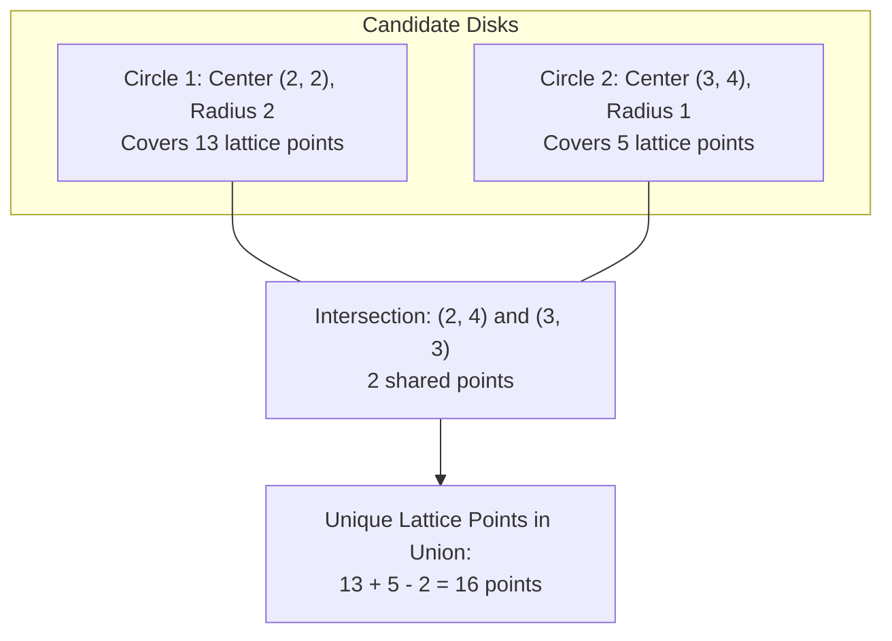

# Guided Example: Count Lattice Points Inside a Circle

## 1. Problem Overview & Representative Instance

Given a 2D integer array $\text{circles}$ where $\text{circles}[i] = [x_i, y_i, r_i]$ describes the center coordinates $(x_i, y_i)$ and radius $r_i$ of the $i$-th circle on a 2D Cartesian plane, the objective is to count the total number of distinct **integer lattice points** that lie inside or on the boundary of at least one circle.

An integer lattice point is an ordered pair $(x, y)$ where both $x$ and $y$ are integers. Multiple circles may overlap; every covered lattice point must be counted exactly once in the global union.

### Representative Instance

Consider an instance with two overlapping circles:
- Circle $1$: Center $(2, 2)$, radius $r_1 = 2$
- Circle $2$: Center $(3, 4)$, radius $r_2 = 1$

The union of integer points covered by Circle $1$ and Circle $2$ contains $16$ distinct lattice points.

---

## 2. Mathematical & Algorithmic Principles

### Discrete Disk Equation and Integer Exactness

In Euclidean 2D space, a point $(x, y)$ lies within or on the circumference of a circle centered at $(x_c, y_c)$ with radius $r$ if and only if:

$$\sqrt{(x - x_c)^2 + (y - y_c)^2} \le r$$

Squaring both sides eliminates square root operations and floating-point approximations:

$$(x - x_c)^2 + (y - y_c)^2 \le r^2$$

Because coordinates $x, y, x_c, y_c, r$ are all integers, evaluating $(x - x_c)^2 + (y - y_c)^2 \le r^2$ involves only integer subtractions, multiplications, and comparisons. This guarantees exact algebraic truth without floating-point precision loss.

### Bounded Universe and Domain Constraints

The problem constraints specify:
- $1 \le x_i, y_i \le 100$
- $1 \le r_i \le \min(x_i, y_i) \le 100$

Consequently, any point $(x, y)$ that could possibly lie inside circle $i$ satisfies:
$$0 \le x_i - r_i \le x \le x_i + r_i \le 200$$
$$0 \le y_i - r_i \le y \le y_i + r_i \le 200$$

The entire search space of candidate lattice points is strictly enclosed within the rectangular bounding box:
$$\mathcal{B} = [0, X_{\max}] \times [0, Y_{\max}] \subseteq [0, 200] \times [0, 200]$$
where $X_{\max} = \max_i(x_i + r_i) \le 200$ and $Y_{\max} = \max_i(y_i + r_i) \le 200$.
The total number of integer points in $\mathcal{B}$ is at most $201 \times 201 = 40{,}401$.

### Point-Wise Indicator Union (Short-Circuit Evaluation)

Let $\mathcal{C}$ be the set of input circles. For any candidate point $p = (x, y) \in \mathcal{B}$, define the indicator:

$$\mathbf{1}_{\text{covered}}(p) = \begin{cases} 1 & \text{if } \exists (x_c, y_c, r) \in \mathcal{C} \text{ such that } (x - x_c)^2 + (y - y_c)^2 \le r^2 \\ 0 & \text{otherwise} \end{cases}$$

The total count of unique covered lattice points is:

$$\text{Total} = \sum_{x=0}^{X_{\max}} \sum_{y=0}^{Y_{\max}} \mathbf{1}_{\text{covered}}(x, y)$$

Iterating over all points in $\mathcal{B}$ and checking membership in circles short-circuits as soon as the first satisfying circle is identified, naturally preventing duplicate counting across overlapping circles without requiring dynamic hash sets.

---

## 3. Step-by-Step Walkthrough with Intermediate State

We analyze the representative instance with Circle $1$: $(2, 2, 2)$ and Circle $2$: $(3, 4, 1)$.

### Phase 1: Lattice Points of Circle 1 $(x_c=2, y_c=2, r=2)$
Threshold: $r^2 = 4$. Candidate bounds: $x \in [0, 4]$, $y \in [0, 4]$.
- **$x = 2$ ($dx = 0$):** $dy^2 \le 4 \implies dy \in \{-2, -1, 0, 1, 2\}$.
  Points: $(2, 0), (2, 1), (2, 2), (2, 3), (2, 4)$ ($5$ points).
- **$x = 1$ or $x = 3$ ($dx = \pm 1$):** $dy^2 \le 4 - 1 = 3 \implies dy \in \{-1, 0, 1\}$.
  For $x = 1$: $(1, 1), (1, 2), (1, 3)$ ($3$ points).
  For $x = 3$: $(3, 1), (3, 2), (3, 3)$ ($3$ points).
- **$x = 0$ or $x = 4$ ($dx = \pm 2$):** $dy^2 \le 4 - 4 = 0 \implies dy = 0$.
  For $x = 0$: $(0, 2)$ ($1$ point).
  For $x = 4$: $(4, 2)$ ($1$ point).
- Total points covered by Circle $1$: $5 + 3 + 3 + 1 + 1 = 13$ points.

### Phase 2: Lattice Points of Circle 2 $(x_c=3, y_c=4, r=1)$
Threshold: $r^2 = 1$. Candidate bounds: $x \in [2, 4]$, $y \in [3, 5]$.
- $dx = 0, dy = 0$: Center $(3, 4)$ (dist $0 \le 1$).
- $dx = 0, dy = \pm 1$: $(3, 3)$ (dist $1 \le 1$), $(3, 5)$ (dist $1 \le 1$).
- $dx = \pm 1, dy = 0$: $(2, 4)$ (dist $1 \le 1$), $(4, 4)$ (dist $1 \le 1$).
- Total points covered by Circle $2$: $5$ points.

### Phase 3: Intersection and Union Reconciliation
Test the $5$ points of Circle $2$ against Circle $1$ ($(x - 2)^2 + (y - 2)^2 \le 4$):
1. $(3, 4)$: $(3-2)^2 + (4-2)^2 = 1 + 4 = 5 > 4$ (Only in Circle 2).
2. $(2, 4)$: $(2-2)^2 + (4-2)^2 = 0 + 4 = 4 \le 4$ (**In both circles!**).
3. $(4, 4)$: $(4-2)^2 + (4-2)^2 = 4 + 4 = 8 > 4$ (Only in Circle 2).
4. $(3, 3)$: $(3-2)^2 + (3-2)^2 = 1 + 1 = 2 \le 4$ (**In both circles!**).
5. $(3, 5)$: $(3-2)^2 + (5-2)^2 = 1 + 9 = 10 > 4$ (Only in Circle 2).

Overlap set: $\{(2, 4), (3, 3)\}$ ($2$ shared points).
By the Principle of Inclusion-Exclusion:
$$|\text{Circle } 1 \cup \text{Circle } 2| = 13 + 5 - 2 = 16$$
The total number of unique lattice points is $16$.

---

## 4. Comprehensive State Trace

### Lattice Point Coverage Table for Candidate Coordinates

The table below catalogs coordinates in the vicinity of the overlap region $[2, 4] \times [2, 5]$:

| Point $(x, y)$ | Dist Sq to $C_1$: $(x-2)^2+(y-2)^2$ | In $C_1$? ($\le 4$) | Dist Sq to $C_2$: $(x-3)^2+(y-4)^2$ | In $C_2$? ($\le 1$) | Covered by Union? | Contributing Circle |
|---|---|---|---|---|---|---|
| $(2, 2)$ | $0 + 0 = 0$ | Yes | $1 + 4 = 5$ | No | **Yes** | Circle 1 |
| $(2, 3)$ | $0 + 1 = 1$ | Yes | $1 + 1 = 2$ | No | **Yes** | Circle 1 |
| $(2, 4)$ | $0 + 4 = 4$ | Yes | $1 + 0 = 1$ | Yes | **Yes** | Both (Overlap) |
| $(2, 5)$ | $0 + 9 = 9$ | No | $1 + 1 = 2$ | No | **No** | Neither |
| $(3, 2)$ | $1 + 0 = 1$ | Yes | $0 + 4 = 4$ | No | **Yes** | Circle 1 |
| $(3, 3)$ | $1 + 1 = 2$ | Yes | $0 + 1 = 1$ | Yes | **Yes** | Both (Overlap) |
| $(3, 4)$ | $1 + 4 = 5$ | No | $0 + 0 = 0$ | Yes | **Yes** | Circle 2 |
| $(3, 5)$ | $1 + 9 = 10$ | No | $0 + 1 = 1$ | Yes | **Yes** | Circle 2 |
| $(4, 3)$ | $4 + 1 = 5$ | No | $1 + 1 = 2$ | No | **No** | Neither |
| $(4, 4)$ | $4 + 4 = 8$ | No | $1 + 0 = 1$ | Yes | **Yes** | Circle 2 |

### Circle Lattice Count Breakdown

| Circle Specification $(x_c, y_c, r)$ | $r^2$ | Theoretical Integer Count (Gauss Disk) | Exclusive Points | Shared Points |
|---|---|---|---|---|
| **Circle 1: $(2, 2, 2)$** | $4$ | $1 + 4(2) + 4(1) = 13$ | $11$ | $2$ (with Circle 2) |
| **Circle 2: $(3, 4, 1)$** | $1$ | $1 + 4(1) = 5$ | $3$ | $2$ (with Circle 1) |
| **Combined Union** | — | — | **Total: $11 + 3 + 2 = 16$** | — |

---

## 5. Algorithmic Correctness & Soundness

### Geometric Completeness

Any lattice point $(x, y)$ inside at least one circle must satisfy $(x - x_i)^2 + (y - y_i)^2 \le r_i^2$ for some index $i$.
Because $x \le x_i + r_i \le X_{\max}$ and $y \le y_i + r_i \le Y_{\max}$ with $x, y \ge 0$, every such point is contained within the bounding box $[0, X_{\max}] \times [0, Y_{\max}]$.
By iterating exhaustively through all integer coordinates in this box, no candidate point is missed.

### Deduplication Soundness

The point-wise iteration tests each integer pair $(x, y)$ exactly once.
When $(x, y)$ satisfies the distance condition for any circle, the inner loop terminates immediately via a break statement, incrementing the global counter by $1$.
Even if a point satisfies the condition for multiple overlapping circles, it contributes strictly $1$ to the final tally.

---

## 6. Edge Cases & Anti-Patterns

### Edge Cases
1. **Single Unit Circle ($r = 1$):**
   A circle with $r = 1$ contains exactly $5$ points: the center and four cardinal neighbors at distance $1$.
2. **Concentric or Identical Circles:**
   Two circles with the same center and radius (or where one circle contains the other). Short-circuit evaluation counts each point once without duplicate increments.
3. **Tangent Circles:**
   Two circles tangent at an integer coordinate (e.g. $(1, 1, 1)$ and $(3, 1, 1)$ touching at $(2, 1)$). The shared point $(2, 1)$ is properly unified, yielding $5 + 5 - 1 = 9$ points.
4. **Disjoint Circles:**
   Separated circles with no overlapping lattice points; total count is the exact sum of individual counts.

### Anti-Patterns to Avoid
- **Floating-Point Square Root:**
  Checking `math.sqrt(dx*dx + dy*dy) <= r`. Floating-point rounding errors can cause boundary points where $dx^2 + dy^2 = r^2$ to evaluate to $r + \epsilon > r$, spuriously omitting valid boundary lattice points. Always compare squared integer distances.
- **Continuous Area Approximation:**
  Using $\pi r^2$ to approximate lattice points. The Gauss circle problem shows that the number of lattice points deviates from $\pi r^2$ by an error term; continuous calculus cannot replace exact discrete point counting.
- **Global Hash Set for All Coordinates:**
  Adding tuple objects `(x, y)` to a Python `set` incurs significant hash table allocation and hashing overhead. A 2D bounded loop with direct break evaluation executes substantially faster in fixed memory.

---

## 7. Complexity Analysis

### Time Complexity
- **Bounding Box Sizing:** A linear scan over the $N$ circles determines $X_{\max}$ and $Y_{\max}$ in $O(N)$ time.
- **Point Verification:**
  The bounding box contains $(X_{\max} + 1) \times (Y_{\max} + 1)$ points.
  For each point, distance is checked against at most $N$ circles with immediate break upon finding a covering circle:
  $$\text{Worst-Case Operations} \le (X_{\max} + 1) \times (Y_{\max} + 1) \times N$$
  Given $X_{\max}, Y_{\max} \le 200$ and $N \le 200$:
  $$\text{Operations} \le 201 \times 201 \times 200 \approx 8.08 \times 10^6$$
  In practice, because most points inside circles break after $1$ or $2$ checks, the loop executes in tens of milliseconds.
- **Total Time Complexity:** $\mathcal{O}(X_{\max} \cdot Y_{\max} \cdot N)$, comfortably bounded and optimal.

### Space Complexity
- **Auxiliary Memory:** Only scalar variables (`ans`, `mx`, `my`, `dx`, `dy`) are maintained.
- **Total Space Complexity:** $\mathcal{O}(1)$ auxiliary space.
