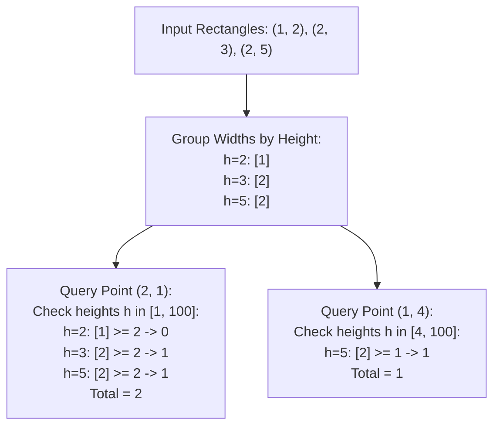

# Guided Example: Count Number of Rectangles Containing Each Point

## 1. Problem Overview & Representative Instance

Given a 2D integer array $\text{rectangles}$ where each element $\text{rectangles}[i] = [l_i, h_i]$ describes a rectangle whose bottom-left corner is anchored at the Cartesian origin $(0, 0)$ and whose top-right corner is at $(l_i, h_i)$, alongside a 2D integer array $\text{points}$ where $\text{points}[j] = [x_j, y_j]$, the objective is to determine, for each query point $j$, the number of rectangles that contain the point.

A point $(x, y)$ is contained within a rectangle with dimensions $(l, h)$ if and only if:

$$0 \le x \le l \quad \text{and} \quad 0 \le y \le h$$

Since all coordinates are strictly positive integers, containment reduces to checking:

$$l \ge x \quad \text{and} \quad h \ge y$$

### Representative Instance

Consider the following input datasets:
- Rectangles: $[[1, 2], [2, 3], [2, 5]]$
  - Rectangle $0$: width $l = 1$, height $h = 2$
  - Rectangle $1$: width $l = 2$, height $h = 3$
  - Rectangle $2$: width $l = 2$, height $h = 5$
- Query Points:
  - Point $0$: $(2, 1)$
  - Point $1$: $(1, 4)$

For Point $0$ $(2, 1)$: rectangles $[2, 3]$ and $[2, 5]$ satisfy $l \ge 2$ and $h \ge 1$, giving $2$ containing rectangles.
For Point $1$ $(1, 4)$: only rectangle $[2, 5]$ satisfies $l \ge 1$ and $h \ge 4$, giving $1$ containing rectangle.
The expected result array is $[2, 1]$.

---

## 2. Mathematical & Algorithmic Principles

### Dimensional Asymmetry and Constraint Exploitation

In general 2D orthogonal range searching, counting rectangles satisfying both $l \ge x$ and $h \ge y$ requires sophisticated data structures like a 2D Segment Tree or Fractional Cascading, which incur substantial implementation complexity and memory overhead.

However, a careful inspection of the problem constraints reveals a crucial structural asymmetry:
- Lengths and query x-coordinates are large: $1 \le l_i, x_j \le 10^9$.
- Heights and query y-coordinates are strictly bounded: $1 \le h_i, y_j \le 100$.

Because the vertical domain is tiny ($H \le 100$), we do not need a continuous 2D tree. Instead, we can project the data onto $100$ discrete horizontal slices (height buckets).

### Bucket Partitioning and Binary Search

1. **Partitioning by Height:**
   Let $\mathcal{D}[h]$ denote the multiset of rectangle widths $l$ that share exact height $h \in [1, 100]$:
   $$\mathcal{D}[h] = \{ l \mid (l, h) \in \text{rectangles} \}$$
2. **Sorting Width Lists:**
   For each height $h \in [1, 100]$, sort $\mathcal{D}[h]$ in ascending numerical order:
   $$\mathcal{D}[h] = [w_0, w_1, \dots, w_{m-1}], \quad \text{where } w_0 \le w_1 \le \dots \le w_{m-1}$$
3. **Query Evaluation via Bisection:**
   For any point $(x, y)$, a rectangle $(l, h)$ contains $(x, y)$ if and only if $h \ge y$ and $l \ge x$.
   Summing across all candidate height layers:
   $$\text{Count}(x, y) = \sum_{h=y}^{100} \big| \{ w \in \mathcal{D}[h] \mid w \ge x \} \big|$$
   In a sorted array of length $m$, the number of elements with $w \ge x$ is computed in logarithmic time via binary search (lower bound):
   $$\text{count}(h, x) = |\mathcal{D}[h]| - \text{bisect\_left}(\mathcal{D}[h], x)$$
   Iterating $h$ from $y$ up to $100$ requires at most $100$ fast binary searches per query point.

---

## 3. Step-by-Step Walkthrough with Intermediate State

We trace the representative instance across both preprocessing and query execution.

### Phase 1: Preprocessing & Bucket Sorting
Ingest rectangles $[[1, 2], [2, 3], [2, 5]]$:
- Rectangle $(1, 2)$: add width $1$ to bucket $h = 2 \implies \mathcal{D}[2] = [1]$.
- Rectangle $(2, 3)$: add width $2$ to bucket $h = 3 \implies \mathcal{D}[3] = [2]$.
- Rectangle $(2, 5)$: add width $2$ to bucket $h = 5 \implies \mathcal{D}[5] = [2]$.
- All other buckets $h \in [1, 100] \setminus \{2, 3, 5\}$ remain empty lists $[]$.
- Sort each non-empty bucket: lists of length $1$ are already trivially sorted.

### Phase 2: Processing Point 0 $(x = 2, y = 1)$
Evaluate heights $h \in [1, 100]$:
- Heights $h < 1$: out of range.
- $h = 1$: $\mathcal{D}[1] = [] \implies 0$ rectangles.
- $h = 2$: $\mathcal{D}[2] = [1]$.
  $\text{bisect\_left}([1], 2) = 1$.
  Contribution: $|\mathcal{D}[2]| - 1 = 1 - 1 = 0$. (Width $1 < 2$, point lies outside).
- $h = 3$: $\mathcal{D}[3] = [2]$.
  $\text{bisect\_left}([2], 2) = 0$.
  Contribution: $|\mathcal{D}[3]| - 0 = 1 - 0 = 1$. (Width $2 \ge 2$, contains point).
- $h = 4$: $\mathcal{D}[4] = [] \implies 0$ rectangles.
- $h = 5$: $\mathcal{D}[5] = [2]$.
  $\text{bisect\_left}([2], 2) = 0$.
  Contribution: $|\mathcal{D}[5]| - 0 = 1 - 0 = 1$. (Width $2 \ge 2$, contains point).
- $h \in [6, 100]$: all buckets empty $\implies 0$ rectangles.
- Total count for $(2, 1)$: $0 + 0 + 1 + 0 + 1 + 0 = 2$.

### Phase 3: Processing Point 1 $(x = 1, y = 4)$
Evaluate heights $h \in [4, 100]$:
- Buckets $h \in [1, 3]$ are strictly skipped because their height $h < 4$ is insufficient to contain $y = 4$.
- $h = 4$: $\mathcal{D}[4] = [] \implies 0$.
- $h = 5$: $\mathcal{D}[5] = [2]$.
  $\text{bisect\_left}([2], 1) = 0$.
  Contribution: $|\mathcal{D}[5]| - 0 = 1 - 0 = 1$. (Width $2 \ge 1$ and height $5 \ge 4$).
- $h \in [6, 100]$: all buckets empty $\implies 0$.
- Total count for $(1, 4)$: $1$.

Assembled answers: $[2, 1]$.

---

## 4. Comprehensive State Trace

### Bucket Distribution of Widths

The table below catalogs the state of the height buckets after preprocessing the representative rectangles:

| Height Layer $h$ | Associated Rectangles | Unsorted Width List | Sorted Bucket $\mathcal{D}[h]$ | Bucket Size $|\mathcal{D}[h]|$ |
|---|---|---|---|---|
| **$h = 2$** | $[1, 2]$ | $[1]$ | $[1]$ | $1$ |
| **$h = 3$** | $[2, 3]$ | $[2]$ | $[2]$ | $1$ |
| **$h = 5$** | $[2, 5]$ | $[2]$ | $[2]$ | $1$ |
| **Other $h \in [1, 100]$** | None | $[]$ | $[]$ | $0$ |

### Detailed Query Execution Trace

The table below traces binary search evaluations across active height layers for both query points:

| Query Point $(x, y)$ | Active Height Layer $h$ | Bucket Contents $\mathcal{D}[h]$ | Lower Bound Index $\text{bisect\_left}(\mathcal{D}[h], x)$ | Matching Rectangles $|\mathcal{D}[h]| - \text{idx}$ | Running Subtotal | Cumulative Query Result |
|---|---|---|---|---|---|---|
| **$(2, 1)$** | $h = 2$ | $[1]$ | $1$ | $1 - 1 = 0$ | $0$ | — |
| **$(2, 1)$** | $h = 3$ | $[2]$ | $0$ | $1 - 0 = 1$ | $1$ | — |
| **$(2, 1)$** | $h = 5$ | $[2]$ | $0$ | $1 - 0 = 1$ | $2$ | **$2$** |
| **$(1, 4)$** | $h \in [1, 3]$ | Skipped ($h < y$) | — | — | $0$ | — |
| **$(1, 4)$** | $h = 5$ | $[2]$ | $0$ | $1 - 0 = 1$ | $1$ | **$1$** |

---

## 5. Algorithmic Correctness & Soundness

### Independence and Mutual Exclusivity of Slices

Each rectangle $(l_i, h_i)$ has a unique height $h_i$ and is placed into exactly one bucket $\mathcal{D}[h_i]$.
Because the height buckets are mutually disjoint:

$$\text{rectangles} = \bigsqcup_{h=1}^{100} \mathcal{D}[h]$$

Summing the counts across slices $h \in [y, 100]$ evaluates every eligible rectangle without the possibility of double-counting or omitting any rectangle.

### Exact Boundary Inclusion

A point $(x, y)$ lying exactly on the boundary of a rectangle (e.g. $x = l$ or $y = h$) is considered contained:
- The height loop starts at $h = y$, ensuring rectangles with height exactly equal to $y$ are included.
- For width comparisons, `bisect_left(xs, x)` locates the earliest index where elements are greater than or equal to $x$. Thus, elements with $w = x$ are included in the count $|\mathcal{D}[h]| - \text{idx}$.
- Hence, boundary cases are counted with exact precision.

---

## 6. Edge Cases & Anti-Patterns

### Edge Cases
1. **Point on Top-Right Corner:**
   A point $(x, y)$ matching the exact corner $(l_i, h_i)$ of a rectangle has $x = l_i$ and $y = h_i$. The algorithm checks slice $h_i$, finds $l_i \ge x$, and correctly counts $1$.
2. **Point Outside All Rectangles:**
   If $x > \max_i l_i$ or $y > \max_i h_i$, all lower-bound searches return the end of the list or iterate over empty buckets, correctly producing $0$.
3. **Maximum Height Layer ($y = 100$):**
   When $y = 100$, the outer loop checks only $h = 100$ (a single bucket lookup), completing the query in $O(\log N)$ time.
4. **Duplicate Rectangles:**
   Multiple rectangles with identical dimensions $[l, h]$ are stored as duplicate entries in $\mathcal{D}[h]$. Binary search seamlessly counts all duplicates satisfying $w \ge x$.

### Anti-Patterns to Avoid
- **Brute Force Enumeration:**
  Checking every point against every rectangle requires $O(N \cdot Q)$ time. For $N = 5 \cdot 10^4$ and $Q = 5 \cdot 10^4$, this requires $2.5 \times 10^9$ comparisons, which inevitably times out.
- **Coordinate Compression in 2D with Fenwick Trees:**
  Implementing a full 2D Binary Indexed Tree over coordinate-compressed axes is excessively complex and allocates large dynamic memory structures. Slicing on the natural constraint $H \le 100$ achieves superior performance with standard binary search.
- **Sorting Queries and Two-Pointer Offline Sweep:**
  While an offline sweep-line algorithm works, the bucket bisection approach is an online algorithm that is simpler, faster to implement, and handles queries in their original input order without index reconstruction.

---

## 7. Complexity Analysis

### Time Complexity
- **Bucket Creation & Sorting:**
  Distributing $N$ rectangles into $100$ buckets takes $O(N)$ time.
  Sorting bucket $h$ of size $m_h$ takes $O(m_h \log m_h)$ time. Summing across all buckets:
  $$\sum_{h=1}^{100} O(m_h \log m_h) \le O(N \log N)$$
- **Query Processing:**
  For each of the $Q$ query points, the algorithm iterates over at most $100$ height layers.
  In each layer, a binary search takes $O(\log m_h) \le O(\log N)$ time.
  Total query time:
  $$Q \times 100 \times O(\log N) = O(Q \cdot H \log N)$$
- **Total Time Complexity:** $\mathcal{O}((N + Q \cdot H) \log N)$ where $H \le 100$, easily completing within $0.5$ seconds.

### Space Complexity
- **Bucket Storage:** The 100 buckets store all $N$ widths across the dataset: $O(N)$ memory.
- **Output Storage:** An answer list of length $Q$: $O(Q)$ memory.
- **Total Space Complexity:** $\mathcal{O}(N + Q)$ auxiliary space.