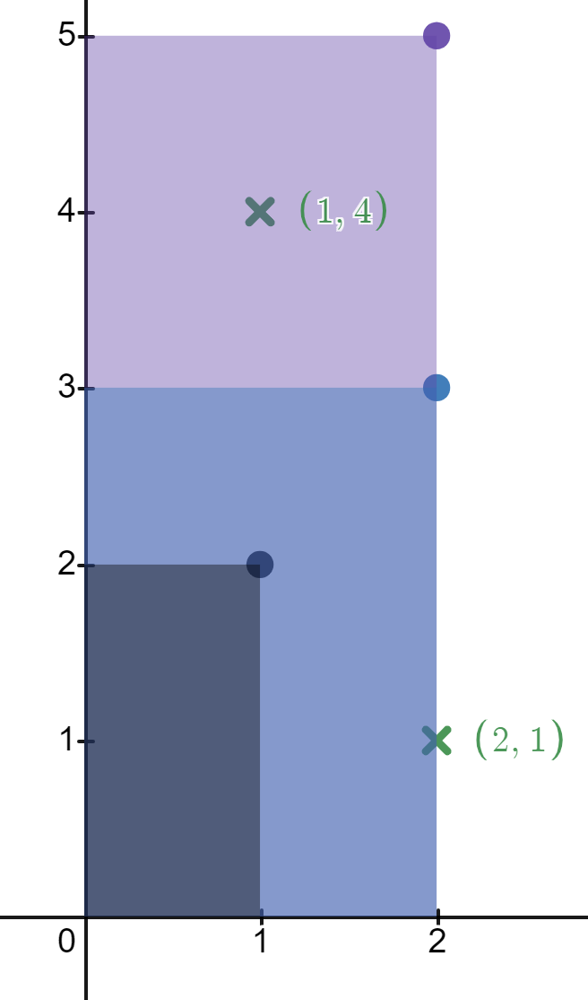
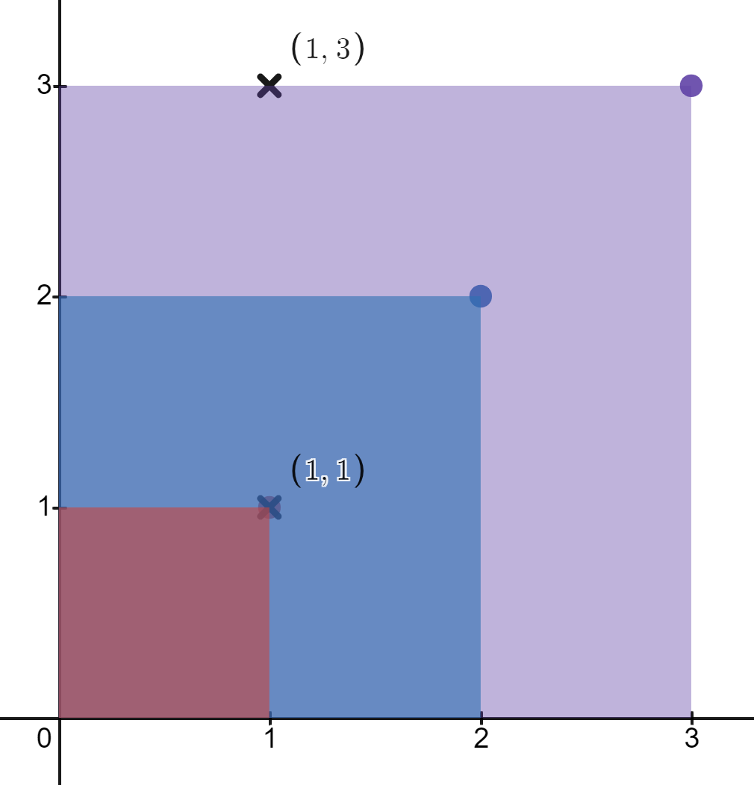

### 1. Description

You are given a 2D integer array `rectangles` where $\text{rectangles}[i] = [l_{i}, h_{i}]$ indicates that $$i^{\text{th}}$$ rectangle has a length of $l_{i}$ and a height of $h_{i}$. You are also given a 2D integer array `points` where $\text{points}[j] = [x_{j}, y_{j}]$ is a point with coordinates $(x_{j}, y_{j})$.

The $$i^{\text{th}}$$ rectangle has its **bottom-left corner** point at the coordinates `(0, 0)` and its **top-right corner** point at $(l_{i}, h_{i})$.

Return* an integer array *`count`* of length *`points.length`* where *$\text{count}[j]$* is the number of rectangles that **contain** the *$$j^{\text{th}}$$* point.*

The $$i^{\text{th}}$$ rectangle **contains** the $$j^{\text{th}}$$ point if $0 \le x_{j} \le l_{i}$ and $0 \le y_{j} \le h_{i}$. Note that points that lie on the **edges** of a rectangle are also considered to be contained by that rectangle.

### 2. Function Contract

- `n`: Input parameter.
- Returns expected result.

### 3. Examples

#### Example 1

- **Input:** $rectangles = [[1,2],[2,3],[2,5]], points = [[2,1],[1,4]]$
- **Output:** `[2,1]`
- **Explanation:**
The first rectangle contains no points.
The second rectangle contains only the point (2, 1).
The third rectangle contains the points (2, 1) and (1, 4).
The number of rectangles that contain the point (2, 1) is 2.
The number of rectangles that contain the point (1, 4) is 1.
Therefore, we return [2, 1].
#### Example 2

- **Input:** $rectangles = [[1,1],[2,2],[3,3]], points = [[1,3],[1,1]]$
- **Output:** `[1,3]`
- **Explanation:**
**The first rectangle contains only the point (1, 1).
The second rectangle contains only the point (1, 1).
The third rectangle contains the points (1, 3) and (1, 1).
The number of rectangles that contain the point (1, 3) is 1.
The number of rectangles that contain the point (1, 1) is 3.
Therefore, we return [1, 3].

### 4. Constraints

- $1 \le \text{rectangles.length}, \text{points.length} \le 5 * 10^{4}$

- $\text{rectangles}[i].length = \text{points}[j].length = 2$

- $1 \le l_{i}, x_{j} \le 10^{9}$

- $1 \le h_{i}, y_{j} \le 100$

- All the `rectangles` are **unique**.

- All the `points` are **unique**.