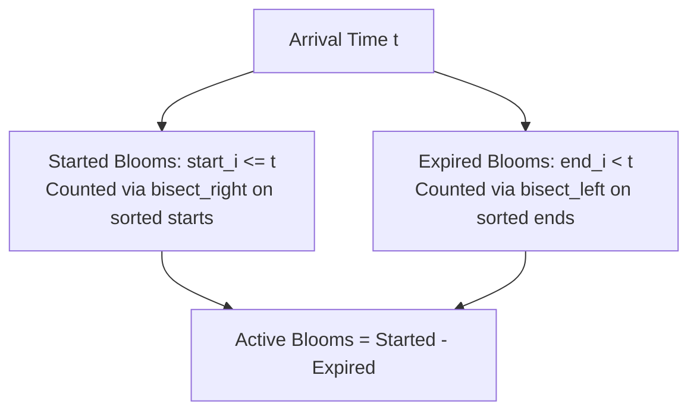

# Guided Example: Number of Flowers in Full Bloom

## 1. Problem Overview & Representative Instance

Given a 2D integer array $\text{flowers}$ where each element $\text{flowers}[i] = [\text{start}_i, \text{end}_i]$ indicates that the $i$-th flower is in full bloom during the closed time interval $[\text{start}_i, \text{end}_i]$ inclusive, along with a 1D integer array $\text{people}$ where $\text{people}[j]$ represents the exact arrival time of person $j$, the task is to determine the number of flowers in full bloom at the arrival time of each person.

A flower is visible in full bloom to person $j$ arriving at time $t = \text{people}[j]$ if and only if the arrival timestamp falls within its bloom span:

$$\text{start}_i \le t \le \text{end}_i$$

### Representative Instance

Consider the following flower blooming schedule and observer arrivals:
- $\text{flowers} = [[1, 6], [3, 7], [9, 12], [4, 13]]$
- $\text{people} = [2, 3, 7, 11]$

For each person arriving at time $t$, we seek to calculate the number of active intervals covering $t$ without simulating timeline ticks.

---

## 2. Mathematical & Algorithmic Principles

### Decoupling Interval Stabbing via Complementation

For any individual flower $i$, let $I_i = [\text{start}_i, \text{end}_i]$ be its blooming interval.
The condition $t \in I_i$ is equivalent to the conjunction of two inequalities:

$$t \in [\text{start}_i, \text{end}_i] \iff (\text{start}_i \le t) \land (t \le \text{end}_i)$$

By the law of complementation, an interval that has started ($\text{start}_i \le t$) is active at $t$ if and only if it has not already expired before $t$:

$$\mathbf{1}_{\text{start}_i \le t \le \text{end}_i} = \mathbf{1}_{\text{start}_i \le t} - \mathbf{1}_{\text{end}_i < t}$$

Summing this identity over all $N$ flowers in the garden gives:

$$\sum_{i=1}^N \mathbf{1}_{t \in I_i} = \sum_{i=1}^N \mathbf{1}_{\text{start}_i \le t} - \sum_{i=1}^N \mathbf{1}_{\text{end}_i < t}$$

This formulation decouples the problem into two independent 1D prefix count queries on scalar arrays:
1. The total number of flowers whose blooming has commenced on or before time $t$.
2. The total number of flowers whose blooming has strictly concluded prior to time $t$.

### Monotonic Sorting and Dual Bisection

Let $\mathcal{S}$ be the array of start times sorted in non-decreasing order:
$$\mathcal{S} = \text{sort}(\{ \text{start}_i \mid i \in [1, N] \})$$
Let $\mathcal{E}$ be the array of end times sorted in non-decreasing order:
$$\mathcal{E} = \text{sort}(\{ \text{end}_i \mid i \in [1, N] \})$$

For any arrival query $t$:
- The count of start times $\le t$ is the number of elements in $\mathcal{S}$ in range $(-\infty, t]$, which is given by the upper bound binary search index:
  $$\text{started}(t) = \text{bisect\_right}(\mathcal{S}, t)$$
- The count of end times $< t$ is the number of elements in $\mathcal{E}$ in range $(-\infty, t - 1]$, which corresponds to the first position where an element is $\ge t$:
  $$\text{expired}(t) = \text{bisect\_left}(\mathcal{E}, t)$$

Therefore, the active flower count at time $t$ evaluates in $O(\log N)$ via:

$$\text{Active}(t) = \text{bisect\_right}(\mathcal{S}, t) - \text{bisect\_left}(\mathcal{E}, t)$$

---

## 3. Step-by-Step Walkthrough with Intermediate State

We apply this dual bisection approach to our representative instance:
- Flowers: $[[1, 6], [3, 7], [9, 12], [4, 13]]$
- People arrivals: $[2, 3, 7, 11]$

### Phase 1: Preprocessing Sorted Boundary Arrays
Extract and sort start times:
$$\mathcal{S} = [1, 3, 4, 9]$$
Extract and sort end times:
$$\mathcal{E} = [6, 7, 12, 13]$$
Array length: $N = 4$.

### Phase 2: Processing Arrival Times

1. **Person 0 arriving at $t = 2$:**
   - Started count: $\text{bisect\_right}([1, 3, 4, 9], 2)$
     Elements $\le 2$: $\{1\}$ ($1$ element). Index $= 1$.
   - Expired count: $\text{bisect\_left}([6, 7, 12, 13], 2)$
     Elements $< 2$: None ($0$ elements). Index $= 0$.
   - Active count: $1 - 0 = 1$.

2. **Person 1 arriving at $t = 3$:**
   - Started count: $\text{bisect\_right}([1, 3, 4, 9], 3)$
     Elements $\le 3$: $\{1, 3\}$ ($2$ elements). Index $= 2$.
   - Expired count: $\text{bisect\_left}([6, 7, 12, 13], 3)$
     Elements $< 3$: None ($0$ elements). Index $= 0$.
   - Active count: $2 - 0 = 2$.

3. **Person 2 arriving at $t = 7$:**
   - Started count: $\text{bisect\_right}([1, 3, 4, 9], 7)$
     Elements $\le 7$: $\{1, 3, 4\}$ ($3$ elements). Index $= 3$.
   - Expired count: $\text{bisect\_left}([6, 7, 12, 13], 7)$
     Elements $< 7$: $\{6\}$ ($1$ element). Index $= 1$.
     Notice that a flower ending at $7$ has not expired at $t = 7$, so $7$ is not strictly less than $7$.
   - Active count: $3 - 1 = 2$.

4. **Person 3 arriving at $t = 11$:**
   - Started count: $\text{bisect\_right}([1, 3, 4, 9], 11)$
     Elements $\le 11$: $\{1, 3, 4, 9\}$ ($4$ elements). Index $= 4$.
   - Expired count: $\text{bisect\_left}([6, 7, 12, 13], 11)$
     Elements $< 11$: $\{6, 7\}$ ($2$ elements). Index $= 2$.
   - Active count: $4 - 2 = 2$.

Compiled result: $[1, 2, 2, 2]$.

---

## 4. Comprehensive State Trace

### Per-Query Dual Bisection Breakdown

The table below catalogs binary search indices and intermediate counts for each person arrival in the representative dataset:

| Arrival Time $t$ | Sorted Starts $\mathcal{S}$ | Upper Bound Index $\text{bisect\_right}(\mathcal{S}, t)$ | Sorted Ends $\mathcal{E}$ | Lower Bound Index $\text{bisect\_left}(\mathcal{E}, t)$ | Active Flowers $\text{idx}_R - \text{idx}_L$ | Active Interval Set |
|---|---|---|---|---|---|---|
| **$t = 2$** | $[1, 3, 4, 9]$ | $1$ (value $1$) | $[6, 7, 12, 13]$ | $0$ (none $< 2$) | $1 - 0 = 1$ | $\{[1, 6]\}$ |
| **$t = 3$** | $[1, 3, 4, 9]$ | $2$ (values $1, 3$) | $[6, 7, 12, 13]$ | $0$ (none $< 3$) | $2 - 0 = 2$ | $\{[1, 6], [3, 7]\}$ |
| **$t = 7$** | $[1, 3, 4, 9]$ | $3$ (values $1, 3, 4$) | $[6, 7, 12, 13]$ | $1$ (value $6$) | $3 - 1 = 2$ | $\{[3, 7], [4, 13]\}$ |
| **$t = 11$** | $[1, 3, 4, 9]$ | $4$ (all $4$ values) | $[6, 7, 12, 13]$ | $2$ (values $6, 7$) | $4 - 2 = 2$ | $\{[9, 12], [4, 13]\}$ |

### Behavior Across Canonical Edge Cases

| Scenario | Flowers Array | Arrival Query $t$ | Started $\le t$ | Expired $< t$ | Result |
|---|---|---|---|---|---|
| **Single-Day Bloom** | $[[5, 5]]$ | $t = 5$ | $1$ | $0$ | $1$ |
| **Arrival Before Bloom** | $[[5, 5]]$ | $t = 4$ | $0$ | $0$ | $0$ |
| **Arrival After Bloom** | $[[5, 5]]$ | $t = 6$ | $1$ | $1$ | $0$ |
| **Multiple Coinciding Ends** | $[[1, 5], [2, 5], [5, 5]]$ | $t = 5$ | $3$ | $0$ | $3$ |
| **Multiple Coinciding Ends** | $[[1, 5], [2, 5], [5, 5]]$ | $t = 6$ | $3$ | $3$ | $0$ |

---

## 5. Algorithmic Correctness & Soundness

### Conservation of Cumulative Difference

To establish that $\text{bisect\_right}(\mathcal{S}, t) - \text{bisect\_left}(\mathcal{E}, t)$ exactly counts active flowers:
1. Every flower $i$ falls into exactly one of three mutually exclusive geometric categories relative to $t$:
   - **Future Flower:** $\text{start}_i > t$.
     Here, $\mathbf{1}_{\text{start}_i \le t} = 0$ and $\mathbf{1}_{\text{end}_i < t} = 0$.
     Net contribution $= 0 - 0 = 0$.
   - **Active Flower:** $\text{start}_i \le t \le \text{end}_i$.
     Here, $\mathbf{1}_{\text{start}_i \le t} = 1$ and $\mathbf{1}_{\text{end}_i < t} = 0$ (since $\text{end}_i \ge t$).
     Net contribution $= 1 - 0 = 1$.
   - **Past Flower:** $\text{end}_i < t$.
     Because intervals are valid ($\text{start}_i \le \text{end}_i$), $\text{end}_i < t$ implies $\text{start}_i < t$.
     Here, $\mathbf{1}_{\text{start}_i \le t} = 1$ and $\mathbf{1}_{\text{end}_i < t} = 1$.
     Net contribution $= 1 - 1 = 0$.
2. Summing over all flowers in the dataset, every active flower contributes exactly $+1$, and every non-active flower contributes exactly $0$.
3. Thus, the algebraic difference between started and expired counts matches the exact number of active flowers.

### Strict Endpoint Inclusivity

Because flowers are blooming inclusively at both boundaries:
- A flower with $\text{start}_i = t$ is counted because $\text{bisect\_right}$ includes all entries equal to $t$.
- A flower with $\text{end}_i = t$ is **not** counted as expired because $\text{bisect\_left}$ identifies only entries strictly less than $t$.
Thus, arrival at the boundary point $\text{end}_i$ correctly treats the flower as active.

---

## 6. Edge Cases & Anti-Patterns

### Edge Cases
1. **Identical Start and End ($[\tau, \tau]$):**
   At arrival $t = \tau$: started count has $+1$, expired count has $0$. Net is $1$.
   At arrival $t = \tau + 1$: started count has $+1$, expired count has $+1$. Net is $0$.
2. **Arrival Outside All Intervals:**
   When $t < \min \text{start}_i$, both bisection functions return $0$, resulting in $0 - 0 = 0$.
   When $t > \max \text{end}_i$, both return $N$, resulting in $N - N = 0$.
3. **Repeated Queries:**
   Query arrivals like $[3, 3, 2]$ are evaluated independently without mutating state or requiring deduplication.
4. **Large Coordinates ($10^9$):**
   Coordinates up to $10^9$ are handled seamlessly in logarithmic time without requiring coordinate compression or sparse hash representations.

### Anti-Patterns to Avoid
- **Coordinate Simulation / Difference Array over Time:**
  Allocating a difference array up to $\max(\text{end}_i) = 10^9$. Allocating $10^9$ elements exhausts memory instantly.
- **Offline Sweep-Line With Query Sorting:**
  Sorting queries, merging with event points, and sweeping with an accumulator is valid ($O((N + M) \log(N + M))$) but requires preserving original query indices to reconstruct the final answer. Independent binary search achieves the same asymptotic runtime with significantly simpler and cleaner code.
- **Comparing Pairwise Intervals:**
  Iterating every flower for every person in $O(N \cdot M)$ time requires up to $5 \cdot 10^4 \times 5 \cdot 10^4 = 2.5 \times 10^9$ operations, which times out.

---

## 7. Complexity Analysis

### Time Complexity
- **Sorting Boundaries:**
  Sorting start times $\mathcal{S}$ of length $N$: $O(N \log N)$.
  Sorting end times $\mathcal{E}$ of length $N$: $O(N \log N)$.
- **Query Evaluation:**
  For each of the $M$ people, executing two binary searches in sorted arrays of length $N$ takes $2 \times O(\log N) = O(\log N)$ time.
  Across all $M$ queries: $O(M \log N)$.
- **Total Time Complexity:** $\mathcal{O}((N + M) \log N)$, which is optimal.

### Space Complexity
- **Boundary Arrays:**
  Storing $\mathcal{S}$ and $\mathcal{E}$ requires two arrays of size $N$: $O(N)$ auxiliary memory.
- **Output Storage:**
  An array of length $M$ to store the query results: $O(M)$.
- **Total Space Complexity:** $\mathcal{O}(N + M)$ auxiliary space.
