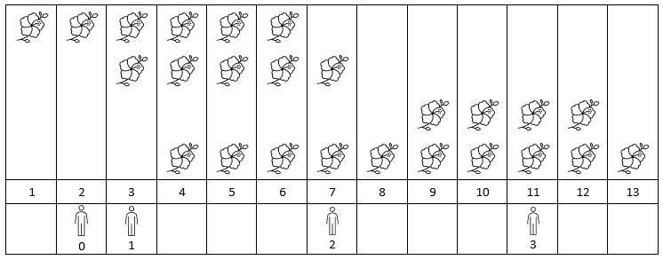
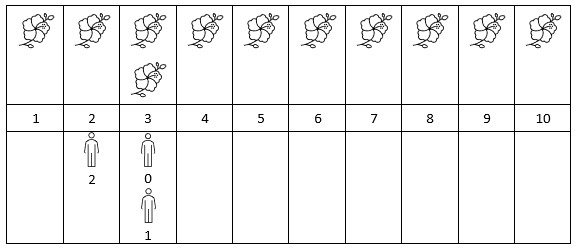

### 1. Description

You are given a **0-indexed** 2D integer array `flowers`, where $\text{flowers}[i] = [\text{start}_{i}, \text{end}_{i}]$ means the $$i^{\text{th}}$$ flower will be in **full bloom** from $\text{start}_{i}$ to $\text{end}_{i}$ (**inclusive**). You are also given a **0-indexed** integer array `people` of size `n`, where $\text{people}[i]$ is the time that the $$i^{\text{th}}$$ person will arrive to see the flowers.

Return *an integer array *`answer`* of size *`n`*, where *$\text{answer}[i]$* is the **number** of flowers that are in full bloom when the *$$i^{\text{th}}$$* person arrives.*

### 2. Function Contract

**Inputs**

- `flowers`: Input parameter (`List[List[int]]`).
- `people`: Input parameter (`List[int]`).

**Return value**

- Returns `List[int]`.

### 3. Examples

#### Example 1

- **Input:** $flowers = [[1,6],[3,7],[9,12],[4,13]], people = [2,3,7,11]$
- **Output:** `[1,2,2,2]`
- **Explanation:** The figure above shows the times when the flowers are in full bloom and when the people arrive.
For each person, we return the number of flowers in full bloom during their arrival.

#### Example 2

- **Input:** $flowers = [[1,10],[3,3]], people = [3,3,2]$
- **Output:** `[2,2,1]`
- **Explanation:** The figure above shows the times when the flowers are in full bloom and when the people arrive.
For each person, we return the number of flowers in full bloom during their arrival.

### 4. Constraints

- $1 \le \text{flowers.length} \le 5 * 10^{4}$

- $\text{flowers}[i].length = 2$

- $1 \le \text{start}_{i} \le \text{end}_{i} \le 10^{9}$

- $1 \le \text{people.length} \le 5 * 10^{4}$

- $1 \le \text{people}[i] \le 10^{9}$
