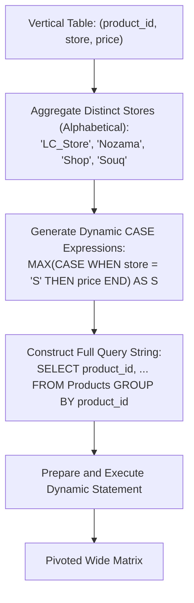

# Guided Example: Dynamic Pivoting of a Table

## 1. Problem Overview & Representative Instance

In relational database systems, a vertical long-format table stores entity attributes as rows, whereas a horizontal wide-format report projects distinct attribute values as separate columns. We are given a table named $\text{Products}$ with schema:

$$\text{Products}(\text{product\_id: INT}, \; \text{store: VARCHAR}, \; \text{price: INT})$$

where the composite pair $(\text{product\_id}, \text{store})$ forms the primary key.

The objective is to pivot the table dynamically such that:
1. Each distinct store name existing in the table becomes an individual output column.
2. The output columns must be ordered lexicographically by store name following the initial $\text{product\_id}$ column.
3. The cell at row $\text{product\_id}$ and column $\text{store}$ contains the corresponding $\text{price}$ if available, or $\text{NULL}$ if that product is not sold in that store.

Because the set of stores is not fixed in advance and differs across database instances, static SQL with hardcoded column lists cannot solve the problem. The solution requires generating and executing **Dynamic SQL** at runtime.

### Representative Instance

Consider the $\text{Products}$ table populated with $6$ rows across $3$ products and $4$ distinct stores:

| Product ID | Store | Price |
|---|---|---|
| $1$ | $\text{Shop}$ | $110$ |
| $1$ | $\text{LC\_Store}$ | $100$ |
| $2$ | $\text{Nozama}$ | $200$ |
| $2$ | $\text{Souq}$ | $190$ |
| $3$ | $\text{Shop}$ | $1000$ |
| $3$ | $\text{Souq}$ | $1900$ |

Distinct store names present in the dataset (sorted alphabetically):
$$\mathcal{U} = [\text{LC\_Store}, \; \text{Nozama}, \; \text{Shop}, \; \text{Souq}]$$

Expected horizontal pivoted projection:

| $\text{product\_id}$ | $\text{LC\_Store}$ | $\text{Nozama}$ | $\text{Shop}$ | $\text{Souq}$ |
|---|---|---|---|---|
| $1$ | $100$ | $\text{NULL}$ | $110$ | $\text{NULL}$ |
| $2$ | $\text{NULL}$ | $200$ | $\text{NULL}$ | $190$ |
| $3$ | $\text{NULL}$ | $\text{NULL}$ | $1000$ | $1900$ |



---

## 2. Mathematical & Algorithmic Principles

### Relational Pivoting via Conditional Aggregation

Pivoting transforms a relation $R \subseteq \mathcal{P} \times \mathcal{S} \times \mathcal{V}$ into a wide relation $R' \subseteq \mathcal{P} \times \mathcal{V}^{|\mathcal{S}|}$, where $\mathcal{P}$ is the primary entity domain ($\text{product\_id}$), $\mathcal{S}$ is the categorical attribute domain ($\text{store}$), and $\mathcal{V}$ is the measure domain ($\text{price}$).

In relational algebra, conditional aggregation achieves this transformation:
For each store $s \in \mathcal{S}$, define a projection mapping for each row:

$$\phi_s(r) = \begin{cases} r.\text{price} & \text{if } r.\text{store} = s \\ \text{NULL} & \text{otherwise} \end{cases}$$

When rows are grouped by $\text{product\_id}$, applying the $\text{MAX}$ aggregate over partition $G_p = \{ r \in R \mid r.\text{product\_id} = p \}$ yields:

$$\Phi_s(p) = \max_{r \in G_p} \phi_s(r)$$

- Because $(\text{product\_id}, \text{store})$ is unique, at most one row in $G_p$ satisfies $r.\text{store} = s$.
- If such a row exists, $\text{MAX}$ ignores $\text{NULL}$ values from other rows and returns that unique price.
- If no row in $G_p$ has $r.\text{store} = s$, all terms in the partition evaluate to $\text{NULL}$, and $\text{MAX}$ evaluates to $\text{NULL}$.

### Dynamic Metaprogramming in Stored Procedures

In a standard query, the target schema must be known at parse time. When the column set $\mathcal{S}$ depends on row values, the database engine must generate the SQL text dynamically:
1. **Schema Discovery:**
   Query the table to extract the distinct categorical values:
   $$\mathcal{S} = \text{DISTINCT } \pi_{\text{store}}(\text{Products})$$
2. **Expression Synthesis:**
   Sort $\mathcal{S}$ alphabetically and serialize conditional aggregation expressions into a comma-delimited string:
   $$\Gamma = \bigoplus_{s \in \mathcal{S}} \text{CONCAT}\left(\text{"MAX(CASE WHEN store = '"}, s, \text{"' THEN price ELSE NULL END) AS `"}, s, \text{"`"}\right)$$
3. **Statement Execution:**
   Embed $\Gamma$ into the outer template:
   $$\text{SQL} = \text{CONCAT}(\text{"SELECT product\_id, "}, \Gamma, \text{" FROM Products GROUP BY product\_id"})$$
   The engine prepares and executes this synthetic SQL text to produce the final dataset.

---

## 3. Step-by-Step Walkthrough with Intermediate State

We trace the dynamic query generation on our representative instance.

### Phase 1: Group Concatenation of Store Expressions
Scan the $\text{Products}$ table to identify distinct stores and format each into an aggregation clause ordered by $\text{store}$:

1. Store $\text{LC\_Store}$:
   Generates: `MAX(CASE WHEN store = 'LC_Store' THEN price ELSE NULL END) AS `LC_Store``
2. Store $\text{Nozama}$:
   Generates: `MAX(CASE WHEN store = 'Nozama' THEN price ELSE NULL END) AS `Nozama``
3. Store $\text{Shop}$:
   Generates: `MAX(CASE WHEN store = 'Shop' THEN price ELSE NULL END) AS `Shop``
4. Store $\text{Souq}$:
   Generates: `MAX(CASE WHEN store = 'Souq' THEN price ELSE NULL END) AS `Souq``

Joining these with commas produces the column expression string $\Gamma$.

### Phase 2: Assembling the Full Query String
Wrap $\Gamma$ with the grouping query template:
```text
SELECT product_id,
  MAX(CASE WHEN store = 'LC_Store' THEN price ELSE NULL END) AS `LC_Store`,
  MAX(CASE WHEN store = 'Nozama' THEN price ELSE NULL END) AS `Nozama`,
  MAX(CASE WHEN store = 'Shop' THEN price ELSE NULL END) AS `Shop`,
  MAX(CASE WHEN store = 'Souq' THEN price ELSE NULL END) AS `Souq`
FROM Products
GROUP BY product_id
```

### Phase 3: Query Execution and Grouped Evaluation

1. **Partition $\text{product\_id} = 1$:**
   - Input rows: $(\text{Shop}, 110)$ and $(\text{LC\_Store}, 100)$.
   - Column `LC_Store`: $\max(\text{NULL}, 100) = 100$.
   - Column `Nozama`: $\max(\text{NULL}, \text{NULL}) = \text{NULL}$.
   - Column `Shop`: $\max(110, \text{NULL}) = 110$.
   - Column `Souq`: $\max(\text{NULL}, \text{NULL}) = \text{NULL}$.
   - Output row: $[1, 100, \text{NULL}, 110, \text{NULL}]$.

2. **Partition $\text{product\_id} = 2$:**
   - Input rows: $(\text{Nozama}, 200)$ and $(\text{Souq}, 190)$.
   - Column `LC_Store`: $\text{NULL}$.
   - Column `Nozama`: $200$.
   - Column `Shop`: $\text{NULL}$.
   - Column `Souq`: $190$.
   - Output row: $[2, \text{NULL}, 200, \text{NULL}, 190]$.

3. **Partition $\text{product\_id} = 3$:**
   - Input rows: $(\text{Shop}, 1000)$ and $(\text{Souq}, 1900)$.
   - Column `LC_Store`: $\text{NULL}$.
   - Column `Nozama`: $\text{NULL}$.
   - Column `Shop`: $1000$.
   - Column `Souq`: $1900$.
   - Output row: $[3, \text{NULL}, \text{NULL}, 1000, 1900]$.

Final table matches the expected matrix.

---

## 4. Comprehensive State Trace

### Intermediate Metaprogramming Serialization

The table below catalogs how each distinct store discovered in the table is mapped to its dynamic SQL column fragment:

| Discovered Store $s$ | Lexicographical Rank | Generated Dynamic CASE Fragment | Generated Column Alias |
|---|---|---|---|
| **$\text{LC\_Store}$** | 1 | $\text{MAX(CASE WHEN store = 'LC\_Store' THEN price ELSE NULL END)}$ | `` `LC_Store` `` |
| **$\text{Nozama}$** | 2 | $\text{MAX(CASE WHEN store = 'Nozama' THEN price ELSE NULL END)}$ | `` `Nozama` `` |
| **$\text{Shop}$** | 3 | $\text{MAX(CASE WHEN store = 'Shop' THEN price ELSE NULL END)}$ | `` `Shop` `` |
| **$\text{Souq}$** | 4 | $\text{MAX(CASE WHEN store = 'Souq' THEN price ELSE NULL END)}$ | `` `Souq` `` |

### Grouped Row Transformation Trace

The table below illustrates row-by-row partition evaluation across all synthesized columns:

| Product Partition | Raw Input Rows Included | Evaluated `LC_Store` | Evaluated `Nozama` | Evaluated `Shop` | Evaluated `Souq` | Emitted Tuple |
|---|---|---|---|---|---|---|
| **$\text{product\_id} = 1$** | $(\text{Shop}, 110), (\text{LC\_Store}, 100)$ | $100$ | $\text{NULL}$ | $110$ | $\text{NULL}$ | $(1, 100, \text{NULL}, 110, \text{NULL})$ |
| **$\text{product\_id} = 2$** | $(\text{Nozama}, 200), (\text{Souq}, 190)$ | $\text{NULL}$ | $200$ | $\text{NULL}$ | $190$ | $(2, \text{NULL}, 200, \text{NULL}, 190)$ |
| **$\text{product\_id} = 3$** | $(\text{Shop}, 1000), (\text{Souq}, 1900)$ | $\text{NULL}$ | $\text{NULL}$ | $1000$ | $1900$ | $(3, \text{NULL}, \text{NULL}, 1000, 1900)$ |

---

## 5. Algorithmic Correctness & Soundness

### Uniqueness and Non-Interference

The schema designates $(\text{product\_id}, \text{store})$ as the primary key.
For any fixed product $p$ and store $s$:
- The subset of rows in $\text{Products}$ having $\text{product\_id} = p$ and $\text{store} = s$ contains at most $1$ record.
- If present, that record supplies price $v$. All other rows in the partition have $\text{store} \ne s$ and evaluate to $\text{NULL}$.
- The aggregation $\max(\{v\} \cup \{\text{NULL}, \dots, \text{NULL}\})$ strictly evaluates to $v$.
- If absent, all rows evaluate to $\text{NULL}$, yielding $\max(\emptyset \cup \{\text{NULL}\}) = \text{NULL}$.
Hence, every cell in the pivoted table reflects the exact truth value without corruption from unrelated stores.

### Alphabetical Column Ordering Guarantee

By specifying `ORDER BY store` inside the string aggregation function, the generated query text arranges column specifications in strictly ascending alphabetical order. The database engine executes column projections in the exact order listed in the `SELECT` clause, ensuring compliant schema output.

---

## 6. Edge Cases & Anti-Patterns

### Edge Cases
1. **Single Store in Dataset:**
   If the table contains records for only one store (e.g. $\text{store} = \text{'Only'}$), the dynamic SQL generator builds a single column clause, producing a table with columns $(\text{product\_id}, \text{Only})$.
2. **Dense Grid (All Products in All Stores):**
   When every product is sold in every store, no cell in the output contains $\text{NULL}$.
3. **Zero Price Value ($0$):**
   A product with $\text{price} = 0$ is a valid non-null numerical value. Using $\text{MAX}$ with $\text{ELSE NULL}$ correctly preserves $0$ because $0 > \text{NULL}$ in SQL three-valued logic.
4. **Buffer Truncation on Large Store Sets:**
   In MySQL, `GROUP_CONCAT` defaults to a buffer limit of $1024$ bytes. If there are many distinct stores, the synthesized SQL string could be truncated. Setting `group_concat_max_len = 5000` (or higher) safeguards against truncated query strings.

### Anti-Patterns to Avoid
- **Static Hardcoded Column Names:**
  Attempting to write a static `SELECT ... CASE WHEN store = 'Shop'` query fails because new test cases introduce unpredicted store names.
- **Using String Concatenation Without Escaping/Backticks:**
  Store names may contain underscores or reserved keywords. Wrapping dynamic column aliases in backticks ensures valid SQL syntax.
- **Full Outer Joins per Store:**
  Attempting to construct dynamic joins (`Products AS p1 LEFT JOIN Products AS p2 ...`) leads to severe combinatorial explosion and poor query plans compared to grouped conditional aggregation.

---

## 7. Complexity Analysis

### Time Complexity
- **Store Discovery & String Aggregation:**
  Scanning the table of $N$ rows and aggregating distinct store names: $O(N \log |\mathcal{S}|)$ where $|\mathcal{S}|$ is the number of distinct stores.
- **Dynamic Query Execution:**
  The executed query performs a single table scan grouped by $\text{product\_id}$, evaluating $|\mathcal{S}|$ expressions per row:
  $$O(N \cdot |\mathcal{S}|)$$
- **Total Time Complexity:** $\mathcal{O}(N \cdot |\mathcal{S}|)$, which is optimal for constructing an $M \times |\mathcal{S}|$ output grid.

### Space Complexity
- **Dynamic SQL Buffer:** The generated query string holds $O(|\mathcal{S}|)$ text tokens, occupying small memory bounded by `group_concat_max_len`.
- **Output Storage:** The resulting matrix contains $O(|\mathcal{P}| \cdot |\mathcal{S}|)$ cells where $|\mathcal{P}|$ is the number of unique products.
- **Total Space Complexity:** $\mathcal{O}(N + |\mathcal{P}| \cdot |\mathcal{S}|)$ auxiliary memory.
