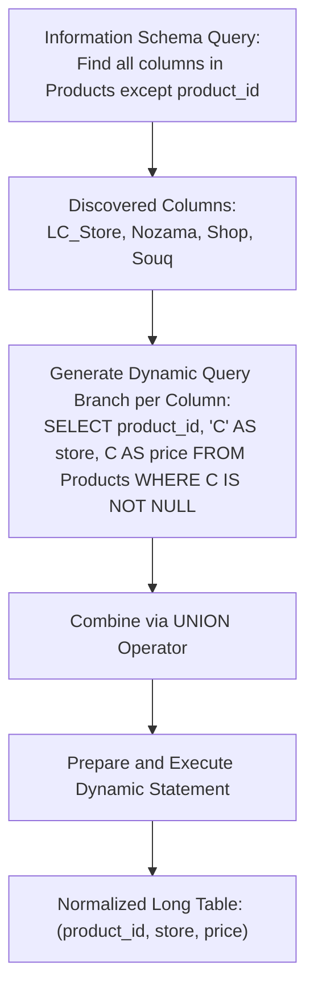

# Guided Example: Dynamic Unpivoting of a Table

## 1. Problem Overview & Representative Instance

In database normalization, unpivoting (or melting) is the relational inverse of pivoting. It converts a wide-format table where attributes are spread across multiple named columns into a long-format normalized table where attribute-value pairs are stored as rows.

We are given a table named $\text{Products}$ where:
- $\text{product\_id}$ is the primary key.
- Each additional column corresponds to a specific store name.
- The cell values represent product prices in those stores, with $\text{NULL}$ indicating that a product is not sold in that specific store.

The objective is to implement a stored procedure that unpivots $\text{Products}$ into a normalized long-format table with the exact schema:

$$\text{Result}(\text{product\_id: INT}, \; \text{store: VARCHAR}, \; \text{price: INT})$$

Filtering rules:
- Any cell containing $\text{NULL}$ must be excluded from the unpivoted output.
- Every non-null price entry must be emitted as an independent tuple $(\text{product\_id}, \text{store}, \text{price})$.
- The procedure must be dynamic: the store column names are unknown beforehand and differ across test cases.

### Representative Instance

Consider a $\text{Products}$ table with columns $\text{product\_id}$, $\text{LC\_Store}$, $\text{Nozama}$, $\text{Shop}$, and $\text{Souq}$:

| $\text{product\_id}$ | $\text{LC\_Store}$ | $\text{Nozama}$ | $\text{Shop}$ | $\text{Souq}$ |
|---|---|---|---|---|
| $1$ | $100$ | $\text{NULL}$ | $110$ | $\text{NULL}$ |
| $2$ | $\text{NULL}$ | $200$ | $\text{NULL}$ | $190$ |
| $3$ | $\text{NULL}$ | $\text{NULL}$ | $1000$ | $1900$ |

Expected long-format unpivoted output:

| $\text{product\_id}$ | $\text{store}$ | $\text{price}$ |
|---|---|---|
| $1$ | $\text{LC\_Store}$ | $100$ |
| $1$ | $\text{Shop}$ | $110$ |
| $2$ | $\text{Nozama}$ | $200$ |
| $2$ | $\text{Souq}$ | $190$ |
| $3$ | $\text{Shop}$ | $1000$ |
| $3$ | $\text{Souq}$ | $1900$ |



---

## 2. Mathematical & Algorithmic Principles

### Unpivoting as a Union of Projections

Let $T$ be the wide relation defined over attribute set $\mathcal{A} = \{ \text{product\_id} \} \cup \mathcal{C}$, where $\mathcal{C} = \{ c_1, c_2, \dots, c_k \}$ represents the set of dynamically discovered store columns.

For each store column $c \in \mathcal{C}$, define a relational projection and filter:

$$R_c = \pi_{\text{product\_id}, \; \text{store} = 'c', \; \text{price} = c} \left( \sigma_{c \text{ IS NOT NULL}}(T) \right)$$

The complete unpivoted relation is the multiset union across all store columns:

$$R_{\text{unpivoted}} = \bigcup_{c \in \mathcal{C}} R_c$$

Because $(\text{product\_id}, c)$ is structurally distinct for different columns $c$, each branch produces tuples with a distinct $\text{store}$ attribute value, ensuring no inadvertent deduplication occurs.

### Information Schema Introspection and Dynamic SQL Generation

In relational database management systems, table schemas can be introspected through the standard ANSI data dictionary $\text{information\_schema.columns}$.
1. **Metadata Introspection:**
   Query the metadata dictionary to discover all store attribute names belonging to the target table:
   $$\mathcal{C} = \pi_{\text{column\_name}}\left(\sigma_{\text{table\_name} = 'Products' \land \text{column\_name} \ne 'product\_id'}(\text{information\_schema.columns})\right)$$
2. **Dynamic Statement Synthesis:**
   For each column name $c \in \mathcal{C}$, synthesize an independent query block:
   $$\text{"SELECT product\_id, '"} \circ c \circ \text{"' AS store, "} \circ c \circ \text{" AS price FROM Products WHERE "} \circ c \circ \text{" IS NOT NULL"}$$
   Concatenate these query fragments using the $\text{UNION}$ (or $\text{UNION ALL}$) keyword.
3. **Execution Pipeline:**
   Prepare and execute the concatenated query string using database statement preparation primitives.

---

## 3. Step-by-Step Walkthrough with Intermediate State

We trace dynamic unpivoting on our representative instance.

### Phase 1: Schema Discovery via Information Schema
Query $\text{information\_schema.columns}$ filtering by table $\text{'Products'}$.
- Column $1$: $\text{'product\_id'}$ $\implies$ Excluded (primary key identifier).
- Column $2$: $\text{'LC\_Store'}$ $\implies$ Retained.
- Column $3$: $\text{'Nozama'}$ $\implies$ Retained.
- Column $4$: $\text{'Shop'}$ $\implies$ Retained.
- Column $5$: $\text{'Souq'}$ $\implies$ Retained.

Active store column list:
$$\mathcal{C} = [\text{LC\_Store}, \; \text{Nozama}, \; \text{Shop}, \; \text{Souq}]$$

### Phase 2: Synthesis of Branch Queries
For each column in $\mathcal{C}$, construct its query component:

1. **Branch for $\text{'LC\_Store'}$:**
   ```text
   SELECT product_id, 'LC_Store' AS store, LC_Store AS price
   FROM Products
   WHERE LC_Store IS NOT NULL
   ```
   Evaluates against input rows:
   - Row $1$: $100 \ne \text{NULL} \implies (1, \text{'LC\_Store'}, 100)$
   - Row $2$: $\text{NULL} \implies$ Filtered out
   - Row $3$: $\text{NULL} \implies$ Filtered out

2. **Branch for $\text{'Nozama'}$:**
   ```text
   SELECT product_id, 'Nozama' AS store, Nozama AS price
   FROM Products
   WHERE Nozama IS NOT NULL
   ```
   Evaluates against input rows:
   - Row $1$: $\text{NULL} \implies$ Filtered out
   - Row $2$: $200 \ne \text{NULL} \implies (2, \text{'Nozama'}, 200)$
   - Row $3$: $\text{NULL} \implies$ Filtered out

3. **Branch for $\text{'Shop'}$:**
   ```text
   SELECT product_id, 'Shop' AS store, Shop AS price
   FROM Products
   WHERE Shop IS NOT NULL
   ```
   Evaluates against input rows:
   - Row $1$: $110 \ne \text{NULL} \implies (1, \text{'Shop'}, 110)$
   - Row $2$: $\text{NULL} \implies$ Filtered out
   - Row $3$: $1000 \ne \text{NULL} \implies (3, \text{'Shop'}, 1000)$

4. **Branch for $\text{'Souq'}$:**
   ```text
   SELECT product_id, 'Souq' AS store, Souq AS price
   FROM Products
   WHERE Souq IS NOT NULL
   ```
   Evaluates against input rows:
   - Row $1$: $\text{NULL} \implies$ Filtered out
   - Row $2$: $190 \ne \text{NULL} \implies (2, \text{'Souq'}, 190)$
   - Row $3$: $1900 \ne \text{NULL} \implies (3, \text{'Souq'}, 1900)$

### Phase 3: Dynamic Union and Output Generation
Joining all branches via $\text{UNION}$ merges the $6$ non-null records into the final tabular result.

---

## 4. Comprehensive State Trace

### Dynamic Column Extraction and Branch Mapping

The table below catalogs the query branches synthesized from introspected schema metadata:

| Discovered Column $c$ | Column Type | Generated Query Fragment | Emitted Row Count |
|---|---|---|---|
| **$\text{LC\_Store}$** | Measure (Price) | $\text{SELECT product\_id, 'LC\_Store', LC\_Store FROM Products WHERE LC\_Store IS NOT NULL}$ | $1$ |
| **$\text{Nozama}$** | Measure (Price) | $\text{SELECT product\_id, 'Nozama', Nozama FROM Products WHERE Nozama IS NOT NULL}$ | $1$ |
| **$\text{Shop}$** | Measure (Price) | $\text{SELECT product\_id, 'Shop', Shop FROM Products WHERE Shop IS NOT NULL}$ | $2$ |
| **$\text{Souq}$** | Measure (Price) | $\text{SELECT product\_id, 'Souq', Souq FROM Products WHERE Souq IS NOT NULL}$ | $2$ |

### Cell-by-Cell Evaluation Trace

The table below shows the evaluation of every cell in the input table against the $\text{IS NOT NULL}$ filter:

| Product ID | Store Column Examined | Raw Cell Value | Condition $\ne \text{NULL}$ | Action Taken | Output Record Formed |
|---|---|---|---|---|---|
| **$1$** | $\text{LC\_Store}$ | $100$ | True | Emit | $(1, \text{'LC\_Store'}, 100)$ |
| **$1$** | $\text{Nozama}$ | $\text{NULL}$ | False | Prune | None |
| **$1$** | $\text{Shop}$ | $110$ | True | Emit | $(1, \text{'Shop'}, 110)$ |
| **$1$** | $\text{Souq}$ | $\text{NULL}$ | False | Prune | None |
| **$2$** | $\text{LC\_Store}$ | $\text{NULL}$ | False | Prune | None |
| **$2$** | $\text{Nozama}$ | $200$ | True | Emit | $(2, \text{'Nozama'}, 200)$ |
| **$2$** | $\text{Shop}$ | $\text{NULL}$ | False | Prune | None |
| **$2$** | $\text{Souq}$ | $190$ | True | Emit | $(2, \text{'Souq'}, 190)$ |
| **$3$** | $\text{LC\_Store}$ | $\text{NULL}$ | False | Prune | None |
| **$3$** | $\text{Nozama}$ | $\text{NULL}$ | False | Prune | None |
| **$3$** | $\text{Shop}$ | $1000$ | True | Emit | $(3, \text{'Shop'}, 1000)$ |
| **$3$** | $\text{Souq}$ | $1900$ | True | Emit | $(3, \text{'Souq'}, 1900)$ |

---

## 5. Algorithmic Correctness & Soundness

### Soundness (Non-Null Guarantee)

Every branch query includes the explicit filter predicate:
$$\text{WHERE } c \text{ IS NOT NULL}$$
Therefore:
- Any record where the price in column $c$ is missing evaluates to false and is discarded before emission.
- Only cells containing an actual numeric value are selected.
- Zero prices ($0$) are non-null and correctly preserved without being conflated with missing data.

### Completeness (Total Column Coverage)

The metadata query inspects all column definitions in the database dictionary:
$$\text{table\_schema} = \text{DATABASE}() \land \text{table\_name} = 'Products' \land \text{column\_name} \ne 'product\_id'$$
- Because every measure column in $\text{Products}$ is listed in $\text{information\_schema.columns}$, no valid store column is omitted.
- The dynamic loop synthesizes a branch for every discovered column.
- Hence, every valid non-null entry across all store columns is visited and included in the union.

---

## 6. Edge Cases & Anti-Patterns

### Edge Cases
1. **Single Store Column:**
   If $\text{Products}$ has only one store column (e.g. $\text{Only}$), the dynamic string aggregation produces a single query without $\text{UNION}$, returning all non-null entries for that store.
2. **All-Null Product Row:**
   If a product has $\text{NULL}$ across every store column, every branch filters out that product. That product contributes $0$ rows to the output, as required.
3. **Zero Price Value ($0$):**
   A product sold for free or cost $0$ has $\text{price} = 0$. Since $0 \text{ IS NOT NULL}$ is true, the zero-priced item is preserved as a valid row.
4. **Equal Prices in Different Stores:**
   If product $1$ has price $5$ in store $A$ and price $5$ in store $B$, the emitted tuples are $(1, \text{'A'}, 5)$ and $(1, \text{'B'}, 5)$. Because the store names differ, the rows are distinct and both are preserved.

### Anti-Patterns to Avoid
- **Static Column Hardcoding:**
  Writing a static query referencing `LC_Store`, `Shop`, etc. fails on test cases with different store column names (e.g. `North`, `South`, `West`).
- **Omitting the Table Schema Filter:**
  Querying $\text{information\_schema.columns}$ without specifying $\text{table\_schema} = \text{DATABASE}()$ can accidentally match columns of a table named $\text{Products}$ in other system databases.
- **Filtering Out Zeros:**
  Writing `WHERE price > 0` or `WHERE price != 0` instead of `WHERE price IS NOT NULL`. A legitimate price of $0$ must not be filtered out.

---

## 7. Complexity Analysis

### Time Complexity
- **Metadata Introspection:**
  Querying the database dictionary for column names takes $O(K)$ time where $K$ is the number of columns in the table.
- **Dynamic Query Execution:**
  Executing $K$ union branches against a table of $N$ product rows:
  $$O(N \cdot K)$$
- **Total Time Complexity:** $\mathcal{O}(N \cdot K)$, which is strictly proportional to the number of cells in the wide table and optimal.

### Space Complexity
- **SQL Text Buffer:**
  The generated query string holds $O(K)$ text tokens, occupying small memory bounded by `group_concat_max_len`.
- **Output Storage:**
  The resulting long table contains $O(N \cdot K)$ rows in the worst case (dense table).
- **Total Space Complexity:** $\mathcal{O}(N \cdot K)$ space for the query result.
