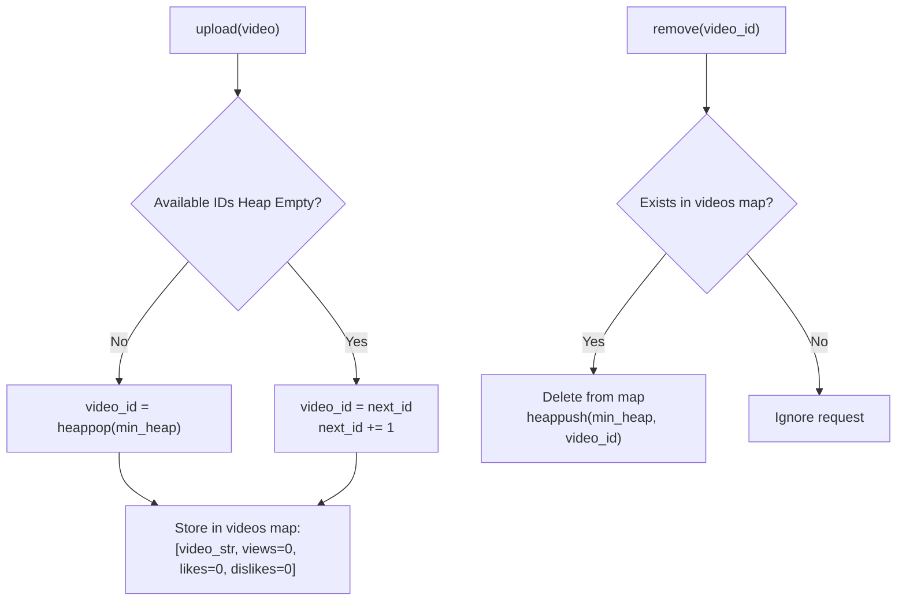

# Guided Example: Design Video Sharing Platform

## 1. Problem Overview & Representative Instance

A video sharing platform manages a collection of uploaded video strings, tracks engagement metrics (views, likes, dislikes), provides windowed playback, and recycles deleted video identifiers. The platform must support the following core API methods:
- $\text{upload}(\text{video})$: Inserts a new video string. Assigns the smallest non-negative integer ID available. If previously removed IDs exist, the smallest such ID must be reused; otherwise, the next contiguous ID is assigned. Returns the assigned ID with metrics initialized to zero.
- $\text{remove}(\text{videoId})$: Deletes the video and its metrics from the system. Its ID becomes immediately eligible for recycling. If the ID does not exist, the operation is ignored.
- $\text{watch}(\text{videoId}, \text{startMinute}, \text{endMinute})$: Increments the video's view count by $1$ and returns the video substring from $\text{startMinute}$ to $\min(\text{endMinute}, |\text{video}| - 1)$ inclusive. If the video does not exist, returns `"-1"`.
- $\text{like}(\text{videoId})$ / $\text{dislike}(\text{videoId})$: Increments the like or dislike counter by $1$ if the video exists; otherwise does nothing.
- $\text{getLikesAndDislikes}(\text{videoId})$: Returns $[ \text{likes}, \text{dislikes} ]$ if the video exists, or $[-1]$ if not.
- $\text{getViews}(\text{videoId})$: Returns total view count if the video exists, or $-1$ if not.

### Representative Instance

Consider the following interleaved sequence of operations:
1. `upload("123")`
2. `upload("456")`
3. `remove(4)` (non-existent ID)
4. `remove(0)`
5. `upload("789")` (recycles smallest available ID)
6. `watch(1, 0, 5)` (clamps to end of video length)
7. `watch(1, 0, 1)`
8. `like(1)`
9. `dislike(1)`
10. `dislike(1)`
11. `getLikesAndDislikes(1)`
12. `getViews(1)`

---

## 2. Mathematical & Algorithmic Principles

### Smallest-Identifier Allocation Strategy

The platform requires a dynamic integer allocator that always issues the minimum available identifier:

$$\text{id}^* = \min \left( \mathbb{N}_0 \setminus \text{ActiveIDs} \right)$$

To achieve optimal logarithmic allocation and deallocation without scanning the integers:
1. **Fresh Monotonic Counter:**
   Maintain a scalar counter $\text{next\_id}$ initialized to $0$. Whenever no recycled IDs are pending, the allocated ID is $\text{next\_id}$, and the counter increments:
   $$\text{id} \leftarrow \text{next\_id}, \quad \text{next\_id} \leftarrow \text{next\_id} + 1$$
2. **Min-Heap for Recycled Holes:**
   When an active video $\text{id} < \text{next\_id}$ is removed, it creates a hole in the sequence. Inserting the freed ID into a min-heap $\mathcal{H}$ preserves the invariant:
   $$\min(\mathcal{H}) = \text{smallest released hole}$$
3. **Allocation Priority:**
   - If $\mathcal{H}$ is non-empty, the minimum available ID is $\text{heappop}(\mathcal{H}) < \text{next\_id}$.
   - If $\mathcal{H}$ is empty, the minimum available ID is $\text{next\_id}$.

This dual-tier allocation guarantees that the returned ID is strictly minimal at all times.

### Constant-Time State Record Encapsulation

Video metadata is indexed in a hash table mapping $\text{videoId} \to \text{Record}$, where:

$$\text{Record} = \big[ \text{content: STRING}, \; \text{views: INT}, \; \text{likes: INT}, \; \text{dislikes: INT} \big]$$

- Key existence checks (`in self.videos`) execute in expected $O(1)$ time.
- Metrics updates (`like`, `dislike`, `watch` view increment) mutate in-place in $O(1)$ time.
- String slicing for `watch` takes $O(L)$ where $L = \text{endMinute} - \text{startMinute} + 1$.

---

## 3. Step-by-Step Walkthrough with Intermediate State

We trace the representative execution step by step.

### Step 1: `upload("123")`
- Available heap $\mathcal{H} = []$ (empty).
- Allocate $\text{id} = \text{next\_id} = 0$. Increment $\text{next\_id} \leftarrow 1$.
- Record for ID $0$: $\text{videos}[0] = [\text{"123"}, 0, 0, 0]$.
- Returns $0$.

### Step 2: `upload("456")`
- $\mathcal{H} = []$. Allocate $\text{id} = \text{next\_id} = 1$. Increment $\text{next\_id} \leftarrow 2$.
- Record for ID $1$: $\text{videos}[1] = [\text{"456"}, 0, 0, 0]$.
- Returns $1$.

### Step 3: `remove(4)`
- ID $4 \notin \text{videos}$.
- Non-existent ID: operation ignored. $\mathcal{H}$ remains $[]$.
- Returns `null`.

### Step 4: `remove(0)`
- ID $0 \in \text{videos}$.
- Delete $\text{videos}[0]$.
- Push $0$ into min-heap $\mathcal{H} \implies \mathcal{H} = [0]$.
- Returns `null`.

### Step 5: `upload("789")`
- Heap $\mathcal{H} = [0]$ is non-empty!
- Pop smallest recycled ID: $\text{id} = \text{heappop}(\mathcal{H}) = 0$.
- Initialize fresh metrics for recycled ID $0$: $\text{videos}[0] = [\text{"789"}, 0, 0, 0]$.
- $\text{next\_id}$ remains $2$.
- Returns $0$.

### Step 6: `watch(1, 0, 5)`
- ID $1 \in \text{videos}$. Content is $\text{"456"}$, length $3$.
- Increment view count: $\text{views}[1] \leftarrow 0 + 1 = 1$.
- Slice window: $[0, 5]$. Clamped to $[0, \min(5, 2)] = [0, 2]$.
- Extracted substring: $\text{"456"}[0:3] = \text{"456"}$.
- Returns $\text{"456"}$.

### Step 7: `watch(1, 0, 1)`
- Increment view count: $\text{views}[1] \leftarrow 1 + 1 = 2$.
- Slice window: $[0, 1]$.
- Extracted substring: $\text{"456"}[0:2] = \text{"45"}$.
- Returns $\text{"45"}$.

### Steps 8–10: `like(1)`, `dislike(1)`, `dislike(1)`
- ID $1$ receives one like: $\text{likes}[1] \leftarrow 0 + 1 = 1$.
- ID $1$ receives two dislikes: $\text{dislikes}[1] \leftarrow 0 + 2 = 2$.

### Step 11: `getLikesAndDislikes(1)`
- Returns $[\text{likes}[1], \text{dislikes}[1]] = [1, 2]$.

### Step 12: `getViews(1)`
- Returns $\text{views}[1] = 2$.

---

## 4. Comprehensive State Trace

### Platform Lifecycle Trace

The table below catalogs system state transitions across the full operation sequence:

| Step | Operation Invoked | Arguments | Active IDs in Store | Recycled Heap $\mathcal{H}$ | Next Fresh ID | Output Emitted |
|---|---|---|---|---|---|---|
| **0** | Constructor | — | $\emptyset$ | $[]$ | $0$ | — |
| **1** | `upload` | `"123"` | $\{0\}$ | $[]$ | $1$ | $0$ |
| **2** | `upload` | `"456"` | $\{0, 1\}$ | $[]$ | $2$ | $1$ |
| **3** | `remove` | $4$ | $\{0, 1\}$ | $[]$ | $2$ | `null` |
| **4** | `remove` | $0$ | $\{1\}$ | $[0]$ | $2$ | `null` |
| **5** | `upload` | `"789"` | $\{0, 1\}$ | $[]$ | $2$ | $0$ (Recycled) |
| **6** | `watch` | $(1, 0, 5)$ | $\{0, 1\}$ | $[]$ | $2$ | `"456"` |
| **7** | `watch` | $(1, 0, 1)$ | $\{0, 1\}$ | $[]$ | $2$ | `"45"` |
| **8** | `like` | $1$ | $\{0, 1\}$ | $[]$ | $2$ | `null` |
| **9** | `dislike` | $1$ | $\{0, 1\}$ | $[]$ | $2$ | `null` |
| **10** | `dislike` | $1$ | $\{0, 1\}$ | $[]$ | $2$ | `null` |
| **11** | `getLikesAndDislikes` | $1$ | $\{0, 1\}$ | $[]$ | $2$ | $[1, 2]$ |
| **12** | `getViews` | $1$ | $\{0, 1\}$ | $[]$ | $2$ | $2$ |

### Video Entity State Comparison

The table below contrasts the individual states of Video $0$ and Video $1$ at the end of the trace:

| Video ID | Stored Video Content | View Count | Likes | Dislikes | Recycling History |
|---|---|---|---|---|---|
| **$0$** | `"789"` | $0$ | $0$ | $0$ | Reallocated at step 5; previous stats reset |
| **$1$** | `"456"` | $2$ | $1$ | $2$ | Persistently active from step 2 |

---

## 5. Algorithmic Correctness & Soundness

### Minimal ID Allocation Invariant

Let $\mathcal{U}$ be the set of currently active video IDs.
- Any ID $x \ge \text{next\_id}$ has never been assigned.
- Any ID $x < \text{next\_id}$ that is not active must have been assigned and subsequently deleted.
- Every deleted ID is pushed to min-heap $\mathcal{H}$ upon removal.
- When an ID is requested:
  - If $\mathcal{H}$ is non-empty, $\min(\mathcal{H}) < \text{next\_id}$ is the absolute smallest non-active non-negative integer.
  - If $\mathcal{H}$ is empty, every integer in $[0, \text{next\_id} - 1]$ is currently active. The smallest available integer is $\text{next\_id}$.
Thus, the allocated identifier is provably the minimum non-negative integer available.

### Idempotence and Anti-Duplication of Removals

Removing an already removed or non-existent ID could corrupt the heap if the ID were pushed again.
The condition `if videoId in self.videos:` strictly guards the deletion and push operations:
- A deleted ID is removed from the hash map in the same atomic step.
- Repeated calls to `remove(videoId)` evaluate to false, preventing duplicate insertions into $\mathcal{H}$.

---

## 6. Edge Cases & Anti-Patterns

### Edge Cases
1. **Targeting Non-Existent or Deleted Videos:**
   Calling `watch`, `like`, `dislike`, `getViews`, or `getLikesAndDislikes` on a non-existent ID gracefully handles the error, returning `"-1"`, `[-1]`, or `-1` as mandated.
2. **Watch Range Exceeding String Length:**
   If $\text{endMinute} \ge |\text{video}|$, Python string slicing automatically clamps to the end of the string without throwing index out-of-range errors.
3. **Repeated ID Removals:**
   Calling `remove(0)` multiple times does not insert multiple copies of $0$ into the min-heap.
4. **Immediate Reuse and Reset:**
   When an ID is reused, its record is newly allocated with view, like, and dislike counters reset to $0$.

### Anti-Patterns to Avoid
- **Linear Scan for Available IDs:**
  Scanning integers $0, 1, 2, \dots$ to find the first absent ID takes $O(N)$ time per upload. Using a min-heap guarantees logarithmic $O(\log N)$ ID retrieval.
- **Lazy ID Deletion Without Heap:**
  Using an unordered set of deleted IDs and taking `min(set)` takes $O(K)$ time per upload. A min-heap maintains the minimum at the root in $O(1)$ peek time.
- **Failing to Guard Removal:**
  Inserting IDs into the heap without verifying they currently exist in the map allows duplicate IDs in the heap, causing duplicate ID assignments in future uploads.

---

## 7. Complexity Analysis

### Time Complexity
- **`upload`:** Popping from min-heap or incrementing counter takes $O(\log K)$ or $O(1)$, where $K$ is the number of deleted IDs. Inserting into hash table takes $O(1)$ time. Overall: $O(\log K)$.
- **`remove`:** Hash table lookup, deletion, and heap push take $O(\log K)$ time.
- **`watch`:** Hash table lookup takes $O(1)$. Slicing a string of length $L = \text{endMinute} - \text{startMinute} + 1$ takes $O(L)$ time.
- **`like` / `dislike`:** $O(1)$ hash table lookup and integer addition.
- **`getLikesAndDislikes` / `getViews`:** $O(1)$ hash table lookup and tuple return.

### Space Complexity
- **Hash Table Storage:** Stores metadata for all $N$ currently active videos: $O(\sum |\text{video}|)$.
- **Min-Heap Storage:** Stores at most $K \le N_{\text{total}}$ recycled integer IDs: $O(K)$.
- **Total Space Complexity:** $\mathcal{O}(\text{Total Stored Content} + K)$ auxiliary space.
