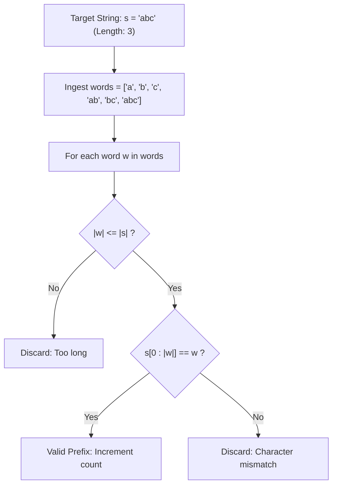

# Guided Example: Count Prefixes of a Given String

## 1. Problem Overview & Representative Instance

Given an array of strings $\text{words}$ and a target string $s$, the objective is to count the total number of strings in $\text{words}$ that are a **prefix** of $s$.

A string $w$ is defined as a prefix of $s$ if $w$ matches the initial segment of $s$ starting from index $0$. That is:
- The length of $w$ must not exceed the length of $s$: $|w| \le |s|$.
- Every character of $w$ must match the corresponding character of $s$ at the same position:
  $$w[k] = s[k] \quad \text{for all } 0 \le k < |w|$$

If identical words appear multiple times in the $\text{words}$ array, each occurrence that satisfies the prefix property must be counted individually toward the total.

### Representative Instance

Consider the input parameters:
- Word collection: $\text{words} = [\text{"a"}, \text{"b"}, \text{"c"}, \text{"ab"}, \text{"bc"}, \text{"abc"}]$
- Target string: $s = \text{"abc"}$

The candidate strings have varying lengths and initial characters:
- $\text{"a"}$ matches the first character of $\text{"abc"}$ (Valid prefix).
- $\text{"b"}$ and $\text{"c"}$ do not start with $\text{'a'}$ (Invalid).
- $\text{"ab"}$ matches the first two characters of $\text{"abc"}$ (Valid prefix).
- $\text{"bc"}$ occurs in $\text{"abc"}$, but begins at index $1$ rather than index $0$ (Invalid).
- $\text{"abc"}$ matches the entirety of $s$ (Valid prefix).

The total count of valid prefixes is $3$.

---

## 2. Mathematical & Algorithmic Principles

### Formal Prefix Indicator Formulation

Let $\Sigma$ be a finite alphabet, and let $s \in \Sigma^*$ be a string of length $n = |s|$.
The prefix operator $\text{pref}_k(s)$ returns the substring consisting of the first $k$ symbols:

$$\text{pref}_k(s) = s[0 \dots k - 1], \quad 0 \le k \le n$$

For any candidate string $w \in \text{words}$ of length $m = |w|$, the indicator function evaluates whether $w$ is a prefix of $s$:

$$\mathbf{1}_{\text{prefix}}(w, s) = \begin{cases} 1 & \text{if } m \le n \land s[0 \dots m - 1] = w \\ 0 & \text{otherwise} \end{cases}$$

The global count of prefixes in a multiset of words is:

$$\text{Total} = \sum_{w \in \text{words}} \mathbf{1}_{\text{prefix}}(w, s)$$

### Prefix vs Substring Distinction

A crucial property of prefixes is their strict anchor at position $0$:
- A general substring may occur at any starting index $j \in [0, n - m]$:
  $$\text{substring: } \exists j \ge 0 \text{ such that } s[j \dots j + m - 1] = w$$
- A prefix restricts the anchor strictly to $j = 0$:
  $$\text{prefix: } j = 0 \text{ strictly}$$
For example, in $s = \text{"abc"}$, the substring $\text{"bc"}$ occurs at $j = 1$. Although it is a substring of $s$, it is not a prefix because $j \ne 0$.

### Short-Circuit Character Comparison

Testing whether $s$ starts with $w$ takes at most $O(|w|)$ time:
1. First, check length: if $|w| > |s|$, the condition fails immediately in $O(1)$.
2. If $|w| \le |s|$, compare characters sequentially from $k = 0$ to $|w| - 1$.
3. The comparison halts at the very first index $k$ where $w[k] \ne s[k]$, short-circuiting unnecessary character checks.

---

## 3. Step-by-Step Walkthrough with Intermediate State

We evaluate each candidate word in $\text{words} = [\text{"a"}, \text{"b"}, \text{"c"}, \text{"ab"}, \text{"bc"}, \text{"abc"}]$ against $s = \text{"abc"}$.
Initialize accumulator: $\text{count} = 0$.

### Step 1: Evaluate $w = \text{"a"}$
- Length check: $|w| = 1 \le |s| = 3$.
- Compare prefix slice: $s[0 : 1] = \text{"a"}$.
- Condition: $\text{"a"} == \text{"a"}$ (True).
- Action: $\text{count} \leftarrow 0 + 1 = 1$.

### Step 2: Evaluate $w = \text{"b"}$
- Length check: $|w| = 1 \le 3$.
- Compare prefix slice: $s[0 : 1] = \text{"a"}$.
- Condition: $\text{"a"} == \text{"b"}$ (False, mismatch at index $0$).
- Action: $\text{count}$ remains $1$.

### Step 3: Evaluate $w = \text{"c"}$
- Length check: $|w| = 1 \le 3$.
- Compare prefix slice: $s[0 : 1] = \text{"a"}$.
- Condition: $\text{"a"} == \text{"c"}$ (False).
- Action: $\text{count}$ remains $1$.

### Step 4: Evaluate $w = \text{"ab"}$
- Length check: $|w| = 2 \le 3$.
- Compare prefix slice: $s[0 : 2] = \text{"ab"}$.
- Condition: $\text{"ab"} == \text{"ab"}$ (True).
- Action: $\text{count} \leftarrow 1 + 1 = 2$.

### Step 5: Evaluate $w = \text{"bc"}$
- Length check: $|w| = 2 \le 3$.
- Compare prefix slice: $s[0 : 2] = \text{"ab"}$.
- Condition: $\text{"ab"} == \text{"bc"}$ (False, mismatch at index $0$).
- Action: $\text{count}$ remains $2$.

### Step 6: Evaluate $w = \text{"abc"}$
- Length check: $|w| = 3 \le 3$.
- Compare prefix slice: $s[0 : 3] = \text{"abc"}$.
- Condition: $\text{"abc"} == \text{"abc"}$ (True).
- Action: $\text{count} \leftarrow 2 + 1 = 3$.

All candidates processed. Final output: $3$.

---

## 4. Comprehensive State Trace

### Per-Candidate Evaluation Matrix

The table below catalogs the detailed verification of each candidate string in the representative instance:

| Candidate Index | Word $w$ | Length $\lvert w \rvert$ | Target Prefix $s[0 : \lvert w \rvert]$ | String Match Comparison | Prefix Criterion Met? | Running Prefix Count |
|---|---|---|---|---|---|---|
| **0** | $\text{"a"}$ | $1$ | $\text{"a"}$ | $\text{"a"} == \text{"a"}$ | **Yes** | $1$ |
| **1** | $\text{"b"}$ | $1$ | $\text{"a"}$ | $\text{"a"} \ne \text{"b"}$ | No | $1$ |
| **2** | $\text{"c"}$ | $1$ | $\text{"a"}$ | $\text{"a"} \ne \text{"c"}$ | No | $1$ |
| **3** | $\text{"ab"}$ | $2$ | $\text{"ab"}$ | $\text{"ab"} == \text{"ab"}$ | **Yes** | $2$ |
| **4** | $\text{"bc"}$ | $2$ | $\text{"ab"}$ | $\text{"ab"} \ne \text{"bc"}$ | No | $2$ |
| **5** | $\text{"abc"}$ | $3$ | $\text{"abc"}$ | $\text{"abc"} == \text{"abc"}$ | **Yes** | $3$ |

### Structural Behavior Across Canonical Edge Scenarios

| Test Scenario | Word List $\text{words}$ | Target $s$ | Prefix Validations | Output Count | Key Takeaway |
|---|---|---|---|---|---|
| **Duplicate Words** | $[\text{"a"}, \text{"a"}]$ | $\text{"aa"}$ | Both copies match $s[0:1]$ | $2$ | Duplicates are counted independently |
| **Word Longer Than Target** | $[\text{"abcd"}, \text{"ab"}]$ | $\text{"abc"}$ | $\text{"abcd"}$ fails length; $\text{"ab"}$ passes | $1$ | $\lvert w \rvert > \lvert s \rvert$ automatically invalidates |
| **Complete Match** | $[\text{"target"}]$ | $\text{"target"}$ | Full string is its own prefix | $1$ | Identical string is a valid prefix |
| **Interior Substring Only** | $[\text{"bcd"}]$ | $\text{"abcde"}$ | Occurs at index $1$, not $0$ | $0$ | Non-zero starting offsets are rejected |

---

## 5. Algorithmic Correctness & Soundness

### Mathematical Invariant

The verification procedure computes:

$$\sum_{w \in \text{words}} \mathbf{1}_{s[0 : |w|] = w \land |w| \le |s|}$$

1. **Soundness:** If a candidate string $w$ increments the counter, it has $|w| \le |s|$ and $s[0 \dots |w| - 1] = w$. By definition, $w$ is an exact prefix of $s$. No invalid word can contribute to the count.
2. **Completeness:** The loop iterates over every element of the input array $\text{words}$. Every element is checked against $s$ under the exact mathematical definition of string prefix. No valid prefix can be skipped.
3. **Multiset Preservation:** Because the iteration operates over the ordered collection rather than a deduplicated set, duplicate words are evaluated and tallied independently without loss of frequency.

---

## 6. Edge Cases & Anti-Patterns

### Edge Cases
1. **Word Equal to Target ($w = s$):**
   A string is always a prefix of itself ($|w| = |s|$ and $s[0 : |s|] = s$). This correctly increments the count.
2. **Word Longer than Target ($|w| > |s|$):**
   E.g., $w = \text{"abcd"}$ with $s = \text{"abc"}$. Slicing or length comparison prevents out-of-bounds index access and evaluates to false.
3. **Duplicate Words in List:**
   If $\text{words} = [\text{"a"}, \text{"a"}]$ and $s = \text{"aa"}$, both words are valid prefixes, yielding $2$.
4. **Disjoint Character Sets:**
   If no word starts with the first character of $s$, all comparisons fail on the first character check, correctly returning $0$.

### Anti-Patterns to Avoid
- **Using General Substring / Search (`in` or `find`):**
  Checking `w in s` or `s.find(w) != -1`. This checks whether $w$ appears anywhere in $s$. For $w = \text{"bc"}$ and $s = \text{"abc"}$, `w in s` is true, but $\text{"bc"}$ is not a prefix. Prefixes must strictly start at index $0$.
- **Deduplicating the Input Array:**
  Converting $\text{words}$ to a `set` before checking prefixes loses duplicate counts, producing an undercount when duplicate valid prefixes exist.
- **Trie Overhead for Small Constraints:**
  Building a prefix tree (Trie) over $s$ or $\text{words}$ adds unnecessary object allocation overhead for modest input constraints ($|\text{words}| \le 1000, |s| \le 100$). Direct linear comparison is faster, simpler, and cache-friendly.

---

## 7. Complexity Analysis

### Time Complexity
- Let $M$ be the number of strings in $\text{words}$.
- Let $L_{\max}$ be the maximum length of a string in $\text{words}$.
- Let $|s|$ be the length of target string $s$.
- For each word $w \in \text{words}$, checking whether $s$ starts with $w$ requires comparing at most $\min(|w|, |s|)$ characters.
- Across all $M$ words:
  $$\text{Total Time} = \sum_{w \in \text{words}} O(|w|) = O\left(\sum_{w \in \text{words}} |w|\right)$$
  In the worst case where every word has length $L_{\max}$: $O(M \cdot L_{\max})$.
  Given $M \le 1000$ and $L_{\max} \le 100$, the maximum number of character comparisons is $10^5$, executing in under $1 \text{ ms}$.

### Space Complexity
- **Auxiliary Storage:**
  Direct character comparisons and length checks operate in-place using constant scalar variables without allocating auxiliary strings or tables.
- **Total Space Complexity:** $\mathcal{O}(1)$ auxiliary space beyond input storage.
