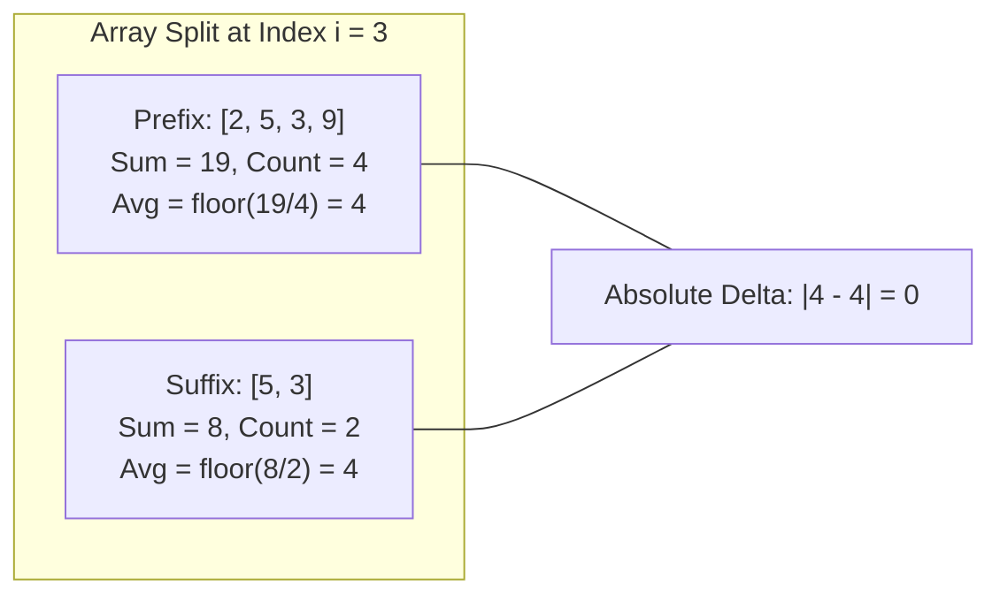

# Guided Example: Minimum Average Difference

## 1. Problem Overview & Representative Instance

Given a $0$-indexed integer array $\text{nums}$ of length $n$, the **average difference** at index $i$ (where $0 \le i < n$) is defined as the absolute difference between:
1. The average of the first $i + 1$ elements ($\text{nums}[0]$ through $\text{nums}[i]$), rounded down to the nearest integer.
2. The average of the remaining $n - i - 1$ elements ($\text{nums}[i + 1]$ through $\text{nums}[n - 1]$), rounded down to the nearest integer.

If $i = n - 1$, the suffix is empty; by definition, the average of $0$ elements is taken to be $0$.

The goal is to return the index $i \in [0, n - 1]$ that yields the **minimum average difference**. If multiple indices achieve the exact same minimum difference, the smallest index must be returned.

### Representative Instance

Consider an array of $6$ elements:
$$\text{nums} = [2, 5, 3, 9, 5, 3], \quad n = 6$$

Total sum of all elements:
$$\Sigma = 2 + 5 + 3 + 9 + 5 + 3 = 27$$

We inspect each split index $i \in [0, 5]$:
- At $i = 3$:
  - Prefix contains $[2, 5, 3, 9]$: sum $= 19$, length $= 4$, floor average $= \lfloor 19 / 4 \rfloor = 4$.
  - Suffix contains $[5, 3]$: sum $= 8$, length $= 2$, floor average $= \lfloor 8 / 2 \rfloor = 4$.
  - Difference $= |4 - 4| = 0$.

Because $0$ is the absolute minimum possible value for any absolute difference metric, index $3$ achieves the global optimum.

---

## 2. Mathematical & Algorithmic Principles

### Formal Definition of the Objective Function

For each split index $i \in \{0, \dots, n - 1\}$:
- The prefix sum is:
  $$\text{pre}(i) = \sum_{k=0}^i \text{nums}[k]$$
- The suffix sum is:
  $$\text{suf}(i) = \sum_{k=i+1}^{n-1} \text{nums}[k] = \Sigma - \text{pre}(i)$$
- The prefix floor average is:
  $$\mu_{\text{pre}}(i) = \left\lfloor \frac{\text{pre}(i)}{i + 1} \right\rfloor$$
- The suffix floor average is:
  $$\mu_{\text{suf}}(i) = \begin{cases} \left\lfloor \frac{\text{suf}(i)}{n - i - 1} \right\rfloor & \text{if } i < n - 1 \\ 0 & \text{if } i = n - 1 \end{cases}$$
- The average difference metric is:
  $$\Delta(i) = |\mu_{\text{pre}}(i) - \mu_{\text{suf}}(i)|$$

The optimal index $i^*$ is defined as:
$$i^* = \min \left( \operatorname{argmin}_{0 \le i < n} \Delta(i) \right)$$

### Running Prefix-Suffix Invariant in $O(1)$ Space

Computing $\text{pre}(i)$ and $\text{suf}(i)$ from scratch for each index $i$ takes $O(n^2)$ time.
Instead, we maintain a running total using two scalar variables:
- Initialize $\text{pre} = 0$ and $\text{suf} = \sum_{k=0}^{n-1} \text{nums}[k]$.
- At each step $i$ as we advance across the array:
  $$\text{pre} \leftarrow \text{pre} + \text{nums}[i]$$
  $$\text{suf} \leftarrow \text{suf} - \text{nums}[i]$$
At every step $i$, $\text{pre}$ equals $\sum_{k=0}^i \text{nums}[k]$ and $\text{suf}$ equals $\sum_{k=i+1}^{n-1} \text{nums}[k]$ in strict $O(1)$ time and $O(1)$ auxiliary space.

### Deterministic Earliest-Index Tie-Breaking

To satisfy the tie-breaking rule (returning the smallest index among equal minima):
- Initialize running minimum: $\text{best\_diff} = \infty$, $\text{best\_index} = 0$.
- When evaluating $\Delta(i)$ at index $i$, update only if strictly smaller:
  $$\text{if } \Delta(i) < \text{best\_diff}: \quad \text{best\_diff} \leftarrow \Delta(i), \quad \text{best\_index} \leftarrow i$$
Using the strict inequality $<$ ensures that if a later index $j > i$ produces $\Delta(j) = \Delta(i)$, the update is ignored, strictly preserving the earliest index $i$.

---

## 3. Step-by-Step Walkthrough with Intermediate State

We trace the representative instance $\text{nums} = [2, 5, 3, 9, 5, 3]$ with $n = 6$.
Initial total: $\text{suf} = 27$, $\text{pre} = 0$.
Initial best: $\text{best\_diff} = \infty$, $\text{best\_index} = 0$.

### Iteration $i = 0$ ($x = 2$)
- State update: $\text{pre} = 0 + 2 = 2$, $\text{suf} = 27 - 2 = 25$.
- Prefix average: $\lfloor 2 / (0 + 1) \rfloor = \lfloor 2 / 1 \rfloor = 2$.
- Suffix average: $n - i - 1 = 5 > 0 \implies \lfloor 25 / 5 \rfloor = 5$.
- Absolute difference: $\Delta(0) = |2 - 5| = 3$.
- Comparison: $3 < \infty \implies \text{best\_diff} = 3, \text{best\_index} = 0$.

### Iteration $i = 1$ ($x = 5$)
- State update: $\text{pre} = 2 + 5 = 7$, $\text{suf} = 25 - 5 = 20$.
- Prefix average: $\lfloor 7 / 2 \rfloor = 3$.
- Suffix average: $\lfloor 20 / 4 \rfloor = 5$.
- Absolute difference: $\Delta(1) = |3 - 5| = 2$.
- Comparison: $2 < 3 \implies \text{best\_diff} = 2, \text{best\_index} = 1$.

### Iteration $i = 2$ ($x = 3$)
- State update: $\text{pre} = 7 + 3 = 10$, $\text{suf} = 20 - 3 = 17$.
- Prefix average: $\lfloor 10 / 3 \rfloor = 3$.
- Suffix average: $\lfloor 17 / 3 \rfloor = 5$.
- Absolute difference: $\Delta(2) = |3 - 5| = 2$.
- Comparison: $2 < 2$ is false (tie). $\text{best\_index}$ remains $1$.

### Iteration $i = 3$ ($x = 9$)
- State update: $\text{pre} = 10 + 9 = 19$, $\text{suf} = 17 - 9 = 8$.
- Prefix average: $\lfloor 19 / 4 \rfloor = 4$.
- Suffix average: $\lfloor 8 / 2 \rfloor = 4$.
- Absolute difference: $\Delta(3) = |4 - 4| = 0$.
- Comparison: $0 < 2 \implies \text{best\_diff} = 0, \text{best\_index} = 3$.

### Iteration $i = 4$ ($x = 5$)
- State update: $\text{pre} = 19 + 5 = 24$, $\text{suf} = 8 - 5 = 3$.
- Prefix average: $\lfloor 24 / 5 \rfloor = 4$.
- Suffix average: $\lfloor 3 / 1 \rfloor = 3$.
- Absolute difference: $\Delta(4) = |4 - 3| = 1$.
- Comparison: $1 < 0$ is false.

### Iteration $i = 5$ ($x = 3$)
- State update: $\text{pre} = 24 + 3 = 27$, $\text{suf} = 3 - 3 = 0$.
- Prefix average: $\lfloor 27 / 6 \rfloor = 4$.
- Suffix average: $n - i - 1 = 0 \implies 0$ by definition.
- Absolute difference: $\Delta(5) = |4 - 0| = 4$.
- Comparison: $4 < 0$ is false.

Final Result: $3$.

---

## 4. Comprehensive State Trace

### Complete Partition Evaluation Trace

The table below catalogs every step of the single-pass sweep:

| Split Index $i$ | Current Value $x$ | Prefix Sum | Prefix Length | Prefix Floor Avg | Suffix Sum | Suffix Length | Suffix Floor Avg | Absolute Delta $\Delta(i)$ | Running Minimum | Best Index $i^*$ |
|---|---|---|---|---|---|---|---|---|---|---|
| **$0$** | $2$ | $2$ | $1$ | $2$ | $25$ | $5$ | $5$ | $|2 - 5| = 3$ | $3$ | $0$ |
| **$1$** | $5$ | $7$ | $2$ | $3$ | $20$ | $4$ | $5$ | $|3 - 5| = 2$ | $2$ | $1$ |
| **$2$** | $3$ | $10$ | $3$ | $3$ | $17$ | $3$ | $5$ | $|3 - 5| = 2$ | $2$ | $1$ (Tie kept) |
| **$3$** | $9$ | $19$ | $4$ | $4$ | $8$ | $2$ | $4$ | $|4 - 4| = 0$ | **$0$** | **$3$** |
| **$4$** | $5$ | $24$ | $5$ | $4$ | $3$ | $1$ | $3$ | $|4 - 3| = 1$ | $0$ | $3$ |
| **$5$** | $3$ | $27$ | $6$ | $4$ | $0$ | $0$ | $0$ | $|4 - 0| = 4$ | $0$ | $3$ |

### Behavior Across Canonical Edge Cases

| Scenario | Input Array $\text{nums}$ | Evaluated Deltas $[\Delta(0), \Delta(1), \dots]$ | Minimum Delta | Result Index $i^*$ |
|---|---|---|---|---|
| **Single Element** | $[0]$ | $[|0 - 0|] = [0]$ | $0$ | $0$ |
| **All Identical Values** | $[1, 1, 1, 1]$ | $[0, 0, 0, 1]$ | $0$ | $0$ (First position on tie) |
| **Monotonic Spike at End** | $[0, 100]$ | $[|0 - 100| = 100, \; |50 - 0| = 50]$ | $50$ | $1$ (Terminal split optimal) |
| **Integer Floor Rounding** | $[5, 1, 1]$ | $[|5 - 1| = 4, \; |3 - 1| = 2, \; |2 - 0| = 2]$ | $2$ | $1$ (Tie between $1$ and $2$, picks $1$) |

---

## 5. Algorithmic Correctness & Soundness

### Conservation of Cumulative Sums

At each index $i$:
$$\text{pre} = \sum_{k=0}^i \text{nums}[k], \quad \text{suf} = \sum_{k=i+1}^{n-1} \text{nums}[k]$$
Their sum satisfies:
$$\text{pre} + \text{suf} = \sum_{k=0}^{n-1} \text{nums}[k] = \Sigma$$
Because subtraction matches addition element-for-element, each integer in the array belongs to either the prefix or the suffix, exactly matching the problem's partition definition without numerical drift.

### Integer Truncation Compliance

The problem specification mandates that each average is rounded down to the nearest integer.
In integer arithmetic, floor division `//` on non-negative integers satisfies:
$$a // b = \lfloor a / b \rfloor$$
Because all element values are non-negative ($\text{nums}[k] \ge 0$), cumulative sums and divisor lengths are strictly positive (except suffix length at $i = n - 1$, which is guarded to return $0$). Floor division strictly implements the mandated mathematical rounding.

---

## 6. Edge Cases & Anti-Patterns

### Edge Cases
1. **Single Element ($n = 1$):**
   When $n = 1$, the only valid index is $i = 0$. Prefix has length $1$, suffix has length $0$ (average $0$). The difference is $| \lfloor \text{nums}[0] / 1 \rfloor - 0 | = \text{nums}[0]$. Correctly returns $0$.
2. **Terminal Split ($i = n - 1$):**
   At the final element, the suffix is empty. Division by zero ($n - i - 1 = 0$) must be guarded, setting suffix average to $0$.
3. **Equal Average Differences:**
   When multiple indices yield the identical minimum value, using strict inequality `<` guarantees that the earliest index is retained.
4. **Large Sums:**
   If $n = 10^5$ and each element is $10^5$, total sum is $10^{10}$, exceeding 32-bit signed integers. In Python, arbitrary-precision integers handle this transparently without overflow.

### Anti-Patterns to Avoid
- **Recomputing Sums with Slicing:**
  Using `sum(nums[:i+1])` and `sum(nums[i+1:])` inside a loop takes $O(n)$ time per index, leading to $O(n^2)$ quadratic slowdown and time limit exceeded on $n = 10^5$.
- **Floating-Point Division:**
  Computing `int(pre / (i + 1))` instead of `pre // (i + 1)`. Floating-point division can suffer from precision truncation errors on large numbers.
- **Updating on Non-Strict Inequality ($\le$):**
  Writing `if t <= mi:` updates the index on ties, returning the largest index instead of the mandated smallest index.

---

## 7. Complexity Analysis

### Time Complexity
- **Initial Summation:** A single pass computes $\sum \text{nums}[k]$ in $O(n)$ time.
- **Prefix-Suffix Sweep:** A single loop traverses all $n$ indices, performing $O(1)$ additions, subtractions, integer divisions, and comparisons per step:
  $$n \times O(1) = O(n)$$
- **Total Time Complexity:** $\mathcal{O}(n)$, which is linear and strictly optimal.

### Space Complexity
- **Auxiliary Memory:** Only four scalar numeric accumulators (`pre`, `suf`, `ans`, `mi`) are allocated.
- **Total Space Complexity:** $\mathcal{O}(1)$ auxiliary space.
