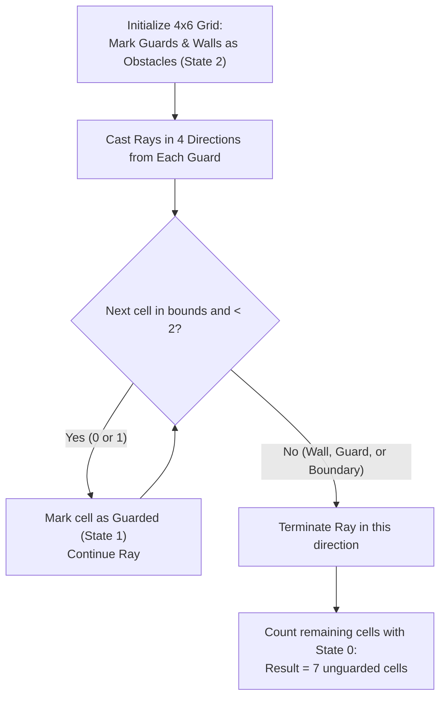

# Guided Example: Count Unguarded Cells in the Grid

## 1. Problem Overview & Representative Instance

Given grid dimensions $m \times n$, a 2D integer array $\text{guards}$ listing coordinates $[r, c]$ of security guards, and a 2D integer array $\text{walls}$ listing coordinates $[r, c]$ of solid walls, the objective is to determine the number of unoccupied grid cells that are completely **unguarded**.

Visibility mechanics:
1. Each guard can see in all $4$ cardinal directions: North (up), South (down), East (right), and West (left).
2. A guard's line of sight extends in an unbroken straight ray until it is blocked by:
   - A solid wall,
   - Another guard, or
   - The boundary of the grid.
3. A cell is **guarded** if it lies within the line of sight of at least one guard.
4. Cells that contain a guard or a wall are obstacles and are not counted as unguarded cells.

We must determine the cardinality of cells that are simultaneously unoccupied by guards, unoccupied by walls, and unreached by any guard's line of sight.

### Representative Instance

Consider a $4 \times 6$ grid ($m = 4, n = 6$):
- Guards at: $(0, 0)$, $(1, 1)$, and $(2, 3)$
- Walls at: $(0, 1)$, $(2, 2)$, and $(1, 4)$

Total grid cells: $4 \times 6 = 24$.
Obstacle count: $3 \text{ guards} + 3 \text{ walls} = 6 \text{ cells}$.
Initially unoccupied cells: $24 - 6 = 18 \text{ cells}$.

---

## 2. Mathematical & Algorithmic Principles

### Trinary State Encoding of Cells

To distinguish between visibility conduits and opaque obstacles, we assign each coordinate $(r, c)$ one of three discrete states:

$$\text{state}(r, c) \in \{0, 1, 2\}$$

- **State $0$ (Unoccupied & Unguarded):** The cell is empty and has not yet been reached by any line of sight.
- **State $1$ (Guarded Empty Cell):** The cell is empty, but is visible to at least one guard. Sight rays may pass through this cell unhindered.
- **State $2$ (Opaque Obstacle):** The cell contains a guard or a wall. It permanently terminates any incident line of sight.

### Ray Casting Propagation Rules

For each guard positioned at $(i, j)$:
Iterate through the four orthogonal unit vectors:
$$\mathbf{d} \in \{(-1, 0), (1, 0), (0, -1), (0, 1)\}$$
Advance coordinates step by step:
$$(x, y) \leftarrow (i + d_r, \; j + d_c), \quad (i + 2d_r, \; j + 2d_c), \quad \dots$$
At each step:
1. **Boundary Check:** If $(x, y)$ falls outside $[0, m - 1] \times [0, n - 1]$, terminate the ray.
2. **Obstacle Collision Check:** If $\text{state}(x, y) = 2$ (collision with a wall or another guard), terminate the ray immediately.
3. **Guard Marking:** If $\text{state}(x, y) < 2$, mark $\text{state}(x, y) \leftarrow 1$ and continue advancing in direction $\mathbf{d}$.

Because rays pass through cells that are already guarded ($\text{state} = 1$), sight is not prematurely stopped by intersecting rays of other guards.

### Global Count Reduction

After all rays from all guards have been traced to termination:

$$\text{Unguarded Count} = \sum_{r=0}^{m-1} \sum_{c=0}^{n-1} \mathbf{1}_{\text{state}(r, c) = 0}$$

---

## 3. Step-by-Step Walkthrough with Intermediate State

We trace the representative instance on the $4 \times 6$ grid.

### Phase 1: Setup Obstacles
Set $\text{state}(r, c) = 2$ for all guards and walls:
- Guards: $(0, 0), (1, 1), (2, 3)$
- Walls: $(0, 1), (2, 2), (1, 4)$
All other $18$ cells are initialized to $0$.

### Phase 2: Ray Casting by Guard

1. **Guard at $(0, 0)$:**
   - **East $(0, 1)$:** Cell $(0, 1)$ is a wall ($\text{state} = 2$). Ray blocked immediately.
   - **South:**
     - $(1, 0)$: empty $\implies$ mark $1$.
     - $(2, 0)$: empty $\implies$ mark $1$.
     - $(3, 0)$: empty $\implies$ mark $1$.
     - $(4, 0)$: out of bounds.
   - **North / West:** Out of bounds.

2. **Guard at $(1, 1)$:**
   - **North $(0, 1)$:** Cell $(0, 1)$ is a wall ($\text{state} = 2$). Ray blocked.
   - **West $(1, 0)$:** Cell $(1, 0)$ has $\text{state} = 1 < 2$. Re-mark $1$. Next is out of bounds.
   - **South:**
     - $(2, 1)$: empty $\implies$ mark $1$.
     - $(3, 1)$: empty $\implies$ mark $1$.
   - **East:**
     - $(1, 2)$: empty $\implies$ mark $1$.
     - $(1, 3)$: empty $\implies$ mark $1$.
     - $(1, 4)$: cell $(1, 4)$ is a wall ($\text{state} = 2$). Ray blocked.

3. **Guard at $(2, 3)$:**
   - **West $(2, 2)$:** Cell $(2, 2)$ is a wall ($\text{state} = 2$). Ray blocked.
   - **North:**
     - $(1, 3)$: has $\text{state} = 1 < 2$. Continue.
     - $(0, 3)$: empty $\implies$ mark $1$.
   - **South:**
     - $(3, 3)$: empty $\implies$ mark $1$.
   - **East:**
     - $(2, 4)$: empty $\implies$ mark $1$.
     - $(2, 5)$: empty $\implies$ mark $1$.

### Phase 3: Final Inventory of States
Counting remaining cells with $\text{state} = 0$:
- Row 0: $(0, 2), (0, 4), (0, 5)$ ($3$ cells).
- Row 1: $(1, 5)$ ($1$ cell, blocked by wall at $(1, 4)$).
- Row 2: None.
- Row 3: $(3, 2), (3, 4), (3, 5)$ ($3$ cells).
Total unguarded cells: $3 + 1 + 0 + 3 = 7$.

---

## 4. Comprehensive State Trace

### Complete Grid State Matrix

The table below catalogs the final state classification of all $24$ cells in the $4 \times 6$ grid:

| Coordinate $(r, c)$ | Entity Present | Guarded by Sight? | Final State Code | Classification |
|---|---|---|---|---|
| $(0, 0)$ | Guard | — | $2$ | Obstacle |
| $(0, 1)$ | Wall | — | $2$ | Obstacle |
| $(0, 2)$ | None | No | $0$ | **Unguarded** |
| $(0, 3)$ | None | Yes (Guard $(2, 3)$) | $1$ | Guarded |
| $(0, 4)$ | None | No | $0$ | **Unguarded** |
| $(0, 5)$ | None | No | $0$ | **Unguarded** |
| $(1, 0)$ | None | Yes (Guards $(0, 0), (1, 1)$) | $1$ | Guarded |
| $(1, 1)$ | Guard | — | $2$ | Obstacle |
| $(1, 2)$ | None | Yes (Guard $(1, 1)$) | $1$ | Guarded |
| $(1, 3)$ | None | Yes (Guards $(1, 1), (2, 3)$) | $1$ | Guarded |
| $(1, 4)$ | Wall | — | $2$ | Obstacle |
| $(1, 5)$ | None | No | $0$ | **Unguarded** |
| $(2, 0)$ | None | Yes (Guard $(0, 0)$) | $1$ | Guarded |
| $(2, 1)$ | None | Yes (Guard $(1, 1)$) | $1$ | Guarded |
| $(2, 2)$ | Wall | — | $2$ | Obstacle |
| $(2, 3)$ | Guard | — | $2$ | Obstacle |
| $(2, 4)$ | None | Yes (Guard $(2, 3)$) | $1$ | Guarded |
| $(2, 5)$ | None | Yes (Guard $(2, 3)$) | $1$ | Guarded |
| $(3, 0)$ | None | Yes (Guard $(0, 0)$) | $1$ | Guarded |
| $(3, 1)$ | None | Yes (Guard $(1, 1)$) | $1$ | Guarded |
| $(3, 2)$ | None | No | $0$ | **Unguarded** |
| $(3, 3)$ | None | Yes (Guard $(2, 3)$) | $1$ | Guarded |
| $(3, 4)$ | None | No | $0$ | **Unguarded** |
| $(3, 5)$ | None | No | $0$ | **Unguarded** |

### Category Tally Summary

| Grid Cell Category | State Value | Identified Coordinates | Count |
|---|---|---|---|
| **Obstacles (Guards + Walls)** | $2$ | $(0,0), (0,1), (1,1), (1,4), (2,2), (2,3)$ | $6$ |
| **Guarded Empty Cells** | $1$ | $(0,3), (1,0), (1,2), (1,3), (2,0), (2,1), (2,4), (2,5), (3,0), (3,1), (3,3)$ | $11$ |
| **Unguarded Empty Cells** | $0$ | $(0,2), (0,4), (0,5), (1,5), (3,2), (3,4), (3,5)$ | **$7$** |
| **Total Grid Cells** | — | $4 \times 6$ | $24$ |

---

## 5. Algorithmic Correctness & Soundness

### Obstacle Invariance

By setting both guards and walls to state $2$ during initialization:
- A wall blocks sight from guards on either side.
- A guard blocks sight from another guard behind them.
- Because the ray-advancement loop terminates whenever $\text{state}(x, y) \ge 2$, neither walls nor guards can be permeated by visibility rays.

### Transparency of Guarded Cells

Multiple guards may have overlapping sight lines (e.g. guard at $(1, 1)$ looking West and guard at $(0, 0)$ looking South cross at $(1, 0)$).
- A guarded empty cell has $\text{state} = 1$.
- Because $1 < 2$, ray casting through $(1, 0)$ continues forward without interruption.
- This preserves the physical reality that air or empty floor remains transparent even when illuminated by multiple guards.

---

## 6. Edge Cases & Anti-Patterns

### Edge Cases
1. **Guard Completely Enclosed by Walls:**
   If a guard is surrounded on all $4$ sides by walls (e.g. $(1, 1)$ enclosed by $(0, 1), (2, 1), (1, 0), (1, 2)$), all $4$ rays terminate after $0$ steps. The exterior cells remain unguarded.
2. **Single Row / Single Column Grid:**
   When $m = 1$ or $n = 1$, rays only propagate in two linear directions. Boundaries naturally stop out-of-bounds ray steps.
3. **Two Adjacent Guards:**
   If two guards are in adjacent cells $(0, 0)$ and $(0, 1)$, ray from $(0, 0)$ East hits $(0, 1)$ (state $2$) and immediately stops, correctly preventing the guard from seeing through their colleague.
4. **All Cells Guarded:**
   If guard coverage spans all empty cells, the final tally of zeros evaluates to $0$.

### Anti-Patterns to Avoid
- **Stopping Rays on State $1$ (Already Guarded):**
  If a ray stopped upon encountering an already-guarded cell ($\text{state} == 1$), a guard would fail to see cells lying further down the corridor behind that intersection, creating false shadows. Rays must continue through state $1$.
- **Breadth-First Search (BFS) / Flood Fill:**
  Applying standard flood-fill BFS expands around corners. Visibility moves strictly along straight Euclidean axes; it does not diffuse around walls.
- **Counting Obstacles as Unguarded:**
  Failing to mark wall and guard cells separately and later counting them as empty cells. Using state $2$ ensures they are never counted in the final sum.

---

## 7. Complexity Analysis

### Time Complexity
- **Grid Initialization:** Allocating and populating an $m \times n$ matrix takes $O(m \cdot n)$ operations.
- **Obstacle Placement:** Storing $G$ guards and $W$ walls takes $O(G + W)$ operations.
- **Ray Tracing:**
  Each guard casts $4$ rays. Although rays may overlap, a ray can traverse at most $\max(m, n)$ cells.
  Across all guards, each row and column is swept. If optimized to stop when reaching a cell already visited in the same direction, each cell is processed at most $4$ times:
  $$O(m \cdot n)$$
- **Final Counting:** Scanning the $m \times n$ matrix takes $O(m \cdot n)$ operations.
- **Total Time Complexity:** $\mathcal{O}(m \cdot n)$, which is strictly linear in the number of grid cells and optimal.

### Space Complexity
- **Grid Memory:** A 2D integer array of size $m \times n$: $O(m \cdot n)$.
- **Direction Offsets:** Constant tuple storage: $O(1)$.
- **Total Space Complexity:** $\mathcal{O}(m \cdot n)$ auxiliary space.
