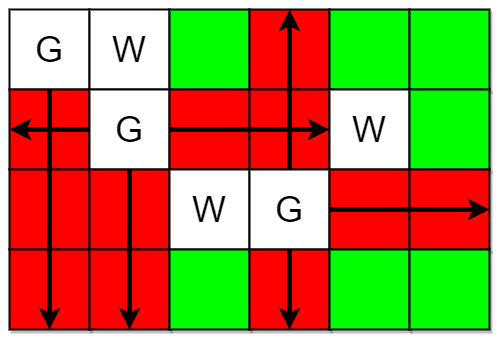
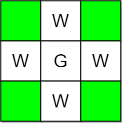

## Description

You are given two integers `m` and `n` representing a **0-indexed** `m x n` grid. You are also given two 2D integer arrays `guards` and `walls` where $\text{guards}[i] = [\text{row}_{i}, \text{col}_{i}]$ and $\text{walls}[j] = [\text{row}_{j}, \text{col}_{j}]$ represent the positions of the $$i^{\text{th}}$$ guard and $$j^{\text{th}}$$ wall respectively.

A guard can see **every** cell in the four cardinal directions (north, east, south, or west) starting from their position unless **obstructed** by a wall or another guard. A cell is **guarded** if there is **at least** one guard that can see it.

Return* the number of unoccupied cells that are **not** **guarded**.*
### Function Contract

- `n`: Input parameter.
- Returns expected result.

### Examples

#### Example 1

- **Input:** $m = 4, n = 6, guards = [[0,0],[1,1],[2,3]], walls = [[0,1],[2,2],[1,4]]$
- **Output:** `7`
- **Explanation:** The guarded and unguarded cells are shown in red and green respectively in the above diagram.
There are a total of 7 unguarded cells, so we return 7.
#### Example 2

- **Input:** $m = 3, n = 3, guards = [[1,1]], walls = [[0,1],[1,0],[2,1],[1,2]]$
- **Output:** `4`
- **Explanation:** The unguarded cells are shown in green in the above diagram.
There are a total of 4 unguarded cells, so we return 4.
### Constraints

- $1 \le m, n \le 10^{5}$

- $2 \le m * n \le 10^{5}$

- $1 \le \text{guards.length}, \text{walls.length} \le 5 * 10^{4}$

- $2 \le \text{guards.length} + \text{walls.length} \le m * n$

- $\text{guards}[i].length = \text{walls}[j].length = 2$

- $0 \le \text{row}_{i}, \text{row}_{j} < m$

- $0 \le \text{col}_{i}, \text{col}_{j} < n$

- All the positions in `guards` and `walls` are **unique**.