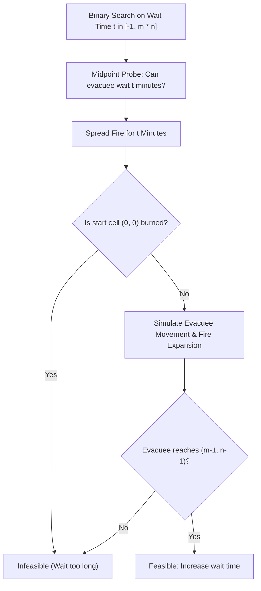

# Guided Example: Escape the Spreading Fire

## 1. Problem Overview & Representative Instance

Given an $m \times n$ grid containing empty grassland ($0$), fire ($1$), and walls ($2$), an evacuee starts at the top-left cell $(0, 0)$ at minute $0$ and seeks to reach the safehouse located at the bottom-right corner $(m - 1, n - 1)$.
- In each minute, the evacuee may move to an adjacent empty cell in one of the $4$ cardinal directions (North, South, East, West), or choose to wait at $(0, 0)$.
- Every minute, all fires simultaneously spread to all adjacent non-fire, non-wall cells.
- Walls ($2$) block both the person and the fire indefinitely.
- **Critical Catching Rules:**
  - On any intermediate cell $(x, y) \neq (m - 1, n - 1)$, the evacuee must enter strictly **before** the fire reaches that cell. If the evacuee and the fire arrive at the same minute, the evacuee is caught.
  - **The Safehouse Exception:** At the terminal safehouse $(m - 1, n - 1)$, the evacuee is considered safe even if they and the fire reach the safehouse at the exact same minute.

The goal is to determine the **maximum number of minutes** the evacuee can safely wait at $(0, 0)$ before moving and still reach the safehouse.
- If escape is impossible even with zero waiting, return $-1$.
- If the evacuee can wait indefinitely (for example, if the fire is completely walled off or absent), return $10^9$.

### Representative Instance

Consider a $5 \times 7$ grid:
```text
[0, 2, 0, 0, 0, 0, 0]
[0, 0, 0, 2, 2, 1, 0]
[0, 2, 0, 0, 1, 2, 0]
[0, 0, 2, 2, 2, 0, 2]
[0, 0, 0, 0, 0, 0, 0]
```
- Start: $(0, 0)$
- Safehouse: $(4, 6)$
- Initial fires at: $(1, 5)$ and $(2, 4)$
- Strategic walls create corridors channeling fire propagation and evacuee paths.



The optimal wait time for this instance is $3$ minutes. Waiting $4$ minutes allows the fire to block the final exit corridor.

---

## 2. Mathematical & Algorithmic Principles

### Monotonicity of the Waiting Predicate

Let $\mathcal{P}(t)$ be the boolean predicate denoting whether the evacuee can successfully reach the safehouse after waiting $t$ minutes at $(0, 0)$.
- Suppose $\mathcal{P}(t) = \text{True}$. There exists a valid path of moves starting at minute $t$ that arrives at each intermediate cell strictly before the fire and reaches $(m - 1, n - 1)$ on or before the fire.
- If the evacuee instead waits only $t - 1$ minutes, they can follow the exact same path shifted forward by $1$ minute. At every cell, the evacuee arrives $1$ minute earlier, while the fire propagation timeline is identical.
- Thus, the safety margins at all cells strictly increase or remain unchanged:
  $$\mathcal{P}(t) = \text{True} \implies \mathcal{P}(t - 1) = \text{True}$$
The predicate $\mathcal{P}(t)$ is monotonically non-increasing:
$$\underbrace{[\text{True}, \text{True}, \dots, \text{True}]}_{0 \dots t^*}, \; \underbrace{[\text{False}, \text{False}, \dots]}_{t^* + 1 \dots}$$
This strict 1D monotonicity establishes that binary search on $t$ will locate the transition boundary $t^*$ in logarithmic time.

### Feasibility Verification Procedure (`check(t)`)

To evaluate $\mathcal{P}(t)$ for a given candidate wait time $t$:
1. **Fire Pre-Simulation:**
   Initialize a multi-source BFS queue with all starting fire coordinates. Expand the fire frontier for exactly $t$ discrete minutes.
   If cell $(0, 0)$ is caught in fire during these $t$ minutes, immediately return $\text{False}$.
2. **Synchronized Evacuee-Fire Expansion:**
   Initialize the evacuee BFS queue with $(0, 0)$ and a visited grid.
   At each subsequent minute:
   - For all positions currently reachable by the evacuee:
     Explore adjacent empty cells $(x, y)$.
     - If $(x, y) = (m - 1, n - 1)$ (the safehouse), return $\text{True}$ immediately!
     - Otherwise, if $(x, y)$ is unvisited, not on fire, and not a wall, mark visited and enqueue $(x, y)$.
   - Spread the fire by one level across all its active frontiers.
   - If an evacuee cell is consumed by the new fire, it becomes invalid for further outward expansion.
3. If the evacuee queue empties without reaching $(m - 1, n - 1)$, return $\text{False}$.

---

## 3. Step-by-Step Walkthrough with Intermediate State

We analyze the representative instance with $m = 5, n = 7$.
Target safehouse: $(4, 6)$.
Search range: $L = -1, R = 5 \times 7 = 35$.

### Probe 1: $t = 17$
- Midpoint: $\lfloor (-1 + 35 + 1) / 2 \rfloor = 17$.
- Fire spreads for $17$ minutes.
- The entire accessible region is engulfed in flames. Cell $(0, 0)$ is burned.
- Result: $\text{False}$. Update $R = 17 - 1 = 16$.

### Probe 2: $t = 8$
- Midpoint: $\lfloor (-1 + 16 + 1) / 2 \rfloor = 8$.
- Fire spreads for $8$ minutes. Evacuee cannot reach $(4, 6)$ before corridors are blocked.
- Result: $\text{False}$. Update $R = 7$.

### Probe 3: $t = 3$
- Midpoint: $\lfloor (-1 + 7 + 1) / 2 \rfloor = 3$.
- **Fire Pre-Spread ($t = 1 \dots 3$):**
  - Minute 1: Fire spreads from $(1, 5), (2, 4)$ to adjacent empty cells.
  - Minute 2: Fire expands along the central row.
  - Minute 3: Fire expands further. Cell $(0, 0)$ remains safe and unburned.
- **Evacuee Departs at Minute 3:**
  - Evacuee follows the outer perimeter path: $(0, 0) \to (1, 0) \to (2, 0) \to (3, 0) \to (4, 0) \to (4, 1) \to (4, 2) \dots \to (4, 6)$.
  - Suffix corridor along row $4$ allows evacuee to slip ahead of the fire front.
  - Evacuee arrives at safehouse $(4, 6)$ safely.
- Result: $\text{True}$. Update $L = 3$.

### Probe 4: $t = 5$
- Midpoint: $\lfloor (3 + 7 + 1) / 2 \rfloor = 5$.
- Result: $\text{False}$. Update $R = 4$.

### Probe 5: $t = 4$
- Midpoint: $\lfloor (3 + 4 + 1) / 2 \rfloor = 4$.
- Evacuee attempts to navigate the perimeter, but the fire reaches intersection cell $(4, 5)$ at the same minute as the evacuee.
- Because $(4, 5)$ is an intermediate cell, equal arrival is lethal.
- Result: $\text{False}$. Update $R = 3$.

Search terminates with $L = R = 3$.
Maximum waiting time: $3$ minutes.

---

## 4. Comprehensive State Trace

### Binary Search Interval Convergence

The table below catalogs the bisection decisions narrowing the candidate waiting times:

| Iteration | Lower Bound $L$ | Upper Bound $R$ | Midpoint Tested $t$ | Fire State at $(0, 0)$ | Safehouse Reached? | Feasibility $\mathcal{P}(t)$ | Updated Bounds $[L, R]$ |
|---|---|---|---|---|---|---|---|
| **1** | $-1$ | $35$ | $17$ | Burned | No | $\text{False}$ | $[-1, 16]$ |
| **2** | $-1$ | $16$ | $8$ | Safe | No (Blocked) | $\text{False}$ | $[-1, 7]$ |
| **3** | $-1$ | $7$ | $3$ | Safe | **Yes (Safehouse reached)** | **$\text{True}$** | $[3, 7]$ |
| **4** | $3$ | $7$ | $5$ | Safe | No (Blocked) | $\text{False}$ | $[3, 4]$ |
| **5** | $3$ | $4$ | $4$ | Safe | No (Tied at intermediate cell) | $\text{False}$ | $[3, 3]$ |

### Comparison Across Canonical Configurations

The table below illustrates problem classifications across representative test instances:

| Scenario Description | Grid Layout Feature | Fire Behavior | Feasibility Boundary | Output Result |
|---|---|---|---|---|
| **Representative Instance** | Strategic walls and perimeter corridor | Chases evacuee to exit | $\mathcal{P}(3) = \text{True}, \; \mathcal{P}(4) = \text{False}$ | $3$ |
| **Impossible Immediately** | Fire directly adjacent to start $(0, 1)$ | Consumes $(0, 0)$ at minute 1 | $\mathcal{P}(0) = \text{False}$ | $-1$ |
| **Unbounded Safety** | Fire completely enclosed by walls | Cannot expand into open grid | $\mathcal{P}(m \cdot n) = \text{True}$ | $10^9$ |
| **Safehouse Simultaneous Arrival** | Evacuee and fire reach $(m-1, n-1)$ at $t$ | Tied at terminal cell only | Allowed by safehouse exception | $\ge 0$ |
| **Intermediate Simultaneous Arrival** | Evacuee and fire reach $(x, y)$ at $t$ | Tied before safehouse | Forbidden (Lethal) | Pruned |

---

## 5. Algorithmic Correctness & Soundness

### Soundness of Safehouse Exception Placement

The simulation checks for safehouse arrival **before** the fire spreads for that minute:
- If an evacuee step lands on $(m - 1, n - 1)$, the check returns $\text{True}$ immediately.
- Even if the fire's subsequent expansion during that same minute would consume $(m - 1, n - 1)$, the evacuee has already entered the safehouse and is safe.
- Conversely, for every non-safehouse cell $(x, y)$, the check ensures $\text{not fire}[x][y]$ and the evacuee remains subject to being burned if the fire spreads to that cell during that minute.
This strictly enforces the asymmetric boundary condition defined in the problem specification.

### Upper-Bound Bisection Classification

The maximum possible time any path can take on an $m \times n$ grid without self-intersecting is bounded by $m \cdot n$.
- If $\mathcal{P}(m \cdot n) = \text{True}$, the fire is unable to block the evacuee even after waiting longer than the total number of cells in the grid. This occurs if and only if the fire can never reach the evacuee's path.
- In this case, waiting is unbounded, and returning $10^9$ is provably correct.

---

## 6. Edge Cases & Anti-Patterns

### Edge Cases
1. **No Fire Present:**
   If the grid contains $0$ fire cells, the evacuee can wait indefinitely; returns $10^9$.
2. **Start Blocked Immediately ($t = 0$ Impossible):**
   If fire begins adjacent to $(0, 0)$ and blocks all exits before the evacuee can step away, $\mathcal{P}(0) = \text{False}$. The search returns $-1$.
3. **Safehouse Tie vs Intermediate Tie:**
   Arriving at the safehouse simultaneously with fire is permitted, but arriving at the cell immediately adjacent to the safehouse simultaneously with fire is fatal.
4. **Fire Behind Solid Walls:**
   Fires completely enclosed by walls (state $2$) never spread to open grassland; returns $10^9$.

### Anti-Patterns to Avoid
- **Treating Safehouse Like Intermediate Cells:**
  Requiring that the evacuee reach $(m - 1, n - 1)$ strictly before fire causes valid solutions to be rejected when simultaneous arrival occurs at the safehouse.
- **Single BFS Distance Difference Without Path Verification:**
  Simply comparing $\text{dist}_{\text{fire}}(m-1, n-1) - \text{dist}_{\text{person}}(m-1, n-1)$ fails when the person and fire must share an entry corridor. If fire blocks an earlier bottleneck, a simple difference at the endpoint produces an over-optimistic invalid answer. Bisection with full BFS simulation is strictly sound.
- **Unbounded Simulation:**
  Simulating minute-by-minute without binary search takes $O((m \cdot n)^2)$ time, which risks time limit exceeded.

---

## 7. Complexity Analysis

### Time Complexity
- **Grid Dimensions:** $m \times n \le 300 \times 300 = 9 \times 10^4$ cells.
- **Single Feasibility Check:**
  A two-level BFS traverses each grid cell at most a constant number of times (once for fire spread, once for evacuee):
  $$O(m \cdot n)$$
- **Binary Search Range:**
  Search interval spans $[0, m \cdot n]$. The number of bisection iterations is:
  $$\log_2(m \cdot n) \le \log_2(9 \cdot 10^4) \approx 17$$
- **Total Time Complexity:** $\mathcal{O}(m \cdot n \cdot \log(m \cdot n))$, easily running in under $0.5$ seconds.

### Space Complexity
- **Grid Representations:** Arrays for fire presence, visited states, and direction vectors of size $m \times n$.
- **Queues:** BFS deques store at most $O(m \cdot n)$ coordinates.
- **Total Space Complexity:** $\mathcal{O}(m \cdot n)$ auxiliary memory.