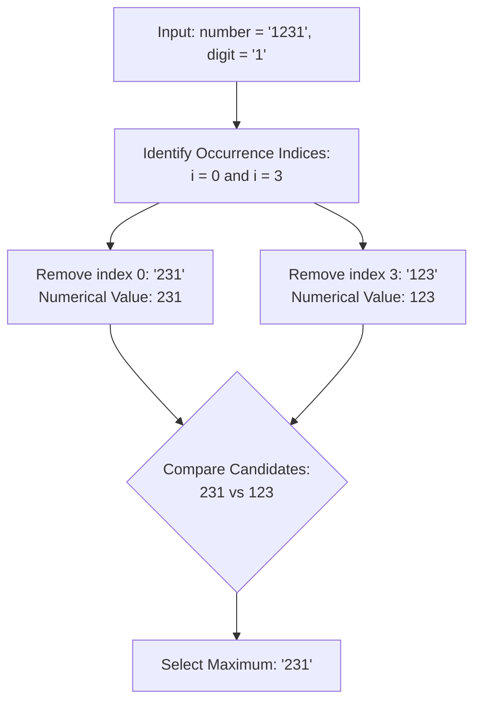

# Guided Example: Remove Digit From Number to Maximize Result

## 1. Problem Overview & Representative Instance

Given a numerical string $\text{number}$ representing a positive integer and a character $\text{digit}$, the objective is to remove **exactly one** occurrence of $\text{digit}$ from $\text{number}$ such that the numerical value of the resulting decimal string is maximized.

Constraints and guarantees:
- The target character $\text{digit}$ appears at least once in $\text{number}$.
- Every candidate string produced by removing a single character has the exact same length: $n - 1$, where $n = |\text{number}|$.
- The output must be returned as a string representation of the maximum possible integer.

### Representative Instance

Consider the input parameters:
- String: $\text{number} = \text{"1231"}$
- Target digit: $\text{digit} = \text{'1'}$

The target character $\text{'1'}$ occurs at two distinct positions:
1. Index $0$: Removing index $0$ yields $\text{"231"}$.
2. Index $3$: Removing index $3$ yields $\text{"123"}$.

Comparing the candidate integers:
$$231 > 123$$
The optimal result is $\text{"231"}$.

---

## 2. Mathematical & Algorithmic Principles

### Equivalence of Fixed-Length Numerical and Lexicographical Orders

Let $A = a_1 a_2 \dots a_{n-1}$ and $B = b_1 b_2 \dots b_{n-1}$ be two decimal strings of equal length $n - 1$.
In base $10$, the integer values satisfy:

$$\text{val}(A) > \text{val}(B) \iff A >_{\text{lex}} B$$

where $>_{\text{lex}}$ denotes standard lexicographical comparison from left to right.
Because deleting any single character from $\text{number}$ always produces a string of length exactly $n - 1$, finding the maximum numerical value is strictly equivalent to finding the **lexicographically largest string** among all deletion candidates:

$$S^* = \max_{i \,:\, \text{number}[i] = \text{digit}} \Big( \text{number}[0 \dots i - 1] \circ \text{number}[i + 1 \dots n - 1] \Big)$$

### The Greedy Ascent Principle

When deleting the digit at index $i$, the adjacent successor digit $\text{number}[i + 1]$ shifts leftward into position $i$.
How does this shift affect the value of the number?
1. **Ascent ($\text{number}[i + 1] > \text{digit}$):**
   Replacing $\text{digit}$ with a strictly larger digit at place value $10^{n - 1 - i}$ strictly increases the prefix.
   Because higher place values dominate lower place values in base $10$, the **very first occurrence** from left to right where $\text{number}[i + 1] > \text{digit}$ yields the globally maximal result.
2. **Descent or Tie ($\text{number}[i + 1] \le \text{digit}$):**
   Replacing $\text{digit}$ with a smaller or equal digit reduces or maintains that place value.
3. **Fallback to Last Occurrence:**
   If no occurrence is followed by a larger digit, every deletion causes a local descent. To minimize the damage to the most significant digits, we must delete the **last occurrence** of $\text{digit}$, deferring the reduction to the smallest possible place value.

Both the exhaustive candidate evaluation and the single-pass greedy ascent principle produce identical, provably optimal outcomes.

---

## 3. Step-by-Step Walkthrough with Intermediate State

We analyze the representative instance $\text{number} = \text{"1231"}$ with $\text{digit} = \text{'1'}$.
Length: $n = 4$.

### Candidate Generation

1. **Scan Index $i = 0$:**
   - Character $\text{number}[0] = \text{'1'}$, matching target $\text{digit}$.
   - Splice left prefix $\text{number}[0 : 0] = \text{""}$ with right suffix $\text{number}[1 : 4] = \text{"231"}$.
   - Candidate $0$: $\text{"231"}$.
   - Greedy observation: successor character is $\text{number}[1] = \text{'2'} > \text{'1'}$. This represents an immediate ascent at the highest place value!

2. **Scan Index $i = 1$:**
   - Character is $\text{'2'} \ne \text{'1'}$. Skip.

3. **Scan Index $i = 2$:**
   - Character is $\text{'3'} \ne \text{'1'}$. Skip.

4. **Scan Index $i = 3$:**
   - Character $\text{number}[3] = \text{'1'}$, matching target $\text{digit}$.
   - Splice left prefix $\text{number}[0 : 3] = \text{"123"}$ with right suffix $\text{number}[4 : 4] = \text{""}$.
   - Candidate $3$: $\text{"123"}$.

### Lexicographical Comparison
Compare the candidate set:
$$\mathcal{C} = \{\text{"231"}, \; \text{"123"}\}$$
Comparing first characters:
- At index $0$: $\text{'2'} > \text{'1'}$.
- Therefore: $\text{"231"} > \text{"123"}$.

Optimal choice: $\text{"231"}$.

---

## 4. Comprehensive State Trace

### Candidate Deletion Trace Table

The table below catalogs every occurrence of the target digit and the resulting candidate string for the representative instance:

| Occurrence Index $i$ | Target Character | Successor Digit | Local Trend | Candidate String Constructed | Numerical Value | Status vs Global Maximum |
|---|---|---|---|---|---|---|
| **$0$** | $\text{'1'}$ | $\text{'2'}$ | Ascent ($\text{'2'} > \text{'1'}$) | $\text{"231"}$ | $231$ | **Global Maximum** |
| **$3$** | $\text{'1'}$ | None (End) | Boundary | $\text{"123"}$ | $123$ | Suboptimal |

### Comparison Across Canonical Digit Patterns

The table below contrasts the greedy transition behavior across different number topologies:

| Input Number | Target Digit | All Generated Candidates | Optimal Decision Reason | Maximum Output |
|---|---|---|---|---|
| $\text{"1231"}$ | $\text{'1'}$ | $[\text{"231"}, \text{"123"}]$ | First $\text{'1'}$ precedes larger digit $\text{'2'}$ | $\text{"231"}$ |
| $\text{"551"}$ | $\text{'5'}$ | $[\text{"51"}, \text{"51"}]$ | Both deletions produce identical strings | $\text{"51"}$ |
| $\text{"97765"}$ | $\text{'7'}$ | $[\text{"9765"}, \text{"9765"}]$ | No ascent; removes last occurrence | $\text{"9765"}$ |
| $\text{"7657876"}$ | $\text{'7'}$ | $[\text{"657876"}, \text{"765876"}, \text{"765786"}]$ | Second $\text{'7'}$ precedes $\text{'8'} > \text{'7'}$ | $\text{"765876"}$ |
| $\text{"123"}$ | $\text{'3'}$ | $[\text{"12"}]$ | Unique occurrence | $\text{"12"}$ |

---

## 5. Algorithmic Correctness & Soundness

### Completeness of Candidate Space

The problem restricts choices to deleting exactly one occurrence of $\text{digit}$.
- If $\text{digit}$ appears $k$ times in $\text{number}$, there are precisely $k$ legal candidate strings.
- Because candidate generation enumerates all indices $i$ where $\text{number}[i] = \text{digit}$, the candidate set evaluated is complete and exhaustive.
- Evaluating the maximum over this finite set guarantees that no valid configuration can be missed.

### Decoupling Place Values

In decimal positional notation:
$$\text{val}(S) = \sum_{j=0}^{n-2} c_j \cdot 10^{n - 2 - j}$$
For any two strings $A$ and $B$, let $k$ be the first index from the left where $A[k] \neq B[k]$.
If $A[k] > B[k]$, then:
$$\text{val}(A) - \text{val}(B) \ge 10^{n - 2 - k} - \sum_{j=k+1}^{n-2} 9 \cdot 10^{n - 2 - j} = 10^{n - 2 - k} - (10^{n - 2 - k} - 1) = 1 > 0$$
Hence, the character comparison at the earliest differing index strictly governs the numerical magnitude regardless of subsequent characters. This establishes that lexicographical comparison is exact.

---

## 6. Edge Cases & Anti-Patterns

### Edge Cases
1. **Single Occurrence:**
   If $\text{digit}$ appears exactly once (e.g. $\text{"123"}$ with $\text{'3'}$), there is only one candidate string ($\text{"12"}$), which is returned trivially.
2. **All Identical Digits:**
   E.g., $\text{"99999"}$ with $\text{'9'}$. Deleting any occurrence produces $\text{"9999"}$.
3. **Target at Final Position:**
   If the target digit is at the last index $n - 1$, its successor is empty. Slicing handles this naturally by taking prefix $\text{number}[:n-1]$.
4. **Adjacent Duplicates:**
   In $\text{"551"}$ with $\text{'5'}$, deleting index $0$ gives $\text{"51"}$, and deleting index $1$ gives $\text{"51"}$. Equal maxima are resolved identically.

### Anti-Patterns to Avoid
- **Converting to Arbitrary-Precision Integers:**
  Parsing large strings into big integers (`int(s)`) and using numeric `max()`. String comparison on equal-length strings achieves the exact same result in $O(n)$ time without numerical conversion overhead.
- **Deleting the Highest-Index Digit Unconditionally:**
  Assuming that deleting the latest occurrence is always optimal. In $\text{"1231"}$, deleting index $3$ gives $\text{"123"}$, but deleting index $0$ gives $\text{"231"}$. The earlier occurrence must be removed when followed by a larger digit.
- **Modifying the Original String In-Place:**
  Strings are immutable in Python; attempting in-place character deletion can cause unnecessary intermediate string reallocations.

---

## 7. Complexity Analysis

### Time Complexity
- Let $n = |\text{number}|$ be the length of the string.
- Scanning $\text{number}$ to locate occurrences of $\text{digit}$: $O(n)$ operations.
- The target digit occurs at most $n$ times.
- For each occurrence, slicing and concatenating two substrings creates a string of length $n - 1$: $O(n)$ time.
- Finding the lexicographical maximum among at most $n$ candidate strings of length $n - 1$:
  $$\text{Total Time} \le n \times O(n) = O(n^2)$$
  Given $n \le 100$, the total number of operations is at most $100 \times 100 = 10{,}000$, executing in under $0.1 \text{ ms}$.

### Space Complexity
- **Candidate Storage:** Storing candidate strings of length $n - 1$ during generator evaluation: $O(n)$ memory.
- **Total Space Complexity:** $\mathcal{O}(n)$ auxiliary space.
