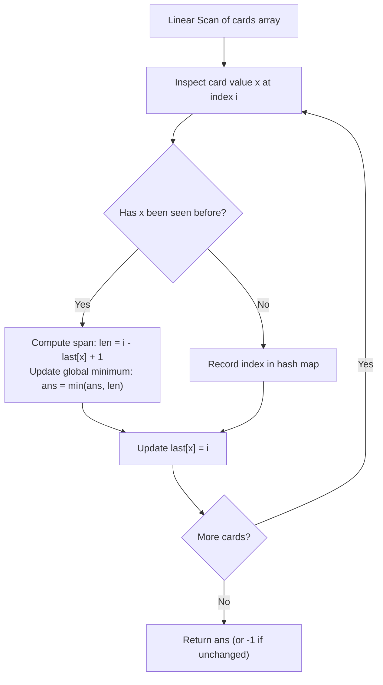

# Guided Example: Minimum Consecutive Cards to Pick Up

## 1. Problem Overview & Representative Instance

Given an integer array $\text{cards}$ where $\text{cards}[i]$ represents the value of the card at index $i$, the task is to find the minimum number of consecutive cards that must be picked up from the array so that the selected contiguous subsegment contains at least one pair of matching cards (two cards with identical values).

If it is impossible to find any matching pair anywhere in the array (that is, all elements in $\text{cards}$ are distinct), the required result is $-1$.

A contiguous subarray spanning indices from $j$ to $i$ (with $j \le i$) contains $i - j + 1$ cards. A matching pair is present within the span if $\text{cards}[j] = \text{cards}[i]$ with $j < i$.

### Representative Instance

Consider the card sequence:
$$\text{cards} = [3, 4, 2, 3, 4, 7]$$

Array length: $n = 6$.
Examining duplicate values in the sequence:
- Value $3$ appears at index $0$ and index $3$. Subarray $[0 \dots 3]$ contains $[3, 4, 2, 3]$ with length $3 - 0 + 1 = 4$.
- Value $4$ appears at index $1$ and index $4$. Subarray $[1 \dots 4]$ contains $[4, 2, 3, 4]$ with length $4 - 1 + 1 = 4$.
- Value $2$ and Value $7$ appear only once.

Both matching pairs require picking up a minimum of $4$ consecutive cards. The expected output is $4$.

---

## 2. Mathematical & Algorithmic Principles

### Subarray Minimization and Adjacent Occurrence Sufficiency

A contiguous subarray $\text{cards}[j \dots i]$ contains a pair of matching cards if and only if there exist two indices $a, b$ such that $j \le a < b \le i$ with $\text{cards}[a] = \text{cards}[b]$.
The length of such a subarray is $i - j + 1 \ge b - a + 1$.
Therefore, the minimal subarray containing matching cards is achieved when the matching cards form the exact endpoints of the window: $j = a$ and $i = b$, giving length $b - a + 1$.

Now consider three or more occurrences of the same card value $x$ at indices $k_1 < k_2 < k_3$:
- The pair $(k_1, k_3)$ spans length $k_3 - k_1 + 1$.
- The pair $(k_2, k_3)$ spans length $k_3 - k_2 + 1 < k_3 - k_1 + 1$.
- The pair $(k_1, k_2)$ spans length $k_2 - k_1 + 1 < k_3 - k_1 + 1$.

Because $k_3 - k_2 + 1$ and $k_2 - k_1 + 1$ are both strictly smaller than $k_3 - k_1 + 1$, distant non-consecutive occurrences of the same value can never achieve a smaller span than adjacent occurrences.
Hence, the search space reduces strictly to **immediately consecutive occurrences** of identical values:

$$\text{Optimal Length} = \min_{x} \min_{k_m, k_{m+1}} (k_{m+1} - k_m + 1)$$

### Hash Map for Most Recent Positions

To evaluate consecutive occurrences in a single streaming pass:
1. Maintain a hash table $\text{last}$ mapping each card value $x \to \text{index of its most recent occurrence}$.
2. Traverse the array with index $i$ from $0$ to $n - 1$:
   - If $\text{cards}[i] = x$ is already present in $\text{last}$:
     $$\text{current\_span} = i - \text{last}[x] + 1$$
     $$\text{ans} \leftarrow \min(\text{ans}, \; \text{current\_span})$$
   - Update $\text{last}[x] \leftarrow i$.
3. If no duplicate is ever encountered, $\text{ans}$ remains $\infty$, and the algorithm returns $-1$.

---

## 3. Step-by-Step Walkthrough with Intermediate State

We trace the representative instance $\text{cards} = [3, 4, 2, 3, 4, 7]$.
Initialize $\text{last} = \{\}$, $\text{ans} = \infty$.

### Step 1: Index $i = 0$, Value $x = 3$
- $3 \notin \text{last}$.
- Update: $\text{last}[3] \leftarrow 0$.
- State: $\text{last} = \{3: 0\}$, $\text{ans} = \infty$.

### Step 2: Index $i = 1$, Value $x = 4$
- $4 \notin \text{last}$.
- Update: $\text{last}[4] \leftarrow 1$.
- State: $\text{last} = \{3: 0, 4: 1\}$, $\text{ans} = \infty$.

### Step 3: Index $i = 2$, Value $x = 2$
- $2 \notin \text{last}$.
- Update: $\text{last}[2] \leftarrow 2$.
- State: $\text{last} = \{3: 0, 4: 1, 2: 2\}$, $\text{ans} = \infty$.

### Step 4: Index $i = 3$, Value $x = 3$
- $3 \in \text{last}$ at index $0$!
- Calculate consecutive span:
  $$\text{span} = i - \text{last}[3] + 1 = 3 - 0 + 1 = 4$$
- Subarray: $\text{cards}[0 \dots 3] = [3, 4, 2, 3]$.
- Update global minimum: $\text{ans} = \min(\infty, 4) = 4$.
- Update last seen position: $\text{last}[3] \leftarrow 3$.
- State: $\text{last} = \{3: 3, 4: 1, 2: 2\}$, $\text{ans} = 4$.

### Step 5: Index $i = 4$, Value $x = 4$
- $4 \in \text{last}$ at index $1$!
- Calculate consecutive span:
  $$\text{span} = i - \text{last}[4] + 1 = 4 - 1 + 1 = 4$$
- Subarray: $\text{cards}[1 \dots 4] = [4, 2, 3, 4]$.
- Update global minimum: $\text{ans} = \min(4, 4) = 4$.
- Update last seen position: $\text{last}[4] \leftarrow 4$.
- State: $\text{last} = \{3: 3, 4: 4, 2: 2\}$, $\text{ans} = 4$.

### Step 6: Index $i = 5$, Value $x = 7$
- $7 \notin \text{last}$.
- Update: $\text{last}[7] \leftarrow 5$.
- State: $\text{ans} = 4$.

Final Result: $4$.

---

## 4. Comprehensive State Trace

### Step-by-Step Execution Log

The table below catalogs every step of the linear scan on the representative instance:

| Index $i$ | Card Value $x$ | Previously Seen? | Previous Index $\text{last}[x]$ | Subarray Span $i - \text{last}[x] + 1$ | Subarray Slice | Updated Minimum $\text{ans}$ | Updated Hash Map Entry |
|---|---|---|---|---|---|---|---|
| **$0$** | $3$ | No | — | — | — | $\infty$ | $3 \to 0$ |
| **$1$** | $4$ | No | — | — | — | $\infty$ | $4 \to 1$ |
| **$2$** | $2$ | No | — | — | — | $\infty$ | $2 \to 2$ |
| **$3$** | $3$ | **Yes** | $0$ | $3 - 0 + 1 = 4$ | $[3, 4, 2, 3]$ | **$4$** | $3 \to 3$ |
| **$4$** | $4$ | **Yes** | $1$ | $4 - 1 + 1 = 4$ | $[4, 2, 3, 4]$ | **$4$** | $4 \to 4$ |
| **$5$** | $7$ | No | — | — | — | $4$ | $7 \to 5$ |

### Behavior Across Canonical Edge Scenarios

| Scenario | Input Array $\text{cards}$ | Observed Pairs $(x, j, i)$ | Computed Spans | Result | Explanation |
|---|---|---|---|---|---|
| **Adjacent Duplicates** | $[8, 8]$ | $(8, 0, 1)$ | $1 - 0 + 1 = 2$ | $2$ | Smallest possible answer for any valid pair |
| **Three Identical Cards** | $[1, 2, 1, 3, 1]$ | $(1, 0, 2)$ and $(1, 2, 4)$ | $3$ and $3$ | $3$ | Latest occurrence bounds the minimal window |
| **All Distinct** | $[1, 0, 5, 3]$ | None | None | $-1$ | No pair exists |
| **Single Card** | $[42]$ | None | None | $-1$ | Cannot form a pair with $n = 1$ |
| **Late Adjacent Pair** | $[7, 1, 2, 3, 7, 9, 9]$ | $(7, 0, 4)$ and $(9, 5, 6)$ | $5$ and $2$ | $2$ | Late adjacent pair beats earlier distant pair |

---

## 5. Algorithmic Correctness & Soundness

### Global Optimality Proof

Suppose the global minimum consecutive cards containing a pair is achieved by some subarray $\text{cards}[a \dots b]$ with $\text{cards}[a] = \text{cards}[b] = v$ and length $L^* = b - a + 1$.
1. If there were another occurrence of $v$ at index $c$ strictly between $a$ and $b$ ($a < c < b$), then the subsegment $[c \dots b]$ would contain matching cards with length $b - c + 1 < b - a + 1 = L^*$, contradicting the assumption that $L^*$ is minimal.
2. Therefore, $a$ and $b$ must be consecutive occurrences of value $v$.
3. When the algorithm reaches index $b$, $\text{last}[v]$ stores the immediately preceding occurrence of $v$, which is precisely $a$.
4. The calculation $b - \text{last}[v] + 1$ evaluates $b - a + 1 = L^*$.
5. Because every adjacent pair of identical values is evaluated when its right endpoint is visited, the global minimum $L^*$ is guaranteed to be observed.

### No False Positives

Every candidate span considered is of the form $i - \text{last}[x] + 1$.
Because $\text{last}[x]$ is an actual index where $\text{cards}[\text{last}[x]] = x$ and $i > \text{last}[x]$ has $\text{cards}[i] = x$, the subarray $\text{cards}[\text{last}[x] \dots i]$ starts and ends with matching card $x$. The subarray is valid by construction.

---

## 6. Edge Cases & Anti-Patterns

### Edge Cases
1. **Adjacent Identical Cards ($i - j = 1$):**
   E.g., $[8, 8]$. The span is $1 - 0 + 1 = 2$, which is the absolute theoretical minimum for any pair.
2. **All Elements Distinct:**
   If no value appears more than once, the condition `x in last` is never triggered. $\text{ans}$ remains $\infty$, returning $-1$.
3. **Array with Single Card ($n = 1$):**
   Loop terminates after 1 iteration without finding duplicates, correctly returning $-1$.
4. **Card Value Zero ($0$):**
   Values can be $0$. In Python, `if x in last` accurately distinguishes key presence from truthiness of the value.

### Anti-Patterns to Avoid
- **Brute Force All Subarrays:**
  Evaluating all pairs $(j, i)$ with $0 \le j < i < n$ takes $O(n^2)$ time. For $n = 10^5$, $10^{10}$ iterations will time out.
- **Storing All Occurrences in Lists:**
  Mapping $x \to [k_1, k_2, \dots]$ and computing adjacent differences in a second pass. While asymptotically $O(n)$, storing all index lists creates extra memory overhead. Keeping only the single most recent index $\text{last}[x]$ is strictly leaner.
- **Two-Pointer Sliding Window:**
  Attempting a dynamic two-pointer sliding window with expansion and contraction. Sliding window requires a frequency counter and contracts from the left, which adds overhead compared to the simple direct index subtraction $i - \text{last}[x] + 1$.

---

## 7. Complexity Analysis

### Time Complexity
- **Single Pass:** The algorithm iterates through the array of length $n$ exactly once.
- **Hash Table Operations:** For each element, checking key membership, retrieving the previous index, and updating the entry takes $O(1)$ expected time.
- **Total Time Complexity:** $\mathcal{O}(n)$, which is linear in the size of $\text{cards}$ and strictly optimal.

### Space Complexity
- **Hash Map Storage:** The table $\text{last}$ stores at most one integer index per distinct card value, bounded by $n$.
- **Total Space Complexity:** $\mathcal{O}(n)$ auxiliary memory in the worst case where all elements are distinct.
