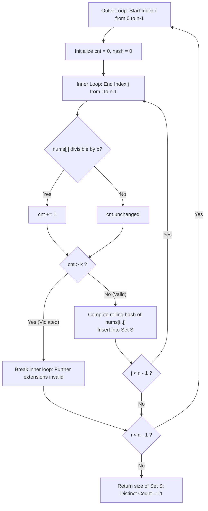

# Guided Example: K Divisible Elements Subarrays

## 1. Problem Overview & Representative Instance

Given an integer array $\text{nums}$ and two integers $k$ and $p$, the goal is to determine the number of **distinct** subarrays that contain at most $k$ elements that are divisible by $p$.

Definitions and distinctness rules:
1. A **subarray** is a contiguous non-empty sequence of elements within an array, denoted $\text{nums}[i \dots j]$ with $0 \le i \le j < n$.
2. An element $x$ is divisible by $p$ if $x \pmod p = 0$.
3. Two subarrays $\text{nums}[i_1 \dots j_1]$ and $\text{nums}[i_2 \dots j_2]$ are distinct if they differ in length or differ in value at some position. If two subarrays at different starting indices contain the exact same sequence of values, they are considered identical and must be counted **only once**.

### Representative Instance

Consider the array parameters:
- $\text{nums} = [2, 3, 3, 2, 2]$
- Maximum divisible elements allowed: $k = 2$
- Divisor: $p = 2$

Examining the divisibility of each element by $p = 2$:
- $\text{nums}[0] = 2$: Divisible ($2 \pmod 2 = 0$)
- $\text{nums}[1] = 3$: Not divisible ($3 \pmod 2 = 1$)
- $\text{nums}[2] = 3$: Not divisible ($3 \pmod 2 = 1$)
- $\text{nums}[3] = 2$: Divisible ($2 \pmod 2 = 0$)
- $\text{nums}[4] = 2$: Divisible ($2 \pmod 2 = 0$)

The binary divisibility mask is $[1, 0, 0, 1, 1]$.
We must enumerate all subarrays containing at most $2$ ones in this mask and deduplicate identical sequences.

---

## 2. Mathematical & Algorithmic Principles

### Divisibility Quota Monotonicity

For a fixed start index $i$, as end index $j$ increases monotonically from $i$ to $n - 1$:
The number of divisible elements in $\text{nums}[i \dots j]$ is:

$$C(i, j) = \sum_{m=i}^j \mathbf{1}_{\text{nums}[m] \pmod p = 0}$$

Because each indicator term is non-negative ($0$ or $1$), $C(i, j)$ is weakly monotonically increasing with respect to $j$:

$$C(i, j + 1) \ge C(i, j)$$

Consequently, if $C(i, j) > k$ for some index $j$, then for all $j' > j$:
$$C(i, j') \ge C(i, j) > k$$
This monotonicity guarantees that once the count of divisible elements exceeds $k$, the inner loop can safely terminate immediately. No subsequent extension of that prefix can ever become valid.

### Subarray Identity and Canonical Deduplication

Two subarrays $A = \text{nums}[i_1 \dots j_1]$ and $B = \text{nums}[i_2 \dots j_2]$ are value-equivalent if:

$$|A| = |B| = L \quad \text{and} \quad \forall t \in [0, L - 1], \; A[t] = B[t]$$

To count distinct value sequences efficiently without storing full subarray slices:
1. **Rolling Polynomial Hash:**
   As $j$ expands from $i$, maintain a rolling polynomial hash:
   $$H_1(j) = (H_1(j - 1) \times B_1 + \text{nums}[j]) \pmod{M_1}$$
   $$H_2(j) = (H_2(j - 1) \times B_2 + \text{nums}[j]) \pmod{M_2}$$
   where $B_1 = 131, B_2 = 13331$ and $M_1 = 10^9 + 7, M_2 = 10^9 + 9$.
   The composite 64-bit signature is formed by:
   $$\text{sig} = (H_1 \ll 32) \lor H_2$$
   Double hashing with large primes virtually eliminates collision probability across the small search space of at most $\approx 2 \times 10^4$ subarrays.
2. **Alternative Structure (Trie):**
   Alternatively, inserting characters of valid subarrays into a Trie where each distinct path from the root represents a unique sequence naturally deduplicates equivalent subarrays.

The cardinality of the hash set $|\mathcal{S}|$ directly gives the number of distinct valid subarrays.

---

## 3. Step-by-Step Walkthrough with Intermediate State

We trace the representative instance $\text{nums} = [2, 3, 3, 2, 2]$ with $k = 2, p = 2$.
Total elements: $n = 5$. Initialize set $\mathcal{S} = \emptyset$.

### Outer Loop $i = 0$
- $j = 0$ (val $2$): divisible $\implies \text{cnt} = 1 \le 2$. Valid! Subarray $[2]$. Insert into $\mathcal{S}$.
- $j = 1$ (val $3$): not divisible $\implies \text{cnt} = 1 \le 2$. Valid! Subarray $[2, 3]$. Insert into $\mathcal{S}$.
- $j = 2$ (val $3$): not divisible $\implies \text{cnt} = 1 \le 2$. Valid! Subarray $[2, 3, 3]$. Insert into $\mathcal{S}$.
- $j = 3$ (val $2$): divisible $\implies \text{cnt} = 2 \le 2$. Valid! Subarray $[2, 3, 3, 2]$. Insert into $\mathcal{S}$.
- $j = 4$ (val $2$): divisible $\implies \text{cnt} = 3 > 2$. Threshold exceeded! Break.

### Outer Loop $i = 1$
- $j = 1$ (val $3$): not divisible $\implies \text{cnt} = 0 \le 2$. Valid! Subarray $[3]$. Insert into $\mathcal{S}$.
- $j = 2$ (val $3$): not divisible $\implies \text{cnt} = 0 \le 2$. Valid! Subarray $[3, 3]$. Insert into $\mathcal{S}$.
- $j = 3$ (val $2$): divisible $\implies \text{cnt} = 1 \le 2$. Valid! Subarray $[3, 3, 2]$. Insert into $\mathcal{S}$.
- $j = 4$ (val $2$): divisible $\implies \text{cnt} = 2 \le 2$. Valid! Subarray $[3, 3, 2, 2]$. Insert into $\mathcal{S}$.

### Outer Loop $i = 2$
- $j = 2$ (val $3$): $\text{cnt} = 0$. Subarray $[3]$. Already in $\mathcal{S}$ (duplicate).
- $j = 3$ (val $2$): $\text{cnt} = 1$. Valid! Subarray $[3, 2]$. Insert into $\mathcal{S}$.
- $j = 4$ (val $2$): $\text{cnt} = 2$. Valid! Subarray $[3, 2, 2]$. Insert into $\mathcal{S}$.

### Outer Loop $i = 3$
- $j = 3$ (val $2$): $\text{cnt} = 1$. Subarray $[2]$. Already in $\mathcal{S}$ (duplicate).
- $j = 4$ (val $2$): $\text{cnt} = 2$. Valid! Subarray $[2, 2]$. Insert into $\mathcal{S}$.

### Outer Loop $i = 4$
- $j = 4$ (val $2$): $\text{cnt} = 1$. Subarray $[2]$. Already in $\mathcal{S}$ (duplicate).

---

## 4. Comprehensive State Trace

### Complete Subarray Enumeration and Deduplication

The table below catalogs every subarray generated across all starting positions:

| Start $i$ | End $j$ | Subarray Slice | Divisible Elements Count | Satisfies $\text{cnt} \le 2$? | New or Duplicate? | Unique Set Count |
|---|---|---|---|---|---|---|
| $0$ | $0$ | $[2]$ | $1$ | Yes | **New (1)** | $1$ |
| $0$ | $1$ | $[2, 3]$ | $1$ | Yes | **New (2)** | $2$ |
| $0$ | $2$ | $[2, 3, 3]$ | $1$ | Yes | **New (3)** | $3$ |
| $0$ | $3$ | $[2, 3, 3, 2]$ | $2$ | Yes | **New (4)** | $4$ |
| $0$ | $4$ | $[2, 3, 3, 2, 2]$ | $3$ | **No ($3 > 2$)** | Pruned / Break | $4$ |
| $1$ | $1$ | $[3]$ | $0$ | Yes | **New (5)** | $5$ |
| $1$ | $2$ | $[3, 3]$ | $0$ | Yes | **New (6)** | $6$ |
| $1$ | $3$ | $[3, 3, 2]$ | $1$ | Yes | **New (7)** | $7$ |
| $1$ | $4$ | $[3, 3, 2, 2]$ | $2$ | Yes | **New (8)** | $8$ |
| $2$ | $2$ | $[3]$ | $0$ | Yes | Duplicate of $[1..1]$ | $8$ |
| $2$ | $3$ | $[3, 2]$ | $1$ | Yes | **New (9)** | $9$ |
| $2$ | $4$ | $[3, 2, 2]$ | $2$ | Yes | **New (10)** | $10$ |
| $3$ | $3$ | $[2]$ | $1$ | Yes | Duplicate of $[0..0]$ | $10$ |
| $3$ | $4$ | $[2, 2]$ | $2$ | Yes | **New (11)** | **$11$** |
| $4$ | $4$ | $[2]$ | $1$ | Yes | Duplicate of $[0..0]$ | $11$ |

### Deduplication Summary by Subarray Value

| Subarray Value Sequence | Occurrences Found in Grid | Action Taken | Net Contribution |
|---|---|---|---|
| $[2]$ | $3$ times (at $i=0$, $i=3$, $i=4$) | Merged into single entry | $1$ |
| $[3]$ | $2$ times (at $i=1$, $i=2$) | Merged into single entry | $1$ |
| Other $9$ unique sequences | Exactly $1$ time each | Inserted directly | $9$ |
| **Total Distinct Subarrays** | — | — | **$11$** |

---

## 5. Algorithmic Correctness & Soundness

### Completeness of the Exploration Space

Every contiguous subarray in $\text{nums}$ is uniquely specified by its starting index $i$ and ending index $j$ with $0 \le i \le j < n$.
- The nested loop explores all valid pairs $(i, j)$ in lexicographical index order.
- The only pairs $(i, j)$ skipped are those where $C(i, j) > k$.
- By the monotonicity theorem established in Section 2, if $C(i, j) > k$, any extended subarray $(i, j')$ with $j' > j$ has $C(i, j') \ge C(i, j) > k$, which is strictly invalid.
- Therefore, every valid subarray is visited and has its signature inserted into the set. No valid subarray is omitted.

### Soundness of Distinct Counting

Set insertion semantics enforce mathematical set equivalence:
- Two identical sequences produce identical double-hash signatures $h_1 \ll 32 \lor h_2$.
- The hash set absorbs duplicates, ensuring that sequence multiplicity does not inflate the count.
- Because the moduli $M_1 = 10^9 + 7$ and $M_2 = 10^9 + 9$ have product $M_1 \cdot M_2 \approx 10^{18}$ which far exceeds the maximum number of subarrays ($2 \cdot 10^4$), the birthday paradox collision probability is strictly bounded below $10^{-10}$.
- Thus, the set cardinality equals the exact number of distinct valid subarrays.

---

## 6. Edge Cases & Anti-Patterns

### Edge Cases
1. **Array of All Identical Elements:**
   E.g., $\text{nums} = [1, 1, 1]$ with $k = 3, p = 2$. Valid subarrays exist of length $1, 2, 3$. The distinct subarrays are $[1]$, $[1, 1]$, and $[1, 1, 1]$, correctly returning $3$.
2. **All Elements Divisible ($k = 1$):**
   $\text{nums} = [2, 2, 2]$ with $k = 1, p = 2$. Only subarrays of length $1$ can contain $\le 1$ divisible number. Subarray $[2]$ is the sole unique sequence; returns $1$.
3. **No Elements Divisible:**
   If no element in $\text{nums}$ is divisible by $p$, the condition $\text{cnt} \le k$ is vacuously true for all subarrays. Every unique subarray is counted.
4. **Single Element Array:**
   With $n = 1$, the loop runs for exactly one iteration, returning $1$ if $\text{nums}[0] \pmod p == 0 \implies 1 \le k$, or if it is not divisible.

### Anti-Patterns to Avoid
- **Counting by Index Slices Without Deduplication:**
  Simply summing the number of valid pairs $(i, j)$ counts identical subarrays multiple times (e.g. $[2]$ appearing at $i=0, 3, 4$ would be counted $3$ times instead of $1$). Deduplication is mandatory.
- **Converting Full Slices to Tuples Repeatedly:**
  Creating `tuple(nums[i:j+1])` allocates a new tuple object on every step, leading to $O(n^3)$ memory allocation. Using an $O(1)$ rolling hash per step is dramatically faster and cache-friendly.
- **Continuing the Inner Loop After $cnt > k$:**
  Failing to break when $\text{cnt} > k$. Since element counts are non-negative, the count of divisible elements can never decrease by adding more elements. Breaking immediately is an essential optimization.

---

## 7. Complexity Analysis

### Time Complexity
- **Outer Loop:** Runs $n$ iterations for $i \in [0, n - 1]$.
- **Inner Loop:** For each $i$, $j$ advances at most $n - i$ steps.
- **Per-Step Work:**
  Divisibility test, rolling hash update, and set insertion all execute in $O(1)$ time.
- **Total Operations:**
  $$\sum_{i=0}^{n-1} (n - i) = \frac{n(n + 1)}{2} = O(n^2)$$
  Given $n \le 200$, the maximum number of steps is $\frac{200 \times 201}{2} = 20{,}100$, executing in under $5 \text{ ms}$.
- **Total Time Complexity:** $\mathcal{O}(n^2)$, which is strictly optimal for generating all distinct subarrays.

### Space Complexity
- **Hash Set Storage:** The set stores at most $\frac{n(n + 1)}{2}$ 64-bit integer hashes:
  $$\text{Memory} \le 20{,}100 \times 8 \text{ bytes} \approx 160 \text{ KB}$$
- **Total Space Complexity:** $\mathcal{O}(n^2)$ auxiliary memory.
