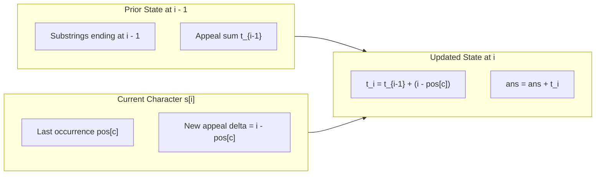

# Guided Example: Total Appeal of A String

## 1. Problem Overview & Representative Instance

The appeal of a string is defined as the number of distinct characters present within that string. Given an input string $s$, the objective is to compute the total sum of appeal values across all possible contiguous substrings of $s$.

Consider the representative string instance:
$$s = \text{"abbca"}$$

The string $s$ has length $n = 5$. A naive brute-force calculation would examine all $\frac{n(n+1)}{2} = \frac{5 \times 6}{2} = 15$ contiguous substrings, count the unique characters in each substring, and sum the counts:
- Length 1: $\text{"a"} \to 1$, $\text{"b"} \to 1$, $\text{"b"} \to 1$, $\text{"c"} \to 1$, $\text{"a"} \to 1$ (Sum = $5$)
- Length 2: $\text{"ab"} \to 2$, $\text{"bb"} \to 1$, $\text{"bc"} \to 2$, $\text{"ca"} \to 2$ (Sum = $7$)
- Length 3: $\text{"abb"} \to 2$, $\text{"bbc"} \to 2$, $\text{"bca"} \to 3$ (Sum = $7$)
- Length 4: $\text{"abbc"} \to 3$, $\text{"bbca"} \to 3$ (Sum = $6$)
- Length 5: $\text{"abbca"} \to 3$ (Sum = $3$)

Summing these contributions yields $5 + 7 + 7 + 6 + 3 = 28$. However, an $O(n^2)$ or $O(n^3)$ inspection strategy is infeasible when $n = 10^5$. Instead, we must invert our perspective from evaluating substrings to evaluating character contributions.

## 2. Mathematical & Algorithmic Principles

Let $s[0 \dots n-1]$ be the string. Define $t_i$ as the sum of appeal values of all substrings that end at index $i$:
$$t_i = \sum_{j=0}^{i} \text{appeal}(s[j \dots i])$$

When transitioning from index $i-1$ to index $i$, each substring ending at $i-1$, denoted $s[j \dots i-1]$, is extended by the single character $c = s[i]$ to form $s[j \dots i]$. 
- If character $c$ has never appeared in $s[j \dots i-1]$, the distinct count of $s[j \dots i]$ increments by $1$.
- If character $c$ already appeared anywhere in $s[j \dots i-1]$, the distinct count of $s[j \dots i]$ remains unchanged.

Character $c$ appeared in $s[j \dots i-1]$ if and only if the start index satisfies $j \le \text{pos}[c]$, where $\text{pos}[c]$ denotes the most recent index where character $c$ occurred before index $i$ (setting $\text{pos}[c] = -1$ if $c$ has not yet appeared).

Consequently:
- For $0 \le j \le \text{pos}[c]$: $\text{appeal}(s[j \dots i]) = \text{appeal}(s[j \dots i-1])$ (no increase).
- For $\text{pos}[c] < j \le i$: $\text{appeal}(s[j \dots i]) = \text{appeal}(s[j \dots i-1]) + 1$ (each of these $i - \text{pos}[c]$ substrings gains $1$ new unique character).

This yields an elegant recurrence relation for $t_i$:
$$t_i = t_{i-1} + (i - \text{pos}[c])$$
$$\text{Total Appeal} = \sum_{i=0}^{n-1} t_i$$

By maintaining an array $\text{pos}$ of size $26$ initialized to $-1$, each step computes the incremental appeal in $O(1)$ arithmetic operations, achieving total runtime $O(n)$ with $O(|\Sigma|)$ auxiliary space.

## 3. Step-by-Step Walkthrough with Intermediate State

We process $s = \text{"abbca"}$ step-by-step from index $0$ to $4$.

| Variable | Initial Meaning |
|---|---|
| $\text{ans}$ | Cumulative sum of appeal across all substrings evaluated so far |
| $t$ | Sum of appeal for all substrings terminating at the current cursor index $i$ |
| $\text{pos}$ | Lookup table storing the most recent index of each character, default $-1$ |

- **Step 0: Index $i = 0$, Character $c = \text{'a'}$**
  - Prior position $\text{pos}[\text{'a'}] = -1$.
  - Incremental contribution: $i - \text{pos}[\text{'a'}] = 0 - (-1) = 1$.
  - Current ending appeal: $t = 0 + 1 = 1$. Substrings ending at $0$: $\text{"a"} \implies \text{appeal} = 1$.
  - Cumulative answer: $\text{ans} = 0 + 1 = 1$.
  - Update position: $\text{pos}[\text{'a'}] = 0$.

- **Step 1: Index $i = 1$, Character $c = \text{'b'}$**
  - Prior position $\text{pos}[\text{'b'}] = -1$.
  - Incremental contribution: $i - \text{pos}[\text{'b'}] = 1 - (-1) = 2$.
  - Current ending appeal: $t = 1 + 2 = 3$. Substrings ending at $1$: $\text{"ab"} (2), \text{"b"} (1) \implies \text{sum} = 3$.
  - Cumulative answer: $\text{ans} = 1 + 3 = 4$.
  - Update position: $\text{pos}[\text{'b'}] = 1$.

- **Step 2: Index $i = 2$, Character $c = \text{'b'}$**
  - Prior position $\text{pos}[\text{'b'}] = 1$.
  - Incremental contribution: $i - \text{pos}[\text{'b'}] = 2 - 1 = 1$.
  - Notice that for start index $j \le 1$ (substrings $\text{"abb"}$ and $\text{"bb"}$), $\text{'b'}$ was already present, so their appeal does not grow. Only $j = 2$ ($\text{"b"}$) gains a new character.
  - Current ending appeal: $t = 3 + 1 = 4$. Substrings ending at $2$: $\text{"abb"} (2), \text{"bb"} (1), \text{"b"} (1) \implies \text{sum} = 4$.
  - Cumulative answer: $\text{ans} = 4 + 4 = 8$.
  - Update position: $\text{pos}[\text{'b'}] = 2$.

- **Step 3: Index $i = 3$, Character $c = \text{'c'}$**
  - Prior position $\text{pos}[\text{'c'}] = -1$.
  - Incremental contribution: $i - \text{pos}[\text{'c'}] = 3 - (-1) = 4$.
  - Current ending appeal: $t = 4 + 4 = 8$. Substrings ending at $3$: $\text{"abbc"} (3), \text{"bbc"} (2), \text{"bc"} (2), \text{"c"} (1) \implies \text{sum} = 8$.
  - Cumulative answer: $\text{ans} = 8 + 8 = 16$.
  - Update position: $\text{pos}[\text{'c'}] = 3$.

- **Step 4: Index $i = 4$, Character $c = \text{'a'}$**
  - Prior position $\text{pos}[\text{'a'}] = 0$.
  - Incremental contribution: $i - \text{pos}[\text{'a'}] = 4 - 0 = 4$.
  - Substring starting at $0$ ($\text{"abbca"}$) already contained $\text{'a'}$ at index $0$, so its appeal remains $3$. Substrings starting at $j \in \{1, 2, 3, 4\}$ ($\text{"bbca"}, \text{"bca"}, \text{"ca"}, \text{"a"}$) each gain $1$.
  - Current ending appeal: $t = 8 + 4 = 12$.
  - Cumulative answer: $\text{ans} = 16 + 12 = 28$.
  - Update position: $\text{pos}[\text{'a'}] = 4$.

The final accumulated answer is $28$.

## 4. Comprehensive State Trace

The table below catalogs the exact progression of variables, contributions, and cumulative sums at each character step.

| Step $i$ | Character $s[i]$ | Prior $\text{pos}[c]$ | Extension Delta $i - \text{pos}[c]$ | Ending Appeal $t$ | Cumulative Sum $\text{ans}$ | Updated $\text{pos}[c]$ |
|---|---|---|---|---|---|---|
| Initial | - | all $-1$ | - | $0$ | $0$ | all $-1$ |
| $0$ | $\text{'a'}$ | $-1$ | $0 - (-1) = 1$ | $1$ | $1$ | $\text{pos}[\text{'a'}] = 0$ |
| $1$ | $\text{'b'}$ | $-1$ | $1 - (-1) = 2$ | $3$ | $4$ | $\text{pos}[\text{'b'}] = 1$ |
| $2$ | $\text{'b'}$ | $1$ | $2 - 1 = 1$ | $4$ | $8$ | $\text{pos}[\text{'b'}] = 2$ |
| $3$ | $\text{'c'}$ | $-1$ | $3 - (-1) = 4$ | $8$ | $16$ | $\text{pos}[\text{'c'}] = 3$ |
| $4$ | $\text{'a'}$ | $0$ | $4 - 0 = 4$ | $12$ | $28$ | $\text{pos}[\text{'a'}] = 4$ |

Every row represents an exact evaluation of the recurrence relation, demonstrating how duplicate characters curtail the appeal delta to precisely the distance from their prior occurrence.

## 5. Algorithmic Correctness & Soundness

The correctness of this dynamic summation rests on the linearity of summation and the partition of substrings by their right endpoint.

Any substring $s[j \dots i]$ can be uniquely identified by its endpoint pair $(j, i)$ where $0 \le j \le i < n$. Thus:
$$\sum_{0 \le j \le i < n} \text{appeal}(s[j \dots i]) = \sum_{i=0}^{n-1} \left( \sum_{j=0}^i \text{appeal}(s[j \dots i]) \right) = \sum_{i=0}^{n-1} t_i$$

For any character $c = s[i]$:
- If $j \le \text{pos}[c]$, character $c$ already appeared at $\text{pos}[c]$ within the range $[j, i-1]$. Adding $s[i]$ introduces a duplicate, which does not alter the cardinality of the distinct character set:
  $$\text{distinct}(s[j \dots i]) = \text{distinct}(s[j \dots i-1])$$
- If $\text{pos}[c] < j \le i$, character $c$ does not appear anywhere in $s[j \dots i-1]$. Appending $s[i]$ introduces an entirely new distinct character:
  $$\text{distinct}(s[j \dots i]) = \text{distinct}(s[j \dots i-1]) + 1$$

Summing over all $j \in [0, i]$:
$$t_i = \sum_{j=0}^{\text{pos}[c]} \text{distinct}(s[j \dots i-1]) + \sum_{j=\text{pos}[c]+1}^i \left(\text{distinct}(s[j \dots i-1]) + 1\right)$$
$$t_i = \sum_{j=0}^{i-1} \text{distinct}(s[j \dots i-1]) + \sum_{j=\text{pos}[c]+1}^i 1 = t_{i-1} + (i - \text{pos}[c])$$

Because the base case $t_{-1} = 0$ holds vacuously for an empty string, mathematical induction guarantees that $t_i$ computes the exact sum of appeal for all substrings ending at $i$, and $\text{ans}$ accumulates the global total appeal without overcounting or omission.

## 6. Edge Cases & Anti-Patterns

1. **All Identical Characters ($s = \text{"aaaa"}$):**
   - At $i = 0$: $t = 1$, $\text{ans} = 1$.
   - For every subsequent $i > 0$: $\text{pos}[\text{'a'}] = i - 1$, so the delta is always $i - (i - 1) = 1$.
   - Hence $t$ increases by $1$ at each step ($t \in \{1, 2, 3, 4\}$), and the total sum is $1 + 2 + 3 + 4 = 10$. Every single one of the $10$ substrings has appeal exactly $1$.
2. **All Distinct Characters ($s = \text{"code"}$):**
   - Each character is novel, meaning $\text{pos}[c] = -1$ always.
   - The delta is $i - (-1) = i + 1$.
   - For length $n$, $t_i = t_{i-1} + (i + 1)$, yielding $t_i = \frac{(i+1)(i+2)}{2}$. This reflects that every substring of length $L$ has appeal exactly equal to $L$.
3. **Large Input Scale ($n = 10^5$):**
   - The maximum possible total appeal occurs when all characters are distinct: $\sum_{L=1}^n L \cdot (n - L + 1) \approx \frac{n^3}{6}$, which exceeds the $32$-bit signed integer range ($2 \times 10^9$).
   - A $64$-bit integer accumulation must be used to prevent arithmetic overflow.
4. **Anti-Pattern: Re-evaluating Substring Sets:**
   - Generating each substring or computing set intersections leads to $O(n^2)$ time and instant timeout on $10^5$ character inputs.
   - Counting right-extension contribution or left-extension intervals eliminates the need to inspect any substring explicitly.

## 7. Complexity Analysis

The complexity parameters are governed by the string length $n$ and the alphabet size $|\Sigma| = 26$.

| Dimension | Bound | Justification |
|---|---|---|
| Time Complexity | $O(n)$ | The algorithm processes each character of $s$ exactly once. Each character inspection involves $O(1)$ array lookups and arithmetic operations. |
| Space Complexity | $O(|\Sigma|)$ | Auxiliary memory is confined to the fixed-size array $\text{pos}$ tracking the $26$ lowercase English characters, requiring $O(1)$ additional space relative to $n$. |
| Overflow Protection | $O(1)$ Words | Accumulator $\text{ans}$ requires a standard $64$-bit integer to hold values up to $\approx \frac{n^3}{6} \approx 1.67 \times 10^{14}$ when $n = 10^5$. |