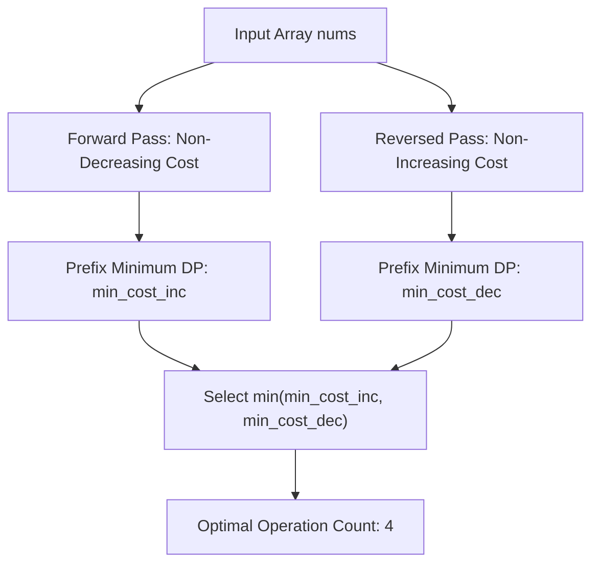

# Guided Example: Make Array Non-Decreasing or Non-Increasing

## 1. Problem Overview & Representative Instance

Given an integer array $nums$, an operation allows selecting any element and incrementing or decrementing it by $1$. The objective is to determine the minimum number of total operations required to transform $nums$ into a monotonic sequence, meaning the resulting sequence must be either non-decreasing ($nums[0] \le nums[1] \le \dots \le nums[n-1]$) or non-increasing ($nums[0] \ge nums[1] \ge \dots \ge nums[n-1]$).

Consider the representative instance:
$$nums = [3, 2, 4, 5, 0]$$

We observe that transforming $nums$ into a non-increasing sequence is significantly cheaper than forcing it to become non-decreasing:
- A potential non-increasing sequence is $[3, 3, 3, 3, 0]$.
- Computing the absolute differences element by element:
  - Position $0$: $|3 - 3| = 0$
  - Position $1$: $|2 - 3| = 1$
  - Position $2$: $|4 - 3| = 1$
  - Position $3$: $|5 - 3| = 2$
  - Position $4$: $|0 - 0| = 0$
- Total operations: $0 + 1 + 1 + 2 + 0 = 4$.

Any alternative non-decreasing configuration (such as raising the trailing $0$ up to $5$ or flattening the values) incurs at least $5$ operations. Thus, the minimum overall cost across both monotonicity orientations is $4$.

## 2. Mathematical & Algorithmic Principles

Let $n$ denote the length of the array, and let $M$ represent the upper bound of the value domain ($M = 1000$ based on the problem bounds, or restricted to the distinct values present in $nums$).

An array $A$ is non-increasing if and only if its reversal $A^{\text{rev}}$ is non-decreasing:
$$A[0] \ge A[1] \ge \dots \ge A[n-1] \iff A^{\text{rev}}[0] \le A^{\text{rev}}[1] \le \dots \le A^{\text{rev}}[n-1]$$

Therefore, a single subroutine that computes the minimum cost to make an arbitrary sequence non-decreasing suffices. We evaluate:
$$\text{Cost}_{\min} = \min\big(\text{SolveNonDecreasing}(nums), \text{SolveNonDecreasing}(nums^{\text{rev}})\big)$$

### Recurrence Formulation

Define $f[i][j]$ as the minimum operations needed to transform the prefix $nums[0 \dots i-1]$ into a valid non-decreasing sequence such that the $i$-th element is chosen to be $j \in [0, M]$.

For the sequence to remain non-decreasing, the predecessor value $k$ at index $i-1$ must not exceed $j$. Thus:
$$f[i][j] = |nums[i-1] - j| + \min_{0 \le k \le j} f[i-1][k]$$

A naive evaluation of this recurrence requires $O(M)$ work per state, yielding $O(n \cdot M^2)$ total operations, which is unnecessarily slow. By observing that the transition depends strictly on the running prefix minimum:
$$\mu_{i-1}(j) = \min_{0 \le k \le j} f[i-1][k]$$

We can update $\mu_{i-1}(j)$ incrementally as $j$ sweeps from $0$ up to $M$:
$$\mu_{i-1}(j) = \min\big(\mu_{i-1}(j-1), f[i-1][j]\big)$$

This optimization reduces the transition to $O(1)$ per state cell, leading to an overall runtime of $O(n \cdot M)$.

## 3. Step-by-Step Walkthrough with Intermediate State

Let us trace the optimal orientation: converting the reversed array $nums^{\text{rev}} = [0, 5, 4, 2, 3]$ into a non-decreasing sequence. For pedagogical clarity, we track the compact active coordinate set $V = \{0, 2, 3, 4, 5\}$.

| Variable | Structural Role |
|---|---|
| $i$ | Prefix length under active evaluation ($1 \le i \le 5$) |
| $x_i$ | Current input value $nums^{\text{rev}}[i-1]$ |
| $j$ | Candidate target value assigned to the $i$-th element |
| $\text{mi}$ | Running prefix minimum of the previous row: $\min_{k \le j} f[i-1][k]$ |
| $f[i][j]$ | Minimum accumulated cost to make prefix non-decreasing ending at $j$ |

- **Step 1: Process $x_1 = 0$ (Prefix length 1)**
  - Base row $f[0][j] = 0$ for all $j \in V$.
  - Running minimum $\text{mi} = 0$.
  - $j = 0: f[1][0] = 0 + |0 - 0| = 0$
  - $j = 2: f[1][2] = 0 + |0 - 2| = 2$
  - $j = 3: f[1][3] = 0 + |0 - 3| = 3$
  - $j = 4: f[1][4] = 0 + |0 - 4| = 4$
  - $j = 5: f[1][5] = 0 + |0 - 5| = 5$

- **Step 2: Process $x_2 = 5$ (Prefix $[0, 5]$)**
  - Running minimums from row $1$: $f[1] = [0, 2, 3, 4, 5]$.
  - $j = 0: \text{mi} = f[1][0] = 0 \implies f[2][0] = 0 + |5 - 0| = 5$
  - $j = 2: \text{mi} = \min(0, 2) = 0 \implies f[2][2] = 0 + |5 - 2| = 3$
  - $j = 3: \text{mi} = \min(0, 3) = 0 \implies f[2][3] = 0 + |5 - 3| = 2$
  - $j = 4: \text{mi} = \min(0, 4) = 0 \implies f[2][4] = 0 + |5 - 4| = 1$
  - $j = 5: \text{mi} = \min(0, 5) = 0 \implies f[2][5] = 0 + |5 - 5| = 0$

- **Step 3: Process $x_3 = 4$ (Prefix $[0, 5, 4]$)**
  - Running minimums from row $2$: $f[2] = [5, 3, 2, 1, 0]$.
  - $j = 0: \text{mi} = 5 \implies f[3][0] = 5 + |4 - 0| = 9$
  - $j = 2: \text{mi} = \min(5, 3) = 3 \implies f[3][2] = 3 + |4 - 2| = 5$
  - $j = 3: \text{mi} = \min(3, 2) = 2 \implies f[3][3] = 2 + |4 - 3| = 3$
  - $j = 4: \text{mi} = \min(2, 1) = 1 \implies f[3][4] = 1 + |4 - 4| = 1$
  - $j = 5: \text{mi} = \min(1, 0) = 0 \implies f[3][5] = 0 + |4 - 5| = 1$

- **Step 4: Process $x_4 = 2$ (Prefix $[0, 5, 4, 2]$)**
  - Running minimums from row $3$: $f[3] = [9, 5, 3, 1, 1]$.
  - $j = 0: \text{mi} = 9 \implies f[4][0] = 9 + |2 - 0| = 11$
  - $j = 2: \text{mi} = \min(9, 5) = 5 \implies f[4][2] = 5 + |2 - 2| = 5$
  - $j = 3: \text{mi} = \min(5, 3) = 3 \implies f[4][3] = 3 + |2 - 3| = 4$
  - $j = 4: \text{mi} = \min(3, 1) = 1 \implies f[4][4] = 1 + |2 - 4| = 3$
  - $j = 5: \text{mi} = \min(1, 1) = 1 \implies f[4][5] = 1 + |2 - 5| = 4$

- **Step 5: Process $x_5 = 3$ (Prefix $[0, 5, 4, 2, 3]$)**
  - Running minimums from row $4$: $f[4] = [11, 5, 4, 3, 4]$.
  - $j = 0: \text{mi} = 11 \implies f[5][0] = 11 + |3 - 0| = 14$
  - $j = 2: \text{mi} = \min(11, 5) = 5 \implies f[5][2] = 5 + |3 - 2| = 6$
  - $j = 3: \text{mi} = \min(5, 4) = 4 \implies f[5][3] = 4 + |3 - 3| = 4$
  - $j = 4: \text{mi} = \min(4, 3) = 3 \implies f[5][4] = 3 + |3 - 4| = 4$
  - $j = 5: \text{mi} = \min(3, 4) = 3 \implies f[5][5] = 3 + |3 - 5| = 5$

The minimum cost in row $5$ is $\min(14, 6, 4, 4, 5) = 4$.

## 4. Comprehensive State Trace

The complete evolution of the cost vector across the reversed array is documented in the table below.

| Row $i$ | Input $x_i$ | $f[i][0]$ | $f[i][2]$ | $f[i][3]$ | $f[i][4]$ | $f[i][5]$ | Row Minimum $\min_j f[i][j]$ |
|---|---|---|---|---|---|---|---|
| $0$ | Base | $0$ | $0$ | $0$ | $0$ | $0$ | $0$ |
| $1$ | $0$ | $0$ | $2$ | $3$ | $4$ | $5$ | $0$ |
| $2$ | $5$ | $5$ | $3$ | $2$ | $1$ | $0$ | $0$ |
| $3$ | $4$ | $9$ | $5$ | $3$ | $1$ | $1$ | $1$ |
| $4$ | $2$ | $11$ | $5$ | $4$ | $3$ | $4$ | $3$ |
| $5$ | $3$ | $14$ | $6$ | $4$ | $4$ | $5$ | $4$ |

Running the symmetric pass on the forward array $nums = [3, 2, 4, 5, 0]$ produces a minimum cost of $5$. Selecting $\min(5, 4)$ confirms the final global minimum of $4$.

## 5. Algorithmic Correctness & Soundness

The correctness of this dynamic programming approach rests on two mathematical guarantees:

1. **Optimal Substructure:**
   If sequence $B[0 \dots i-1]$ is an optimal non-decreasing assignment ending with $B[i-1] = k$, then appending $B[i] = j \ge k$ to form a non-decreasing sequence of length $i+1$ pays cost:
   $$\text{cost}(B[0 \dots i]) = \text{cost}(B[0 \dots i-1]) + |nums[i] - j|$$
   Because the objective is the sum of independent terms $\sum |nums[t] - B[t]|$, minimizing each prefix state $f[i][j]$ guarantees that the global minimum $\min_j f[n][j]$ contains the globally minimal sum of absolute deviations.

2. **Sufficiency of Discrete Values:**
   By a classical theorem of isotonic regression with $L_1$ norm, there exists an optimal target array $B^*$ where every element $B^*[i]$ belongs to the set of values $\{nums[0], \dots, nums[n-1]\}$. Hence, restricting $j$ to the value range of the input does not exclude any optimal configuration.

3. **Prefix Minimum Monotonicity:**
   Computing $\mu_{i-1}(j) = \min_{k \le j} f[i-1][k]$ in a single forward pass over $j$ ensures that every valid predecessor $k \le j$ is considered. No candidate transition is omitted, and no illegal transition ($k > j$) is permitted.

## 6. Edge Cases & Anti-Patterns

1. **Already Monotonic Inputs:**
   - For an already non-decreasing input like $[2, 2, 3, 4]$, the forward pass computes cost $0$.
   - For a strictly decreasing input like $[9, 7, 4, 1]$, the reversed pass computes cost $0$.
   - The algorithm correctly outputs $0$ without superfluous modifications.
2. **Single-Element Array ($n = 1$):**
   - Any single number $[x]$ is trivially monotonic in both directions.
   - The inner loop executes once and yields cost $0$.
3. **Alternating Peaks and Valleys ($[5, 1, 5, 1]$):**
   - Neither orientation is initially satisfied. The algorithm flattens either the peaks down or the valleys up, discovering the optimal balancing target with cost $4$.
4. **Anti-Pattern: Greedy Adjustments:**
   - Attempting to greedily adjust an adjacent violation $nums[i] > nums[i+1]$ by either setting $nums[i+1] = nums[i]$ or $nums[i] = nums[i+1]$ fails because an adjustment early in the array propagates ripple effects down the entire sequence.
   - Global dynamic programming or the slope trick is required to balance multi-element adjustments simultaneously.

## 7. Complexity Analysis

The computational demands are parameterized by array length $n$ and maximum element value $M$.

| Resource Metric | Theoretical Bound | Practical Magnitude ($n \le 1000, M \le 1000$) |
|---|---|---|
| Time Complexity | $O(n \cdot M)$ | Exactly two passes of $n$ rows, each scanning $M+1$ values with $O(1)$ arithmetic operations ($\approx 2 \times 10^6$ operations). |
| Space Complexity | $O(n \cdot M)$ or $O(M)$ | The state table requires $O(n \cdot M)$ when tracking history, or $O(M)$ auxiliary space using two alternating 1D row buffers. |
| Value Dimension Pruning | $O(n \cdot k)$ | If coordinate compression is applied over the $k \le n$ unique sorted values of $nums$, runtime reduces to $O(n^2)$. |
