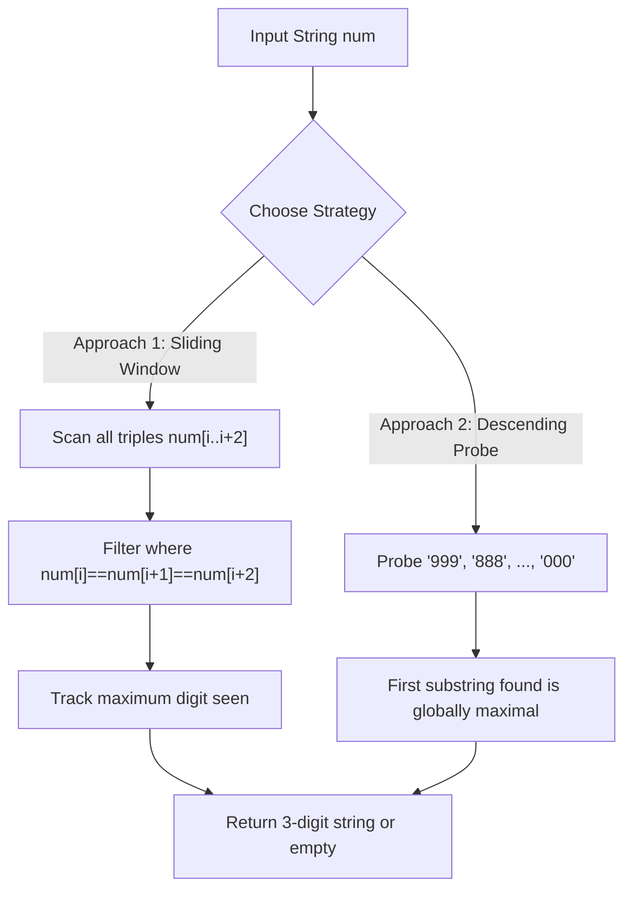

# Guided Example: Largest 3-Same-Digit Number in String

## 1. Problem Overview & Representative Instance

A substring of an integer string $num$ is designated as a good integer if it satisfies two strict criteria:
1. It has length exactly equal to $3$.
2. It consists of only one unique digit repeated three consecutive times.

Given the string $num$, the task is to identify the maximum good integer present as a contiguous substring. If multiple valid triples exist, the one representing the largest numerical value must be returned. If no such substring exists within $num$, the empty string `""` is returned.

Consider the representative instance:
$$num = \text{"6777133339"}$$

We analyze the string of length $n = 10$. Contiguous windows of length $3$ span from index $0$ to index $7$:
- Window $0 \dots 2$: $\text{"677"}$ (heterogeneous, invalid)
- Window $1 \dots 3$: $\text{"777"}$ (homogeneous digit $7$, valid candidate)
- Window $2 \dots 4$: $\text{"771"}$ (heterogeneous, invalid)
- Window $3 \dots 5$: $\text{"713"}$ (heterogeneous, invalid)
- Window $4 \dots 6$: $\text{"133"}$ (heterogeneous, invalid)
- Window $5 \dots 7$: $\text{"333"}$ (homogeneous digit $3$, valid candidate)
- Window $6 \dots 8$: $\text{"333"}$ (homogeneous digit $3$, valid candidate)
- Window $7 \dots 9$: $\text{"339"}$ (heterogeneous, invalid)

The valid candidates discovered are $\text{"777"}$ and $\text{"333"}$. Comparing their values, $\text{"777"} > \text{"333"}$. Hence, the optimal return string is $\text{"777"}$.

## 2. Mathematical & Algorithmic Principles

Because the alphabet of decimal digits is strictly bounded to $\Sigma = \{'0', '1', \dots, '9'\}$, there are only ten possible valid uniform triples:
$$\mathcal{T} = \{\text{"999"}, \text{"888"}, \text{"777"}, \text{"666"}, \text{"555"}, \text{"444"}, \text{"333"}, \text{"222"}, \text{"111"}, \text{"000"}\}$$

### Equivalence of Numeric and Lexicographical Order

For any two equal-length uniform strings $u = d_1 d_1 d_1$ and $v = d_2 d_2 d_2$, where $d_1, d_2 \in [0, 9]$:
$$\text{val}(u) > \text{val}(v) \iff d_1 > d_2 \iff u \succ_{\text{lex}} v$$

This equivalence enables two distinct algorithmic formulations:

1. **Greedy Descending Probe:**
   We iterate through candidate digits $d$ in descending order from $9$ down to $0$. The first candidate pattern $d d d$ that appears as a contiguous substring inside $num$ is mathematically guaranteed to be the largest possible good integer. If the loop completes without any match, no good integer exists.
   - Cost: At most $10$ substring checks over a string of length $n$.

2. **Single-Pass Linear Window Scan:**
   We inspect each index $i \in [0, n-3]$. Whenever $num[i] = num[i+1] = num[i+2]$, we update a maximum tracked character:
   $$d_{\max} = \max(d_{\max}, num[i])$$
   After examining all $n-2$ windows, we format $d_{\max}$ as a three-character string if at least one candidate was recorded.

Both strategies achieve optimal linear time complexity $O(n)$ with $O(1)$ auxiliary memory.

## 3. Step-by-Step Walkthrough with Intermediate State

Let us trace the single-pass linear sliding window on $num = \text{"6777133339"}$.

| Variable | Architectural Purpose |
|---|---|
| $i$ | Starting offset of the active length-$3$ evaluation window |
| $num[i \dots i+2]$ | Current substring of length $3$ |
| $\text{IsGood}$ | Boolean flag verifying whether all three characters match |
| $d_{\max}$ | Highest character encountered in a verified good triple, initially null |

- **Window 0 ($i = 0$): $\text{"677"}$**
  - Characters: $num[0] = \text{'6'}, num[1] = \text{'7'}, num[2] = \text{'7'}$.
  - Equality check: $\text{'6'} \ne \text{'7'}$. Invalid triple.
  - State remains: $d_{\max} = \text{null}$.

- **Window 1 ($i = 1$): $\text{"777"}$**
  - Characters: $num[1] = \text{'7'}, num[2] = \text{'7'}, num[3] = \text{'7'}$.
  - Equality check: $\text{'7'} = \text{'7'} = \text{'7'}$. Valid triple!
  - Update: $d_{\max} = \max(\text{null}, \text{'7'}) = \text{'7'}$.

- **Window 2 ($i = 2$): $\text{"771"}$**
  - Characters: $num[2] = \text{'7'}, num[3] = \text{'7'}, num[4] = \text{'1'}$.
  - Equality check: $\text{'7'} \ne \text{'1'}$. Invalid triple.

- **Window 3 ($i = 3$): $\text{"713"}$**
  - Equality check fails ($\text{'7'} \ne \text{'1'}$).

- **Window 4 ($i = 4$): $\text{"133"}$**
  - Equality check fails ($\text{'1'} \ne \text{'3'}$).

- **Window 5 ($i = 5$): $\text{"333"}$**
  - Characters: $num[5] = \text{'3'}, num[6] = \text{'3'}, num[7] = \text{'3'}$.
  - Equality check holds. Candidate digit is $\text{'3'}$.
  - Comparison: $\text{'3'} < d_{\max} (\text{'7'})$, so $d_{\max}$ remains $\text{'7'}$.

- **Window 6 ($i = 6$): $\text{"333"}$**
  - Characters: $num[6] = \text{'3'}, num[7] = \text{'3'}, num[8] = \text{'3'}$.
  - Equality check holds. Digit $\text{'3'}$ does not exceed $d_{\max} = \text{'7'}$.

- **Window 7 ($i = 7$): $\text{"339"}$**
  - Equality check fails ($\text{'3'} \ne \text{'9'}$).

Scanning finishes at $i = 7 = n - 3$. The highest recorded digit is $\text{'7'}$. Repeating it three times produces the solution string $\text{"777"}$.

## 4. Comprehensive State Trace

The state of both detection strategies across all candidate windows is summarized below.

| Window Index $i$ | Substring Content | Uniformity Status | Candidate Digit | Active $d_{\max}$ | Descending Probe Priority |
|---|---|---|---|---|---|
| $0$ | $\text{"677"}$ | Disqualified | None | $\text{null}$ | - |
| $1$ | $\text{"777"}$ | Qualified | $\text{'7'}$ | $\text{'7'}$ | Matched on probe $d = 7$ |
| $2$ | $\text{"771"}$ | Disqualified | None | $\text{'7'}$ | - |
| $3$ | $\text{"713"}$ | Disqualified | None | $\text{'7'}$ | - |
| $4$ | $\text{"133"}$ | Disqualified | None | $\text{'7'}$ | - |
| $5$ | $\text{"333"}$ | Qualified | $\text{'3'}$ | $\text{'7'}$ | Suboptimal ($3 < 7$) |
| $6$ | $\text{"333"}$ | Qualified | $\text{'3'}$ | $\text{'7'}$ | Suboptimal ($3 < 7$) |
| $7$ | $\text{"339"}$ | Disqualified | None | $\text{'7'}$ | - |

Under the descending probe approach:
- Probe $\text{"999"}$: Not in $num$.
- Probe $\text{"888"}$: Not in $num$.
- Probe $\text{"777"}$: Found at index $1$! Immediate return $\text{"777"}$.

Both methods arrive at the identical canonical outcome.

## 5. Algorithmic Correctness & Soundness

The correctness of the algorithm is substantiated by complete space enumeration:

1. **Finite Canonical Domain:**
   Because a good integer must have length $3$ and contain a single repeated digit, the candidate universe is strictly $|\mathcal{T}| = 10$.
2. **Total Ordering:**
   The set $\mathcal{T}$ has a strict total order:
   $$\text{"000"} < \text{"111"} < \text{"222"} < \dots < \text{"888"} < \text{"999"}$$
   In the descending probe approach, candidates are tested in monotonically decreasing order of value. Therefore, the first candidate $t \in \mathcal{T}$ that occurs as a substring of $num$ is guaranteed to satisfy:
   $$t \ge t' \quad \forall t' \in \mathcal{T} \text{ such that } t' \text{ is a substring of } num$$
3. **Exhaustive Window Coverage:**
   In the window scan approach, every contiguous substring of length $3$ begins at some index $i \in [0, n-3]$. By evaluating all indices without skipping, no valid candidate is omitted.
4. **Leading Zero Preservation:**
   If the only valid triple is $\text{"000"}$ (for example in $num = \text{"2300019"}$), treating the output as a literal three-character string preserves all three zeros, satisfying the problem specification rather than collapsing to numerical $0$.

## 6. Edge Cases & Anti-Patterns

1. **All Zero Triple ($\text{"000"}$):**
   - Inputs like $\text{"2300019"}$ contain $\text{"000"}$.
   - Converting strings to numbers prematurely could accidentally treat $\text{"000"}$ as an empty or falsy value. Storing characters directly avoids stripping leading zeros.
2. **Short String Length ($n < 3$):**
   - If $num$ has length $1$ or $2$, no window of length $3$ can be formed.
   - The loop range $[0, n-3]$ is empty, and the algorithm immediately returns `""`.
3. **Long Consecutive Runs ($\text{"4444"}$):**
   - A sequence of four identical digits contains two overlapping valid triples: $num[0 \dots 2] = \text{"444"}$ and $num[1 \dots 3] = \text{"444"}$.
   - Both evaluate to the same digit $\text{'4'}$, correctly resolving to $\text{"444"}$ without dual-counting side effects.
4. **No Matching Triples ($num = \text{"42352338"}$):**
   - Even though $\text{'3'}$ appears twice consecutively ($\text{"33"}$), it fails the strict length-$3$ requirement.
   - The output remains `""`.
5. **Anti-Pattern: Regular Expression Backtracking:**
   - Writing complex backtracking regexes over long inputs incurs substantial parsing overhead. Direct substring searching or adjacent character comparison is vastly faster and allocation-free.

## 7. Complexity Analysis

The operational demands are parameterized by the length $n$ of the string $num$.

| Metric | Bound | Analysis |
|---|---|---|
| Time Complexity (Linear Scan) | $O(n)$ | Inspects $n - 2$ windows of length $3$, performing $2$ character equality checks per window. Total operations: $2n - 4 \in O(n)$. |
| Time Complexity (Descending Probe) | $O(|\Sigma| \cdot n)$ | At most $10$ substring searches across a string of length $n$. Since $|\Sigma| = 10$ is a fixed constant, runtime is strictly $O(n)$. |
| Space Complexity | $O(1)$ | Only a few scalar variables or fixed three-character constant probe strings are used. No dynamic allocations scale with $n$. |
| Character Comparisons | $\le 2n$ | In the sliding window pass, at most two equality checks are made per index offset. |
