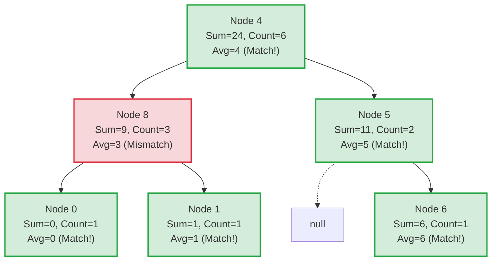

# Guided Example: Count Nodes Equal to Average of Subtree

## 1. Problem Overview & Representative Instance

Given the root of a binary tree, we must determine the number of nodes where the node's value equals the integer average of the values within its entire subtree. 

The average of a subtree with $n$ nodes having total value sum $s$ is computed using standard floor division:
$$\text{Average} = \left\lfloor \frac{s}{n} \right\rfloor$$

Consider the representative binary tree instance:
$$\text{root} = [4, 8, 5, 0, 1, \text{null}, 6]$$

The tree structure and node values are:
- Node $4$ is the tree root.
  - Left child of $4$ is Node $8$.
    - Left child of $8$ is Node $0$ (leaf).
    - Right child of $8$ is Node $1$ (leaf).
  - Right child of $4$ is Node $5$.
    - Right child of $5$ is Node $6$ (leaf).

A bottom-up examination reveals:
- Subtrees rooted at leaves $0, 1, 6$ each contain $1$ node, trivially matching their own value.
- Subtree at Node $5$ has sum $5 + 6 = 11$ across $2$ nodes; average is $\lfloor 11/2 \rfloor = 5$, matching Node $5$.
- Subtree at Node $8$ has sum $8 + 0 + 1 = 9$ across $3$ nodes; average is $\lfloor 9/3 \rfloor = 3 \ne 8$.
- Subtree at Root $4$ has sum $4 + 9 + 11 = 24$ across $6$ nodes; average is $\lfloor 24/6 \rfloor = 4$, matching Node $4$.

Thus, $5$ nodes satisfy the subtree average condition.

## 2. Mathematical & Algorithmic Principles

To determine if a node $u$ satisfies the property $\text{val}(u) = \lfloor \text{Sum}(u) / \text{Count}(u) \rfloor$, the aggregate sum $\text{Sum}(u)$ and node count $\text{Count}(u)$ must be known.

### Top-Down Inefficiency vs. Bottom-Up Sufficiency

- A naive top-down traversal calculates the sum and count for each node by initiating a separate recursive search across its descendants. For a skewed tree of depth $N$, this produces $O(N^2)$ runtime.
- In contrast, the subtree aggregation displays strict compositionality:
  $$\text{Sum}(u) = \text{val}(u) + \text{Sum}(\text{left}(u)) + \text{Sum}(\text{right}(u))$$
  $$\text{Count}(u) = 1 + \text{Count}(\text{left}(u)) + \text{Count}(\text{right}(u))$$

By employing a post-order traversal (visiting left subtree, right subtree, and then parent), every node receives the aggregate tuple $(\text{Sum}, \text{Count})$ from its immediate children in $O(1)$ time. 

### Invariant and State Definition

For an empty subtree ($\text{null}$ reference):
$$\text{State}(\text{null}) = (0, 0)$$

For any non-null node $u$ receiving states $(s_L, c_L)$ from the left child and $(s_R, c_R)$ from the right child:
1. Aggregate sum: $s_u = s_L + s_R + \text{val}(u)$
2. Aggregate count: $c_u = c_L + c_R + 1$
3. Validity predicate:
   $$P(u) = \begin{cases} 1 & \text{if } \lfloor s_u / c_u \rfloor = \text{val}(u) \\ 0 & \text{otherwise} \end{cases}$$
4. Return tuple: $(s_u, c_u)$

The global total of valid nodes is simply $\sum_{u \in T} P(u)$.

## 3. Step-by-Step Walkthrough with Intermediate State

We execute a post-order traversal over the tree `root = [4, 8, 5, 0, 1, null, 6]`.

| Step | Visited Node | Left Child Returned | Right Child Returned | Subtree Sum $s$ | Subtree Count $c$ | Floor Average $\lfloor s/c \rfloor$ | Matches Value? |
|---|---|---|---|---|---|---|---|
| 1 | Leaf $0$ | $(0, 0)$ | $(0, 0)$ | $0 + 0 + 0 = 0$ | $0 + 0 + 1 = 1$ | $\lfloor 0/1 \rfloor = 0$ | $0 = 0$ (Yes) |
| 2 | Leaf $1$ | $(0, 0)$ | $(0, 0)$ | $0 + 0 + 1 = 1$ | $0 + 0 + 1 = 1$ | $\lfloor 1/1 \rfloor = 1$ | $1 = 1$ (Yes) |
| 3 | Parent $8$ | $(0, 1)$ | $(1, 1)$ | $0 + 1 + 8 = 9$ | $1 + 1 + 1 = 3$ | $\lfloor 9/3 \rfloor = 3$ | $3 \ne 8$ (No) |
| 4 | $\text{null}$ (left of 5) | - | - | $0$ | $0$ | - | - |
| 5 | Leaf $6$ | $(0, 0)$ | $(0, 0)$ | $0 + 0 + 6 = 6$ | $0 + 0 + 1 = 1$ | $\lfloor 6/1 \rfloor = 6$ | $6 = 6$ (Yes) |
| 6 | Parent $5$ | $(0, 0)$ | $(6, 1)$ | $0 + 6 + 5 = 11$ | $0 + 1 + 1 = 2$ | $\lfloor 11/2 \rfloor = 5$ | $5 = 5$ (Yes) |
| 7 | Root $4$ | $(9, 3)$ | $(11, 2)$ | $9 + 11 + 4 = 24$ | $3 + 2 + 1 = 6$ | $\lfloor 24/6 \rfloor = 4$ | $4 = 4$ (Yes) |

At the completion of the traversal, the tally of affirmative matches increments across Steps 1, 2, 5, 6, and 7, reaching a final total of $5$.

## 4. Comprehensive State Trace

The state propagation for every node in the hierarchy is traced in the table below.

| Traversal Order | Node Reference | Subtree Node Values | Subtree Sum | Subtree Cardinality | Integer Average | Node Value | Match Predicate $P(u)$ | Running Count |
|---|---|---|---|---|---|---|---|---|
| Post-Order 1 | Node $0$ | $\{0\}$ | $0$ | $1$ | $0$ | $0$ | $1$ | $1$ |
| Post-Order 2 | Node $1$ | $\{1\}$ | $1$ | $1$ | $1$ | $1$ | $1$ | $2$ |
| Post-Order 3 | Node $8$ | $\{8, 0, 1\}$ | $9$ | $3$ | $3$ | $8$ | $0$ | $2$ |
| Post-Order 4 | Node $6$ | $\{6\}$ | $6$ | $1$ | $6$ | $6$ | $1$ | $3$ |
| Post-Order 5 | Node $5$ | $\{5, 6\}$ | $11$ | $2$ | $5$ | $5$ | $1$ | $4$ |
| Post-Order 6 | Node $4$ | $\{4, 8, 0, 1, 5, 6\}$ | $24$ | $6$ | $4$ | $4$ | $1$ | $5$ |

Every row shows that the integer average computation strictly depends on the subtree values, properly reflecting the floor division rounding behavior.

## 5. Algorithmic Correctness & Soundness

The soundness of this post-order recursive scheme is established by structural induction on binary trees:

1. **Base Case:**
   A null node represents an empty set of tree vertices. The returned tuple $(0, 0)$ represents the additive identity for sums and counts.
2. **Inductive Step:**
   Assume by induction that for any node $u$, the recursive calls on $u.\text{left}$ and $u.\text{right}$ return $(s_L, c_L)$ and $(s_R, c_R)$ representing the true sum and exact node count of the left and right subtrees, respectively.
   - By definition, the vertex set of the subtree rooted at $u$ is the disjoint union:
     $$V(u) = \{u\} \cup V(u.\text{left}) \cup V(u.\text{right})$$
   - Because these sets are mutually disjoint, the sum of values and count of elements partition cleanly:
     $$\text{Sum}(u) = \sum_{v \in V(u)} \text{val}(v) = \text{val}(u) + s_L + s_R$$
     $$\text{Count}(u) = |V(u)| = 1 + c_L + c_R$$
   - Because $u$ is included, $c_u \ge 1$, precluding any division by zero.
   - Therefore, the average computed as $\lfloor s_u / c_u \rfloor$ is exact according to the problem contract.
3. **Completeness:**
   Post-order traversal visits every tree node exactly once. Thus, every node is evaluated against its true subtree average exactly once, guaranteeing no missed candidates and no duplicate evaluations.

## 6. Edge Cases & Anti-Patterns

1. **Leaf Nodes:**
   - Every leaf node has $s = \text{val}$ and $c = 1$.
   - The average is $\lfloor \text{val} / 1 \rfloor = \text{val}$.
   - Every leaf in any binary tree always matches its subtree average.
2. **Single-Node Tree ($N = 1$):**
   - The root is itself a leaf. The return value is always $1$.
3. **All Nodes Having Identical Values:**
   - If every node holds value $k$, then for any subtree of size $c$, the sum is $s = k \cdot c$.
   - The average is $\lfloor (k \cdot c) / c \rfloor = k$.
   - Every single node in the tree matches, so the answer is $N$.
4. **Floor Division Rounding Truncation:**
   - For a subtree with values $[2, 1, 4]$, sum is $7$, count is $3$.
   - $\lfloor 7/3 \rfloor = 2$.
   - If the root value is $2$, it matches despite the real average being $2.333\dots$. Truncating towards zero (integer division) must be used, not floating-point rounding.
5. **Anti-Pattern: Recomputing Subtree Metrics:**
   - Calling a helper function `get_sum_and_count(node)` at every node from a pre-order traversal repeats descendant traversals for every ancestor, degrading complexity to $O(N^2)$. Returning the tuple $(s, c)$ bottom-up preserves strict $O(N)$ efficiency.

## 7. Complexity Analysis

The complexity boundaries are expressed in terms of the total number of nodes $N$ and maximum tree height $H$.

| Complexity Dimension | Worst Case (Skewed Tree) | Balanced Case (Complete Tree) | Justification |
|---|---|---|---|
| Time Complexity | $O(N)$ | $O(N)$ | Every tree node is visited exactly once during the post-order depth-first traversal. All operations at each node (additions and integer division) run in $O(1)$ time. |
| Space Complexity (Call Stack) | $O(N)$ | $O(\log N)$ | Memory is bounded by the recursion stack depth, which equals the maximum tree height $H$. In a degenerate line, $H = N$; in a balanced tree, $H = \log_2 N$. |
| Auxiliary Heap Space | $O(1)$ | $O(1)$ | No heap collections, hash maps, or secondary tree structures are created during traversal. |