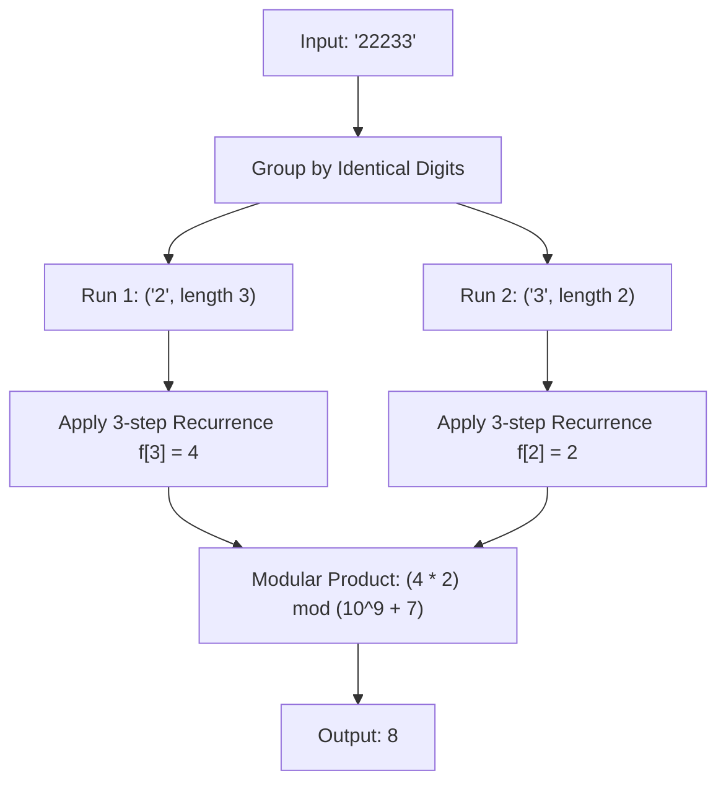

# Guided Example: Count Number of Texts

## 1. Problem Overview & Representative Instance

In traditional multi-tap telephone keypad entry, pressing a number button repeatedly cycles through its mapped characters. Releasing a button sends a completed character. Specifically:
- Digits `'2'`, `'3'`, `'4'`, `'5'`, `'6'`, and `'8'` map to sets of $3$ letters (e.g., `'2'` maps to `['a', 'b', 'c']`), requiring $1$, $2$, or $3$ consecutive presses.
- Digits `'7'` and `'9'` map to sets of $4$ letters (e.g., `'7'` maps to `['p', 'q', 'r', 's']` and `'9'` maps to `['w', 'x', 'y', 'z']`), requiring $1$, $2$, $3$, or $4$ consecutive presses.

Given a string $pressedKeys$ representing the historical sequence of keypresses, the goal is to compute the total number of distinct text messages that could have produced this exact sequence. Because the result can be very large, it must be computed modulo $10^9 + 7$.

Consider the representative instance:
$$pressedKeys = \text{"22233"}$$

Consecutive identical keypresses can be grouped into characters of sizes $1, 2, 3$ (or $4$ for keys $7$ and $9$), but keypresses of different digits can never combine into a single character. Thus, the sequence naturally decomposes into two disjoint contiguous runs:
1. Run 1: $\text{"222"}$ (digit `'2'` repeated $3$ times)
2. Run 2: $\text{"33"}$ (digit `'3'` repeated $2$ times)

Let us examine all decipherings for each segment:
- For $\text{"222"}$ (digit `'2'`, capacity $3$):
  - Group size $3$: $\text{'c'}$
  - Group sizes $1 + 2$: $\text{'a'} + \text{'b'} = \text{"ab"}$
  - Group sizes $2 + 1$: $\text{'b'} + \text{'a'} = \text{"ba"}$
  - Group sizes $1 + 1 + 1$: $\text{'a'} + \text{'a'} + \text{'a'} = \text{"aaa"}$
  - Total decipherings for Run 1: $4$ ways.
- For $\text{"33"}$ (digit `'3'`, capacity $3$):
  - Group size $2$: $\text{'e'}$
  - Group sizes $1 + 1$: $\text{'d'} + \text{'d'} = \text{"dd"}$
  - Total decipherings for Run 2: $2$ ways.

Because choices in Run 1 and Run 2 are completely independent, the multiplicative principle of combinatorics yields:
$$\text{Total Messages} = 4 \times 2 = 8$$

## 2. Mathematical & Algorithmic Principles

### Independence and Decomposition

Let $pressedKeys = R_1 R_2 \dots R_k$ be the run-length decomposition of the string into maximal contiguous uniform substrings, where run $R_i$ consists of character $c_i$ repeated $m_i$ times. 

No character boundary can cross between $R_i$ and $R_{i+1}$ because multi-tap letters are confined strictly to repeated presses of the identical digit. Therefore, the total number of interpretations factors into independent terms:
$$\text{Total Texts} = \prod_{i=1}^k \text{ways}(c_i, m_i) \pmod{10^9 + 7}$$

### Recurrence Relations for Uniform Runs

Consider a uniform run of length $m$ formed by digit $c$:
- If the last emitted character used a group of $1$ press, the remaining prefix has length $m - 1$.
- If it used a group of $2$ presses, the remaining prefix has length $m - 2$.
- If it used a group of $3$ presses, the remaining prefix has length $m - 3$.
- If $c \in \{'7', '9'\}$ and it used a group of $4$ presses, the remaining prefix has length $m - 4$.

Let $K(c)$ denote the maximum group size for key $c$:
$$K(c) = \begin{cases} 4 & \text{if } c \in \{'7', '9'\} \\ 3 & \text{if } c \in \{'2', '3', '4', '5', '6', '8'\} \end{cases}$$

For an arbitrary capacity $K$, the number of valid partitions of an integer $m$ into parts bounded by $K$ satisfies the $K$-step linear recurrence:
$$\text{dp}[m] = \sum_{j=1}^{\min(m, K)} \text{dp}[m - j] \pmod{10^9 + 7}$$
with base condition $\text{dp}[0] = 1$.

Specifically:
- For $3$-letter keys ($f$ sequence):
  $$f[m] = \big(f[m-1] + f[m-2] + f[m-3]\big) \pmod{10^9 + 7}$$
  Base values: $f[0] = 1, f[1] = 1, f[2] = 2, f[3] = 4$.
- For $4$-letter keys ($g$ sequence):
  $$g[m] = \big(g[m-1] + g[m-2] + g[m-3] + g[m-4]\big) \pmod{10^9 + 7}$$
  Base values: $g[0] = 1, g[1] = 1, g[2] = 2, g[3] = 4, g[4] = 8$.

Precomputing $f$ and $g$ up to the maximum possible string length $N = 10^5$ allows each run in the input to be resolved in $O(1)$ time.

## 3. Step-by-Step Walkthrough with Intermediate State

Let us trace the execution on $pressedKeys = \text{"22233"}$.

| Precomputed Index $m$ | $3$-Letter Recurrence $f[m]$ | $4$-Letter Recurrence $g[m]$ | Derivation ($f$) |
|---|---|---|---|
| $0$ | $1$ | $1$ | Empty run identity |
| $1$ | $1$ | $1$ | Single press: $[1]$ |
| $2$ | $2$ | $2$ | $[1+1, 2]$ |
| $3$ | $4$ | $4$ | $[1+1+1, 1+2, 2+1, 3]$ |
| $4$ | $7$ | $8$ | $f: 4+2+1=7 \quad g: 4+2+1+1=8$ |
| $5$ | $13$ | $15$ | $f: 7+4+2=13 \quad g: 8+4+2+1=15$ |

- **Step 1: Initialization**
  - Running modular product accumulator: $\text{ans} = 1$.
  - Modulo constant: $M = 10^9 + 7$.

- **Step 2: Inspect Run 1**
  - Segment: $\text{"222"}$.
  - Identified digit: $c = \text{'2'}$.
  - Segment length: $m = 3$.
  - Key category: Digits $\text{'2'}$ has $3$-letter capacity, so we query $f[3]$.
  - Retrieved factor: $f[3] = 4$.
  - Update accumulator:
    $$\text{ans} = (\text{ans} \times f[3]) \bmod M = (1 \times 4) \bmod M = 4$$

- **Step 3: Inspect Run 2**
  - Segment: $\text{"33"}$.
  - Identified digit: $c = \text{'3'}$.
  - Segment length: $m = 2$.
  - Key category: Digits $\text{'3'}$ has $3$-letter capacity, so we query $f[2]$.
  - Retrieved factor: $f[2] = 2$.
  - Update accumulator:
    $$\text{ans} = (\text{ans} \times f[2]) \bmod M = (4 \times 2) \bmod M = 8$$

- **Step 4: Completion**
  - All runs processed. Final modular text count is $8$.

## 4. Comprehensive State Trace

The table below catalogs run detection and factor combination across several representative multi-tap sequences.

| Input String | Partitioned Runs $(c, m)$ | Applicable Recurrence | Factor per Run | Modular Product Calculation | Final Result |
|---|---|---|---|---|---|
| $\text{"22233"}$ | $(\text{'2'}, 3), (\text{'3'}, 2)$ | $f[3], f[2]$ | $4, 2$ | $(4 \times 2) \bmod (10^9+7)$ | $8$ |
| $\text{"2222"}$ | $(\text{'2'}, 4)$ | $f[4]$ | $7$ | $7 \bmod (10^9+7)$ | $7$ |
| $\text{"7777"}$ | $(\text{'7'}, 4)$ | $g[4]$ | $8$ | $8 \bmod (10^9+7)$ | $8$ |
| $\text{"222777"}$ | $(\text{'2'}, 3), (\text{'7'}, 3)$ | $f[3], g[3]$ | $4, 4$ | $(4 \times 4) \bmod (10^9+7)$ | $16$ |
| $\text{"23456789"}$ | $8$ runs of length $1$ | $f[1]$ and $g[1]$ | All $1$ | $1^8 \bmod (10^9+7)$ | $1$ |
| $\text{"999999"}$ | $(\text{'9'}, 6)$ | $g[6]$ | $29$ | $29 \bmod (10^9+7)$ | $29$ |

The contrast between $\text{"2222"}$ (yielding $7$) and $\text{"7777"}$ (yielding $8$) highlights the effect of the $4$-letter press capacity of key $'7'$, which permits the single $4$-press group `ssss` in addition to the seven $3$-bounded partitions.

## 5. Algorithmic Correctness & Soundness

The correctness of this algorithm is established by three structural guarantees:

1. **Orthogonal Subproblem Independence:**
   A message decoding is a sequence of characters $w_1 w_2 \dots w_p$. Because every character $w_j$ is formed from consecutive presses of a single key, transitions between distinct digits $c_i \ne c_{i+1}$ cannot belong to the same character. Therefore, any valid global message $W$ factors uniquely into sub-messages:
   $$W = W_1 \circ W_2 \circ \dots \circ W_k$$
   where each $W_i$ is a valid decoding of run $R_i$. The Cartesian product of all valid sub-message sets forms the exact set of valid global messages.
2. **Exhaustive Recurrence by Last Decision:**
   For a uniform run of length $m$, the last character in the decoding must consist of $j \in \{1, \dots, K\}$ keypresses. These choices are mutually exclusive and collectively exhaustive. Hence:
   $$\text{dp}[m] = \sum_{j=1}^K \text{dp}[m - j]$$
   Every valid sequence of button presses corresponds to a unique composition of $m$ into integers $\le K$, with no possibilities omitted or double-counted.
3. **Modular Arithmetic Preservation:**
   Because multiplication is commutative and associative under modular arithmetic:
   $$\left(\prod a_i\right) \bmod M = \left(\dots\left((a_1 \bmod M) \times a_2 \bmod M\right) \dots \times a_k \bmod M\right) \bmod M$$
   Intermediate modular reductions maintain exact equivalence with the mathematical ideal while preventing integer overflow.

## 6. Edge Cases & Anti-Patterns

1. **Alternating Distinct Keys ($\text{"23456789"}$):**
   - Every run has length $m = 1$.
   - $f[1] = 1$ and $g[1] = 1$.
   - Product of ones is $1$. Exactly one message can be decoded.
2. **Maximum Key Capacity Boundary ($\text{"2222"}$ vs $\text{"7777"}$):**
   - For key $'2'$, a group of size $4$ is invalid because $'2'$ only maps to three letters (`'a', 'b', 'c'`). Thus $f[4] = 4 + 2 + 1 = 7$.
   - For key $'7'$, a group of size $4$ is valid (`'s'`). Thus $g[4] = 4 + 2 + 1 + 1 = 8$.
   - Failing to distinguish between $3$-letter and $4$-letter keys produces incorrect counts on runs of length $\ge 4$.
3. **Extremely Long Runs ($m = 10^5$):**
   - Inputs like $\text{"222...2"}$ contain $10^5$ identical characters.
   - Without precomputing the recurrence or applying modular arithmetic at each addition, numbers quickly exceed $64$-bit integer bounds or time out.
4. **Anti-Pattern: Recursive Backtracking:**
   - Attempting to generate or count valid words via branching recursion without memoization leads to $O(3^N)$ worst-case explosion. Dynamic programming reduces this to strict $O(N)$ linear time.

## 7. Complexity Analysis

The operational parameters depend on the input string length $N = |pressedKeys|$.

| Resource Metric | Complexity | Explanation |
|---|---|---|
| Precomputation Time | $O(N)$ | Generating $f$ and $g$ arrays up to $N = 10^5$ takes $N$ additions modulo $10^9 + 7$. |
| Query Time | $O(N)$ | Run-length compression scans the string in a single linear pass of $N$ characters, followed by at most $N$ modular multiplications. |
| Space Complexity | $O(N)$ | Precomputed recurrence tables $f$ and $g$ store $10^5$ integer entries ($\approx 800\text{ KB}$ of memory). |
| Arithmetic Operations | $O(1)$ per keypress | Each step performs only basic addition and modular multiplication. |