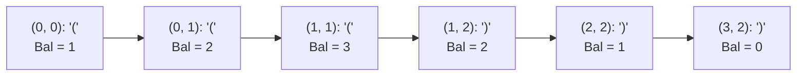

# Guided Example: Check if There Is a Valid Parentheses String Path

## 1. Problem Overview & Representative Instance

Given an $m \times n$ grid of parentheses characters, where each cell contains either an opening parenthesis `'('` or a closing parenthesis `')'`, we must determine whether there exists a valid path from the top-left corner $(0, 0)$ to the bottom-right corner $(m-1, n-1)$.

Path traversal is restricted to two legal directions at each step:
- Move one cell downward: $(i, j) \to (i+1, j)$
- Move one cell rightward: $(i, j) \to (i, j+1)$

A string formed by concatenating the characters along the path from source to target is considered valid if and only if:
1. The total count of opening parentheses equals the total count of closing parentheses.
2. In every prefix of the path, the count of opening parentheses is at least as large as the count of closing parentheses.

Consider the representative $4 \times 3$ grid instance:
$$\text{grid} = \begin{bmatrix} \text{'('} & \text{'('} & \text{'('} \\ \text{')'} & \text{'('} & \text{')'} \\ \text{'('} & \text{'('} & \text{')'} \\ \text{'('} & \text{'('} & \text{')'} \end{bmatrix}$$

Here, $m = 4$ and $n = 3$. Any path from $(0, 0)$ to $(3, 2)$ requires exactly $(m - 1) = 3$ downward steps and $(n - 1) = 2$ rightward steps, spanning a path length of:
$$L = m + n - 1 = 4 + 3 - 1 = 6$$

Because $L = 6$ is even, a balanced sequence containing $3$ opening and $3$ closing parentheses is mathematically possible. Let us trace the path:
$$(0, 0) \to (0, 1) \to (1, 1) \to (1, 2) \to (2, 2) \to (3, 2)$$

The resulting character sequence is $\text{"((()))"}$, which maintains a non-negative running balance throughout and terminates with balance zero. Thus, a valid path exists, and the answer is $\text{true}$.

## 2. Mathematical & Algorithmic Principles

### Balance Counter Formalism

Let each cell contribute a delta:
$$\Delta(i, j) = \begin{cases} +1 & \text{if } \text{grid}[i][j] = \text{'('} \\ -1 & \text{if } \text{grid}[i][j] = \text{')'} \end{cases}$$

A path of length $L$ with prefixes $P_1, P_2, \dots, P_L$ is valid if and only if:
1. $k_t = \sum_{r=1}^t \Delta(P_r) \ge 0$ for all $1 \le t \le L$.
2. $k_L = \sum_{r=1}^L \Delta(P_r) = 0$.

### Necessary Structural Pre-Conditions

We can disqualify invalid configurations in $O(1)$ time using three invariant checks:
1. **Odd Path Length:** Any path has length $m + n - 1$. If $(m + n - 1) \pmod 2 \ne 0$, opening and closing parentheses cannot match. Return $\text{false}$.
2. **Invalid Start Cell:** If $\text{grid}[0][0] = \text{')'}$, balance drops to $-1$ at step $1$. Return $\text{false}$.
3. **Invalid End Cell:** If $\text{grid}[m-1][n-1] = \text{'('}$, the final step increments balance, making balance $0$ at termination impossible. Return $\text{false}$.

### State Space Pruning and Bounded Balance

At any intermediate coordinate $(i, j)$ with running balance $k$:
- **Negative Balance Violation:** If $k < 0$, the prefix condition is breached. Prune immediately.
- **Unclosable Balance Bound:** The remaining distance to destination $(m-1, n-1)$ is:
  $$d_{\text{rem}} = (m - 1 - i) + (n - 1 - j)$$
  Even if every single remaining cell along the trajectory is a closing parenthesis `')'`, the balance can decrease by at most $d_{\text{rem}}$. Thus, if $k > d_{\text{rem}}$, the path can never terminate at $0$. Prune immediately.
- **Upper Bound on Balance:** Since $k$ cannot exceed the total number of opening parentheses needed, $k \le \frac{m + n - 1}{2}$.

### Dynamic Programming Formulation

We define a boolean state:
$$\text{reachable}(i, j, k)$$
indicating whether the destination $(m-1, n-1)$ can be reached with final balance $0$ starting from cell $(i, j)$ with entry balance $k$.

Transitions explore the two downward and rightward neighbors:
$$\text{reachable}(i, j, k) = \text{reachable}(i+1, j, k') \lor \text{reachable}(i, j+1, k')$$
where $k' = k + \Delta(i, j)$. With memoization, each unique tuple $(i, j, k)$ is visited at most once.

## 3. Step-by-Step Walkthrough with Intermediate State

Let us trace the optimal path $(0, 0) \to (0, 1) \to (1, 1) \to (1, 2) \to (2, 2) \to (3, 2)$ on the $4 \times 3$ grid.

| Step | Coordinate $(i, j)$ | Cell Character | Remaining Distance $d_{\text{rem}}$ | Prior Balance $k_{\text{in}}$ | New Balance $k_{\text{out}}$ | Feasibility Check ($0 \le k_{\text{out}} \le d_{\text{rem}}$) |
|---|---|---|---|---|---|---|
| 1 | $(0, 0)$ | `'('` | $(3-0) + (2-0) = 5$ | $0$ | $0 + 1 = 1$ | $1 \le 5$ (Valid) |
| 2 | $(0, 1)$ | `'('` | $(3-0) + (2-1) = 4$ | $1$ | $1 + 1 = 2$ | $2 \le 4$ (Valid) |
| 3 | $(1, 1)$ | `'('` | $(3-1) + (2-1) = 3$ | $2$ | $2 + 1 = 3$ | $3 \le 3$ (Valid, at boundary) |
| 4 | $(1, 2)$ | `')'` | $(3-1) + (2-2) = 2$ | $3$ | $3 - 1 = 2$ | $2 \le 2$ (Valid) |
| 5 | $(2, 2)$ | `')'` | $(3-2) + (2-2) = 1$ | $2$ | $2 - 1 = 1$ | $1 \le 1$ (Valid) |
| 6 | $(3, 2)$ | `')'` | $(3-3) + (2-2) = 0$ | $1$ | $1 - 1 = 0$ | $0 \le 0$ (Target reached with $k=0$!) |

- At Step 3, entering $(1, 1)$ produces balance $3$. Notice that $d_{\text{rem}} = 3$. If the path had chosen to move down to $(2, 1)$ where cell is `'('`, the new balance would become $4 > 2$, which exceeds $d_{\text{rem}}$ and immediately prunes that dead branch.
- Turning right to $(1, 2)$ decreases balance to $2$, which exactly matches the remaining $2$ steps, allowing the subsequent two closing parentheses to bring the balance to zero.

## 4. Comprehensive State Trace

The table below contrasts multiple candidate paths through the grid, demonstrating how pruning discards invalid branches.

| Path Traversal Route | Sequence of Characters | Balance Evolution | Failure Point or Outcome | Classification |
|---|---|---|---|---|
| $(0,0) \to (0,1) \to (1,1) \to (1,2) \to (2,2) \to (3,2)$ | $\text{"((()))"}$ | $1 \to 2 \to 3 \to 2 \to 1 \to 0$ | Reaches $(3,2)$ with $k = 0$ | **Valid Path (Returns True)** |
| $(0,0) \to (1,0) \to (2,0) \to (3,0) \to (3,1) \to (3,2)$ | $\text{"()((( )"}$ | $1 \to 0 \to 1 \to 2 \to 3 \to 2$ | Ends at $(3,2)$ with balance $k = 2 \ne 0$ | Invalid (Unbalanced end) |
| $(0,0) \to (1,0) \to (1,1) \to (2,1) \to (3,1) \to (3,2)$ | $\text{"()((() "}$ | $1 \to 0 \to 1 \to 2 \to 3 \to 2$ | Ends at $(3,2)$ with balance $k = 2 \ne 0$ | Invalid (Unbalanced end) |
| $(0,0) \to (0,1) \to (0,2) \to (1,2) \to (2,2) \to (3,2)$ | $\text{"((()))"}$ | $1 \to 2 \to 3 \to 2 \to 1 \to 0$ | Reaches $(3,2)$ with $k = 0$ | **Alternative Valid Path** |

Both the path through $(1, 1)$ and the upper rim path through $(0, 2)$ discover valid balance progressions.

## 5. Algorithmic Correctness & Soundness

The correctness of this search relies on state space equivalence and complete boundary containment:

1. **State Sufficiency:**
   At any cell $(i, j)$, the legality of subsequent steps depends solely on the current balance $k$. Two distinct paths that reach $(i, j)$ with identical balance $k$ face identical future constraints. Therefore, the triple $(i, j, k)$ is a complete Markovian state for the dynamic program.
2. **Monotonicity of Steps:**
   At each step, $i + j$ strictly increases by $1$. Consequently, the state transition graph is a Directed Acyclic Graph (DAG), guaranteeing termination without cycles.
3. **Soundness of Pruning:**
   - If $k < 0$, prefix validity is already violated. Because balance can only change by $\pm 1$ per step, no future suffix can retroactively repair a negative prefix.
   - If $k > d_{\text{rem}}$, even if all remaining $d_{\text{rem}}$ characters are `')'`, the minimum possible final balance is $k - d_{\text{rem}} > 0$. Hence, reaching $0$ is physically impossible.
   - Pruning these branches eliminates only provably dead paths, preserving all viable solutions.

## 6. Edge Cases & Anti-Patterns

1. **Odd Total Grid Distance:**
   - For a $2 \times 2$ grid, path length is $2 + 2 - 1 = 3$.
   - Any string of length $3$ cannot be balanced. The algorithm terminates in $O(1)$ without exploring any cells.
2. **Closing Parenthesis at $(0, 0)$:**
   - If $\text{grid}[0][0] = \text{')'}$, every possible path begins with a negative prefix balance. The pre-condition returns $\text{false}$ immediately.
3. **Opening Parenthesis at $(m-1, n-1)$:**
   - If the target cell is `'('`, any path entering it increases balance by $+1$. Thus, ending with balance $0$ is impossible. The pre-condition returns $\text{false}$ immediately.
4. **Equal Totals with Negative Prefix ($[[\text{'('}, \text{')'}, \text{')'}], [\text{')'}, \text{'('}, \text{'('}]]$):**
   - Even if total opening and closing counts in the entire grid match, paths dipping into negative balances along the way are rejected.
5. **Anti-Pattern: Unmemoized DFS:**
   - Exploring grid paths without recording visited $(i, j, k)$ states causes an exponential blowup of $\binom{m+n-2}{m-1} \approx \binom{198}{99} \approx 10^{58}$ operations. Memoization collapses this to at most $m \cdot n \cdot \frac{m+n}{2} \approx 10^6$ operations.

## 7. Complexity Analysis

The complexity parameters are governed by the grid dimensions $m$ and $n$.

| Dimension | Theoretical Bound | Practical Bound ($m, n \le 100$) |
|---|---|---|
| State Space Size | $O(m \cdot n \cdot (m+n))$ | With $m, n \le 100$, $m \cdot n = 10^4$ and $k \le 100$, yielding $\le 10^6$ distinct states. |
| Transition Cost | $O(1)$ | Each state attempts at most two directional transitions (down and right) with basic arithmetic checks. |
| Overall Time Complexity | $O(m \cdot n \cdot (m+n))$ | At most $2 \times 10^6$ operations, executing in under $50\text{ ms}$. |
| Auxiliary Space Complexity | $O(m \cdot n \cdot (m+n))$ | Memoization cache or 3D boolean table of dimensions $100 \times 100 \times 101$ requires $\approx 1\text{ MB}$ of memory. |
