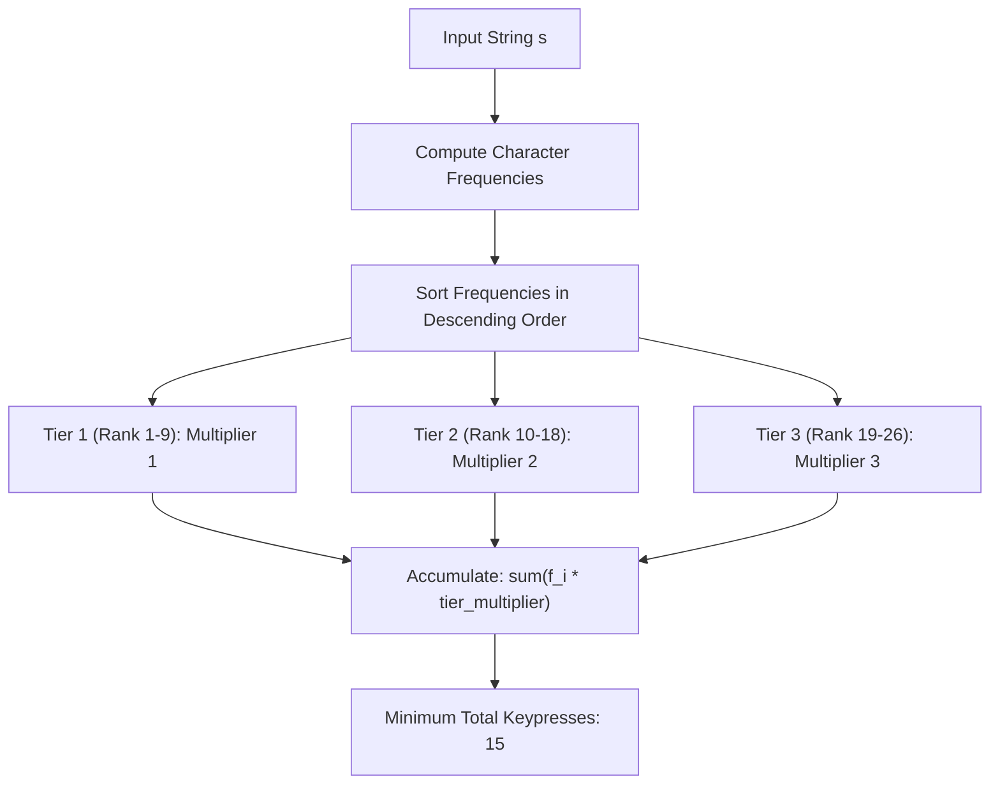

# Guided Example: Minimum Number of Keypresses

## 1. Problem Overview & Representative Instance

Consider a customizable keypad containing exactly $9$ buttons (numbered $2$ through $9$). We must map the $26$ lowercase English letters across these $9$ buttons such that each letter is assigned to exactly one button. 

When multiple letters are assigned to the same button:
- The first letter assigned to that button requires $1$ keypress.
- The second letter assigned to that button requires $2$ keypresses.
- The third letter assigned to that button requires $3$ keypresses.

Given a string $s$, our goal is to design an optimal keypad mapping that minimizes the total number of keypresses needed to type $s$.

Consider the representative instance:
$$s = \text{"abcdefghijkl"}$$

The string consists of $12$ distinct characters, each appearing exactly once:
$$\text{Frequencies: } \text{'a'}: 1, \text{'b'}: 1, \dots, \text{'l'}: 1$$

Because there are $9$ buttons available:
- Exactly $9$ letters can be assigned as the primary ($1$-press) character on each button.
- The remaining $12 - 9 = 3$ letters must be placed as secondary ($2$-press) characters.
- None of the letters need to occupy the third ($3$-press) tier.

Calculating the total cost:
- $9$ primary letters $\times 1\text{ press} = 9$
- $3$ secondary letters $\times 2\text{ presses} = 6$
- Total keypresses: $9 + 6 = 15$.

## 2. Mathematical & Algorithmic Principles

### Capacity Partitioning of the 9 Buttons

Each of the $9$ buttons provides three slots of increasing cost:
- **Tier 1 (Cost $1$):** $9$ available slots (one per button).
- **Tier 2 (Cost $2$):** $9$ available slots (one per button).
- **Tier 3 (Cost $3$):** $9$ available slots (up to $8$ needed for the remaining letters of the $26$-letter alphabet).

Thus, the global cost vector for the $26$ letters across the available slots is:
$$C = [\underbrace{1, 1, \dots, 1}_{9 \text{ times}}, \underbrace{2, 2, \dots, 2}_{9 \text{ times}}, \underbrace{3, 3, \dots, 3}_{8 \text{ times}}]$$

### The Rearrangement Inequality

Let $f_1, f_2, \dots, f_k$ denote the frequencies of the distinct characters occurring in $s$, sorted in descending order:
$$f_1 \ge f_2 \ge \dots \ge f_k$$

Let $c_1, c_2, \dots, c_k$ denote the keypress costs assigned to these characters, sorted in non-decreasing order:
$$c_1 \le c_2 \le \dots \le c_k$$

By the classical **Rearrangement Inequality**, the dot product $\sum_{i=1}^k f_i \cdot \pi(c_i)$ is strictly minimized when the sequences are sorted in opposite directions:
$$\sum_{i=1}^k f_i \cdot c_i \le \sum_{i=1}^k f_i \cdot c_{\pi(i)}$$
for any permutation $\pi$.

Therefore, the greedy choice is mathematically optimal:
1. Assign the $9$ most frequent characters to Tier 1 (multiplier $1$).
2. Assign the next $9$ most frequent characters to Tier 2 (multiplier $2$).
3. Assign any remaining characters to Tier 3 (multiplier $3$).

For any $1$-indexed rank $i$, the keypress multiplier is given compactly by:
$$\text{cost}(i) = \left\lfloor \frac{i - 1}{9} \right\rfloor + 1$$
$$\text{Total Keypresses} = \sum_{i=1}^k \left(\left\lfloor \frac{i - 1}{9} \right\rfloor + 1\right) \cdot f_i$$

## 3. Step-by-Step Walkthrough with Intermediate State

Let us trace the process on $s = \text{"abcdefghijkl"}$.

| Variable | Concrete Role |
|---|---|
| $s$ | Input text of length $12$ |
| $cnt$ | Frequency map of characters |
| $i$ | $1$-based rank index of sorted frequencies ($1 \le i \le 12$) |
| $k$ | Active tier multiplier ($\lfloor (i-1)/9 \rfloor + 1$) |
| $\text{ans}$ | Running accumulator of total keypresses |

- **Step 1: Frequency Calculation**
  - All $12$ letters appear once: $f = [1, 1, 1, 1, 1, 1, 1, 1, 1, 1, 1, 1]$.
  - Number of distinct characters: $k = 12$.

- **Step 2: Tier 1 Processing (Ranks $1$ through $9$)**
  - Multiplier is $k = 1$.
  - Rank $1$: $ans = 0 + 1 \times 1 = 1$
  - Rank $2$: $ans = 1 + 1 \times 1 = 2$
  - Rank $3$: $ans = 2 + 1 \times 1 = 3$
  - Rank $4$: $ans = 3 + 1 \times 1 = 4$
  - Rank $5$: $ans = 4 + 1 \times 1 = 5$
  - Rank $6$: $ans = 5 + 1 \times 1 = 6$
  - Rank $7$: $ans = 6 + 1 \times 1 = 7$
  - Rank $8$: $ans = 7 + 1 \times 1 = 8$
  - Rank $9$: $ans = 8 + 1 \times 1 = 9$
  - At $i = 9$, index is divisible by $9$: increment tier multiplier to $k = 2$.

- **Step 3: Tier 2 Processing (Ranks $10$ through $12$)**
  - Multiplier is $k = 2$.
  - Rank $10$: $ans = 9 + 2 \times 1 = 11$
  - Rank $11$: $ans = 11 + 2 \times 1 = 13$
  - Rank $12$: $ans = 13 + 2 \times 1 = 15$

- **Step 4: Result Extraction**
  - All frequencies exhausted. Total keypresses = $15$.

## 4. Comprehensive State Trace

The assignment across different input patterns is detailed below.

| Example Input | Distinct Counts | Frequencies (Sorted) | Tier 1 ($1\times$) | Tier 2 ($2\times$) | Tier 3 ($3\times$) | Total Calculation | Output |
|---|---|---|---|---|---|---|---|
| $\text{"apple"}$ | $4$ | $[2, 1, 1, 1]$ | $2, 1, 1, 1$ | None | None | $1 \times (2 + 1 + 1 + 1)$ | $5$ |
| $\text{"abcdefghijkl"}$ | $12$ | $12$ ones | $9$ ones | $3$ ones | None | $9(1) + 3(2)$ | $15$ |
| $\text{"abcdefghi"}$ | $9$ | $9$ ones | $9$ ones | None | None | $9 \times 1$ | $9$ |
| $\text{"abcdefghij"}$ | $10$ | $10$ ones | $9$ ones | $1$ one | None | $9(1) + 1(2)$ | $11$ |
| Alphabet ($26$ letters) | $26$ | $26$ ones | $9$ ones | $9$ ones | $8$ ones | $9(1) + 9(2) + 8(3)$ | $51$ |
| $\text{"aaaaabbbbcccdde"}$ | $5$ | $[5, 4, 3, 2, 1]$ | $5, 4, 3, 2, 1$ | None | None | $1 \times (15)$ | $15$ |

In $\text{"aaaaabbbbcccdde"}$, the $5$ distinct letters fit comfortably within the $9$ available Tier 1 buttons. Assigning `'a'` (frequency $5$) and `'b'` (frequency $4$) to primary positions ensures they incur only $1$ press each.

## 5. Algorithmic Correctness & Soundness

The correctness of the greedy assignment strategy is verified through an exchange argument:

1. **Exchange Argument Proof:**
   Suppose an optimal mapping exists where a character $A$ with frequency $f_A$ is placed in a tier with cost $c_A$, and a character $B$ with frequency $f_B$ is placed in a tier with cost $c_B$, such that $f_A > f_B$ but $c_A > c_B$.
   - Current combined cost:
     $$\text{Cost}_{\text{current}} = f_A \cdot c_A + f_B \cdot c_B$$
   - Swap the button positions of $A$ and $B$:
     $$\text{Cost}_{\text{swapped}} = f_A \cdot c_B + f_B \cdot c_A$$
   - Taking the difference:
     $$\text{Cost}_{\text{swapped}} - \text{Cost}_{\text{current}} = f_A(c_B - c_A) + f_B(c_A - c_B) = (f_A - f_B)(c_B - c_A)$$
   - Since $f_A - f_B > 0$ and $c_B - c_A < 0$, their product is strictly negative:
     $$\text{Cost}_{\text{swapped}} - \text{Cost}_{\text{current}} < 0 \implies \text{Cost}_{\text{swapped}} < \text{Cost}_{\text{current}}$$
   This strictly decreases the total keypress count, contradicting the optimality of the initial assignment.
2. **Global Optimality:**
   By repeated application of this exchange, any assignment can be transformed into the sorted frequency assignment without ever increasing the cost. Thus, sorting frequencies descendingly and filling slot tiers in increasing order of cost is globally optimal.

## 6. Edge Cases & Anti-Patterns

1. **Single Distinct Character ($\text{"mmmmmmmmmmmm"}$):**
   - The string has length $12$, but only $1$ distinct character ($'m'$).
   - Character $'m'$ is assigned to Tier 1 on any button, paying $1$ press per character. Total cost: $12 \times 1 = 12$.
2. **Tier Boundaries ($9, 10, 18, 19$ Distinct Characters):**
   - At $9$ letters: All fit in Tier 1. Cost is $\sum f_i$.
   - At $10$ letters: Exactly $1$ letter spills into Tier 2. The smallest frequency letter pays $2\times$.
   - At $19$ letters: $9$ in Tier 1, $9$ in Tier 2, and the $19$-th letter enters Tier 3, paying $3\times$.
3. **Full $26$-Letter Alphabet:**
   - Maximum possible distinct count is $26$.
   - Breakdown: $9$ in Tier 1, $9$ in Tier 2, $8$ in Tier 3.
   - For uniform frequencies ($f_i = 1$): $9(1) + 9(2) + 8(3) = 9 + 18 + 24 = 51$.
4. **Anti-Pattern: Static Alphabet Assignment:**
   - Mapping letters in standard alphabetical order (placing `a, b, c` on button 2, etc.) regardless of input frequencies incurs high costs when rare letters get priority over high-frequency letters. The keypad layout must be tailored dynamically to the string's empirical frequency distribution.

## 7. Complexity Analysis

The complexity parameters are governed by the length of the string $N = |s|$ and the alphabet size $|\Sigma| = 26$.

| Operation Phase | Time Complexity | Space Complexity | Details |
|---|---|---|---|
| Frequency Counting | $O(N)$ | $O(\lvert \Sigma \rvert)$ | Single linear scan over the string of length $N$ to tally character counts into an array of size $26$. |
| Frequency Sorting | $O(\lvert \Sigma \rvert \log \lvert \Sigma \rvert)$ | $O(\lvert \Sigma \rvert)$ | Sorting at most $26$ integer counts takes negligible time ($\le 26 \log_2 26 \approx 122$ comparisons). |
| Dot Product Accumulation | $O(\lvert \Sigma \rvert)$ | $O(1)$ | Single pass over at most $26$ values with integer multiplication and addition. |
| Total Complexity | $O(N)$ | $O(\lvert \Sigma \rvert) = O(1)$ | Strictly linear in input size $N$ with constant auxiliary memory. |
