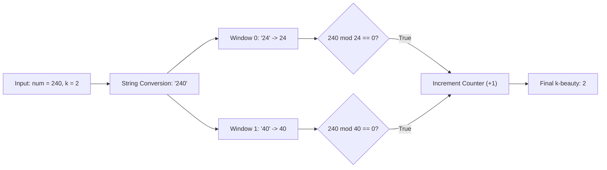

# Guided Example: Find the K-Beauty of a Number

## 1. Problem Overview & Representative Instance

The $k$-beauty of an integer $num$ is defined as the number of substrings of length $k$ (when $num$ is represented as a decimal string) that satisfy two conditions:
1. The substring, parsed as an integer $t$, is non-zero ($t \ne 0$).
2. The parsed integer $t$ is a divisor of $num$ (meaning $num \bmod t = 0$).

Substrings are considered by position: if an identical numerical value appears at multiple distinct substring offsets, each valid occurrence increments the $k$-beauty counter independently. Substrings with leading zeros are parsed as standard integers (e.g., $\text{"04"} \to 4$).

Consider the representative instance:
$$num = 240, \quad k = 2$$

Representing $num$ as a string yields $s = \text{"240"}$ with length $L = 3$. The number of contiguous substrings of length $k = 2$ is $L - k + 1 = 3 - 2 + 1 = 2$:
1. Offset $0 \dots 1$: Substring is $\text{"24"}$.
   - Integer value: $t_1 = 24$.
   - Divisibility check: $240 \bmod 24 = 0$. Valid divisor!
2. Offset $1 \dots 2$: Substring is $\text{"40"}$.
   - Integer value: $t_2 = 40$.
   - Divisibility check: $240 \bmod 40 = 0$. Valid divisor!

Both candidate substrings divide $num$ evenly. Therefore, the $k$-beauty of $240$ is $2$.

## 2. Mathematical & Algorithmic Principles

### Substring Window Enumeration

Let $s = d_0 d_1 \dots d_{L-1}$ be the decimal character representation of $num$. The total number of decimal digits is $L = \lfloor \log_{10} num \rfloor + 1$. 

Every valid window of size $k$ begins at an index $i \in [0, L - k]$. The substring spanning $[i, i+k-1]$ represents the integer:
$$t_i = \sum_{j=0}^{k-1} d_{i+j} \cdot 10^{k-1-j}$$

### Predicate Decomposition

For each window integer $t_i$, the qualification predicate $\mathcal{Q}(t_i)$ is evaluated:
$$\mathcal{Q}(t_i) = \begin{cases} 1 & \text{if } t_i \ne 0 \land num \bmod t_i = 0 \\ 0 & \text{otherwise} \end{cases}$$

The $k$-beauty of $num$ is the sum of qualifications:
$$\text{k-beauty}(num, k) = \sum_{i=0}^{L - k} \mathcal{Q}(t_i)$$

### Structural Safeguards

1. **Zero-Divisor Prevention:**
   If a substring consists entirely of zeros (e.g., $\text{"00"}$), its parsed numerical value is $0$. Division by zero is undefined in arithmetic. The condition $t_i \ne 0$ must short-circuit before attempting the modulo operation $num \bmod t_i$.
2. **Positional Multiplicity:**
   Unlike set deduplication, identical values appearing at distinct indices must be counted repeatedly. The iteration operates across index offsets $i$, not unique value sets.

## 3. Step-by-Step Walkthrough with Intermediate State

Let us examine the extended sample instance:
$$num = 430043, \quad k = 2$$
The decimal string is $s = \text{"430043"}$ with length $L = 6$. There are $6 - 2 + 1 = 5$ candidate windows.

| Window $i$ | Substring $s[i \dots i+k-1]$ | Numerical Value $t$ | Non-Zero Check ($t \ne 0$) | Modulo Evaluation $430043 \bmod t$ | Divisor Status | Running Counter |
|---|---|---|---|---|---|---|
| $0$ | $\text{"43"}$ | $43$ | Passed ($43 \ne 0$) | $430043 \bmod 43 = 0$ | Qualified | $1$ |
| $1$ | $\text{"30"}$ | $30$ | Passed ($30 \ne 0$) | $430043 \bmod 30 = 23$ | Disqualified | $1$ |
| $2$ | $\text{"00"}$ | $0$ | Failed ($0 = 0$) | Skipped (Division by zero) | Disqualified | $1$ |
| $3$ | $\text{"04"}$ | $4$ | Passed ($4 \ne 0$) | $430043 \bmod 4 = 3$ | Disqualified | $1$ |
| $4$ | $\text{"43"}$ | $43$ | Passed ($43 \ne 0$) | $430043 \bmod 43 = 0$ | Qualified | $2$ |

- **Step 0 ($i = 0$):** Substring $\text{"43"}$ converts to integer $43$. Dividing $430043$ by $43$ yields exactly $10001$ with remainder $0$. The counter increments to $1$.
- **Step 1 ($i = 1$):** Substring $\text{"30"}$ converts to integer $30$. Modulo is $23 \ne 0$. Counter remains $1$.
- **Step 2 ($i = 2$):** Substring $\text{"00"}$ converts to integer $0$. The non-zero guard stops execution immediately, avoiding a division by zero runtime error. Counter remains $1$.
- **Step 3 ($i = 3$):** Substring $\text{"04"}$ has a leading zero, parsing to value $4$. Modulo is $3 \ne 0$. Counter remains $1$.
- **Step 4 ($i = 4$):** Substring $\text{"43"}$ converts to integer $43$. Divides evenly ($430043 \bmod 43 = 0$). The counter increments to $2$.

The final accumulated $k$-beauty is $2$.

## 4. Comprehensive State Trace

The table below catalogs evaluations across diverse structural boundaries.

| Input $num$ | Parameter $k$ | String Length $L$ | Evaluated Windows (Value $t$) | Valid Divisor Values | Disqualified Values | Output Counter |
|---|---|---|---|---|---|---|
| $240$ | $2$ | $3$ | $[24, 40]$ | $24, 40$ | None | $2$ |
| $430043$ | $2$ | $6$ | $[43, 30, 0, 4, 43]$ | $43, 43$ | $30$ (rem $23$), $0$ (zero), $4$ (rem $3$) | $2$ |
| $1$ | $1$ | $1$ | $[1]$ | $1$ | None | $1$ |
| $100$ | $1$ | $3$ | $[1, 0, 0]$ | $1$ | $0, 0$ (both zero) | $1$ |
| $10101$ | $2$ | $5$ | $[10, 1, 10, 1]$ | $1, 1$ | $10, 10$ ($10101 \bmod 10 = 1$) | $2$ |
| $99999$ | $2$ | $5$ | $[99, 99, 99, 99]$ | None | $99$ ($99999 \bmod 99 = 9$) | $0$ |

In the case $num = 10101$ with $k = 2$:
- Windows at offsets $1$ and $3$ evaluate to $\text{"01"}$, which parses to integer $1$.
- Since $1$ divides every integer, both occurrences qualify, demonstrating the necessity of leading zero parsing.

## 5. Algorithmic Correctness & Soundness

The correctness of the algorithm relies on exhaustive window exploration and exact arithmetic properties:

1. **Exhaustiveness of the Window Shift:**
   The index range $i \in [0, L - k]$ spans all possible contiguous substrings of length $k$ by definition of substring indexing. No valid window is skipped.
2. **Deterministic String-to-Integer Projection:**
   Decimal parsing maps each sequence of $k$ ASCII digits uniquely to an integer value in $[0, 10^k - 1]$. Leading zeros are naturally absorbed during standard base-$10$ expansion.
3. **Safety of Zero Division Guard:**
   In modular arithmetic, the operation $A \bmod B$ is defined if and only if $B \ne 0$. Enforcing $t \ne 0$ prior to the remainder operation guarantees both mathematical validity and runtime safety.
4. **Finite Bound on Number of Digits:**
   Since $num \le 10^9$, the decimal representation has length $L \le 10$. The number of windows $L - k + 1$ never exceeds $10$. Hence, precision limits for standard $32$-bit or $64$-bit integers are never exceeded.

## 6. Edge Cases & Anti-Patterns

1. **Entire Substring Consists of Zeros ($\text{"00"}$):**
   - In numbers like $100$ with $k=1$, or $430043$ with $k=2$, zero windows are encountered.
   - Guarding against $t = 0$ prevents catastrophic arithmetic exceptions.
2. **$k$ Equals the Total Length of $num$ ($k = L$):**
   - Only one window exists: the entire number itself.
   - Since any positive integer $num$ divides itself ($num \bmod num = 0$), the result is guaranteed to be $1$.
3. **$k = 1$ with Trailing Zeros:**
   - For $num = 240$ and $k = 1$, windows are $\text{"2"}$, $\text{"4"}$, $\text{"0"}$.
   - $240 \bmod 2 = 0$ (pass), $240 \bmod 4 = 0$ (pass), $0$ (skipped). Total is $2$.
4. **Anti-Pattern: Set Deduplication:**
   - Inserting parsed values into a hash set before counting breaks correctness because duplicate occurrences at different indices would collapse into a single count. The problem explicitly counts substrings by position.

## 7. Complexity Analysis

The operational complexity is governed by the number of decimal digits $L = O(\log_{10} num)$.

| Metric | Theoretical Bound | Magnitude ($num \le 10^9$) |
|---|---|---|
| Digit Conversion | $O(L)$ | At most $10$ character conversions. |
| Window Extraction Iterations | $L - k + 1$ | At most $10$ iterations. |
| Per-Window Arithmetic Cost | $O(k)$ | Substring slicing and integer parsing take $O(k)$ operations. Remainder $num \bmod t$ takes $O(1)$ machine cycles. |
| Total Time Complexity | $O(L \cdot k)$ | Since $L \le 10$ and $k \le 10$, total operations are bounded by $\le 100$, running in under $1\text{ }\mu\text{s}$. |
| Space Complexity | $O(L)$ | Storing the string representation of $num$ takes $\le 10$ bytes of memory. |