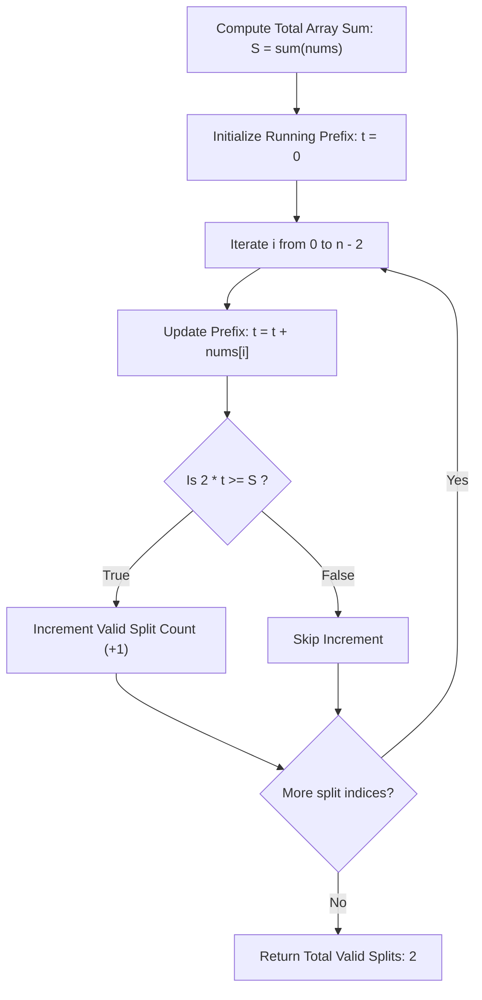

# Guided Example: Number of Ways to Split Array

## 1. Problem Overview & Representative Instance

Given an integer array $nums$ of length $n$, we consider all possible valid splits of the array into two non-empty contiguous sections. A split occurs at index $i$, where $0 \le i < n - 1$, dividing the array into:
1. A left subarray spanning indices $0$ through $i$: $nums[0 \dots i]$
2. A right subarray spanning indices $i + 1$ through $n - 1$: $nums[i+1 \dots n-1]$

A split is defined as valid if and only if the sum of elements in the left subarray is greater than or equal to the sum of elements in the right subarray:
$$\sum_{j=0}^i nums[j] \ge \sum_{j=i+1}^{n-1} nums[j]$$

The objective is to determine the total count of valid split points across the array.

Consider the representative array instance:
$$nums = [10, 4, -8, 7]$$

Here, the length is $n = 4$. Since both parts must be non-empty, the split index $i$ can take values in $\{0, 1, 2\}$:
- **Split at $i = 0$:**
  - Left subarray: $[10]$ with sum $= 10$.
  - Right subarray: $[4, -8, 7]$ with sum $4 + (-8) + 7 = 3$.
  - Comparison: $10 \ge 3$ (Condition holds, valid split).
- **Split at $i = 1$:**
  - Left subarray: $[10, 4]$ with sum $10 + 4 = 14$.
  - Right subarray: $[-8, 7]$ with sum $(-8) + 7 = -1$.
  - Comparison: $14 \ge -1$ (Condition holds, valid split).
- **Split at $i = 2$:**
  - Left subarray: $[10, 4, -8]$ with sum $10 + 4 - 8 = 6$.
  - Right subarray: $[7]$ with sum $= 7$.
  - Comparison: $6 \ge 7$ (Condition fails, invalid split).

Out of $3$ possible split points, exactly $2$ satisfy the requirement. Thus, the output is $2$.

## 2. Mathematical & Algorithmic Principles

### Total Sum Derivation and Suffix Elimination

Let $S$ denote the total sum of all elements across the entire array:
$$S = \sum_{j=0}^{n-1} nums[j]$$

Let $T_i$ represent the prefix sum up to index $i$:
$$T_i = \sum_{j=0}^i nums[j]$$

Because the left subarray $nums[0 \dots i]$ and the right subarray $nums[i+1 \dots n-1]$ form a complete partition of the array, the right subarray sum is identically equal to the complement of the left subarray sum:
$$\sum_{j=i+1}^{n-1} nums[j] = S - T_i$$

### Algebraic Simplification of the Split Condition

The original validity condition:
$$T_i \ge S - T_i$$
rearranges algebraically to:
$$2 T_i \ge S$$

This reformulates the check into a single arithmetic comparison involving only the running prefix sum $T_i$ and the constant total sum $S$. There is no need to maintain a separate suffix array or perform repeated slice summations.

### Algorithm Pipeline

1. Compute the total sum $S$ in a single preliminary pass.
2. Maintain a running scalar accumulator $t$ initialized to $0$.
3. Iterate $i$ from $0$ up to $n - 2$ (stopping strictly before the final element to ensure the right subarray contains at least one element):
   - Add $nums[i]$ to $t$.
   - If $2t \ge S$, increment the valid split counter.
4. Return the counter.

## 3. Step-by-Step Walkthrough with Intermediate State

We execute the procedure on $nums = [10, 4, -8, 7]$.

| Tracking Variable | Definition |
|---|---|
| $S$ | Global sum of all elements in $nums$ ($S = 10 + 4 - 8 + 7 = 13$) |
| $i$ | Split index under evaluation ($0 \le i \le 2$) |
| $t$ | Running prefix sum representing $nums[0 \dots i]$ |
| $S - t$ | Implicit right subarray sum representing $nums[i+1 \dots n-1]$ |
| $2t \ge S$ | Simplified algebraic validity test |
| $\text{ans}$ | Count of valid split boundaries |

- **Step 0: Initial State**
  - Compute total sum: $S = 13$.
  - Initialize prefix accumulator: $t = 0$.
  - Initialize valid count: $\text{ans} = 0$.

- **Step 1: Evaluate Split $i = 0$ ($nums[0] = 10$)**
  - Update prefix sum: $t = 0 + 10 = 10$.
  - Check validity: $2 \times 10 = 20 \ge 13$ (Equivalently, left $10 \ge$ right $13 - 10 = 3$).
  - Condition satisfied! Increment count: $\text{ans} = 0 + 1 = 1$.

- **Step 2: Evaluate Split $i = 1$ ($nums[1] = 4$)**
  - Update prefix sum: $t = 10 + 4 = 14$.
  - Check validity: $2 \times 14 = 28 \ge 13$ (Equivalently, left $14 \ge$ right $13 - 14 = -1$).
  - Condition satisfied! Increment count: $\text{ans} = 1 + 1 = 2$.

- **Step 3: Evaluate Split $i = 2$ ($nums[2] = -8$)**
  - Update prefix sum: $t = 14 + (-8) = 6$.
  - Check validity: $2 \times 6 = 12 < 13$ (Equivalently, left $6 \ge$ right $13 - 6 = 7$ is false).
  - Condition fails. Counter remains: $\text{ans} = 2$.

- **Step 4: Boundary Stop**
  - The loop terminates at $i = 2 = n - 2$. Index $i = 3$ is not evaluated because the right subarray would be empty.
  - Final result: $\text{ans} = 2$.

## 4. Comprehensive State Trace

The state variables across diverse test inputs are traced in the table below.

| Input $nums$ | Total Sum $S$ | Split Index $i$ | Element $nums[i]$ | Prefix $t$ | Suffix $S - t$ | Comparison $t \ge S - t$ | Valid? | Running Count |
|---|---|---|---|---|---|---|---|---|
| $[10, 4, -8, 7]$ | $13$ | $0$ | $10$ | $10$ | $3$ | $10 \ge 3$ | Yes | $1$ |
| | | $1$ | $4$ | $14$ | $-1$ | $14 \ge -1$ | Yes | $2$ |
| | | $2$ | $-8$ | $6$ | $7$ | $6 \ge 7$ | No | $2$ |
| $[2, 3, 1, 0]$ | $6$ | $0$ | $2$ | $2$ | $4$ | $2 \ge 4$ | No | $0$ |
| | | $1$ | $3$ | $5$ | $1$ | $5 \ge 1$ | Yes | $1$ |
| | | $2$ | $1$ | $6$ | $0$ | $6 \ge 0$ | Yes | $2$ |
| $[1, 1]$ | $2$ | $0$ | $1$ | $1$ | $1$ | $1 \ge 1$ | Yes | $1$ |
| $[-5, 10]$ | $5$ | $0$ | $-5$ | $-5$ | $10$ | $-5 \ge 10$ | No | $0$ |
| $[0, 0, 0, 0]$ | $0$ | $0$ | $0$ | $0$ | $0$ | $0 \ge 0$ | Yes | $1$ |
| | | $1$ | $0$ | $0$ | $0$ | $0 \ge 0$ | Yes | $2$ |
| | | $2$ | $0$ | $0$ | $0$ | $0 \ge 0$ | Yes | $3$ |

For $[0, 0, 0, 0]$, every split has left sum $0$ and right sum $0$. Since $0 \ge 0$ holds at all $n - 1 = 3$ split boundaries, all splits are valid.

## 5. Algorithmic Correctness & Soundness

The correctness of the single-pass prefix summation is guaranteed by algebraic partition properties:

1. **Exact Complementarity:**
   For any array of real numbers and any index $i \in [0, n-2]$:
   $$\sum_{j=0}^{n-1} nums[j] = \sum_{j=0}^i nums[j] + \sum_{j=i+1}^{n-1} nums[j]$$
   Denoting the left sum by $L$ and right sum by $R$, $S = L + R \implies R = S - L$.
   Therefore, the condition $L \ge R$ is strictly equivalent to $L \ge S - L \iff 2L \ge S$. No approximation is introduced.
2. **Exclusion of Empty Subarrays:**
   The problem requires both subarrays to be non-empty. This demands $i \ge 0$ (left subarray has length at least $1$) and $i \le n - 2$ (right subarray has length at least $(n - 1) - (n - 2) = 1$). Iterating $i$ strictly over $[0, n-2]$ guarantees that every tested split satisfies the non-empty requirement.
3. **Signed Integer Soundness:**
   The inequality $2L \ge S$ holds identically for positive, negative, and mixed-sign elements. For instance, if $L = -2$ and $R = -5$, $L \ge R$ is true ($-2 \ge -5$). In our formula, $S = -7$, and $2(-2) = -4 \ge -7$, which correctly evaluates to true.

## 6. Edge Cases & Anti-Patterns

1. **Negative Numbers ($nums = [-1, -2, -3, -4]$):**
   - Total sum: $S = -10$.
   - $i = 0$: $t = -1$, right is $-9$. Since $-1 \ge -9$, valid!
   - $i = 1$: $t = -3$, right is $-7$. Since $-3 \ge -7$, valid!
   - $i = 2$: $t = -6$, right is $-4$. Since $-6 < -4$, invalid.
   - Result is $2$.
2. **Minimal Length Array ($n = 2$):**
   - Exactly one split point exists at $i = 0$.
   - If $nums = [1, 1]$, $1 \ge 1$, yielding $1$.
   - If $nums = [-5, 10]$, $-5 < 10$, yielding $0$.
3. **Potential Integer Overflow:**
   - With $n = 10^5$ and $nums[i] \approx 10^5$, the total sum can reach $10^{10}$, which exceeds the $32$-bit signed integer maximum ($2.14 \times 10^9$).
   - A $64$-bit integer accumulator must be used for $S$ and $t$ to prevent arithmetic overflow.
4. **Anti-Pattern: $O(n^2)$ Slicing:**
   - Calling `sum(nums[:i+1])` and `sum(nums[i+1:])` inside a loop takes $O(n)$ work per iteration, resulting in $O(n^2)$ time and causing timeouts on $10^5$ elements. Computing the running prefix sum maintains strict $O(n)$ efficiency.

## 7. Complexity Analysis

The operational parameters depend on the length of the array $n = |nums|$.

| Metric | Complexity | Explanation |
|---|---|---|
| Total Sum Calculation | $O(n)$ | One initial pass over $n$ elements to compute $S$. |
| Prefix Sweep | $O(n)$ | One single pass over the first $n - 1$ elements updating $t$ and evaluating $2t \ge S$. |
| Total Time Complexity | $O(n)$ | Performs $2n - 1$ scalar additions and comparisons, taking $\approx 1\text{ ms}$ for $n = 10^5$. |
| Auxiliary Space Complexity | $O(1)$ | Memory is confined to two $64$-bit integer accumulators ($S$ and $t$) and an integer counter. No arrays or collections are allocated. |
