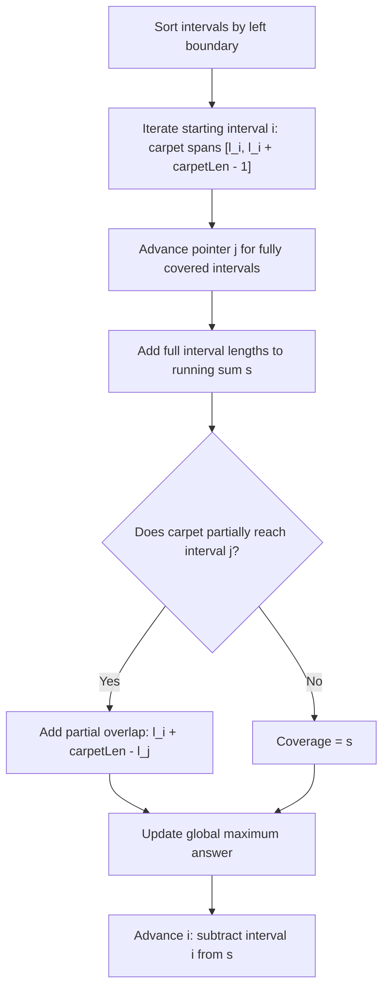

# Guided Example: Maximum White Tiles Covered by a Carpet

## 1. Problem Overview & Representative Instance

We are given a 2D integer array $tiles$, where each element $tiles[i] = [l_i, r_i]$ denotes an inclusive range of white tiles on an infinite number line. All other tile coordinates are black. The provided tile intervals are mutually disjoint and non-overlapping. Additionally, we are given an integer $carpetLen$ representing the length of a single carpet that can be positioned anywhere along the number line.

Our objective is to determine the maximum number of white tiles that can be simultaneously covered by placing the carpet.

Consider the representative instance:
$$tiles = [[1, 5], [10, 11], [12, 18], [20, 25], [30, 32]], \quad carpetLen = 10$$

The number line contains white segments separated by black gaps:
- Interval $0$: $[1, 5]$ (length $5$)
- Gap: $(5, 10)$ of length $4$ (black tiles $6, 7, 8, 9$)
- Interval $1$: $[10, 11]$ (length $2$)
- Interval $2$: $[12, 18]$ (length $7$)
- Gap: $(18, 20)$ of length $1$ (black tile $19$)
- Interval $3$: $[20, 25]$ (length $6$)
- Interval $4$: $[30, 32]$ (length $3$)

Let us test potential placements:
- If the carpet starts at tile coordinate $1$, it spans the range $[1, 10]$. It covers all of $[1, 5]$ ($5$ tiles), the black gap $[6, 9]$ ($0$ tiles), and tile $10$ from $[10, 11]$ ($1$ tile). Total covered white tiles: $5 + 1 = 6$.
- If the carpet starts at tile coordinate $10$, it spans the range $[10, 19]$. It fully covers $[10, 11]$ ($2$ tiles) and fully covers $[12, 18]$ ($7$ tiles). Total covered white tiles: $2 + 7 = 9$.

No alternate placement can cover more than $9$ white tiles. Hence, the optimal result is $9$.

## 2. Mathematical & Algorithmic Principles

### The Left-Alignment Optimality Lemma

**Lemma:** *There exists an optimal carpet placement whose left boundary aligns exactly with the left boundary $l_i$ of some interval $tiles[i]$.*

**Proof:**
Suppose an optimal carpet covers the maximum possible white tiles spanning range $[x, x + carpetLen - 1]$:
1. If $x$ lies in a black gap between intervals, shifting the carpet to the right until $x = l_{\text{next}}$ does not lose any white tiles on the left (since $[x, l_{\text{next}} - 1]$ consists purely of black tiles), while it can only gain or retain white tiles on the right.
2. If $x$ lies strictly inside an interval $[l_i, r_i]$ with $x > l_i$, consider shifting the carpet leftward. For every unit shifted left, the left edge covers another white tile from $[l_i, r_i]$. The right edge might drop a tile, but that tile can be either black or white. Thus, shifting left until $x = l_i$ can never decrease total white tile coverage unless an earlier black gap is encountered. By continuity and discrete monotonicity, the maximum is always achieved at $x = l_i$ for some $i$.

### Two-Pointer Sliding Window Formulation

Sort the intervals such that $l_0 < l_1 < \dots < l_{n-1}$. 

For each left anchor $i \in [0, n-1]$, the carpet spans $[l_i, l_i + carpetLen - 1]$:
1. Maintain a pointer $j \ge i$ identifying the first interval that is not fully covered. An interval $j$ is fully covered if:
   $$r_j - l_i + 1 \le carpetLen \iff r_j \le l_i + carpetLen - 1$$
   We accumulate the sum of lengths of all fully covered intervals:
   $$s = \sum_{k=i}^{j-1} (r_k - l_k + 1)$$
2. If $j < n$ and the carpet reaches into interval $j$ (meaning $l_i + carpetLen > l_j$), the partial white tile overlap from interval $j$ is:
   $$\text{partial} = l_i + carpetLen - l_j$$
   Total coverage starting at $l_i$ is $s + \text{partial}$.
3. As $i$ advances to $i+1$, the interval $[l_i, r_i]$ leaves the window, so we subtract $(r_i - l_i + 1)$ from $s$. Pointer $j$ never retreats, guaranteeing an $O(n)$ amortized scan after the initial $O(n \log n)$ sort.

## 3. Step-by-Step Walkthrough with Intermediate State

We execute the two-pointer scan on the sorted intervals:
$$tiles = [[1, 5], [10, 11], [12, 18], [20, 25], [30, 32]], \quad carpetLen = 10$$

| Variable | Architectural Meaning |
|---|---|
| $i$ | Index of the interval anchoring the carpet's left edge ($l_i$) |
| $j$ | Index of the first interval not completely covered by the carpet |
| $s$ | Running sum of lengths of completely covered intervals $[i \dots j-1]$ |
| $\text{reach}$ | Right endpoint of the carpet: $l_i + carpetLen - 1 = l_i + 9$ |
| $\text{ans}$ | Maximum white tile coverage discovered so far |

- **Step 0: Anchor at Interval $0$ ($[1, 5]$)**
  - Left edge: $l_0 = 1$. Carpet reaches up to $1 + 10 - 1 = 10$.
  - Interval $0$ ($[1, 5]$): $r_0 = 5 \le 10$ (fully covered). Add length $5 - 1 + 1 = 5$ to $s$. $j$ becomes $1$.
  - Interval $1$ ($[10, 11]$): $r_1 = 11 > 10$ (not fully covered). Stop advancing $j$.
  - Partial check: $l_0 + carpetLen = 11 > l_1 = 10$. Partial overlap is $11 - 10 = 1$.
  - Total candidate coverage: $s + \text{partial} = 5 + 1 = 6$.
  - Maximum update: $\text{ans} = \max(0, 6) = 6$.
  - Slide window: Subtract interval $0$ length ($5$) from $s \implies s = 0$.

- **Step 1: Anchor at Interval $1$ ($[10, 11]$)**
  - Left edge: $l_1 = 10$. Carpet reaches up to $10 + 9 = 19$.
  - Interval $1$ ($[10, 11]$): $r_1 = 11 \le 19$. Add length $2$ to $s \implies s = 2$. $j$ becomes $2$.
  - Interval $2$ ($[12, 18]$): $r_2 = 18 \le 19$. Add length $7$ to $s \implies s = 2 + 7 = 9$. $j$ becomes $3$.
  - Interval $3$ ($[20, 25]$): $r_3 = 25 > 19$. Stop advancing $j$.
  - Partial check: $l_1 + carpetLen = 20 \le l_3 = 20$ (no overlap into interval $3$).
  - Total candidate coverage: $s = 9$.
  - Maximum update: $\text{ans} = \max(6, 9) = 9$.
  - Slide window: Subtract interval $1$ length ($2$) from $s \implies s = 7$.

- **Step 2: Anchor at Interval $2$ ($[12, 18]$)**
  - Left edge: $l_2 = 12$. Carpet reaches up to $12 + 9 = 21$.
  - Pointer $j = 3$ ($[20, 25]$): $r_3 = 25 > 21$. Cannot fully cover.
  - Partial check: $12 + 10 = 22 > l_3 = 20$. Overlap is $22 - 20 = 2$.
  - Total candidate coverage: $s + \text{partial} = 7 + 2 = 9$.
  - Maximum update: $\text{ans} = \max(9, 9) = 9$.
  - Slide window: Subtract interval $2$ length ($7$) from $s \implies s = 0$.

- **Step 3: Anchor at Interval $3$ ($[20, 25]$)**
  - Left edge: $l_3 = 20$. Carpet reaches up to $20 + 9 = 29$.
  - Interval $3$ ($[20, 25]$): $r_3 = 25 \le 29$. Add length $6$ to $s \implies s = 6$. $j$ becomes $4$.
  - Interval $4$ ($[30, 32]$): $r_4 = 32 > 29$. Stop advancing $j$.
  - Partial check: $20 + 10 = 30 \le l_4 = 30$ (no overlap).
  - Total coverage: $s = 6$.
  - Slide window: Subtract interval $3$ length ($6$) from $s \implies s = 0$.

- **Step 4: Anchor at Interval $4$ ($[30, 32]$)**
  - Left edge: $l_4 = 30$. Carpet reaches up to $30 + 9 = 39$.
  - Interval $4$ ($[30, 32]$): Fully covered ($r_4 = 32 \le 39$). Add length $3$ to $s \implies s = 3$. $j$ becomes $5 = n$.
  - Total coverage: $3$.

The global maximum white tiles covered across all anchors is $9$.

## 4. Comprehensive State Trace

The progression of variables at each anchor step is summarized in the state table below.

| Anchor $i$ | Interval $[l_i, r_i]$ | Carpet Span | Full Intervals Covered $[i \dots j-1]$ | Full Sum $s$ | Partial Interval $j$ | Partial Overlap | Total Covered | Running $\text{ans}$ |
|---|---|---|---|---|---|---|---|---|
| $0$ | $[1, 5]$ | $[1, 10]$ | $\{[1, 5]\}$ | $5$ | $[10, 11]$ | $1$ | $6$ | $6$ |
| $1$ | $[10, 11]$ | $[10, 19]$ | $\{[10, 11], [12, 18]\}$ | $9$ | None ($l_3 = 20$) | $0$ | $9$ | $9$ |
| $2$ | $[12, 18]$ | $[12, 21]$ | $\{[12, 18]\}$ | $7$ | $[20, 25]$ | $2$ | $9$ | $9$ |
| $3$ | $[20, 25]$ | $[20, 29]$ | $\{[20, 25]\}$ | $6$ | None ($l_4 = 30$) | $0$ | $6$ | $9$ |
| $4$ | $[30, 32]$ | $[30, 39]$ | $\{[30, 32]\}$ | $3$ | None ($j = 5$) | $0$ | $3$ | $9$ |

Every anchor represents an independent placement candidate, showing how pointer $j$ advances monotonically to evaluate complete and partial coverage seamlessly.

## 5. Algorithmic Correctness & Soundness

The correctness of this procedure is anchored in three structural guarantees:

1. **Sufficiency of Discrete Start Coordinates:**
   By the Left-Alignment Optimality Lemma, restricting the carpet's left edge to the set $\{l_0, l_1, \dots, l_{n-1}\}$ guarantees that at least one optimal placement is evaluated. Any arbitrary placement between intervals can be shifted to align with some $l_i$ without reducing coverage.
2. **Disjoint Partition of Covered Area:**
   Because all intervals in $tiles$ are disjoint ($r_k < l_{k+1}$):
   $$\text{Coverage}([l_i, l_i + carpetLen - 1]) = \sum_{k=i}^{j-1} |I_k| + \big|I_j \cap [l_i, l_i + carpetLen - 1]\big|$$
   There is no double-counting between intervals, and black gaps contribute exactly zero to the sum.
3. **Monotonicity of the Two Pointers:**
   As $l_i$ strictly increases with $i$, the right reach $l_i + carpetLen - 1$ also strictly increases. Therefore, the boundary index $j$ where intervals cease to be fully covered never decreases ($j_{i+1} \ge j_i$). This guarantees that each interval enters and leaves the sliding window at most once.

## 6. Edge Cases & Anti-Patterns

1. **Carpet Fits Completely Inside a Single Interval:**
   - For $tiles = [[1, 100]]$ and $carpetLen = 10$, the carpet covers $10$ tiles.
   - The loop detects that the interval length $100$ exceeds $carpetLen$. The partial branch assigns $\text{ans} = 10$.
2. **Carpet Spans All Intervals and All Intervening Gaps:**
   - If $carpetLen = 1000$ and total white tiles across all intervals is $50$, the carpet covers every interval completely. The algorithm correctly returns $50$ (the sum of all white tiles) rather than $1000$.
3. **Carpet Length Equals 1:**
   - A carpet of length $1$ covers exactly $1$ tile when placed on any white segment.
   - The algorithm evaluates $s + \text{partial} = 1$ for all anchors, returning $1$.
4. **Anti-Pattern: Discrete Coordinate Simulation:**
   - Attempting to simulate each coordinate using an array or hash set fails because coordinates can be as large as $10^9$, which causes memory overflow and timeouts. The algorithm operates strictly over compressed interval endpoints.

## 7. Complexity Analysis

The operational demands are parameterized by the number of intervals $n = |tiles|$.

| Algorithmic Phase | Time Complexity | Auxiliary Space | Justification |
|---|---|---|---|
| Sorting Intervals | $O(n \log n)$ | $O(\log n)$ or $O(n)$ | Sorting $n$ interval pairs by their left coordinate. |
| Two-Pointer Sweep | $O(n)$ | $O(1)$ | Both pointer $i$ and pointer $j$ iterate from $0$ to $n$ at most once. Window adjustments take $O(1)$ per step. |
| Total Complexity | $O(n \log n)$ | $O(1)$ auxiliary | The runtime is dominated by the initial sort. For $n = 5 \times 10^4$, total operations are $\approx 8 \times 10^5$, executing in under $30\text{ ms}$. |
