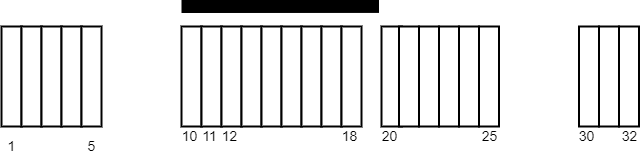
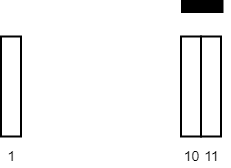

### 1. Description

You are given a 2D integer array `tiles` where $\text{tiles}[i] = [l_{i}, r_{i}]$ represents that every tile `j` in the range $l_{i} \le j \le r_{i}$ is colored white.

You are also given an integer `carpetLen`, the length of a single carpet that can be placed **anywhere**.

Return *the **maximum** number of white tiles that can be covered by the carpet*.

### 2. Function Contract

- `n`: Input parameter.
- Returns expected result.

### 3. Examples

#### Example 1

- **Input:** $tiles = [[1,5],[10,11],[12,18],[20,25],[30,32]], carpetLen = 10$
- **Output:** `9`
- **Explanation:** Place the carpet starting on tile 10.
It covers 9 white tiles, so we return 9.
Note that there may be other places where the carpet covers 9 white tiles.
It can be shown that the carpet cannot cover more than 9 white tiles.
#### Example 2

- **Input:** $tiles = [[10,11],[1,1]], carpetLen = 2$
- **Output:** `2`
- **Explanation:** Place the carpet starting on tile 10.
It covers 2 white tiles, so we return 2.

### 4. Constraints

- $1 \le \text{tiles.length} \le 5 * 10^{4}$

- $\text{tiles}[i].length = 2$

- $1 \le l_{i} \le r_{i} \le 10^{9}$

- $1 \le carpetLen \le 10^{9}$

- The `tiles` are **non-overlapping**.