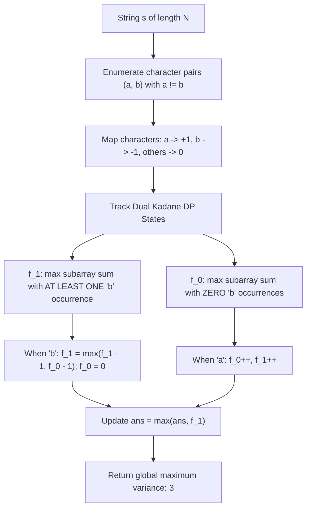

# Guided Example: Substring With Largest Variance

## 1. Problem Overview & Representative Instance

The variance of a string is defined as the largest difference between the frequencies of any two distinct characters that are both present (having frequency at least $1$) within that string. Given a string $s$ consisting of lowercase English letters, our goal is to find the maximum possible variance across all contiguous substrings of $s$.

Consider the representative instance:
$$s = \text{"aababbb"}$$

The string has length $n = 7$ and contains characters `'a'` and `'b'`. Let us examine several candidate substrings:
- Substring $\text{"aaba"}$ (indices $0 \dots 3$): frequency of `'a'` is $3$, frequency of `'b'` is $1$. Variance $= 3 - 1 = 2$.
- Substring $\text{"abbb"}$ (indices $3 \dots 6$): frequency of `'b'` is $3$, frequency of `'a'` is $1$. Variance $= 3 - 1 = 2$.
- Substring $\text{"babbb"}$ (indices $2 \dots 6$): frequency of `'b'` is $4$, frequency of `'a'` is $1$. Variance $= 4 - 1 = 3$.

Can any substring achieve a variance greater than $3$?
- The total occurrences of `'b'` in the entire string is $4$. Because any valid variance requires the presence of at least one minor character, the frequency of `'a'` must be at least $1$. The theoretical upper bound for `'b'` as the dominant character is $4 - 1 = 3$.
- The total occurrences of `'a'` is $3$, yielding a theoretical maximum variance of $3 - 1 = 2$.

Therefore, the maximum variance across all substrings of $s$ is exactly $3$.

## 2. Mathematical & Algorithmic Principles

### Reduction to Pairwise Maximum Subarray Sum

Let $\Sigma$ be the alphabet of lowercase English letters ($|\Sigma| \le 26$). Any optimal substring with maximum variance is governed by some pair of characters $(a, b)$, where:
- $a$ is the **major character** (most frequent in the substring).
- $b$ is the **minor character** (least frequent in the substring, with frequency $\ge 1$).

For any fixed ordered pair $(a, b)$ with $a \ne b$, we project the string $s$ into a numerical sequence:
$$v[i] = \begin{cases} +1 & \text{if } s[i] = a \\ -1 & \text{if } s[i] = b \\ 0 & \text{otherwise} \end{cases}$$

The difference in counts between $a$ and $b$ in substring $s[l \dots r]$ equals the sum of the subarray:
$$\text{count}(a) - \text{count}(b) = \sum_{k=l}^r v[k]$$

### The Mandatory Minor Character Constraint

Standard Kadane's algorithm finds $\max \sum v[k]$, but it might select a subarray containing only $+1$'s and no $-1$'s (meaning $b$ never appears). A substring without character $b$ cannot have variance defined relative to $b$. Therefore, the candidate subarray must strictly contain at least one occurrence of $b$.

To enforce this invariant, we maintain two dynamic programming states during a linear scan over $s$:
1. $f_0$: The maximum subarray sum ending at the current position that contains **zero** occurrences of $b$.
2. $f_1$: The maximum subarray sum ending at the current position that contains **at least one** occurrence of $b$.

### State Transition Equations

Initialize $f_0 = 0$ and $f_1 = -\infty$. For each character $c \in s$:
- **Case 1: $c = a$ (Major character, value $+1$):**
  $$f_0 \leftarrow f_0 + 1$$
  $$f_1 \leftarrow f_1 + 1$$
- **Case 2: $c = b$ (Minor character, value $-1$):**
  Including this $b$ transitions any prior subarray with zero $b$'s ($f_0$) into a subarray with at least one $b$ ($f_0 - 1$). Alternatively, it can extend an existing subarray that already contained $b$ ($f_1 - 1$):
  $$f_1 \leftarrow \max(f_1 - 1, f_0 - 1)$$
  Because any future subarray with zero $b$'s cannot span across this current $b$, $f_0$ resets to the empty prefix:
  $$f_0 \leftarrow 0$$
- **Case 3: $c \notin \{a, b\}$:**
  Neither $f_0$ nor $f_1$ changes.

Whenever $f_1 > -\infty$, we update our global answer:
$$\text{ans} \leftarrow \max(\text{ans}, f_1)$$

Iterating this linear pass across all $26 \times 25 = 650$ distinct ordered pairs $(a, b)$ guarantees finding the global maximum variance.

## 3. Step-by-Step Walkthrough with Intermediate State

Let us trace the execution for the pair $(a, b) = (\text{'b'}, \text{'a'})$ on $s = \text{"aababbb"}$, where $a = \text{'b'}$ ($+1$) is the major character and $b = \text{'a'}$ ($-1$) is the minor character.

| Step | Index $i$ | Character $s[i]$ | Event Type | $f_0$ Before | $f_1$ Before | $f_0$ After | $f_1$ After | Update $\text{ans} = \max(\text{ans}, f_1)$ |
|---|---|---|---|---|---|---|---|---|
| Init | - | - | - | $0$ | $-\infty$ | $0$ | $-\infty$ | $0$ |
| 1 | $0$ | `'a'` | Minor ($b$) | $0$ | $-\infty$ | $0$ | $\max(-\infty - 1, 0 - 1) = -1$ | $\max(0, -1) = 0$ |
| 2 | $1$ | `'a'` | Minor ($b$) | $0$ | $-1$ | $0$ | $\max(-1 - 1, 0 - 1) = -1$ | $\max(0, -1) = 0$ |
| 3 | $2$ | `'b'` | Major ($a$) | $0$ | $-1$ | $0 + 1 = 1$ | $-1 + 1 = 0$ | $\max(0, 0) = 0$ |
| 4 | $3$ | `'a'` | Minor ($b$) | $1$ | $0$ | $0$ | $\max(0 - 1, 1 - 1) = 0$ | $\max(0, 0) = 0$ |
| 5 | $4$ | `'b'` | Major ($a$) | $0$ | $0$ | $0 + 1 = 1$ | $0 + 1 = 1$ | $\max(0, 1) = 1$ |
| 6 | $5$ | `'b'` | Major ($a$) | $1$ | $1$ | $1 + 1 = 2$ | $1 + 1 = 2$ | $\max(1, 2) = 2$ |
| 7 | $6$ | `'b'` | Major ($a$) | $2$ | $2$ | $2 + 1 = 3$ | $2 + 1 = 3$ | $\max(2, 3) = 3$ |

- At Step 4 ($i = 3$, character `'a'`), $f_0$ was $1$ (representing the single major `'b'` at index $2$). Including this `'a'` sets $f_1 = \max(0 - 1, 1 - 1) = 0$, representing the valid contiguous substring $\text{"ba"}$.
- Over Steps 5, 6, and 7, three consecutive `'b'` characters append to this substring, driving $f_1$ from $0 \to 1 \to 2 \to 3$.
- The substring corresponding to $f_1 = 3$ is precisely $s[2 \dots 6] = \text{"babbb"}$, which contains four `'b'`s and one `'a'`.

The final recorded variance for this pair is $3$.

## 4. Comprehensive State Trace

The table below contrasts multiple character pair evaluations on $s = \text{"aababbb"}$.

| Major Character $a$ | Minor Character $b$ | Count of $a$ in $s$ | Count of $b$ in $s$ | Maximum Valid $f_1$ Achieved | Best Substring Example |
|---|---|---|---|---|---|
| `'b'` | `'a'` | $4$ | $3$ | **$3$** | $\text{"babbb"}$ (four `'b'`, one `'a'`) |
| `'a'` | `'b'` | $3$ | $4$ | $2$ | $\text{"aaba"}$ (three `'a'`, one `'b'`) |
| `'a'` | `'c'` | $3$ | $0$ | $-\infty$ | No valid substring ($'c'$ absent from $s$) |
| `'b'` | `'c'` | $4$ | $0$ | $-\infty$ | No valid substring ($'c'$ absent from $s$) |

Because characters other than `'a'` and `'b'` do not appear in $s$, any pair involving unobserved characters immediately yields $-\infty$. The symmetric pair $(\text{'a'}, \text{'b'})$ achieves at most $2$, confirming that $(\text{'b'}, \text{'a'})$ yields the unique maximum variance of $3$.

## 5. Algorithmic Correctness & Soundness

The correctness of the dual-state Kadane formulation is proven through induction on the string length:

1. **Mutual Exclusivity and Exhaustiveness of States:**
   At any position $i$, every non-empty suffix of $s[0 \dots i]$ either contains no occurrences of minor character $b$ or contains at least one occurrence of $b$.
   - $f_0$ tracks the optimal sum among all valid suffixes strictly devoid of $b$.
   - $f_1$ tracks the optimal sum among all valid suffixes containing $\ge 1$ occurrences of $b$.
2. **Inductive Preservation of Invariants:**
   - When encountering $a$, appending $+1$ to both classes preserves their respective defining invariants ($0$ occurrences remains $0$; $\ge 1$ occurrences remains $\ge 1$).
   - When encountering $b$, any suffix ending at $b$ must have at least one $b$. Its predecessor either had zero $b$'s (paying $f_0 - 1$) or already had at least one $b$ (paying $f_1 - 1$). Taking $\max(f_0 - 1, f_1 - 1)$ covers all possible valid choices.
   - Setting $f_0 = 0$ after seeing $b$ ensures that future zero-$b$ suffixes cannot cross this $b$, correctly reflecting the reset boundary.
3. **Soundness of the Maximum:**
   Because $\text{ans}$ is updated exclusively from $f_1$ (and never from $f_0$), every recorded variance corresponds to a genuine substring where both $a$ and $b$ appear at least once.

## 6. Edge Cases & Anti-Patterns

1. **Minor Character Occurs First ($\text{"baaaa"}$):**
   - At index $0$, $s[0] = \text{'b'}$, $f_1 = -1, f_0 = 0$.
   - For each subsequent `'a'`, $f_1$ increments: $-1 + 4 = 3$.
   - The algorithm correctly retains the prefix minor character, discovering variance $4 - 1 = 3$.
2. **All Distinct Characters ($\text{"abcde"}$):**
   - Every character appears at most once.
   - For any pair $(a, b)$, maximum occurrences of $a$ is $1$, and $b$ must appear once ($1 - 1 = 0$).
   - The algorithm correctly outputs $0$.
3. **Single Distinct Character ($\text{"aaaa"}$):**
   - No second distinct character exists.
   - For all pairs, $f_1$ remains $-\infty$, and the algorithm returns $0$.
4. **Anti-Pattern: Standard Kadane Without Minor Tracking:**
   - Running vanilla Kadane with $a \to +1, b \to -1$ would yield $4$ for $s = \text{"aababbb"}$ on the suffix $\text{"bbb"}$ because it ignores the absence of $b$. Enforcing the dual state $f_1$ prevents this fatal overcount.

## 7. Complexity Analysis

The operational parameters depend on the string length $N = |s|$ and the lowercase alphabet size $|\Sigma| \le 26$.

| Complexity Dimension | Theoretical Bound | Practical Magnitude ($N \le 10^4, \lvert \Sigma \rvert \le 26$) |
|---|---|---|
| Character Pair Enumeration | $\lvert \Sigma \rvert \times (\lvert \Sigma \rvert - 1)$ | At most $26 \times 25 = 650$ pairs (or fewer if filtering by distinct characters present in $s$). |
| Per-Pair Scan Time | $O(N)$ | A single linear pass through $s$ evaluating simple $O(1)$ conditional updates. |
| Total Time Complexity | $O(\lvert \Sigma \rvert^2 \cdot N)$ | $\le 650 \times 10^4 = 6.5 \times 10^6$ basic operations, executing in $\approx 25\text{ ms}$. |
| Auxiliary Space Complexity | $O(1)$ | Memory is confined to two scalar DP variables ($f_0, f_1$) and loop registers. No dynamic data structures are allocated. |
