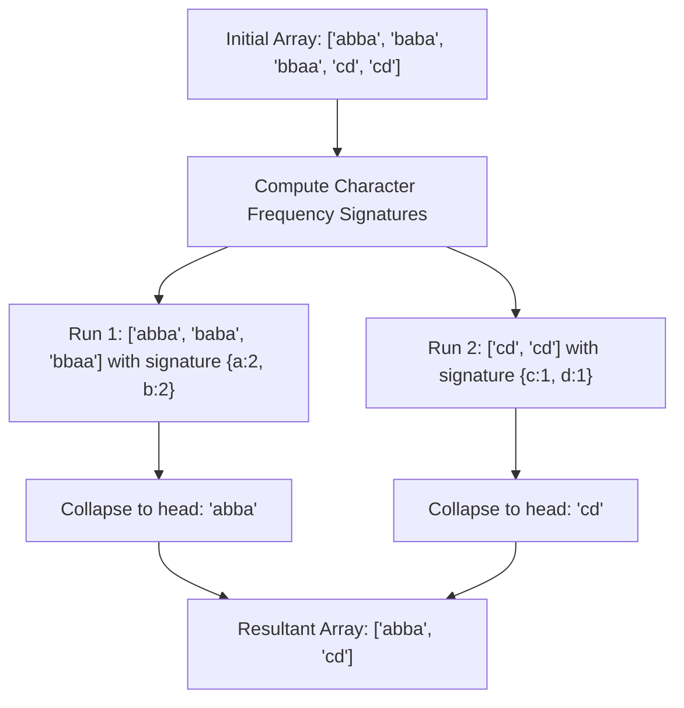

# Guided Example: Find Resultant Array After Removing Anagrams

## 1. Problem Overview & Representative Instance

We are given an array of strings $words$. In a single operation, we may select any index $i$ ($0 < i < |words|$) such that $words[i - 1]$ and $words[i]$ are anagrams of each other, and delete $words[i]$ from the array. We repeat this operation until no two adjacent elements in the array are anagrams. Our goal is to determine the final resultant array of words.

Two strings are defined as anagrams if they contain the exact same characters with identical frequencies, differing only in the relative ordering of those characters.

Consider the representative instance:
$$words = [\text{"abba"}, \text{"baba"}, \text{"bbaa"}, \text{"cd"}, \text{"cd"}]$$

Let us trace the successive elimination of adjacent anagrams:
1. Compare $words[0] = \text{"abba"}$ and $words[1] = \text{"baba"}$:
   - Both contain two `'a'`s and two `'b'`s. They are anagrams.
   - Delete $words[1] = \text{"baba"}$.
   - Array becomes: $[\text{"abba"}, \text{"bbaa"}, \text{"cd"}, \text{"cd"}]$.
2. Compare the new adjacent pair $words[0] = \text{"abba"}$ and $words[1] = \text{"bbaa"}$:
   - Both contain two `'a'`s and two `'b'`s. They are anagrams.
   - Delete $words[1] = \text{"bbaa"}$.
   - Array becomes: $[\text{"abba"}, \text{"cd"}, \text{"cd"}]$.
3. Compare $words[0] = \text{"abba"}$ and $words[1] = \text{"cd"}$:
   - Different letter sets. They are not anagrams. No deletion.
4. Compare $words[1] = \text{"cd"}$ and $words[2] = \text{"cd"}$:
   - Identical strings are anagrams.
   - Delete $words[2] = \text{"cd"}$.
   - Array becomes: $[\text{"abba"}, \text{"cd"}]$.

No further adjacent words are anagrams. The final resultant array is:
$$[\text{"abba"}, \text{"cd"}]$$

## 2. Mathematical & Algorithmic Principles

### The Anagram Equivalence Relation

Let $\sim$ denote the anagram relation between two strings:
$$s \sim t \iff \text{Parikh}(s) = \text{Parikh}(t)$$
where $\text{Parikh}(s) \in \mathbb{N}^{26}$ represents the frequency vector of characters in $s$.

Because equality of frequency vectors is an equivalence relation, $\sim$ satisfies:
1. **Reflexivity:** $s \sim s$ for all strings $s$.
2. **Symmetry:** $s \sim t \iff t \sim s$.
3. **Transitivity:** $s \sim t \land t \sim u \implies s \sim u$.

### Contiguous Block Collapse Theorem

**Theorem:** *Any maximal contiguous subsegment of words $words[l \dots r]$ that share the same anagram signature collapses into the single element $words[l]$ regardless of the order of deletions.*

**Proof:**
By induction on the subsegment length $k = r - l + 1$:
- For $k = 1$, no deletion is possible, and $words[l]$ remains.
- For $k \ge 2$, $words[l] \sim words[l+1]$. Deleting $words[l+1]$ shortens the segment to length $k - 1$. By transitivity, the new adjacent element $words[l+2]$ is an anagram of $words[l]$ ($words[l] \sim words[l+1] \sim words[l+2] \implies words[l] \sim words[l+2]$). Repeating this process eliminates all elements from index $l+1$ through $r$, preserving only the first element $words[l]$.

### Single-Pass Filtering Invariant

Because non-adjacent anagrams across different signature boundaries can never become adjacent (separated by a word with a different signature), a word $words[i]$ ($i \ge 1$) survives if and only if:
$$words[i] \not\sim words[i-1]$$

This reduces the problem from dynamic array deletions to a single linear filtering pass:
$$\text{Result} = [words[0]] \cup \big\{ words[i] \mid i \in [1, |words|-1] \land words[i] \not\sim words[i-1] \big\}$$

## 3. Step-by-Step Walkthrough with Intermediate State

We evaluate the condition across all adjacent pairs in $words = [\text{"abba"}, \text{"baba"}, \text{"bbaa"}, \text{"cd"}, \text{"cd"}]$.

| Pair Index $(i-1, i)$ | Left Word $s$ | Right Word $t$ | Signature Comparison | Anagram? | Decision on $t$ | Output Array State |
|---|---|---|---|---|---|---|
| Initial | - | - | - | - | Include $words[0]$ | $[\text{"abba"}]$ |
| $(0, 1)$ | $\text{"abba"}$ | $\text{"baba"}$ | $\{\text{'a'}: 2, \text{'b'}: 2\} = \{\text{'a'}: 2, \text{'b'}: 2\}$ | Yes | Discard $t$ | $[\text{"abba"}]$ |
| $(1, 2)$ | $\text{"baba"}$ | $\text{"bbaa"}$ | $\{\text{'a'}: 2, \text{'b'}: 2\} = \{\text{'a'}: 2, \text{'b'}: 2\}$ | Yes | Discard $t$ | $[\text{"abba"}]$ |
| $(2, 3)$ | $\text{"bbaa"}$ | $\text{"cd"}$ | $\{\text{'a'}: 2, \text{'b'}: 2\} \ne \{\text{'c'}: 1, \text{'d'}: 1\}$ | No | Retain $t$ | $[\text{"abba"}, \text{"cd"}]$ |
| $(3, 4)$ | $\text{"cd"}$ | $\text{"cd"}$ | $\{\text{'c'}: 1, \text{'d'}: 1\} = \{\text{'c'}: 1, \text{'d'}: 1\}$ | Yes | Discard $t$ | $[\text{"abba"}, \text{"cd"}]$ |

- **Pair $(0, 1)$:** $s = \text{"abba"}, t = \text{"baba"}$. Frequencies match. Discard $\text{"baba"}$.
- **Pair $(1, 2)$:** $s = \text{"baba"}, t = \text{"bbaa"}$. Frequencies match. Discard $\text{"bbaa"}$.
- **Pair $(2, 3)$:** $s = \text{"bbaa"}, t = \text{"cd"}$. Lengths and character sets differ. Retain $\text{"cd"}$.
- **Pair $(3, 4)$:** $s = \text{"cd"}, t = \text{"cd"}$. Identical words match signatures. Discard second $\text{"cd"}$.

Scanning concludes with the final array $[\text{"abba"}, \text{"cd"}]$.

## 4. Comprehensive State Trace

The table below catalogs adjacent pair evaluations across several representative test cases.

| Input $words$ | Pairwise Signature Invariant Transitions | Discarded Words | Retained Words (Result) |
|---|---|---|---|
| $[\text{"abba"}, \text{"baba"}, \text{"bbaa"}, \text{"cd"}, \text{"cd"}]$ | $\text{"abba"} \sim \text{"baba"} \sim \text{"bbaa"} \not\sim \text{"cd"} \sim \text{"cd"}$ | $\text{"baba"}, \text{"bbaa"}, \text{"cd"}$ | $[\text{"abba"}, \text{"cd"}]$ |
| $[\text{"a"}, \text{"b"}, \text{"c"}, \text{"d"}, \text{"e"}]$ | $\text{"a"} \not\sim \text{"b"} \not\sim \text{"c"} \not\sim \text{"d"} \not\sim \text{"e"}$ | None | $[\text{"a"}, \text{"b"}, \text{"c"}, \text{"d"}, \text{"e"}]$ |
| $[\text{"abc"}, \text{"cba"}, \text{"bac"}]$ | $\text{"abc"} \sim \text{"cba"} \sim \text{"bac"}$ | $\text{"cba"}, \text{"bac"}$ | $[\text{"abc"}]$ |
| $[\text{"ab"}, \text{"cd"}, \text{"ba"}]$ | $\text{"ab"} \not\sim \text{"cd"} \not\sim \text{"ba"}$ | None (Separated by $\text{"cd"}$) | $[\text{"ab"}, \text{"cd"}, \text{"ba"}]$ |
| $[\text{"listen"}, \text{"silent"}, \text{"enlist"}, \text{"x"}]$ | $\text{"listen"} \sim \text{"silent"} \sim \text{"enlist"} \not\sim \text{"x"}$ | $\text{"silent"}, \text{"enlist"}$ | $[\text{"listen"}, \text{"x"}]$ |

In $[\text{"ab"}, \text{"cd"}, \text{"ba"}]$, notice that $\text{"ab"}$ and $\text{"ba"}$ are anagrams, but because $\text{"cd"}$ intervenes between them, they are never adjacent. Neither is deleted.

## 5. Algorithmic Correctness & Soundness

The correctness of this single-pass adjacent comparison is established by invariant preservation:

1. **Non-Interference of Distinct Runs:**
   Suppose $words[i] \not\sim words[i-1]$. Because deletions only remove an element when it is an anagram of its immediate neighbor, no deletion within the suffix $words[i \dots |words|-1]$ or prefix $words[0 \dots i-1]$ can ever eliminate the boundary between two distinct anagram equivalence classes. Therefore, the boundary between $words[i-1]$ and $words[i]$ is permanently preserved.
2. **Order Independence of Deletions:**
   Within any maximal contiguous anagram run $R = [w_1, w_2, \dots, w_k]$, deleting any adjacent pair $w_j$ preserves the invariant that all remaining elements in $R$ are anagrams of $w_1$. The process terminates if and only if $|R| = 1$, leaving $w_1$ intact.
3. **Completeness of Single-Pass Filtering:**
   Checking whether $words[i] \sim words[i-1]$ in the original array precisely mirrors the first step of any deletion sequence. By transitivity, an element is removed if and only if it belongs to the same contiguous run as its predecessor.

## 6. Edge Cases & Anti-Patterns

1. **Separated Identical Anagrams ($[\text{"ab"}, \text{"cd"}, \text{"ba"}]$):**
   - $\text{"ab"}$ and $\text{"ba"}$ are anagrams, but separated by $\text{"cd"}$.
   - Since $\text{"cd"}$ is never deleted, $\text{"ab"}$ and $\text{"ba"}$ never become adjacent. Both remain in the output.
   - Filtering by global hash set would erroneously eliminate $\text{"ba"}$. Adjacent comparison is strictly required.
2. **Single-Word Input ($|words| = 1$):**
   - The loop over pairs is empty.
   - The single word is returned unmodified.
3. **Entire Array is One Anagram Run ($[\text{"abc"}, \text{"cba"}, \text{"bac"}]$):**
   - Every word after index $0$ is an anagram of its neighbor.
   - All subsequent words are discarded, returning $[\text{"abc"}]$.
4. **Anti-Pattern: In-Place Array Resizing:**
   - Repeatedly deleting elements from a dynamic array using `list.pop(i)` incurs $O(N^2 \cdot L)$ time due to array shifting. Single-pass linear filtering executes in $O(N \cdot L)$ time without allocations.

## 7. Complexity Analysis

The complexity parameters are defined by the number of words $N = |words|$ and the maximum word length $L$.

| Dimension | Bound | Justification |
|---|---|---|
| Frequency Counting / Comparison | $O(L)$ | Comparing two words of length $L$ requires tallying character counts across an alphabet of size $|\Sigma| = 26$. |
| Total Time Complexity | $O(N \cdot L)$ | There are $N - 1$ pairwise comparisons, each taking $O(L)$ time. Total operations $\approx 100 \times 10 = 1000$. |
| Space Complexity | $O(N \cdot L)$ | Storing the output array of strings requires $O(N \cdot L)$ memory. |
| Auxiliary Memory | $O(|\Sigma|) = O(1)$ | Frequency counting uses a fixed $26$-element array or hash map. |
