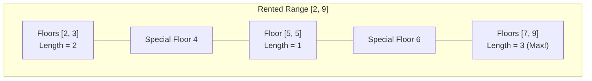

# Guided Example: Maximum Consecutive Floors Without Special Floors

## 1. Problem Overview & Representative Instance

Alice rents a contiguous block of building floors spanning from $bottom$ to $top$ inclusive. Certain floors within this range are designated as special floors and cannot be used for relaxation. The special floors are provided as an integer array $special$.

Our objective is to compute the maximum number of consecutive floors within the rented range $[bottom, top]$ that do not contain any special floor.

Consider the representative instance:
$$bottom = 2, \quad top = 9, \quad special = [4, 6]$$

The rented floor range is $[2, 9]$, encompassing $8$ total floors:
$$\{2, 3, 4, 5, 6, 7, 8, 9\}$$

The special floors are $4$ and $6$. Removing these two floors partitions the remaining floors into three mutually disjoint consecutive blocks:
1. **Lower Boundary Segment:** Floors below the first special floor:
   $$[bottom, special[0] - 1] = [2, 3] \implies 2 \text{ floors}$$
2. **Interior Segment:** Floors between the two special floors:
   $$[special[0] + 1, special[1] - 1] = [5, 5] \implies 1 \text{ floor}$$
3. **Upper Boundary Segment:** Floors above the last special floor:
   $$[special[1] + 1, top] = [7, 9] \implies 3 \text{ floors}$$

Comparing the lengths of these three available contiguous floor spans: $\max(2, 1, 3) = 3$. The optimal contiguous run consists of floors $7, 8,$ and $9$. Thus, the maximum consecutive floors is $3$.

## 2. Mathematical & Algorithmic Principles

### Point-Punctured Interval Decomposition

Let $S = \{s_0, s_1, \dots, s_{k-1}\}$ denote the set of special floors, sorted in strictly ascending order:
$$bottom \le s_0 < s_1 < \dots < s_{k-1} \le top$$

The non-special floors represent the set difference:
$$[bottom, top] \setminus S$$

Because the interval $[bottom, top]$ is one-dimensional and continuous over the integers, puncturing it with $k$ distinct points partitions the remaining valid elements into exactly $k + 1$ disjoint contiguous intervals:
1. **Lower Boundary Gap:**
   $$I_0 = [bottom, s_0 - 1], \quad |I_0| = (s_0 - 1) - bottom + 1 = s_0 - bottom$$
2. **Interior Gaps ($0 \le i < k - 1$):**
   $$I_{i+1} = [s_i + 1, s_{i+1} - 1], \quad |I_{i+1}| = (s_{i+1} - 1) - (s_i + 1) + 1 = s_{i+1} - s_i - 1$$
3. **Upper Boundary Gap:**
   $$I_k = [s_{k-1} + 1, top], \quad |I_k| = top - (s_{k-1} + 1) + 1 = top - s_{k-1}$$

The maximum consecutive floor count is the maximum of these interval lengths:
$$\text{MaxConsecutive} = \max\left(s_0 - bottom, \; \max_{0 \le i < k-1}(s_{i+1} - s_i - 1), \; top - s_{k-1}\right)$$

### Algorithmic Strategy

1. Sort the array $special$ in ascending order.
2. Initialize the answer with the two boundary gap lengths:
   $$\text{ans} = \max(special[0] - bottom, \; top - special[-1])$$
3. Iterate across all adjacent pairs $(x, y) = (special[i], special[i+1])$ and update:
   $$\text{ans} = \max(\text{ans}, \; y - x - 1)$$
4. Return $\text{ans}$.

## 3. Step-by-Step Walkthrough with Intermediate State

We execute the procedure on $bottom = 2, top = 9, special = [4, 6]$.

| Evaluation Step | Segment Evaluated | Mathematical Formula | Calculation | Intermediate Gap Length | Running Maximum $\text{ans}$ |
|---|---|---|---|---|---|
| Step 1: Sort | Array $special$ | Monotonic ordering | $[4, 6]$ | - | - |
| Step 2: Lower Boundary | Floors $[2, 3]$ | $special[0] - bottom$ | $4 - 2$ | $2$ | $2$ |
| Step 3: Upper Boundary | Floors $[7, 9]$ | $top - special[-1]$ | $9 - 6$ | $3$ | $\max(2, 3) = 3$ |
| Step 4: Interior Pair $(4, 6)$ | Floors $[5, 5]$ | $6 - 4 - 1$ | $2 - 1$ | $1$ | $\max(3, 1) = 3$ |

- **Step 1:** The input $special = [4, 6]$ is already sorted.
- **Step 2:** The lower gap spans from $bottom = 2$ up to $4 - 1 = 3$. Length is $4 - 2 = 2$. Running maximum is $2$.
- **Step 3:** The upper gap spans from $6 + 1 = 7$ up to $top = 9$. Length is $9 - 6 = 3$. Running maximum becomes $\max(2, 3) = 3$.
- **Step 4:** The interior gap between special floors $4$ and $6$ is $6 - 4 - 1 = 1$ (consisting solely of floor $5$). Since $1 \le 3$, the running maximum remains $3$.

All segments are exhausted, yielding the final answer $3$.

## 4. Comprehensive State Trace

The table below catalogs gap evaluations across diverse structural test configurations.

| Configuration $(bottom, top)$ | $special$ Input | Sorted $special$ | Lower Gap ($s_0 - bottom$) | Interior Gaps ($s_{i+1} - s_i - 1$) | Upper Gap ($top - s_{k-1}$) | Maximum Consecutive |
|---|---|---|---|---|---|---|
| $(2, 9)$ | $[4, 6]$ | $[4, 6]$ | $4 - 2 = 2$ | $[6 - 4 - 1] = [1]$ | $9 - 6 = 3$ | **$3$** |
| $(6, 8)$ | $[7, 6, 8]$ | $[6, 7, 8]$ | $6 - 6 = 0$ | $[7-6-1, 8-7-1] = [0, 0]$ | $8 - 8 = 0$ | **$0$** |
| $(1, 10)$ | $[5]$ | $[5]$ | $5 - 1 = 4$ | None | $10 - 5 = 5$ | **$5$** |
| $(10, 20)$ | $[18, 20]$ | $[18, 20]$ | $18 - 10 = 8$ | $[20 - 18 - 1] = [1]$ | $20 - 20 = 0$ | **$8$** |
| $(2, 10)$ | $[2, 3, 9]$ | $[2, 3, 9]$ | $2 - 2 = 0$ | $[3-2-1, 9-3-1] = [0, 5]$ | $10 - 9 = 1$ | **$5$** |
| $(1, 10^9)$ | $[999999999, 2]$ | $[2, 999999999]$ | $2 - 1 = 1$ | $[999999999 - 2 - 1] = [999999996]$ | $10^9 - 999999999 = 1$ | **$999999996$** |

In the configuration $(6, 8)$ with $special = [6, 7, 8]$, every single rented floor is special, leaving no available floors. All gaps evaluate to $0$, correctly yielding $0$.

## 5. Algorithmic Correctness & Soundness

The correctness of this algorithm rests on the topology of discrete integer intervals:

1. **Partition Exhaustiveness:**
   Any floor $f \in [bottom, top]$ is either a member of $S$ or not. If $f \notin S$, then $f$ must satisfy exactly one of three cases relative to the ordered sequence $s_0 < s_1 < \dots < s_{k-1}$:
   - $f < s_0 \iff bottom \le f \le s_0 - 1$
   - $s_i < f < s_{i+1}$ for some unique $i \in [0, k-2] \iff s_i + 1 \le f \le s_{i+1} - 1$
   - $f > s_{k-1} \iff s_{k-1} + 1 \le f \le top$
   Therefore, the union of these $k + 1$ intervals exactly equals $[bottom, top] \setminus S$.
2. **Contiguity and Maximality:**
   Each interval $I$ constructed in this manner is bounded on both sides either by a special floor or the global boundary ($bottom - 1$ or $top + 1$). Thus, no two intervals can merge, and each interval is maximally contiguous.
3. **Optimality:**
   The maximum consecutive non-special floors is by definition the maximum cardinality among all connected components of $[bottom, top] \setminus S$. Taking the maximum of these $k + 1$ scalar lengths is guaranteed to find the true global maximum.

## 6. Edge Cases & Anti-Patterns

1. **All Rented Floors are Special:**
   - If $special = [bottom, bottom+1, \dots, top]$, no valid floor exists.
   - All computed gap lengths evaluate to $0$. The algorithm correctly returns $0$.
2. **Only One Special Floor ($k = 1$):**
   - The special floor partitions $[bottom, top]$ into at most two segments.
   - The loop over adjacent pairs executes zero times.
   - The result is simply $\max(s_0 - bottom, top - s_0)$.
3. **Special Floors at Exact Boundaries ($s_0 = bottom$ or $s_{k-1} = top$):**
   - If $s_0 = bottom$, $s_0 - bottom = 0$ (no floors below $s_0$).
   - If $s_{k-1} = top$, $top - s_{k-1} = 0$ (no floors above $s_{k-1}$).
   - The formula naturally computes $0$ without requiring dedicated conditional branches.
4. **Large Coordinate Values ($10^9$):**
   - Rented ranges can span up to $10^9$ floors.
   - Simulating individual floors in a boolean array or set would exhaust available memory. The coordinate difference approach uses $O(1)$ space and executes instantaneously regardless of coordinate magnitude.

## 7. Complexity Analysis

The complexity parameters are governed by the number of special floors $k = |special|$.

| Operation Phase | Time Complexity | Auxiliary Space Complexity | Explanation |
|---|---|---|---|
| Sorting Special Floors | $O(k \log k)$ | $O(\log k)$ or $O(k)$ | Sorting the $k$ special floor integers in place. |
| Gap Evaluation Sweep | $O(k)$ | $O(1)$ | A single linear pass evaluating $k - 1$ adjacent pairs and $2$ boundary differences. |
| Total Complexity | $O(k \log k)$ | $O(1)$ auxiliary | The complexity is completely independent of the floor coordinate range $(top - bottom)$ and scales solely with $k \le 10^5$. |
