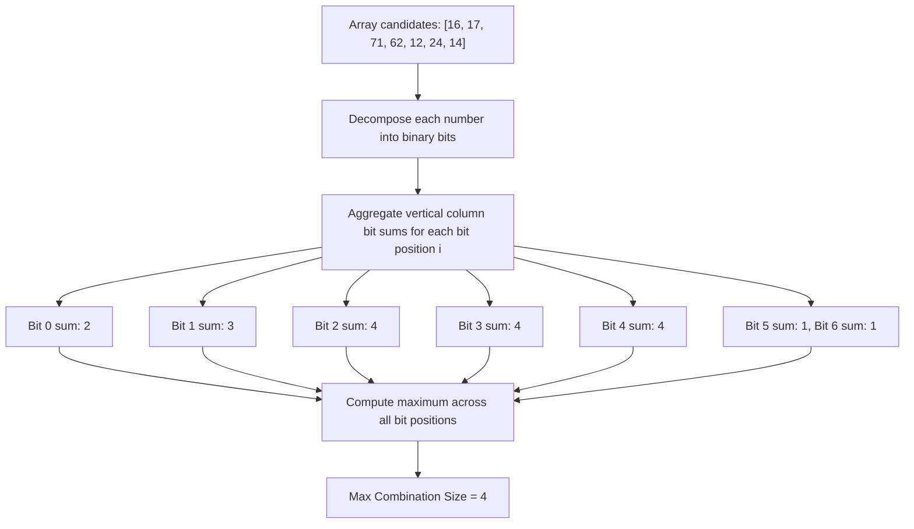

# Guided Example: Largest Combination With Bitwise AND Greater Than Zero

## 1. Problem Overview & Representative Instance

The bitwise AND of an array of numbers is the bitwise AND of all elements within that array. Given an array of positive integers $candidates$, we must find the maximum number of elements that can be chosen to form a combination such that the cumulative bitwise AND of the chosen elements is strictly greater than zero:
$$\bigwedge_{x \in \mathcal{C}} x > 0$$

Each element from $candidates$ may be chosen at most once.

Consider the representative instance:
$$candidates = [16, 17, 71, 62, 12, 24, 14]$$

Let us express each integer in its binary representation:
- $16 = 0010000_2$
- $17 = 0010001_2$
- $71 = 1000111_2$
- $62 = 0111110_2$
- $12 = 0001100_2$
- $24 = 0011000_2$
- $14 = 0001110_2$

For the bitwise AND of a subset to be non-zero, all numbers in that subset must share a `'1'` at some identical bit position. Examining the bit columns:
- Bit $0$ is shared by $\{17, 71\}$ ($2$ numbers).
- Bit $1$ is shared by $\{71, 62, 14\}$ ($3$ numbers).
- Bit $2$ is shared by $\{71, 62, 12, 14\}$ ($4$ numbers).
- Bit $3$ is shared by $\{62, 12, 24, 14\}$ ($4$ numbers).
- Bit $4$ is shared by $\{16, 17, 62, 24\}$ ($4$ numbers).

Taking the subset sharing Bit $4$, namely $\{16, 17, 62, 24\}$:
$$16 \ \&\ 17 \ \&\ 62 \ \&\ 24 = 16 > 0$$

This combination contains $4$ elements. No single bit is shared by $5$ or more candidates. Hence, the largest valid combination size is $4$.

## 2. Mathematical & Algorithmic Principles

### Necessary and Sufficient Condition for Positive Bitwise AND

Let $\mathcal{C} \subseteq candidates$ be a subset of integers, and let $P$ denote their cumulative bitwise AND:
$$P = \bigwedge_{x \in \mathcal{C}} x$$

By definition of the bitwise AND operator, the $i$-th bit of $P$ is $1$ if and only if every element in $\mathcal{C}$ has a $1$ at bit position $i$:
$$P \text{ has bit } i \text{ set} \iff \forall x \in \mathcal{C}, \quad (x \gg i) \ \&\ 1 = 1$$

Because $P \ge 0$ for positive integers, we have:
$$P > 0 \iff \exists i \ge 0 \text{ such that } \forall x \in \mathcal{C}, \quad (x \gg i) \ \&\ 1 = 1$$

### Reduction to Independent Bit Column Counts

This equivalence reveals a profound structural simplification:
1. **Any combination with bitwise AND $> 0$ must share at least one common set bit $i$.**
2. **Conversely, for any fixed bit position $i$, the entire set of all elements in $candidates$ having bit $i$ set forms a valid combination whose bitwise AND has bit $i$ set (and is thus $\ge 2^i > 0$).**

Therefore, the maximum possible combination size equals the maximum column sum when the candidates are written in binary:
$$\text{MaxCombinationSize} = \max_{0 \le i < B} \sum_{x \in candidates} \left( \frac{x}{2^i} \pmod 2 \right)$$
where $B$ is the maximum bit length needed to represent any candidate ($B \le 24$ since candidates are bounded by $10^7 < 2^{24}$).

Evaluating the sum of set bits across at most $24$ bit positions requires only $O(B \cdot N)$ operations.

## 3. Step-by-Step Walkthrough with Intermediate State

We evaluate each bit position $i \in [0, 6]$ across $candidates = [16, 17, 71, 62, 12, 24, 14]$.

| Bit Position $i$ | Place Value $2^i$ | Binary Bit per Candidate ($16, 17, 71, 62, 12, 24, 14$) | Count of $1$s | Running Maximum $\text{ans}$ |
|---|---|---|---|---|
| $0$ | $1$ | $[0, 1, 1, 0, 0, 0, 0]$ | $2$ | $2$ |
| $1$ | $2$ | $[0, 0, 1, 1, 0, 0, 1]$ | $3$ | $\max(2, 3) = 3$ |
| $2$ | $4$ | $[0, 0, 1, 1, 1, 0, 1]$ | $4$ | $\max(3, 4) = 4$ |
| $3$ | $8$ | $[0, 0, 0, 1, 1, 1, 1]$ | $4$ | $\max(4, 4) = 4$ |
| $4$ | $16$ | $[1, 1, 0, 1, 0, 1, 0]$ | $4$ | $\max(4, 4) = 4$ |
| $5$ | $32$ | $[0, 0, 0, 1, 0, 0, 0]$ | $1$ | $\max(4, 1) = 4$ |
| $6$ | $64$ | $[0, 0, 1, 0, 0, 0, 0]$ | $1$ | $\max(4, 1) = 4$ |

- **Bit $0$:** Elements $17$ and $71$ are odd (bit $0 = 1$). Tally is $2$.
- **Bit $1$:** Elements $71, 62, 14$ have bit $1 = 1$. Tally is $3$.
- **Bit $2$:** Elements $71, 62, 12, 14$ have bit $2 = 1$. Tally is $4$. Running maximum updates to $4$.
- **Bit $3$:** Elements $62, 12, 24, 14$ have bit $3 = 1$. Tally is $4$.
- **Bit $4$:** Elements $16, 17, 62, 24$ have bit $4 = 1$. Tally is $4$.
- **Bits $5$ and $6$:** Each has a tally of $1$.

The maximum column count across all bit positions is $4$.

## 4. Comprehensive State Trace

The table below catalogs bitwise distributions across diverse candidate profiles.

| Candidate Array | Binary Forms | Active Bit Column Tallies | Best Bit Position | Maximal Valid Combination | Output |
|---|---|---|---|---|---|
| $[16, 17, 71, 62, 12, 24, 14]$ | Mixed binary | Bit $2: 4$, Bit $3: 4$, Bit $4: 4$ | $2, 3,$ or $4$ | $\{16, 17, 62, 24\}$ | **$4$** |
| $[8, 8]$ | $[1000_2, 1000_2]$ | Bit $3: 2$ | $3$ | $\{8, 8\}$ | **$2$** |
| $[1, 2, 4, 8]$ | $[0001_2, 0010_2, 0100_2, 1000_2]$ | Bit $0: 1$, Bit $1: 1$, Bit $2: 1$, Bit $3: 1$ | Any | $\{x\}$ | **$1$** |
| $[3, 5, 6, 7]$ | $[011_2, 101_2, 110_2, 111_2]$ | Bit $0: 3$, Bit $1: 3$, Bit $2: 3$ | $0, 1,$ or $2$ | $\{3, 5, 7\}$ (bit $0$) | **$3$** |
| $[3, 5, 6]$ | $[011_2, 101_2, 110_2]$ | Bit $0: 2$, Bit $1: 2$, Bit $2: 2$ | $0, 1,$ or $2$ | $\{3, 5\}$ (bit $0$) | **$2$** |
| $[7, 7, 7, 7]$ | Four identical $111_2$ | Bit $0: 4$, Bit $1: 4$, Bit $2: 4$ | $0, 1,$ or $2$ | All four | **$4$** |

In $[3, 5, 6]$:
- Every pair shares a bit ($3 \& 5 = 1, 3 \& 6 = 2, 5 \& 6 = 4$).
- However, all three together have $3 \& 5 \& 6 = 0$.
- The maximum column sum is $2$, demonstrating that pairwise non-zero ANDs do not permit a 3-element combination unless a single bit is shared by all three.

## 5. Algorithmic Correctness & Soundness

The correctness of the column-sum algorithm is established by bidirectional implication:

1. **Upper Bound (Soundness):**
   Suppose there exists a combination $\mathcal{C}$ of size $K$ with $\bigwedge_{x \in \mathcal{C}} x > 0$.
   Because their bitwise AND is positive, there must exist some bit position $j$ where the bitwise AND has a $1$.
   By definition of bitwise AND, every single element $x \in \mathcal{C}$ must have a $1$ at bit position $j$.
   Therefore, the total count of numbers in $candidates$ having bit $j$ set is at least $K$.
   Hence, the maximum combination size cannot exceed $\max_i \text{count}(\text{bit } i)$.
2. **Lower Bound (Achievability):**
   Let $j^*$ be the bit position that maximizes $\text{count}(\text{bit } j)$, with count $M$.
   Let $\mathcal{C}^* = \{x \in candidates \mid (x \gg j^*) \& 1 = 1\}$.
   By construction, $|\mathcal{C}^*| = M$.
   Furthermore, every $x \in \mathcal{C}^*$ has bit $j^*$ set, so the $j^*$-th bit of $\bigwedge_{x \in \mathcal{C}^*} x$ is $1$.
   Because it has at least one bit set, $\bigwedge_{x \in \mathcal{C}^*} x \ge 2^{j^*} > 0$.
   Therefore, $\mathcal{C}^*$ is a valid combination of size $M$.
3. **Conclusion:**
   The maximum valid combination size is identically equal to $\max_i \text{count}(\text{bit } i)$.

## 6. Edge Cases & Anti-Patterns

1. **Powers of Two ($[1, 2, 4, 8]$):**
   - Each candidate has exactly one bit set, and no two candidates share any bit.
   - Every bit column sum is $1$. The algorithm returns $1$.
2. **Duplicate Candidates ($[8, 8]$):**
   - Duplicate values are distinct elements and can both be selected.
   - Both contribute to bit $3$, yielding answer $2$.
3. **Pairwise Overlap Trap ($[3, 5, 6]$):**
   - Attempting greedy pair graph matching fails because pairwise AND overlaps do not guarantee a mutually shared bit across the entire ensemble.
   - Evaluating bit columns independently avoids this graph clique pitfall.
4. **Anti-Pattern: Exponential Subset Search:**
   - Generating all $2^N$ combinations or searching subsets recursively takes exponential time $O(2^N)$, which times out catastrophically when $N = 10^5$. Vertical bit-column counting executes in linear time $O(24 \cdot N)$.

## 7. Complexity Analysis

The operational demands are parameterized by the number of elements $N = |candidates|$ and the bit width $B$.

| Resource Metric | Theoretical Bound | Practical Magnitude ($N \le 10^5, \max x \le 10^7$) |
|---|---|---|
| Maximum Bit Length $B$ | $\lfloor \log_2(\max x) \rfloor + 1$ | For $x \le 10^7$, $B \le 24$. |
| Bit Column Sweep Time | $O(B \cdot N)$ | $24 \times 10^5 \approx 2.4 \times 10^6$ bit operations, executing in under $15\text{ ms}$. |
| Auxiliary Space Complexity | $O(1)$ | Memory is confined to a few scalar counters. No dynamic arrays or collections are allocated. |
| Bitwise Shifting Cost | $O(1)$ per operation | Primitive bitwise shifts and masks run in single machine cycles. |
