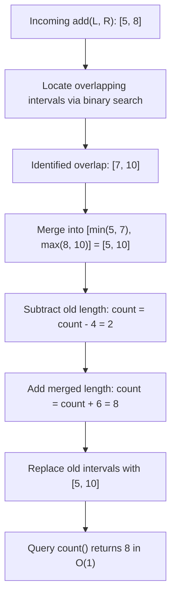

# Guided Example: Count Integers in Intervals

## 1. Problem Overview & Representative Instance

We are tasked with designing a dynamic data structure that efficiently manages a collection of inclusive integer intervals over a massive coordinate range ($1 \le left \le right \le 10^9$) and answers cardinality queries:
- `add(left, right)`: Adds the inclusive interval $[left, right]$ to the collection.
- `count()`: Returns the total number of distinct integers covered by at least one interval in the collection.

Consider the representative sequence of operations:
1. `CountIntervals()`: Initializes an empty structure.
2. `add(2, 3)`: Adds $[2, 3]$.
3. `add(7, 10)`: Adds $[7, 10]$.
4. `count()`: Queries total distinct integers.
5. `add(5, 8)`: Adds $[5, 8]$.
6. `count()`: Queries total distinct integers.

Let us trace the evolution of covered integer sets:
- After `add(2, 3)`: Covered integers are $\{2, 3\}$. Size is $2$.
- After `add(7, 10)`: Covered integers are $\{2, 3\} \cup \{7, 8, 9, 10\}$. The two intervals $[2, 3]$ and $[7, 10]$ are disjoint. Size is $2 + 4 = 6$.
- Query `count()` returns $6$.
- Operation `add(5, 8)`: The new interval $[5, 8]$ overlaps with the existing interval $[7, 10]$ on integers $\{7, 8\}$. 
  - They coalesce into a single merged interval:
    $$[\min(5, 7), \max(8, 10)] = [5, 10]$$
  - The set of disjoint intervals becomes $\{[2, 3], [5, 10]\}$.
  - The union of covered integers is $\{2, 3\} \cup \{5, 6, 7, 8, 9, 10\}$.
  - The new total size is $2 + 6 = 8$.
- Query `count()` returns $8$.

## 2. Mathematical & Algorithmic Principles

### The Disjoint Interval Invariant

Let $\mathcal{I} = \{[l_1, r_1], [l_2, r_2], \dots, [l_m, r_m]\}$ be the active set of intervals maintained by the data structure. We maintain the invariant that all intervals in $\mathcal{I}$ are pairwise disjoint and sorted:
$$r_k < l_{k+1} - 1 \quad \forall k \in [1, m-1]$$
(Notice that if $r_k = l_{k+1} - 1$, the intervals are adjacent and touch, which allows them to merge into $[l_k, r_{k+1}]$).

Under this disjoint invariant, the total count of covered integers is the sum of their individual lengths:
$$\text{count} = \sum_{[l, r] \in \mathcal{I}} (r - l + 1)$$

### The Merge Operation

When a new interval $[L, R]$ arrives:
1. Two intervals $[l_i, r_i]$ and $[L, R]$ intersect or touch if and only if:
   $$r_i \ge L - 1 \quad \text{and} \quad l_i \le R + 1$$
2. Let $\mathcal{O} \subseteq \mathcal{I}$ be the subset of all intervals satisfying this overlap condition.
3. If $\mathcal{O}$ is empty:
   - Insert $[L, R]$ into $\mathcal{I}$.
   - Increment total count: $\text{count} \leftarrow \text{count} + (R - L + 1)$.
4. If $\mathcal{O} = \{[l_{i_1}, r_{i_1}], \dots, [l_{i_p}, r_{i_p}]\}$ is non-empty:
   - Form the expanded union interval:
     $$L^* = \min\big(L, \min_{[l, r] \in \mathcal{O}} l\big)$$
     $$R^* = \max\big(R, \max_{[l, r] \in \mathcal{O}} r\big)$$
   - Subtract the lengths of all intervals in $\mathcal{O}$ from $\text{count}$:
     $$\text{count} \leftarrow \text{count} - \sum_{[l, r] \in \mathcal{O}} (r - l + 1)$$
   - Add the length of the new merged interval:
     $$\text{count} \leftarrow \text{count} + (R^* - L^* + 1)$$
   - Remove all intervals of $\mathcal{O}$ from $\mathcal{I}$ and insert $[L^*, R^*]$.

### Amortized Complexity Analysis

Although a single `add` operation can remove multiple overlapping intervals, each interval in $\mathcal{I}$ is created by an `add` call and deleted at most once during a future merge. Thus, across $Q$ total `add` operations, the amortized cost per addition is $O(\log Q)$, while `count()` executes in $O(1)$ time.

Alternatively, a dynamically allocated Segment Tree with lazy propagation spanning $[1, 10^9]$ achieves worst-case $O(\log(\text{range})) \approx 30$ operations per insertion and query.

## 3. Step-by-Step Walkthrough with Intermediate State

We trace the representative sequence using the disjoint interval map approach.

| Step | Operation | Incoming Range $[L, R]$ | Overlapping Intervals $\mathcal{O}$ | Merged Range $[L^*, R^*]$ | Interval Set $\mathcal{I}$ After Step | Global Count $\text{cnt}$ |
|---|---|---|---|---|---|---|
| 0 | `CountIntervals()` | - | - | - | $\emptyset$ | $0$ |
| 1 | `add(2, 3)` | $[2, 3]$ | None | $[2, 3]$ | $\{[2, 3]\}$ | $0 + 2 = 2$ |
| 2 | `add(7, 10)` | $[7, 10]$ | None | $[7, 10]$ | $\{[2, 3], [7, 10]\}$ | $2 + 4 = 6$ |
| 3 | `count()` | - | - | - | $\{[2, 3], [7, 10]\}$ | Returns $6$ |
| 4 | `add(5, 8)` | $[5, 8]$ | $\{[7, 10]\}$ | $[\min(5,7), \max(8,10)] = [5, 10]$ | $\{[2, 3], [5, 10]\}$ | $6 - 4 + 6 = 8$ |
| 5 | `count()` | - | - | - | $\{[2, 3], [5, 10]\}$ | Returns $8$ |

- **Step 1:** Add $[2, 3]$. No prior intervals exist. Insert $[2, 3]$. $\text{cnt} = 2$.
- **Step 2:** Add $[7, 10]$. Check overlap: $3 < 7 - 1 = 6$, so $[2, 3]$ is strictly disjoint. Insert $[7, 10]$. $\text{cnt} = 2 + (10 - 7 + 1) = 6$.
- **Step 3:** Query `count()`. Read stored scalar $\text{cnt} = 6$.
- **Step 4:** Add $[5, 8]$. 
  - Compare with $[2, 3]$: $3 < 5 - 1 = 4$ (disjoint, untouched).
  - Compare with $[7, 10]$: $7 \le 8$ and $10 \ge 5$ (overlaps!).
  - Form merged interval $[\min(5, 7), \max(8, 10)] = [5, 10]$.
  - Update scalar: subtract $|[7, 10]| = 4$, add $|[5, 10]| = 6 \implies \text{cnt} = 6 - 4 + 6 = 8$.
  - Remove $[7, 10]$ and insert $[5, 10]$.
- **Step 5:** Query `count()`. Read stored scalar $\text{cnt} = 8$.

## 4. Comprehensive State Trace

The table below catalogs various interval addition scenarios and their resolution.

| Scenario | Existing Intervals $\mathcal{I}$ | Incoming $[L, R]$ | Overlap Identification | Resulting Disjoint Set | Count Update |
|---|---|---|---|---|---|
| Disjoint Insertion | $\{[2, 3]\}$ | $[7, 10]$ | None | $\{[2, 3], [7, 10]\}$ | $+4 \implies 6$ |
| Partial Overlap | $\{[2, 3], [7, 10]\}$ | $[5, 8]$ | Overlaps $[7, 10]$ | $\{[2, 3], [5, 10]\}$ | $-4 + 6 = +2 \implies 8$ |
| Bridging Multiple | $\{[1, 3], [8, 10]\}$ | $[3, 8]$ | Overlaps both $[1, 3]$ and $[8, 10]$ | $\{[1, 10]\}$ | $-3 - 3 + 10 = +4 \implies 10$ |
| Fully Nested | $\{[1, 10]\}$ | $[3, 6]$ | Completely contained in $[1, 10]$ | $\{[1, 10]\}$ | $-10 + 10 = +0 \implies 10$ |
| Adjacent / Touching | $\{[1, 2]\}$ | $[3, 4]$ | Touches ($2 + 1 = 3$) | $\{[1, 4]\}$ | $-2 + 4 = +2 \implies 4$ |
| Extreme Domain | $\{[1, 1]\}$ | $[10^9, 10^9]$ | Disjoint | $\{[1, 1], [10^9, 10^9]\}$ | $+1 \implies 2$ |

In the "Bridging Multiple" scenario, the incoming interval $[3, 8]$ connects two previously disjoint intervals $[1, 3]$ and $[8, 10]$ into a single unified span $[1, 10]$. Both old intervals are removed, and their individual lengths are replaced by the union length.

## 5. Algorithmic Correctness & Soundness

The correctness of this dynamic interval management is established by set union invariance:

1. **Equivalence of Set Unions:**
   Let $U$ be the set of integers $\bigcup_{I \in \mathcal{I}} I$. When adding $[L, R]$, the new set of covered integers is:
   $$U' = U \cup [L, R] = \left( \bigcup_{I \in \mathcal{I} \setminus \mathcal{O}} I \right) \cup \left( \bigcup_{I \in \mathcal{O}} I \cup [L, R] \right)$$
   By definition of $\mathcal{O}$, every interval in $\mathcal{O}$ intersects or touches $[L, R]$, forming a connected component in $\mathbb{Z}$.
   The union of a connected set of integer intervals is a single interval $[L^*, R^*]$, where $L^* = \min(L, \min l)$ and $R^* = \max(R, \max r)$.
   Therefore:
   $$U' = \left( \bigcup_{I \in \mathcal{I} \setminus \mathcal{O}} I \right) \cup [L^*, R^*]$$
   The new family of intervals remains pairwise disjoint.
2. **Cardinality Invariant:**
   Because elements of $\mathcal{I}$ are pairwise disjoint, $|U| = \sum_{I \in \mathcal{I}} |I|$. Updating the scalar count by subtracting the lengths of all removed intervals in $\mathcal{O}$ and adding the length of the new merged interval $[L^*, R^*]$ preserves the exact invariant $|U| = \text{count}$ without needing to re-enumerate covered integers.

## 6. Edge Cases & Anti-Patterns

1. **Adding Nested Interval ($[L, R] \subseteq [l_i, r_i]$):**
   - The merge produces $L^* = l_i$ and $R^* = r_i$.
   - Length difference is $(r_i - l_i + 1) - (r_i - l_i + 1) = 0$.
   - Count remains unchanged, avoiding redundant additions.
2. **Adjacent / Touching Intervals ($r_1 = 2, L = 3$):**
   - Discrete integers $2$ and $3$ are consecutive.
   - Merging $[1, 2]$ and $[3, 4]$ produces $[1, 4]$ with length $4$.
   - Touching check must use $r_i \ge L - 1$ rather than strict inequality $r_i \ge L$.
3. **Full Domain Coverage ($[1, 10^9]$):**
   - Adding $[1, 10^9]$ encompasses all future intervals.
   - Subsequent calls merge cleanly without arithmetic overflow when using $64$-bit integer counters.
4. **Anti-Pattern: Linear Scan of Intervals:**
   - Scanning through a flat list of intervals to find overlaps takes $O(m)$ per addition, resulting in $O(Q^2)$ worst-case time for $Q$ operations. Binary search tree lookup (or dynamic segment trees) ensures $O(\log Q)$ or $O(\log(\text{range}))$ performance.

## 7. Complexity Analysis

The operational parameters depend on the number of operations $Q \le 10^5$ and the coordinate range $M = 10^9$.

| Operation | Disjoint Interval Map (Balanced BST) | Dynamic Segment Tree |
|---|---|---|
| `add(left, right)` Time | Amortized $O(\log Q)$ | $O(\log M) \approx 30$ operations |
| `count()` Time | $O(1)$ scalar query | $O(1)$ query at root node |
| Total Time ($Q$ operations) | $O(Q \log Q) \approx 1.7 \times 10^6$ ops | $O(Q \log M) \approx 3 \times 10^6$ ops |
| Auxiliary Space Complexity | $O(Q)$ intervals stored ($\approx 2\text{ MB}$) | $O(Q \log M)$ tree nodes ($\approx 20\text{ MB}$) |
