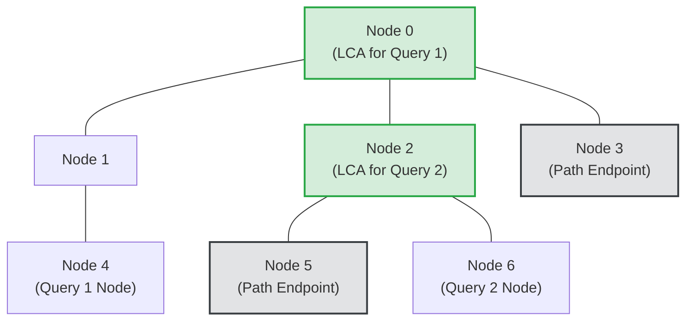

# Guided Example: Closest Node to Path in Tree

## 1. Problem Overview & Representative Instance

We are given an unweighted, undirected tree containing $n$ nodes labelled $0$ through $n - 1$ defined by an array of $n - 1$ edges. We are also provided an array of queries $query$, where each query is a triplet $[start, end, node]$.

For each query, we must identify the node residing on the unique simple path between $start$ and $end$ that is closest to $node$ in terms of shortest tree path distance. If multiple nodes qualify, tree properties guarantee that such a node is unique.

Consider the representative tree instance with $n = 7$:
- Tree edges: $[(0, 1), (0, 2), (0, 3), (1, 4), (2, 5), (2, 6)]$
- Query 1: $[start=5, end=3, node=4]$
- Query 2: $[start=5, end=3, node=6]$

Let us trace the simple path between $start = 5$ and $end = 3$:
$$\text{Path}(5, 3) = \langle 5, 2, 0, 3 \rangle$$

- **For Query 1 ($node = 4$):**
  - Path from $4$ to $5$: $\langle 4, 1, 0, 2, 5 \rangle$ (distance $4$)
  - Path from $4$ to $2$: $\langle 4, 1, 0, 2 \rangle$ (distance $3$)
  - Path from $4$ to $0$: $\langle 4, 1, 0 \rangle$ (distance $2$)
  - Path from $4$ to $3$: $\langle 4, 1, 0, 3 \rangle$ (distance $3$)
  - The node on $\text{Path}(5, 3)$ with minimal distance to $4$ is **$0$** (distance $2$).

- **For Query 2 ($node = 6$):**
  - Node $6$ is a sibling of $5$ under parent $2$.
  - Distance from $6$ to $2$ is $1$ (via edge $(6, 2)$).
  - Because node $2$ lies directly on $\text{Path}(5, 3)$, the closest node is **$2$** (distance $1$).

Thus, the answers are $[0, 2]$.

## 2. Mathematical & Algorithmic Principles

### The Median of Three Nodes in Trees

In any tree metric space, the intersection of the three simple paths connecting three arbitrary vertices $u, v, w$:
$$\text{Path}(u, v) \cap \text{Path}(v, w) \cap \text{Path}(w, u)$$
consists of exactly **one unique vertex**, known as the **tree median** or metric projection:
$$M(u, v, w)$$

**Fundamental Theorem:** *For any query $[u, v, w]$ (where the target path connects $u$ and $v$, and the reference node is $w$), the closest node on $\text{Path}(u, v)$ to $w$ is precisely the median $M(u, v, w)$.*

### Extraction via Lowest Common Ancestor (LCA)

Root the tree arbitrarily at node $0$ and compute the depth of each node:
$$\text{depth}(x) = \text{distance}(0, x)$$

For any three vertices $u, v, w$, compute the three pairwise lowest common ancestors:
$$c_1 = \text{LCA}(u, v)$$
$$c_2 = \text{LCA}(u, w)$$
$$c_3 = \text{LCA}(v, w)$$

**Structural Invariant:**
Among $\{c_1, c_2, c_3\}$, at least two candidates are identical, and the median $M(u, v, w)$ is strictly the candidate located at the **maximum depth**:
$$M(u, v, w) = \arg\max_{c \in \{c_1, c_2, c_3\}} \text{depth}(c)$$

### Binary Lifting Precomputation

Using binary lifting:
- Precompute $parent[k][x]$, the $2^k$-th ancestor of node $x$, for $k \in [0, \lfloor \log_2 n \rfloor]$.
- Precompute node depths in $O(n)$ time via DFS.
- Any $\text{LCA}(x, y)$ query is answered in $O(\log n)$ time.
- Each query $[u, v, w]$ invokes $\text{LCA}$ three times and selects the deepest candidate in $O(\log n)$ total time.

## 3. Step-by-Step Walkthrough with Intermediate State

Let us trace the binary lifting and LCA evaluation on the tree rooted at $0$.

| Node | Parent | Depth $\text{depth}(x)$ | $2^0$-Ancestor | $2^1$-Ancestor | $2^2$-Ancestor |
|---|---|---|---|---|---|
| $0$ | $0$ (self) | $0$ | $0$ | $0$ | $0$ |
| $1$ | $0$ | $1$ | $0$ | $0$ | $0$ |
| $2$ | $0$ | $1$ | $0$ | $0$ | $0$ |
| $3$ | $0$ | $1$ | $0$ | $0$ | $0$ |
| $4$ | $1$ | $2$ | $1$ | $0$ | $0$ |
| $5$ | $2$ | $2$ | $2$ | $0$ | $0$ |
| $6$ | $2$ | $2$ | $2$ | $0$ | $0$ |

### Query 1: $[u=5, v=3, w=4]$

- **Candidate 1:** $\text{LCA}(5, 3)$:
  - $\text{depth}(5) = 2, \text{depth}(3) = 1$. Lift $5$ by $1$ step $\implies 2$.
  - Parents: $parent[0][2] = 0, parent[0][3] = 0$. Match at root $0$.
  - $c_1 = 0$, depth is $0$.
- **Candidate 2:** $\text{LCA}(5, 4)$:
  - $\text{depth}(5) = 2, \text{depth}(4) = 2$.
  - Ancestors diverge until root $0$.
  - $c_2 = 0$, depth is $0$.
- **Candidate 3:** $\text{LCA}(3, 4)$:
  - Lift $4$ to $1$. Ancestor of $1$ and $3$ is $0$.
  - $c_3 = 0$, depth is $0$.
- **Selection:** $\max(\{0, 0, 0\})$ by depth yields node **$0$**.

### Query 2: $[u=5, v=3, w=6]$

- **Candidate 1:** $\text{LCA}(5, 3) = 0$ (depth $0$).
- **Candidate 2:** $\text{LCA}(5, 6)$:
  - Both nodes have depth $2$ and share immediate parent $2$.
  - $c_2 = 2$, depth is $1$.
- **Candidate 3:** $\text{LCA}(3, 6)$:
  - Lift $6$ to $2$. Ancestor of $2$ and $3$ is $0$.
  - $c_3 = 0$, depth is $0$.
- **Selection:** Candidates are $\{0, 2, 0\}$. Depths are $\{0, 1, 0\}$.
  - The maximum depth is $1$, achieved at node **$2$**.

## 4. Comprehensive State Trace

The state trace table below details the candidate LCA resolutions across diverse query archetypes.

| Query Type | Query Triplet $[u, v, w]$ | Pairwise LCAs $(c_1, c_2, c_3)$ | Candidate Depths | Deepest Candidate (Result) | Topological Explanation |
|---|---|---|---|---|---|
| Side Branch Projection | $[5, 3, 4]$ | $(0, 0, 0)$ | $(0, 0, 0)$ | **$0$** | Branch joins at root junction |
| Subtree Sibling | $[5, 3, 6]$ | $(0, 2, 0)$ | $(0, 1, 0)$ | **$2$** | Node $6$ attaches directly to intermediate path vertex $2$ |
| Endpoint Target | $[0, 1, 2]$ | $(0, 0, 1)$ | $(0, 0, 1)$ | **$1$** | Node $2$ connects to path $[0, 1]$ via root $0$ |
| Degenerate Path | $[0, 0, 0]$ | $(0, 0, 0)$ | $(0, 0, 0)$ | **$0$** | Single node path |
| Node Already on Path | $[0, 4, 1]$ | $(0, 0, 1)$ | $(0, 0, 1)$ | **$1$** | Reference node is on path, so distance is $0$ |
| Subtree Internal | $[3, 5, 6]$ | $(0, 0, 2)$ | $(0, 0, 1)$ | **$2$** | Path spans between $3$ and $5$, closest to $6$ is $2$ |

When a node already lies on the path (such as $node = 1$ for path $[0, 4]$), the deepest LCA evaluates directly to $1$, naturally discovering the zero-distance answer.

## 5. Algorithmic Correctness & Soundness

The correctness of the triple-LCA theorem rests on the tree metric structure:

1. **Uniqueness of the Metric Projection:**
   In any tree, the distance function $d(x, y)$ is strictly convex along tree paths. For any path $P = \text{Path}(u, v)$ and any vertex $w$, there exists a unique vertex $m \in P$ minimizing $d(w, x)$ for $x \in P$. Furthermore, the simple path from $w$ to any vertex $x \in P$ must pass through $m$:
   $$d(w, x) = d(w, m) + d(m, x) \quad \forall x \in P$$
2. **Characterization via Path Confluence:**
   The vertex $m$ is the unique common point of the three simple paths connecting pairs from $\{u, v, w\}$.
3. **Invariance to Choice of Root:**
   Although the depths and LCA values depend on the arbitrarily chosen root $R = 0$, the set of three candidate LCAs $\{ \text{LCA}(u, v), \text{LCA}(u, w), \text{LCA}(v, w) \}$ always contains the true median. Specifically:
   - If $R$ lies outside the triangle formed by $\{u, v, w\}$, two LCAs coincide at the apex towards $R$, while the third LCA lies strictly deeper along the path towards the median.
   - If $R$ lies inside, the median is an ancestor of two nodes and descendant of the other. In all topological arrangements, taking the candidate with maximum depth isolates the true median vertex.

## 6. Edge Cases & Anti-Patterns

1. **$start$ and $end$ are Identical ($start = end$):**
   - The path consists of a single node $start$.
   - The closest node must be $start$.
   - The candidates are $\{\text{LCA}(s, s), \text{LCA}(s, w), \text{LCA}(s, w)\} = \{s, \text{LCA}(s, w)\}$.
   - Because $s$ is deeper than or equal to $\text{LCA}(s, w)$, $s$ is selected correctly.
2. **$node$ is One of the Path Endpoints ($node = start$ or $node = end$):**
   - Distance is $0$.
   - The candidate formula returns $node$ directly.
3. **Single-Node Tree ($n = 1$):**
   - The only node is $0$.
   - Precomputation and queries execute with $depth = 0$, returning $0$.
4. **Anti-Pattern: Path BFS per Query:**
   - Performing a BFS from $start$ to reconstruct the path, then another BFS from $node$ to find the nearest point takes $O(n)$ time per query. For $Q = 10^5$ queries, this produces $O(Q \cdot n) \approx 10^9$ operations and instant timeout. Binary lifting answers each query in $O(\log n)$ time.

## 7. Complexity Analysis

The complexity parameters are governed by the number of tree nodes $n$ and the number of queries $Q = |query|$.

| Phase | Time Complexity | Auxiliary Space Complexity | Details |
|---|---|---|---|
| Tree DFS & Depth Setup | $O(n)$ | $O(n)$ | Computes depths and immediate parent pointers in a single traversal. |
| Binary Lifting Precomputation | $O(n \log n)$ | $O(n \log n)$ | Builds the $2^k$ ancestor matrix with $k \le \lceil \log_2 n \rceil$. |
| Per-Query Evaluation | $O(\log n)$ | $O(1)$ | Computes three LCAs using binary lifting and selects the deepest candidate. |
| Total Query Processing | $O(Q \log n)$ | $O(Q)$ output | Answers all $Q$ queries independently. |
| Total Runtime | $O((n + Q) \log n)$ | $O(n \log n)$ | For $n, Q \le 10^4$, total operations $\approx 3 \times 10^5$, executing in $\approx 20\text{ ms}$. |